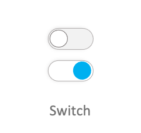

# Switch

Switch is a common component that can be used as a selector.



## Add namespace
To implement Switch, include `Tizen.NUI.Components` namespace in your application:

```csharp
using Tizen.NUI;
using Tizen.NUI.Components;
```

```xaml
xmlns:base="clr-namespace:Tizen.NUI.BaseComponents;assembly=Tizen.NUI"
xmlns:comp="clr-namespace:Tizen.NUI.Components;assembly=Tizen.NUI.Components"
```

## Create with property

To create a Switch using property, follow these steps:

1. Create Switch using the default constructor:

    ```xaml
    <comp:Switch Text="switch1"/>
    <comp:Switch Text="switch2"/>
    <comp:Switch Text="switch3"/>
    <comp:Switch Text="switch4"/>
    ```

2. Set the Switch property:

    ```xaml
        <comp:Switch x:Name="switch1" Size="96, 60"
            SwitchHandlerImageSize="40, 40"
            IsSelected="True"/>
            
        <comp:Switch x:Name="switch2" Size="96, 60"
            SwitchHandlerImageSize="40, 40"/>

        <comp:Switch x:Name="switch3" Size="96, 60" 
            SwitchHandlerImageSize="40, 40"
            IsEnabled="False"/>

        <comp:Switch x:Name="switch4" Size="96, 60"
            SwitchHandlerImageSize="40, 40"
            IsEnabled="False" />
    ```

    ```cs
        StringSelector s1 = new StringSelector
        {
            Normal = "controller_switch_bg_off.png",
            Selected = "controller_switch_bg_on.png",
            Disabled = "controller_switch_bg_off_dim.png",
            DisabledSelected = "controller_switch_bg_on_dim.png",
        };

        StringSelector s2 = new StringSelector
        {
            Normal = "controller_switch_handler.png",
            Selected = "controller_switch_handler.png",
            Disabled = "controller_switch_handler_dim.png",
            DisabledSelected = "controller_switch_handler_dim.png",
        };

        switch1.SwitchBackgroundImageURLSelector = s1;
        switch1.SwitchHandlerImageURLSelector = s2;

        switch2.SwitchBackgroundImageURLSelector = s1;
        switch2.SwitchHandlerImageURLSelector = s2;

        switch3.SwitchBackgroundImageURLSelector = s1;
        switch3.SwitchHandlerImageURLSelector = s2;

        switch4.SwitchBackgroundImageURLSelector = s1;
        switch4.SwitchHandlerImageURLSelector = s2;

    ```

The following output is generated when the Switch is created using property:


## Respond to selected changed event

When you click the Switch, the popup instance receives a selected changed event.
You can declare the event handler as follows:

```xaml
<comp:Switch Text="swich1" SelectedChanged="OnSelectedChanged"/>
```

```csharp
private void OnSelectedChanged(object sender, SelectedChangedEventArgs e)
{
    //Do something when user selects or unselects the Switch
}
```

## Related information

- Dependencies
  -   Tizen 6.5 and Higher 
