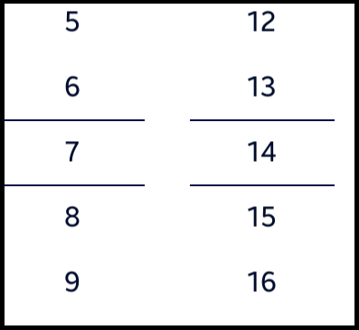

# TimePicker

TimePicker is a class that provides a function that allows the user to select a time through a scrolling motion by expressing the specified value as a list. TimePicker expresses the current time using the `locale` information of the system.


## Add namespace
To implement TimePicker, include `Tizen.NUI.Components` and namespace in your application:

```xaml
xmlns:comp="clr-namespace:Tizen.NUI.Components;assembly=Tizen.NUI.Components"
```

## Create with property

To create a TimePicker, follow these steps:

1. Create TimePicker in XAML:

    ```xaml
    <comp:TimePicker x:Name="picker"/>
    ```

2. Set the TimePicker property:

    ```xaml
    <comp:TimePicker x:Name="picker"
        isAm="False"
        is24HourView="True"/>
    ```
The following output is generated when the TimePicker is created using property:



## Respond to value changed event

When you touch or pan a TimePicker, the TimePicker instance receives a value changed event.
You can declare the value changed event handler as follows:

```xaml
<comp:TimePicker x:Name="picker" ValueChanged="OnValueChanged"/>
```

```csharp
private void OnValueChanged(object sender, ValueChangedEventArgs args)
{
    // Do something in response to TimePicker click
}
```

## Respond to time changed event

When you change time in TimePicker, the TimePicker instance receives a time changed event.
You can declare the time changed event handler as follows:

```xaml
<comp:TimePicker x:Name="picker" TimeChanged="OnTimeChanged"/>
```

```csharp
private void OnTimeChanged(object sender, TimeChangedEventArgs args)
{
    // Do something in response to TimePicker click
}
```

## Related information

- Dependencies
  -   Tizen 6.5 and Higher 


