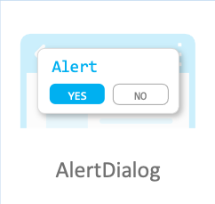

# AlertDialog

Use an AlertDialog when the user must acknowledge something, or choose between a small number of actions, before continuing. It arranges the title, the message, and the action buttons for you.



## Add namespace
To implement AlertDialog, include `Tizen.NUI.Components` and namespace in your application:

```xaml
xmlns:comp="clr-namespace:Tizen.NUI.Components;assembly=Tizen.NUI.Components"
```

## Create with property

To create an AlertDialog, follow these steps:

1. Create AlertDialog in XAML:

    ```xaml
    <comp:AlertDialog Text="dialog" Title="Title" Message="Message" 
        Position="200,200" 
        WidthSpecification="300" 
        HeightSpecification="300"/>
    ```

2. The following output is generated when the AlertDialog is created using property:


## Related information

- Dependencies
  -   Tizen 6.5 and Higher

- API References
  - [AlertDialog API](/application/dotnet/api/TizenFX/latest/api/Tizen.NUI.Components.AlertDialog.html)
