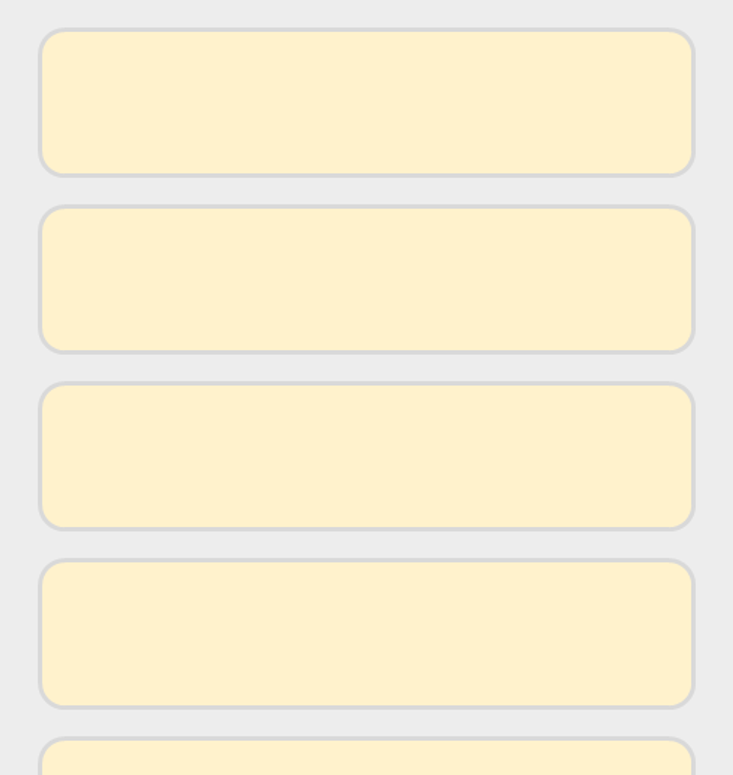
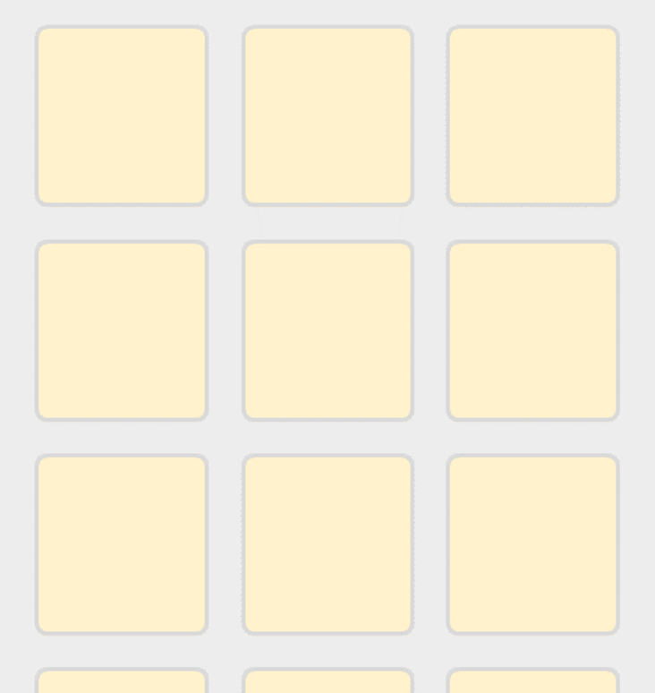

## Create items

1. To create items in CollectionView, use [`DataTemplate`](/application/dotnet/api/TizenFX/latest/api/Tizen.NUI.Binding.DataTemplate.html) as `ItemTemplate` of collectionView:

    <div id="TabSection1">
        <div class="sampletab " id="ProjectCreateTab">
            <button id="ItemTemplate-CSharp" class="tablinks " onclick="openTabSection(event, 'ItemTemplate-CSharp', 'TabSection1') ">C#</button>
            <button id="ItemTemplate-Xaml" class="tablinks " onclick="openTabSection(event, 'ItemTemplate-Xaml', 'TabSection1') ">Xaml</button>
        </div>
        <div id="ItemTemplate-CSharp" class="tabcontent">
            <table>
                <tbody>
                    <tr>
    <span style="display:block">

    ```csharp
    var collectionView = new CollectionView()
    {
        ItemTemplate = new DataTemplate(() =>
        {
            /// Create item here. This method is CreateContent() of DataTemplate.
        });
    }
   ```

    </span>
                    </tr>
                </tbody>
            </table>
        </div>
        <div id="ItemTemplate-Xaml" class="tabcontent">
            <table>
                <tbody>
                    <tr>
    <span style="display:block">


    ```xaml
    <CollectionView>
        <ItemTemplate>
            <DataTemplate>
                <!-- Create item here -->
            </DataTemplate>
        </ItemTemplate>
    </CollectionView>
    ```


    </span>
                    </tr>
                </tbody>
            </table>
        </div>
    </div>

2. Create Item as a content of the [`DataTemplate`](/application/dotnet/api/TizenFX/latest/api/Tizen.NUI.Binding.DataTemplate.html) CollectionView accepts [`RecyclerViewItem`](/application/dotnet/api/TizenFX/latest/api/Tizen.NUI.Components.RecyclerViewItem.html) class as an item.
    fallowing classes are pre-defined default item classes :


    **Figure: DefaultLinearItem**

    

    DefaultLinearItem is for LinearLayout items. It provides fallowing contents:

    **Table: DefaultLinearItem**

    | Property                  | Type               | Description                                                              |
    |---------------------------|--------------------|--------------------------------------------------------------------------|
    | `Text`                    | `string`           | The main text. use `Label`for get `TextLabel` object.                    |
    | `SubText`                 | `string`           | The substitute text. `SubLabel`for get `TextLabel` object.               |
    | `Icon`                    | `View`             | The left icon content of item.                                           |
    | `Extra`                   | `View`             | The right icon content of item.                                          |


    **Figure: DefaultGridItem**

    

    DefaultGridItem is for GridLayout items. It provides fallowing contents:

    **Table: DefaultGridItem**

    | Property                  | Type               | Description                                                              |
    |---------------------------|--------------------|--------------------------------------------------------------------------|
    | `Text`                    | `string`           | The main text. use `Label`for get `TextLabel` object.                    |
    | `Image`                   | `ImageView`        | The image content of item. Readonly.                                     |
    | `Badge`                   | `View`             | The top-right badge icon content of item.                                |


    **Figure: DefaultTitleItem**

    

    DefaultTitleItem is for group header items. It provides fallowing contents:

    **Table: DefaultTitleItem**
    | Property                  | Type               | Description                                                              |
    |---------------------------|--------------------|--------------------------------------------------------------------------|
    | `Text`                    | `string`           | The main text. use `Label`for get `TextLabel` object.                    |
    | `Icon`                    | `View`             | The left icon content of item.                                           |


    Use data binding for property update.

    <div id="TabSection2">
        <div class="sampletab " id="ProjectCreateTab">
            <button id="ItemCreate-CSharp" class="tablinks " onclick="openTabSection(event, 'ItemCreate-CSharp', 'TabSection2') ">C#</button>
            <button id="ItemCreate-Xaml" class="tablinks " onclick="openTabSection(event, 'ItemCreate-Xaml', 'TabSection2') ">Xaml</button>
        </div>
        <div id="ItemCreate-CSharp" class="tabcontent">
            <table>
                <tbody>
                    <tr>
    <span style="display:block">


    ```csharp
    var collectionView = new CollectionView()
    {
        ItemTemplate = new DataTemplate(() =>
        {
            var item =  DefaultLinearItem()
            {
                WidthSpecification = LayoutParamPolicies.MatchParent
            };

            item.SetBinding(DefaultLinearItem.TextProperty, "Name");
            item.SetBinding(DefaultLinearItem.SubTextProperty, "ScientificName");
            item.Icon = new ImageView()
            {
                WidthSpecification = 80,
                HeightSpecification = 80,
            };
            item.Icon.SetBinding(ImageView.ResourceUrlProperty, "ImagePath");

            return item;
        });
    }
   ```

    </span>
                    </tr>
                </tbody>
            </table>
        </div>
        <div id="ItemCreate-Xaml" class="tabcontent">
            <table>
                <tbody>
                    <tr>
    <span style="display:block">

    ```xaml
    <CollectionView>
        <CollectionView.ItemTemplate>
            <DataTemplate>
                <DefaultLinearItem
                    WidthSpecification="{Static LayoutParamPolicies.MatchParent}"
                    Text="{Binding Path=Name}"
                    SubText="{Binding Path=ScientificName}">
                    <DefaultLinearItem.Icon>
                        <ImageView
                            WidthSpecification="80"
                            HeightSpecification="80"
                            ResourceUrl="{Binding Path=ImagePath}" />
                    </DefaultLinearItem.Icon>
                </DefaultLinearItem>
            </DataTemplate>
        </CollectionView.ItemTemplate>
    </CollectionView>
    ```

    </span>
                    </tr>
                </tbody>
            </table>
        </div>
    </div>


`GroupHeader` and `GroupFooter` also can be created with [`DataTemplate`](/application/dotnet/api/TizenFX/latest/api/Tizen.NUI.Binding.DataTemplate.html).


## Set Layout on CollectionView

[`CollectionView`](/application/dotnet/api/TizenFX/latest/api/Tizen.NUI.Components.CollectionView.html) allow layout flexibly by [`ItemsLayouter`](/application/dotnet/api/TizenFX/latest/api/Tizen.NUI.Components.ItemsLayouter.html).

NUI provide fallowing pre-defined ItemsLayouter:


| Class                     | Figure                     | Description                                                              |
|---------------------------|----------------------------|--------------------------------------------------------------------------|
| `LinearLayouter`          | | The layouter to layout items on linear position such as list view.       |
| `GridLayouter`            |     | The layouter to layout items on grid row and columns.                    |


<div id="TabSection3">
    <div class="sampletab " id="ProjectCreateTab">
        <button id="ItemLayouter-CSharp" class="tablinks " onclick="openTabSection(event, 'ItemLayouter-CSharp', 'TabSection3') ">C#</button>
        <button id="ItemLayouter-Xaml" class="tablinks " onclick="openTabSection(event, 'ItemLayouter-Xaml', 'TabSection3') ">Xaml</button>
    </div>
    <div id="ItemLayouter-CSharp" class="tabcontent">
        <table>
            <tbody>
                <tr>
<span style="display:block">


```csharp
var collectionView = new CollectionView()
{
    ItemsLayouter = new LinearLayouter(),
    ScrollingDirection = Tizen.NUI.Components.ScrollableBase.Direction.Vertical
}
```

</span>
                </tr>
            </tbody>
        </table>
    </div>
    <div id="ItemLayouter-Xaml" class="tabcontent">
        <table>
            <tbody>
                <tr>
<span style="display:block">

```xaml
<CollectionView ScrollingDirection="Vertical">
    <ItemsLayouter>
        <LinearLayouter />
    </ItemsLayouter>
</CollectionView>
```

</span>
                </tr>
            </tbody>
        </table>
    </div>
</div>


## Related information

- Dependencies
  -   Tizen 7.0 and Higher


<script>
    function openTabSection(evt, profileName, sectionId) {
        var i, tabcontent, tablinks, section;
        let selected = 0;

        section = document.getElementById(sectionId);
        tabcontent = section.getElementsByClassName("tabcontent");
        for (i = 0; i < tabcontent.length; i++) {
            tabcontent[i].style.display = "none";
            if (tabcontent[i].id == profileName) {
                selected = i;
            }
        }

        tablinks = section.getElementsByClassName("tablinks");

        for (i = 0; i < tablinks.length; i++) {
            tablinks[i].className = tablinks[i].className.replace(" active", "");
        }

        tabcontent[selected].style.display = "block";
        evt.currentTarget.className += " active";
    }
    document.getElementById("AbsoluteLayout-Example-CSharp").click();
</script>
