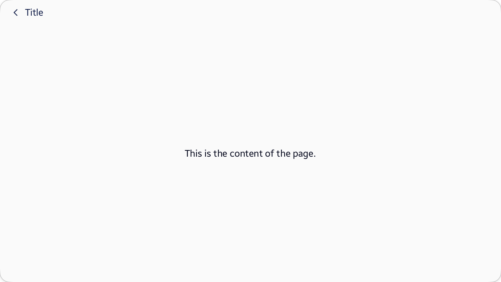

<style>
    .tabcontent img {
        border: 1px solid #555;
        max-width: 100% !important;
        max-height: 100%;
    }
</style>

# ContentPage

## Overview

[Tizen.NUI.Components.ContentPage](/application/dotnet/api/TizenFX/latest/api/Tizen.NUI.Components.ContentPage.html) class helps to organize a formatted full screen page. `ContentPage` is composed of [AppBar](/application/dotnet/api/TizenFX/latest/api/Tizen.NUI.Components.ContentPage.html#Tizen_NUI_Components_ContentPage_AppBar) and [Content](/application/dotnet/api/TizenFX/latest/api/Tizen.NUI.Components.ContentPage.html#Tizen_NUI_Components_ContentPage_Content) properties.

`AppBar` property indicates the region to show the title of `ContentPage`. [Tizen.NUI.Components.AppBar](/application/dotnet/api/TizenFX/latest/api/Tizen.NUI.Components.AppBar.html) class instance is set to `AppBar` property to show a back button ([NavigationContent](/application/dotnet/api/TizenFX/latest/api/Tizen.NUI.Components.AppBar.html#Tizen_NUI_Components_AppBar_NavigationContent)), title ([Title](/application/dotnet/api/TizenFX/latest/api/Tizen.NUI.Components.AppBar.html#Tizen_NUI_Components_AppBar_Title)), and action buttons ([Actions](/application/dotnet/api/TizenFX/latest/api/Tizen.NUI.Components.AppBar.html#Tizen_NUI_Components_AppBar_Actions)).

`Content` property indicates the region to show the main content of the screen. A `View` with objects which organizes the main content of the screen is set to `Content` property.



## Example code

The following example shows how to create a `ContentPage`:

<div id="TabSection1">
    <div class="sampletab " id="ProjectCreateTab">
        <button id="ContentPage-Example-CSharp" class="tablinks " onclick="openTabSection(event, 'ContentPage-Example-CSharp', 'TabSection1') ">C#</button>
        <button id="ContentPage-Example-Xaml" class="tablinks " onclick="openTabSection(event, 'ContentPage-Example-Xaml', 'TabSection1') ">Xaml</button>
    </div>
    <div id="ContentPage-Example-CSharp" class="tabcontent">
        <table>
            <tbody>
                <tr>
<span style="display:block">

```csharp
ContentPage contentPage = new ContentPage
{
    AppBar = new AppBar()
    {
        Title = "Title",
    },
    Content = new TextLabel()
    {
        Text = "This is the content of the page.",
        WidthSpecification = LayoutParamPolicied.MatchParent,
        HeightSpecification = LayoutParamPolicied.MatchParent,
        HorizontalAlignment = HorizontalAlignment.Center,
        VerticalAlignment = VerticalAlignment.Center,
    },
};

// Pushes the ContentPage to the default Navigator.
NUIApplication.GetDefaultWindow().GetDefaultNavigator().Push(contentPage);
```

</span>
                </tr>
            </tbody>
        </table>
    </div>
    <div id="ContentPage-Example-Xaml" class="tabcontent">
        <table>
            <tbody>
                <tr>
<span style="display:block">

```xaml
<?xml version="1.0" encoding="UTF-8"?>
<ContentPage x:Class="MyContentPage"
    xmlns="http://tizen.org/Tizen.NUI/2018/XAML"
    xmlns:x="http://schemas.microsoft.com/winfx/2009/xaml"
    <ContentPage.AppBar>
        <AppBar Title="Title"/>
    </ContentPage.AppBar>

    <ContentPage.Content>
        <TextLabel
            Text="This is the content of the page."
            WidthSpecification="{Static LayoutParamPolicies.MatchParent}"
            HeightSpecification="{Static LayoutParamPolicies.MatchParent}"
            HorizontalAlignment="Center"
            VerticalAlignment="Center"/>
    </ContentPage.Content>
</ContentPage>

<!-- Needs to push the ContentPage to the default Navigator in .cs file. -->
```

</span>
                </tr>
            </tbody>
        </table>
    </div>
</div>

## Related information

- Dependencies
  - Tizen 6.5 and Higher

<script>
    function openTabSection(evt, profileName, sectionId) {
        var i, tabcontent, tablinks, section;
        let selected = 0;

        section = document.getElementById(sectionId);
        tabcontent = section.getElementsByClassName("tabcontent");
        for (i = 0; i < tabcontent.length; i++) {
            tabcontent[i].style.display = "none";
            if (tabcontent[i].id == profileName) {
                selected = i;
            }
        }

        tablinks = section.getElementsByClassName("tablinks");

        for (i = 0; i < tablinks.length; i++) {
            tablinks[i].className = tablinks[i].className.replace(" active", "");
        }

        tabcontent[selected].style.display = "block";
        evt.currentTarget.className += " active";
    }
    document.getElementById("ContentPage-Example-CSharp").click();
</script>