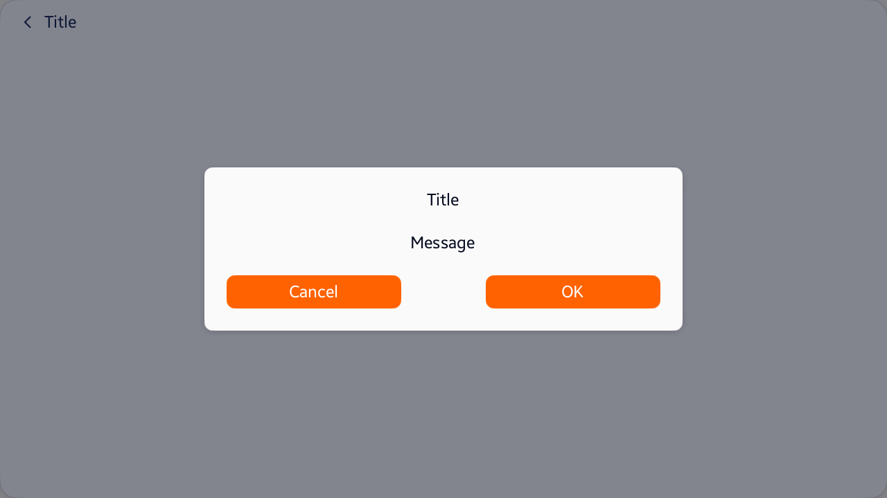

<style>
    .tabcontent img {
        border: 1px solid #555;
        max-width: 100% !important;
        max-height: 100%;
    }
</style>

# DialogPage

## Overview

[Tizen.NUI.Components.DialogPage](/application/dotnet/api/TizenFX/latest/api/Tizen.NUI.Components.DialogPage.html) class helps to show a dialog on the screen. `DialogPage` is composed of [Content](/application/dotnet/api/TizenFX/latest/api/Tizen.NUI.Components.DialogPage.html#Tizen_NUI_Components_DialogPage_Content) and [Scrim](/application/dotnet/api/TizenFX/latest/api/Tizen.NUI.Components.DialogPage.html#Tizen_NUI_Components_DialogPage_Scrim) properties.

`Content` property indicates the region to show the dialog on the screen. [Tizen.NUI.Components.AlertDialog](/application/dotnet/api/TizenFX/latest/api/Tizen.NUI.Components.AlertDialog.html) class or [Tizen.NUI.Components.Dialog](/application/dotnet/api/TizenFX/latest/api/Tizen.NUI.Components.Dialog.html) class is set to `Content` property.

`Scrim` property indicates the dimmed background region behind the dialog. By default, `DialogPage` is popped when `Scrim` is clicked.

To show a dialog easier, `DialogPage` provides [ShowAlertDialog](/application/dotnet/api/TizenFX/latest/api/Tizen.NUI.Components.DialogPage.html#Tizen_NUI_Components_DialogPage_ShowAlertDialog_System_String_System_String_Tizen_NUI_BaseComponents_View___) and [ShowDialog](/application/dotnet/api/TizenFX/latest/api/Tizen.NUI.Components.DialogPage.html#Tizen_NUI_Components_DialogPage_ShowDialog_Tizen_NUI_BaseComponents_View_) methods instead of pushing `DialogPage` to `Navigator` manually.



## Example code

The following example shows how to create a `DialogPage`:

<div id="TabSection1">
    <div class="sampletab " id="ProjectCreateTab">
        <button id="DialogPage-Example-CSharp" class="tablinks " onclick="openTabSection(event, 'DialogPage-Example-CSharp', 'TabSection1') ">C#</button>
        <button id="DialogPage-Example-Xaml" class="tablinks " onclick="openTabSection(event, 'DialogPage-Example-Xaml', 'TabSection1') ">Xaml</button>
    </div>
    <div id="DialogPage-Example-CSharp" class="tabcontent">
        <table>
            <tbody>
                <tr>
<span style="display:block">

```csharp
Button cancelButton = new Button()
{
    Text = "Cancel",
};
cancelButton.Clicked += (o, e) =>
{
    // Executes cancel actions.
    // ...

    // Pops DialogPage from Navigator.
    NUIApplication.GetDefaultWindow().GetDefaultNavigator().Pop();
};

Button okButton = new Button()
{
    Text = "OK",
};
okButton.Clicked += (o, e) =>
{
    // Executes ok actions.
    // ...

    // Pops DialogPage from Navigator.
    NUIApplication.GetDefaultWindow().GetDefaultNavigator().Pop();
};

DialogPage.ShowAlertDialog("Title",
                           "Message",
                           cancelButton, okButton);

// The above ShowAlertDialog does the same with the following code.

// DialogPage dialogPage = new DialogPage
// {
//     Content = new AlertDialog()
//     {
//         Title = "Title",
//         Message = "Message",
//         Actions = new View[] { cancelButton, okButton },
//     },
// };

// // Pushes the DialogPage to the default Navigator.
// NUIApplication.GetDefaultWindow().GetDefaultNavigator().Push(dialogPage);
```

</span>
                </tr>
            </tbody>
        </table>
    </div>
    <div id="DialogPage-Example-Xaml" class="tabcontent">
        <table>
            <tbody>
                <tr>
<span style="display:block">

```xaml
<?xml version="1.0" encoding="UTF-8"?>
<DialogPage x:Class="MyDialogPage"
    xmlns="http://tizen.org/Tizen.NUI/2018/XAML"
    xmlns:x="http://schemas.microsoft.com/winfx/2009/xaml"
    <DialogPage.Content>
        <AlertDialog Title="Title" Message="Message">
            <AlertDialog.ActionContent>
                <View WidthSpecification="626">
                    <View.Layout>
                        <FlexLayout Direction="Row" Justification="SpaceBetween"/>
                    </View.Layout>
                </View>
            </AlertDialog.ActionContent>
        </AlertDialog>
    </DialogPage.Content>
</DialogPage>

<!-- Needs to push the DialogPage to the default Navigator in .cs file. -->
```

</span>
                </tr>
            </tbody>
        </table>
    </div>
</div>

## Related information

- Dependencies
  - Tizen 6.5 and Higher

<script>
    function openTabSection(evt, profileName, sectionId) {
        var i, tabcontent, tablinks, section;
        let selected = 0;

        section = document.getElementById(sectionId);
        tabcontent = section.getElementsByClassName("tabcontent");
        for (i = 0; i < tabcontent.length; i++) {
            tabcontent[i].style.display = "none";
            if (tabcontent[i].id == profileName) {
                selected = i;
            }
        }

        tablinks = section.getElementsByClassName("tablinks");

        for (i = 0; i < tablinks.length; i++) {
            tablinks[i].className = tablinks[i].className.replace(" active", "");
        }

        tabcontent[selected].style.display = "block";
        evt.currentTarget.className += " active";
    }
    document.getElementById("DialogPage-Example-CSharp").click();
</script>