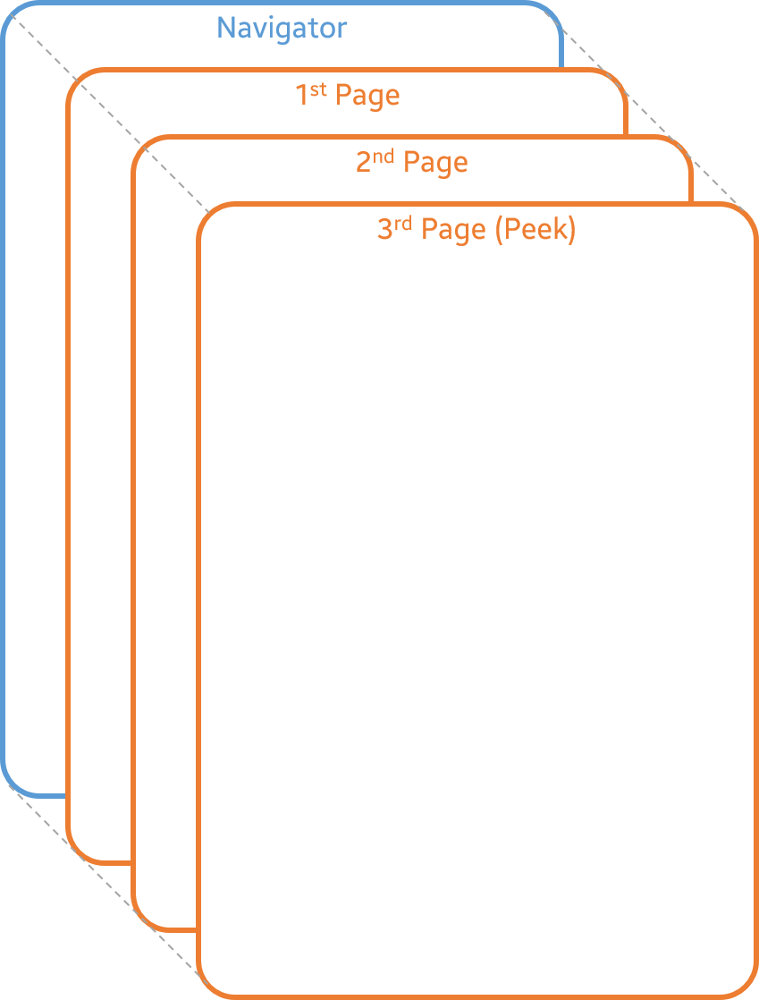

# Page Navigation

## Overview

NUI provides a system to organize screens and navigate between them.

[Tizen.NUI.Components.Page](/application/dotnet/api/TizenFX/latest/api/Tizen.NUI.Components.Page.html) class helps to organize a screen as a formatted full screen page or a dialog on the screen.
NUI provides [Tizen.NUI.Components.ContentPage](/application/dotnet/api/TizenFX/latest/api/Tizen.NUI.Components.ContentPage.html) class to organize a formatted full screen page and [Tizen.NUI.Components.DialogPage](/application/dotnet/api/TizenFX/latest/api/Tizen.NUI.Components.DialogPage.html) class to show a dialog on the screen.

[Tizen.NUI.Components.Navigator](/application/dotnet/api/TizenFX/latest/api/Tizen.NUI.Components.Navigator.html) class helps to navigate between pages.
`Navigator` has a LIFO structure to manage pages by stack methods such as [Push](/application/dotnet/api/TizenFX/latest/api/Tizen.NUI.Components.Navigator.html#Tizen_NUI_Components_Navigator_Push_Tizen_NUI_Components_Page_) and [Pop](/application/dotnet/api/TizenFX/latest/api/Tizen.NUI.Components.Navigator.html#Tizen_NUI_Components_Navigator_Pop) methods. The [Peek](/application/dotnet/api/TizenFX/latest/api/Tizen.NUI.Components.Navigator.html#Tizen_NUI_Components_Navigator_Peek) page, which has been pushed last, is displayed on the screen by overlapping the previous page.
Since each instance of [Tizen.NUI.Window](/application/dotnet/api/TizenFX/latest/api/Tizen.NUI.Window.html) class provides a default `Navigator` with [GetDefaultNavigator](/application/dotnet/api/TizenFX/latest/api/Tizen.NUI.Components.Navigator.html#Tizen_NUI_Components_Navigator_GetDefaultNavigator_Tizen_NUI_Window_) method, it is recommended to use the default `Navigator` to navigate between pages.

## Related information

- Dependencies
  - Tizen 6.5 and Higher