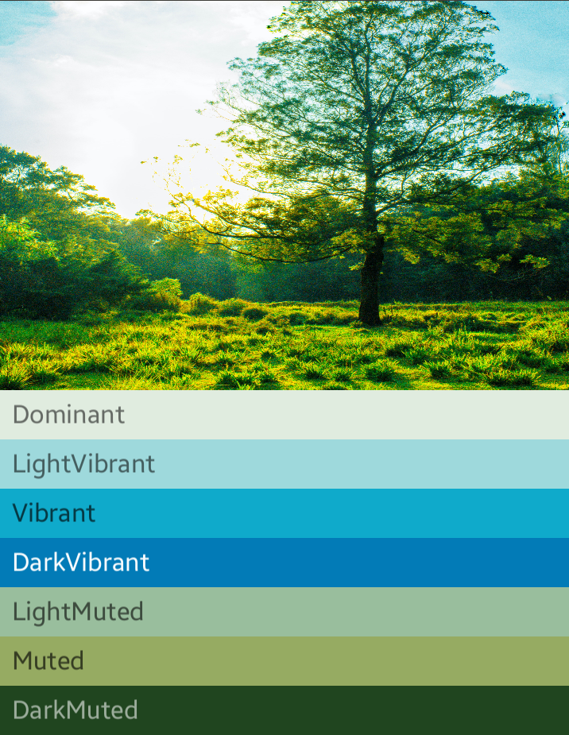

# Palette

The Palette APIs support in selecting colors from images to help you create visually engaging apps.

You can use the Palette APIs to design layout themes and apply custom colors to visual elements in your application. For example, you can use a Palette to create a color-coordinated title card for a song based on its album cover, or to adjust an app's toolbar color when its background image changes. The Palette object gives you access to the colors in a bitmap image, while also providing six main color profiles from the bitmap to help your design choices.

## Add namespace

To implement Palette, include `Tizen.NUI` namespace in your application:

```csharp
using Tizen.NUI;
```

## Create Palette

Generate a Palette instance using the `ImageLoading` to first create a `PixelBuffer` from an image.

1. Create `PixelBuffer` from source image:

    ```csharp
    PixelBuffer imgBitmap = ImageLoading.LoadImageFromFile(imagePath);   
    ```
   - You can generate the Palette either synchronously or asynchronously.

2. Generate a Palette synchronously or asynchronously:
    ```csharp
    // Generate a Palette synchronously
    public void PaletteGeneratesync()
    {
        PixelBuffer imgBitmap = ImageLoading.LoadImageFromFile(_imgPath);
        try
        {
            Palette palette = Palette.Generate(imgBitmap);
        }
        catch (ArgumentNullException e)
        {
            //Exception Handling.
        }
    }
    
    // Generate a Palette asynchronously
    public async Task PaletteGenerateAsync()
    {
        PixelBuffer imgBitmap = ImageLoading.LoadImageFromFile(_imgPath);
        try
        {
            Palette palette = await Palette.GenerateAsync(imgBitmap);
        }
        catch (ArgumentNullException e)
        {
            //Exception Handling.
        }
    }
    ```

 3. Set a region of the `PixelBuffer` to be used exclusively when calculating the Palette. This is optional:

    ```csharp
    Rectangle rect = new Rectangle(0, 0, 100, 100);
    ...
    Palette palette = Palette.Generate(imgBitmap, rect);
    ```

## Extract color profiles

Colors extracted from the bitmap image are scored against each profile based on saturation, luminance, and population (number of pixels in the bitmap represented by the color). For each profile, the color with the best score defines that color profile for the given image. Palette object contains 16 primary colors from a given image.

The Palette library attempts to extract the following six color profiles:

- Light vibrant
- Vibrant
- Dark vibrant
- Light muted
- Muted
- Dark muted

Each of the Palettes `get<Profile>Color()` returns the color in the Palette associated with that particular profile, where <Profile> is replaced by the name of one of the six color profiles. For example, the method to get the Dark Vibrant color profile is `getDarkVibrantColor()`. Not all images contain all color profiles, you must also provide a default color to return:



To access all colors in a Palette, the `getSwatches()` returns a list of all swatches generated from an image, including the standard six color profiles.


## Use swatches to create color schemes

The Palette class also generates `Palette.Swatch` objects for each color profile. The `Palette.Swatch` objects contain the associated color for that profile as well as the population of colors in pixels. Swatches have additional methods for accessing more information about the color profile, such as HSL values and pixel population. You can use swatches to create more comprehensive color schemes and app themes using the `getBodyTextColor()` and `getTitleTextColor()`.

The following methods return colors that are appropriate for use over the swatch’s color:

- Each of Palettes `get<Profile>Swatch()` returns the swatch associated with that particular profile, where <Profile> is replaced by the name of one of the six color profiles.

- The Palettes `get<Profile>Swatch()` does not require default value parameters, the method returns null if a particular profile does not exist in the image. Therefore, you must ensure that a swatch is not null before using it. For example, the following code gets the title text color from a Palette, if the vibrant swatch is not null:

  ```csharp
  var mutedSwatch = palette.GetMutedSwatch();
  TextLabel label = new TextLabel(txt)
  {
      TextColor = mutedSwatch.GetBodyTextColor(),
      ...
  };
  ```
## Related information
- Dependencies
  -   Tizen 6.5 and Higher
