<style>
    .tabcontent img {
        border: 1px solid #555;
        max-width: 100% !important;
        max-height: 100%;
    }
</style>

# Relative layout

The `RelativeLayout` is a layout class in which each side of the child can be specified as relative to the sibling view or the parent. The `Target` and the `RelativeOffset` properties define a relationship with each other.
The following figure shows the relative layout position of rectangles with `Target` and `RelativeOffset`. The arrows in the preview indicate where the `LeftTarget` and the `RightTarget` are pointing:

**Figure: Relative layout example with `Target` and `RelativeOffset`**

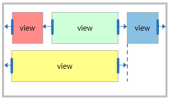

```xaml
<View x:Name="Parent">
    <View.Layout>
        <RelativeLayout/>
    </View.Layout>

    <View x:Name="RedRect"
        BackgroundColor="1,0,0,1"
        WidthSpecification="100"
        HeightSpecification="100"/>

    <View x:Name="GreenRect"
        BackgroundColor="0,1,0,1" HeightSpecification="100"
        RelativeLayout.LeftTarget={x:Reference Name=RedRect}"
        RelativeLayout.RightTarget="{x:Reference Name=BlueRect}"
        RelativeLayout.FillHorizontal="true"
        RelativeLayout.LeftRelativeOffset="1.0"/>

    <View x:Name="BlueRect"
        BackgroundColor="0,0,1,1"
        WidthSpecification="100"
        HeightSpecification="100"
        RelativeLayout.RightRelativeOffset="1.0"
        RelativeLayout.LeftRelativeOffset="1.0"
        RelativeLayout.HorizontalAlignment="End"/>

    <View x:Name="YellowRect"
        BackgroundColor="1,1,0,1"
        HeightSpecification="100"
        RelativeLayout.LeftTarget="{x:Reference Name=Parent}"
        RelativeLayout.RightTarget="{x:Reference Name=BlueRect}"
        RelativeLayout.FillHorizontal="true"/>
</View>
```

- When the `Target` and the `RelativeOffset` properties are set as default:
  - The `RedRect` is aligned to the left side of the parent layout.
  - The `BlueRect` is aligned to the right side of the parent layout by the `HorizontalAlignment`.
  - The left side of `GreenRect` is set to be aligned with `RedRect` and the right side is set to be aligned with `BlueRect`.
  - The `GreenRect` fills the space between `RedRect` and `BlueRect` by using `FillHorizontal`.
  - The `YellowRect` represents that each side can be set as sibling view and parent layout.

**Figure: Relative layout with `Target` and `RelativeOffset` on different screen resolutions**

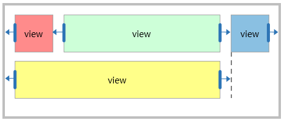

Since the children of the relative layout are laid out depending on their relationship, therefore you can create a responsive UI that keeps the proportions across different screen resolutions without modifications.
The width of `RedRect` and `BlueRect` is set as `100` by specifying the `WidthSpecification` property. However, the width of `GreenRect` and `YellowRect` is resized within the layout space that is set by the `LeftTarget` and `RightTarget`.

The following table describes the properties of `RelativeLayout`:

| Property               | Type            | Description  |
| -----------------------| --------------- | ------------ |
| `LeftTarget`           | View            | Gets or sets the target that the child's left side is referring to.|
| `RightTarget`          | View            | Gets or sets the target that the child's right side is referring to.|
| `TopTarget`            | View            | Gets or sets the target that the child's top side is referring to.|
| `BottomTarget`         | View            | Gets or sets the target that the child's bottom side is referring to.|
| `LeftRelativeOffset`   | float           | Gets or sets the relative offset for the left target. <br /> When the value is `0`, the left edges of the left target and child view are aligned.<br/> When the value is `1`, the left edge of the child view is aligned to the right edge of the left target. |
| `RightRelativeOffset`  | float           | Gets or sets the relative offset for the right target. <br /> When the value is `0`, the right edge of the child view is aligned to the left edge of the right target.<br/> When the value is `1`, the right edges of the right target and child view are aligned.
| `TopRelativeOffset`    | float           | Gets or sets the relative offset for the top target. <br /> When the value is `0`, the top edges of the top target and child view are aligned.<br/> When the value is `1`, the top edge of the child view is aligned to the bottom edge of the top target.
| `BottomRelativeOffset` | float           | Gets or sets the relative offset for the bottom target. <br /> When the value is `0`, the bottom edge of the child view is aligned to the top edge of the bottom target.<br/>When the value is `1`, the bottom edges of the bottom target and child view are aligned.
| `HorizontalAlignment`  | RelativeLayout.Alignment| Gets or sets the horizontal alignment of the child view.|
| `VerticalAlignment`  | RelativeLayout.Alignment| Gets or sets the vertical alignment of the child view.|
| `FillHorizontal`  | bool | Gets or sets the boolean value. It indicates whether or not the child fills its horizontal space.|
| `FillVertical`  | bool | Gets or sets the boolean value. It indicates whether or not the child fills its vertical space.|

## Layout space of child view

The `Target` and the `RelativeOffset` properties determine the size of the layout space. The `Target` property indicates the target view in which each edge of the layout space is aligned. The default value is `null`, which refers to the relative layout.

The `RelativeOffset` moves each edge of layout space in proportion to the target view size:
- If the value is `0.0f`, the edge of the layout space is aligned with the left or top edge of the target view.
- If the value is `1.0f`, the edge of the layout space is aligned with the right or bottom edge of the target view:

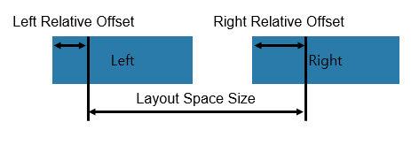

## Alignment

The `HorizontalAlignment` and the `VerticalAlignment` properties describe how to align the child view with the layout space. The default value is `Start` for both the axes:
 |`HorizontalAlignment`: Start|`HorizontalAlignment`: Center|`HorizontalAlignment`: End|
 |:---:|:---:|:---:|
 ||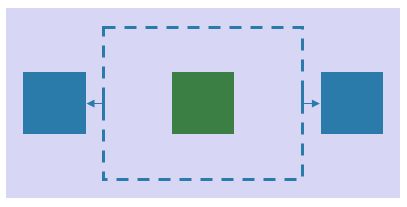|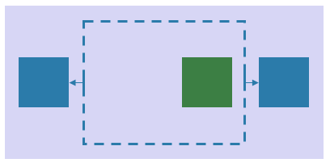|

The alignment property allows to change fixed size view's position begins when all targets on axis (horizontal or vertical) are set to the same value.

|`HorizontalAlignment`: Start |`HorizontalAlignment`: Center|`HorizontalAlignment`: End|
| :---: | :---: | :---: |
| 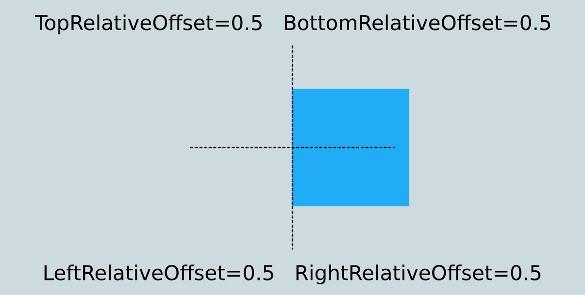 | 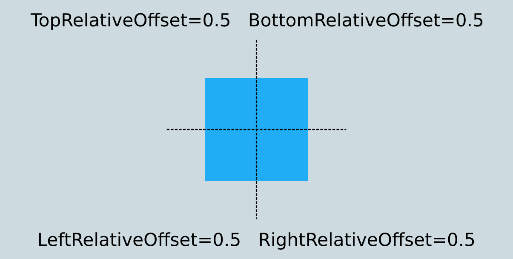 | 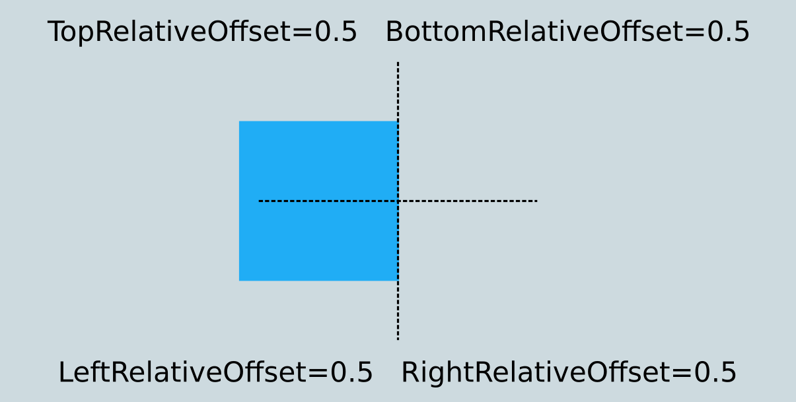 |

## Fill

 The `FillHorizontal` and the `FillVertical` properties are specified by boolean values. These boolean values specify whether or not to fill the layout space. The default is `false` for both the axes:
 |`FillHorizontal`: false|`FillHorizontal`: true|
 |:---:|:---:|
 ||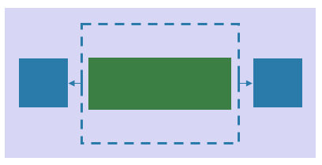|

> [!NOTE]
>To fill control with the predefined size is needed to change property `WidthSpecification`/`HeightSpecification` to value `WrapContent`. Otherwise the control doesn't fill properly the space created by offsets.

## Example

RelativeLayout can fill the bounded container with the content of the view. It is possible to fill the container horizontally and vertically.

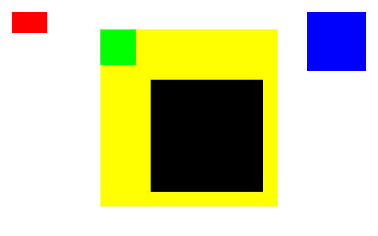

### RelativeLayout initialization

<div id="TabSection1">
    <div class="sampletab" id="ProjectCreateTab">
        <button id="RelativeLayout-Init-CSharp" class="tablinks " onclick="openTabSection(event, 'RelativeLayout-Init-CSharp', 'TabSection1') ">C#</button>
        <button id="RelativeLayout-Init-Xaml" class="tablinks " onclick="openTabSection(event, 'RelativeLayout-Init-Xaml', 'TabSection1') ">Xaml</button>
    </div>
    <div id="RelativeLayout-Init-CSharp" class="tabcontent">
        <table>
            <tbody>
                <tr>
<span style="display:block">

```csharp
View relativeLayoutView = new View
{
    WidthSpecification = LayoutParamPolicies.MatchParent,
    HeightSpecification = LayoutParamPolicies.MatchParent,
    BackgroundColor = Color.White
};

relativeLayoutView.Layout = new RelativeLayout();
```

</span>
                </tr>
            </tbody>
        </table>
    </div>
    <div id="RelativeLayout-Init-Xaml" class="tabcontent">
        <table>
            <tbody>
                <tr>
<span style="display:block">

```xaml
<View
    WidthSpecification="{Static LayoutParamPolicies.MatchParent}"
    HeightSpecification="{Static LayoutParamPolicies.MatchParent}"
    BackgroundColor="White">

    <View.Layout>
        <RelativeLayout />
    </View.Layout>

</View>
```

</span>
                </tr>
            </tbody>
        </table>
    </div>
</div>

### Red view

The following code shows how to create the red view with bounded by offsets.


<div id="TabSection2">
    <div class="sampletab " id="ProjectCreateTab">
        <button id="RelativeLayout-RedView-CSharp" class="tablinks " onclick="openTabSection(event, 'RelativeLayout-RedView-CSharp', 'TabSection2') ">C#</button>
        <button id="RelativeLayout-RedView-Xaml" class="tablinks " onclick="openTabSection(event, 'RelativeLayout-RedView-Xaml', 'TabSection2') ">Xaml</button>
    </div>
    <div id="RelativeLayout-RedView-CSharp" class="tabcontent">
        <table>
            <tbody>
                <tr>
<span style="display:block">

- `RelativeLayout.SetLeftRelativeOffset(redView, 0.0f)` - view's left is at the parent's left.
- `RelativeLayout.SetRightRelativeOffset(redView, 0.1f)` - view's right is at the position of 0.1 width from the parent's left.
- `RelativeLayout.SetTopRelativeOffset(redView, 0.0f)` - view's top is at the parent's top.
- `RelativeLayout.SetBottomRelativeOffset(redView, 0.1f)` - view's bottom bound is at the position of 0.1 width from the parent's top.
- `RelativeLayout.SetFillHorizontal(redView, true)` and `RelativeLayout.SetFillVertical(redView, true)` - Since the view does not have its Width and Height, the view should be filled the relative position(left, right, top, bottom).

```csharp
View redView = new View
{
    BackgroundColor = Color.Red
};

RelativeLayout.SetLeftRelativeOffset(redView, 0.0f);
RelativeLayout.SetRightRelativeOffset(redView, 0.1f);
RelativeLayout.SetTopRelativeOffset(redView, 0.0f);
RelativeLayout.SetBottomRelativeOffset(redView, 0.1f);

RelativeLayout.SetFillHorizontal(redView, true);
RelativeLayout.SetFillVertical(redView, true);

relativeLayoutView.Add(redView);
```

</span>
                </tr>
            </tbody>
        </table>
    </div>
    <div id="RelativeLayout-RedView-Xaml" class="tabcontent">
        <table>
            <tbody>
                <tr>
<span style="display:block">

- `RelativeLayout.LeftRelativeOffset="0.0"` - view's left is at the parent's left.
- `RelativeLayout.RightRelativeOffset="0.1"` - view's right is at the position of 0.1 width from the parent's left.
- `RelativeLayout.TopRelativeOffset="0.0"` - view's top is at the parent's top.
- `RelativeLayout.BottomRelativeOffset="0.1"` - view's bottom bound is at the position of 0.1 width from the parent's top.
- `RelativeLayout.FillHorizontal="true"` and `RelativeLayout.FillVertical="true"` - Since the view does not have its Width and Height, the view should be filled the relative position(left, right, top, bottom).

```xaml
<View x:name="redView"
    BackgroundColor="Red"
    RelativeLayout.LeftRelativeOffset="0.0"
    RelativeLayout.RightRelativeOffset="0.1"
    RelativeLayout.TopRelativeOffset="0.0"
    RelativeLayout.BottomRelativeOffset="0.1"
    RelativeLayout.FillHorizontal="True"
    RelativeLayout.FillVertical="True"/>
```

</span>
                </tr>
            </tbody>
        </table>
    </div>
</div>

### Blue view

The following code shows how to position the blue view with predefined size and change its position begins with `HorizontalAlignment`.

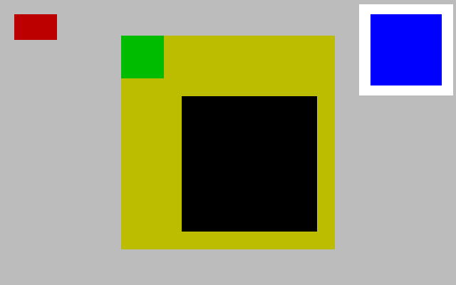

<div id="TabSection3">
    <div class="sampletab " id="ProjectCreateTab">
        <button id="RelativeLayout-BlueView-CSharp" class="tablinks " onclick="openTabSection(event, 'RelativeLayout-BlueView-CSharp', 'TabSection3') ">C#</button>
        <button id="RelativeLayout-BlueView-Xaml" class="tablinks " onclick="openTabSection(event, 'RelativeLayout-BlueView-Xaml', 'TabSection3') ">Xaml</button>
    </div>
    <div id="RelativeLayout-BlueView-CSharp" class="tabcontent">
        <table>
            <tbody>
                <tr>
<span style="display:block">

- `WidthSpecification` and `HeightSpecification` - set the size of the view.
- `RelativeLayout.SetLeftRelativeOffset(blueView, 1.0f)` - view's left is on the parent's right.
- `RelativeLayout.SetRightRelativeOffset(blueView, 1.0f)` - view's right is on the parent's right.
- `RelativeLayout.SetTopRelativeOffset(blueView, 0.0f)` - view's top is on the parent's top.
- `RelativeLayout.SetBottomRelativeOffset(blueView, 0.0f)` - view's bottom is on the parent's top.
- `RelativeLayout.SetHorizontalAlignment(blueView, RelativeLayout.Alignment.End)` - position view begins from right to left from the container.

```csharp
View blueView = new View
{
    BackgroundColor = Color.Blue,
    WidthSpecification = 200,
    HeightSpecification = 200
};

RelativeLayout.SetLeftRelativeOffset(blueView, 1.0f);
RelativeLayout.SetRightRelativeOffset(blueView, 1.0f);
RelativeLayout.SetTopRelativeOffset(blueView, 0.0f);
RelativeLayout.SetBottomRelativeOffset(blueView, 0.0f);

RelativeLayout.SetHorizontalAlignment(blueView, RelativeLayout.Alignment.End);
relativeLayoutView.Add(blueView);
```

</span>
                </tr>
            </tbody>
        </table>
    </div>
    <div id="RelativeLayout-BlueView-Xaml" class="tabcontent">
        <table>
            <tbody>
                <tr>
<span style="display:block">

- `RelativeLayout.LeftRelativeOffset="1.0"` - view's left is on the parent's right.
- `RelativeLayout.RightRelativeOffset="1.0"` - view's right is on the parent's right.
- `RelativeLayout.TopRelativeOffset="0.0"` - view's top is on the parent's top.
- `RelativeLayout.BottomRelativeOffset="0.0"` - view's bottom is on the parent's top.
- `WidthSpecification` and `HeightSpecification` set the size of the view.
- `RelativeLayout.HorizontalAlignment="End"` - position view begins from right to left from the container.

```xaml
<View x:name="blueView"
    BackgroundColor="Blue"
    WidthSpecification="200"
    HeightSpecification="200"

    RelativeLayout.LeftRelativeOffset="1.0"
    RelativeLayout.RightRelativeOffset="1.0"
    RelativeLayout.TopRelativeOffset="0.0"
    RelativeLayout.BottomRelativeOffset="0.0"

    RelativeLayout.HorizontalAlignment="End"/>
```

</span>
                </tr>
            </tbody>
        </table>
    </div>
</div>

### Yellow view

The following code shows how to center yellow view with predefined size.

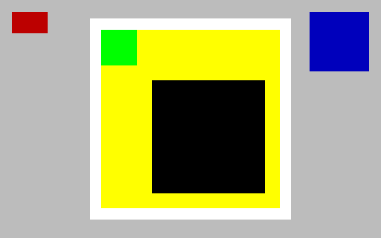

<div id="TabSection4">
    <div class="sampletab " id="ProjectCreateTab">
        <button id="RelativeLayout-YellowView-CSharp" class="tablinks " onclick="openTabSection(event, 'RelativeLayout-YellowView-CSharp', 'TabSection4') ">C#</button>
        <button id="RelativeLayout-YellowView-Xaml" class="tablinks " onclick="openTabSection(event, 'RelativeLayout-YellowView-Xaml', 'TabSection4') ">Xaml</button>
    </div>
    <div id="RelativeLayout-YellowView-CSharp" class="tabcontent">
        <table>
            <tbody>
                <tr>
<span style="display:block">

- `RelativeLayout.SetLeftRelativeOffset(yellowView, 0.5f)` - view's left is on center of the parent's view.
- `RelativeLayout.SetRightRelativeOffset(yellowView, 0.5f)` - view's right is on center of the parent's view.
- `RelativeLayout.SetTopRelativeOffset(yellowView, 0.5f)` - view's top is on center of the parent's view.
- `RelativeLayout.SetBottomRelativeOffset(yellowView, 0.5f)` - view's bottom is on center of the parent's view.
- `WidthSpecification` and `HeightSpecification` set the size of the view.
- `RelativeLayout.SetHorizontalAlignment(blueView, RelativeLayout.Alignment.Center)` and `RelativeLayout.SetVerticalAlignment(blueView, RelativeLayout.Alignment.Center)` - position view on the center of container.

```csharp
View yellowView = new View
{
    BackgroundColor = Color.Yellow,
    WidthSpecification = 600,
    HeightSpecification = 600
};

RelativeLayout.SetLeftRelativeOffset(yellowView, 0.5f);
RelativeLayout.SetRightRelativeOffset(yellowView, 0.5f);
RelativeLayout.SetTopRelativeOffset(yellowView, 0.5f);
RelativeLayout.SetBottomRelativeOffset(yellowView, 0.5f);

RelativeLayout.SetHorizontalAlignment(blueView, RelativeLayout.Alignment.Center);
RelativeLayout.SetVerticalAlignment(blueView, RelativeLayout.Alignment.Center);
relativeLayoutView.Add(yellowView);
```

</span>
                </tr>
            </tbody>
        </table>
    </div>
    <div id="RelativeLayout-YellowView-Xaml" class="tabcontent">
        <table>
            <tbody>
                <tr>
<span style="display:block">

- `RelativeLayout.LeftRelativeOffset="0.5"` - view's left is on center of the parent's view.
- `RelativeLayout.RightRelativeOffset="0.5"` - view's right is on center of the parent's view.
- `RelativeLayout.TopRelativeOffset="0.5"` - view's top is on center of the parent's view.
- `RelativeLayout.BottomRelativeOffset="0.5"` - view's bottom is on center of the parent's view.
- `WidthSpecification` and `HeightSpecification` set the size of the view.
- `RelativeLayout.HorizontalAlignment="Center"` and `RelativeLayout.VerticalAlignment="Center"` - position view on the center of the container.

```xaml
<View x:Name="yellowView"
    BackgroundColor="Yellow"
    WidthSpecification="600"
    HeightSpecification="600"
    RelativeLayout.LeftRelativeOffset="0.5"
    RelativeLayout.RightRelativeOffset="0.5"
    RelativeLayout.TopRelativeOffset="0.5"
    RelativeLayout.BottomRelativeOffset="0.5"
    RelativeLayout.HorizontalAlignment="Center"
    RelativeLayout.VerticalAlignment="Center"/>
```

</span>
                </tr>
            </tbody>
        </table>
    </div>
</div>

### Green view

The following code shows how create the green view to relate to yellowView for every target.

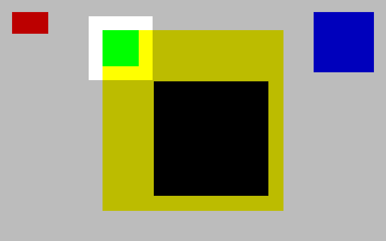

<div id="TabSection5">
    <div class="sampletab " id="ProjectCreateTab">
        <button id="RelativeLayout-GreenView-CSharp" class="tablinks " onclick="openTabSection(event, 'RelativeLayout-GreenView-CSharp', 'TabSection5') ">C#</button>
        <button id="RelativeLayout-GreenView-Xaml" class="tablinks " onclick="openTabSection(event, 'RelativeLayout-GreenView-Xaml', 'TabSection5') ">Xaml</button>
    </div>
    <div id="RelativeLayout-GreenView-CSharp" class="tabcontent">
        <table>
            <tbody>
                <tr>
<span style="display:block">

- View's targets are set to the `yellowView`.
- `RelativeLayout.SetLeftRelativeOffset(greenView, 0.0f)` - view's left is at the yellowView's left.
- `RelativeLayout.SetRightRelativeOffset(greenView, 0.2f)` - view's right is at the position of 0.2 width from the yellowView's left.
- `RelativeLayout.SetTopRelative Offset(greenView, 0.0f)` - view's top is at the yellowView's top.
- `RelativeLayout.SetBottomRelativeOffset(greenView, 0.2f)` - view's bottom is at the position of 0.2 width from the yellowView's left.
- `RelativeLayout.SetFillHorizontal(greenView, true)` and `RelativeLayout.SetFillVertical(greenView, true)` - Since the view does not have its Width and Height, the view should be filled the relative position(left, right, top, bottom).

```csharp
View greenView = new View
{
    BackgroundColor = Color.Green
};

RelativeLayout.SetLeftTarget(greenView, yellowView);
RelativeLayout.SetRightTarget(greenView, yellowView);
RelativeLayout.SetTopTarget(greenView, yellowView);
RelativeLayout.SetBottomTarget(greenView, yellowView);

RelativeLayout.SetLeftRelativeOffset(greenView, 0.0f);
RelativeLayout.SetRightRelativeOffset(greenView, 0.2f);
RelativeLayout.SetTopRelativeOffset(greenView, 0.0f);
RelativeLayout.SetBottomRelativeOffset(greenView, 0.2f);

RelativeLayout.SetFillHorizontal(greenView, true);
RelativeLayout.SetFillVertical(greenView, true);
relativeLayoutView.Add(greenView);
```

- View's targets are set to the `yellowView`.
- `RelativeLayout.LeftRelativeOffset="0.0"` - view's left is at the yellowView's left.
- `RelativeLayout.RightRelativeOffset="0.2"` - view's right is at the position of 0.2 width from the yellowView's left.
- `RelativeLayout.TopRelativeOffset="0.0"` - view's top is at the yellowView's top.
- `RelativeLayout.BottomRelativeOffset="0.2"` - view's bottom is at the position of 0.2 width from the yellowView's left.
- `RelativeLayout.FillHorizontal="true"` and `RelativeLayout.FillVertical="true"` - Since the view does not have its Width and Height, the view should be filled the relative position(left, right, top, bottom).

</span>
                </tr>
            </tbody>
        </table>
    </div>
    <div id="RelativeLayout-GreenView-Xaml" class="tabcontent">
        <table>
            <tbody>
                <tr>
<span style="display:block">

```xaml
<View x:Name="greenView"
    BackgroundColor="Green"
    RelativeLayout.LeftTarget="{x:Reference Name=yellowView}"
    RelativeLayout.RightTarget="{x:Reference Name=yellowView}"
    RelativeLayout.TopTarget="{x:Reference Name=yellowView}"
    RelativeLayout.BottomTarget="{x:Reference Name=yellowView}"
    RelativeLayout.LeftRelativeOffset="0.0"
    RelativeLayout.RightRelativeOffset="0.2"
    RelativeLayout.TopRelativeOffset="0.0"
    RelativeLayout.BottomRelativeOffset="0.2"
    RelativeLayout.FillHorizontal="True"
    RelativeLayout.FillVertical="True"/>
```

</span>
                </tr>
            </tbody>
        </table>
    </div>
</div>

### Black view

The following code shows how to create the black view related to yellowView and greenView.

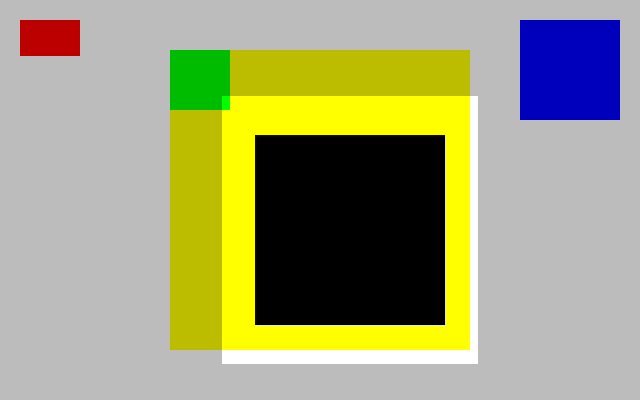

<div id="TabSection6">
    <div class="sampletab " id="ProjectCreateTab">
        <button id="RelativeLayout-BlackView-CSharp" class="tablinks " onclick="openTabSection(event, 'RelativeLayout-BlackView-CSharp', 'TabSection6') ">C#</button>
        <button id="RelativeLayout-BlackView-Xaml" class="tablinks " onclick="openTabSection(event, 'RelativeLayout-BlackView-Xaml', 'TabSection6') ">Xaml</button>
    </div>
    <div id="RelativeLayout-BlackView-CSharp" class="tabcontent">
        <table>
            <tbody>
                <tr>
<span style="display:block">

- View's left and top targets are set to `greenView`.
- View's right and bottom targets are set to `yellowView`.
- `RelativeLayout.SetLeftRelativeOffset(blackView, 1.0f)` - view's left is on the greenView's right.
- `RelativeLayout.SetRightRelativeOffset(blackView, 1.0f)` - view's right is on the yellowView's right.
- `RelativeLayout.SetTopRelativeOffset(blackView, 1.0f)` - view's top is on the greenView's bottom.
- `RelativeLayout.SetBottomRelativeOffset(blackView, 1.0f)` - view's bottom is on the yellowView's bottom.
- `RelativeLayout.SetFillHorizontal(blackView, true)` and `RelativeLayout.SetFillVertical(blackView, true)` - Since the view does not have its Width and Height, the view should be filled the relative position(left, right, top, bottom).

```csharp
View blackView = new View
{
    BackgroundColor = Color.Black,
    Margin = new Extents(50, 50, 50, 50)
};

RelativeLayout.SetLeftTarget(blackView, greenView);
RelativeLayout.SetRightTarget(blackView, yellowView);
RelativeLayout.SetTopTarget(blackView, greenView);
RelativeLayout.SetBottomTarget(blackView, yellowView);

RelativeLayout.SetLeftRelativeOffset(blackView, 1.0f);
RelativeLayout.SetRightRelativeOffset(blackView, 1.0f);
RelativeLayout.SetTopRelativeOffset(blackView, 1.0f);
RelativeLayout.SetBottomRelativeOffset(blackView, 1.0f);

RelativeLayout.SetFillHorizontal(blackView, true);
RelativeLayout.SetFillVertical(blackView, true);
relativeLayoutView.Add(blackView);
```

</span>
                </tr>
            </tbody>
        </table>
    </div>
    <div id="RelativeLayout-BlackView-Xaml" class="tabcontent">
        <table>
            <tbody>
                <tr>
<span style="display:block">

- View's left and top targets are set to `greenView`.
- View's right and bottom targets are set to `yellowView`.
- `RelativeLayout.LeftRelativeOffset="1.0"` - view's left is on the greenView's right.
- `RelativeLayout.RightRelativeOffset="1.0"` - view's right is on the yellowView's right.
- `RelativeLayout.TopRelativeOffset="1.0"` - view's top is on the greenView's bottom.
- `RelativeLayout.BottomRelativeOffset="1.0"` - view's bottom is on the yellowView's bottom.
- `RelativeLayout.FillHorizontal="true"` and `RelativeLayout.FillVertical="true"` - Since the view does not have its Width and Height, the view should be filled the relative position(left, right, top, bottom).

```xaml
<View x:name="blackView"
    BackgroundColor="Black"
    RelativeLayout.LeftTarget="{x:Reference Name=greenView}"
    RelativeLayout.RightTarget="{x:Reference Name=yellowView}"
    RelativeLayout.TopTarget="{x:Reference Name=greenView}"
    RelativeLayout.BottomTarget="{x:Reference Name=yellowView}"
    RelativeLayout.LeftRelativeOffset="1.0"
    RelativeLayout.RightRelativeOffset="1.0"
    RelativeLayout.TopRelativeOffset="1.0"
    RelativeLayout.BottomRelativeOffset="1.0"
    RelativeLayout.FillHorizontal="True"
    RelativeLayout.FillVertical="True"
    Margin="50,50,50,50"/>
```

</span>
                </tr>
            </tbody>
        </table>
    </div>
</div>

## Related information

- Dependencies
  -  Tizen 6.5 and Higher

<script>
    function openTabSection(evt, profileName, sectionId) {
        var i, tabcontent, tablinks, section;
        let selected = 0;

        section = document.getElementById(sectionId);
        tabcontent = section.getElementsByClassName("tabcontent");

        for (i = 0; i < tabcontent.length; i++) {
            tabcontent[i].style.display = "none";
            if (tabcontent[i].id == profileName) {
                selected = i;
            }
        }

        tablinks = section.getElementsByClassName("tablinks");

        for (i = 0; i < tablinks.length; i++) {
            tablinks[i].className = tablinks[i].className.replace(" active", "");
        }

        tabcontent[selected].style.display = "block";
        evt.currentTarget.className += " active";
    }

    document.getElementById("RelativeLayout-Init-CSharp").click();
    document.getElementById("RelativeLayout-RedView-CSharp").click();
    document.getElementById("RelativeLayout-BlueView-CSharp").click();
    document.getElementById("RelativeLayout-YellowView-CSharp").click();
    document.getElementById("RelativeLayout-GreenView-CSharp").click();
    document.getElementById("RelativeLayout-BlackView-CSharp").click();
</script>
