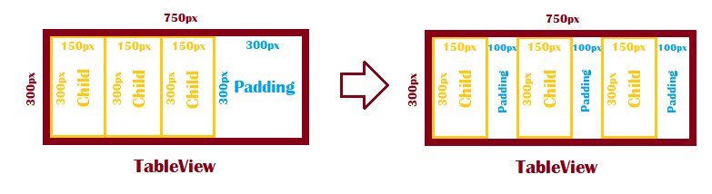
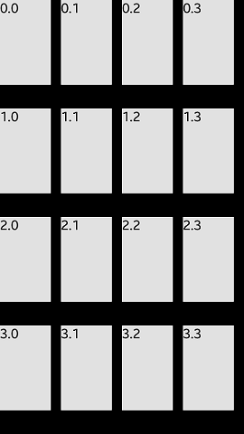

# TableView

The [TableView](/application/dotnet/api/TizenFX/latest/api/Tizen.NUI.BaseComponents.TableView.html) class is a layout container for aligning child actors in a grid like layout.
Based on `TableView` and child's size, child's X and Y positions are defined. 

In case the sum of children's width in a row is lower than the width of `TableView`, then the children are positioned with equal padding. Analogous rule are used when the sum of children's height in a column is lower than the height of `TableView`:

**Figure: TableView behaviour in case of row underflow**



The Z position and depth are left intact, so that the three-dimensional model actors can also be laid out in a grid without losing their depth scaling.

## Create a TableView

The following example illustrates how to create a `TableView` object:

**Figure: TableView example**



1.  To use the `TableView` class, add the following namespace and assembly:

    ```xaml
    xmlns:base="clr-namespace:Tizen.NUI.BaseComponents;assembly=Tizen.NUI"
    ```

2.  To create `TableView` as the whole view, set the resize policy to `FillToParent`. Add `TextLabel`s as cells of `TableView`:

    ```xaml
    <base:TableView x:Name="tableView" WidthResizePolicy="FillToParent" HeightResizePolicy="FillToParent" Rows="4" Columns="4" >
        <base:TextLabel Text="0.0" BackgroundColor="White" WidthSpecification="150" HeightSpecification="250"  />
        <base:TextLabel Text="0.1" BackgroundColor="White" WidthSpecification="150" HeightSpecification="250" />
        <base:TextLabel Text="0.2" BackgroundColor="White" WidthSpecification="150" HeightSpecification="250" />
        <base:TextLabel Text="0.3" BackgroundColor="White" WidthSpecification="150" HeightSpecification="250" />
        <base:TextLabel Text="1.0" BackgroundColor="White" WidthSpecification="150" HeightSpecification="250" />
        <base:TextLabel Text="1.1" BackgroundColor="White" WidthSpecification="150" HeightSpecification="250" />
        <base:TextLabel Text="1.2" BackgroundColor="White" WidthSpecification="150" HeightSpecification="250" />
        <base:TextLabel Text="1.3" BackgroundColor="White" WidthSpecification="150" HeightSpecification="250" />
        <base:TextLabel Text="2.0" BackgroundColor="White" WidthSpecification="150" HeightSpecification="250" />
        <base:TextLabel Text="2.1" BackgroundColor="White" WidthSpecification="150" HeightSpecification="250" />
        <base:TextLabel Text="2.2" BackgroundColor="White" WidthSpecification="150" HeightSpecification="250" />
        <base:TextLabel Text="2.3" BackgroundColor="White" WidthSpecification="150" HeightSpecification="250" />
        <base:TextLabel Text="3.0" BackgroundColor="White" WidthSpecification="150" HeightSpecification="250" />
        <base:TextLabel Text="3.1" BackgroundColor="White" WidthSpecification="150" HeightSpecification="250" />
        <base:TextLabel Text="3.2" BackgroundColor="White" WidthSpecification="150" HeightSpecification="250" />
        <base:TextLabel Text="3.3" BackgroundColor="White" WidthSpecification="150" HeightSpecification="250" />
    </base:TableView>
    ```

## TableView properties

The following table lists the available `TableView` properties:

**Table: TableView properties**

| Property        | Type         | Description                        |
|-----------------|--------------|------------------------------------|
| `Rows`          | Integer      | The amount of rows in the table.    |
| `Columns`       | Integer      | The amount of columns in the table. |
| `CellPadding`   | Vector2      | Padding between the cells.              |
| `LayoutRows`    | PropertyMap  | The number of layout rows.          |
| `LayoutColumns` | PropertyMap  | The number of layout columns.       |


## Related information
- Dependencies
  -   Tizen 6.5 and Higher
