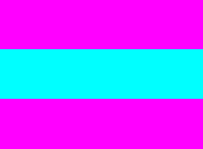

# UI Components

UI components are interactive components for layout and user interface. NUI provides UI components, such as buttons, table view, text controls, image view, flex container, slider, and video view.

**Figure: UI components**

 

The following table lists the available UI components:

**Table: UI components**

| Control                              | Description                              | Appearance                          |
| ------------------------------------ | ---------------------------------------- | ---------------------------------------- |
| [AlertDialog](./nui-components/AlertDialog.md)  | AlertDialog class shows a dialog with title, message, and action buttons.  [Guide ](./nui-components/AlertDialog.md) / [API](/application/dotnet/api/TizenFX/latest/api/Tizen.NUI.Components.AlertDialog.html)  |    [C# code for this page](./codeExamples/AlertDialog.cs) / [XAML page](./codeExamples/AlertDialog.xaml)                |
| [Button](./nui-components/Button.md) | Button is a common component and describes what action occurs when you select it. A Button can either contain a text or an icon.  [Guide ](./nui-components/Button.md) / [API](/application/dotnet/api/TizenFX/latest/api/Tizen.NUI.Components.Button.html) |   [C# code for this page](codeExamples/Button.cs) / [XAML page](codeExamples/Button.xaml)               |
| [CanvasView](./vectorgraphics/CanvasView.md) | A CanvasView is a class for displaying vector primitives.  [Guide ](./vectorgraphics/CanvasView.md) / [API](/application/dotnet/api/TizenFX/latest/api/Tizen.NUI.BaseComponents.VectorGraphics.CanvasView.html)| `CanvasViewView` |
| [CameraView](./nui-components/CameraView.md) | A camera view that controls and displays camera playback.  [Guide ](./nui-components/CameraView.md) / [API](/application/dotnet/api/TizenFX/latest/api/Tizen.NUI.BaseComponents.CameraView.html)| `CameraView` |
| [CheckBox](./nui-components/CheckBox.md) | A CheckBox that can set selected or unselected status when user selects it. [Guide ](./nui-components/CheckBox.md) / [API](/application/dotnet/api/TizenFX/latest/api/Tizen.NUI.Components.CheckBox.html)  |   [C# code for this page](./codeExamples/CheckBox.cs) / [XAML page](./codeExamples/CheckBox.xaml)                |
| [DatePicker](./nui-components/DatePicker.md)        | DatePicker is a class which provides a function that allows the user to select a date through a scrolling motion by expressing the specified value as a list. DatePicker expresses the current date using the locale information of the system. Year range is 1970~2038 (glibc time_t struct min, max value)  [Guide ](./nui-components/DatePicker.md) / [API](/application/dotnet/api/TizenFX/latest/api/Tizen.NUI.Components.DatePicker.html)  |   [C# code for this page](./codeExamples/DatePicker.cs) / [XAML page](./codeExamples/DatePicker.xaml) |
| [GLView](./glview.md) | GLView is a class which renders the view with OpenGL&reg; ES.  [Guide ](./glview.md) / [API](/application/dotnet/api/TizenFX/latest/api/Tizen.NUI.BaseComponents.GLView.html)| `GLView` |
| [ImageView](./imageview.md)          | An image view is a class for displaying an image resource.   [Guide ](./imageview.md) / [API](/application/dotnet/api/TizenFX/latest/api/Tizen.NUI.BaseComponents.ImageView.html)  |   [C# code for this page](./codeExamples/ImageView.cs) / [XAML page](./codeExamples/ImageView.xaml) |
| [Loading](./nui-components/Loading.md) | A loading is used to give information about the ongoing operations.  [Guide ](./nui-components/Loading.md) / [API](/application/dotnet/api/TizenFX/latest/api/Tizen.NUI.Components.Loading.html) |   [C# code for this page](./codeExamples/Loading.cs) / [XAML page](./codeExamples/Loading.xaml) |
| [LottieAnimationView](./nui-components/LottieAnimationView.md) | A LottieAnimationView is used to show a vector animation.  [Guide ](./nui-components/LottieAnimationView.md) / [API](/application/dotnet/api/TizenFX/latest/api/Tizen.NUI.BaseComponents.LottieAnimationView.html) |   [C# code for this page](./codeExamples/LottieAnimationView.cs) / [XAML page](./codeExamples/LottieAnimationView.xaml) |
| [Menu](./nui-components/Menu.md)        | Menu is a class which contains a set of MenuItems and has one of them selected. [Guide ](./nui-components/Menu.md) / [API](/application/dotnet/api/TizenFX/latest/api/Tizen.NUI.Components.Menu.html) |   [C# code for this page](./codeExamples/Menu.cs) / [XAML page](./codeExamples/MenuTestPage.xaml)   [C# code Menu definition](./codeExamples/MenuTestMenu.xaml.cs) / [XAML Menu definition](./codeExamples/MenuTestMenu.xaml) |
| [Notification](./nui-components/Notification.md) | A notification is used to pop-up a notification window with a content view.  [Guide ](./nui-components/Notification.md) / [API](/application/dotnet/api/TizenFX/latest/api/Tizen.NUI.Components.Notification.html)| `Notification` |
| [Pagination](./nui-components/Pagination.md) | A Pagination is used to show the number of pages available and the currently active page.  [Guide ](./nui-components/Pagination.md) / [API](/application/dotnet/api/TizenFX/latest/api/Tizen.NUI.Components.Pagination.html)  |   [C# code for this page](./codeExamples/Pagination.cs) / [XAML page](./codeExamples/Pagination.xaml) |
| [Picker](./nui-components/Picker.md)        | Picker is a class which provides a function that allows the user to select a value through a scrolling motion by expressing the specified value as a list. [Guide ](./nui-components/Picker.md) / [API](/application/dotnet/api/TizenFX/latest/api/Tizen.NUI.Components.Picker.html)  |   [C# code for this page](./codeExamples/Picker.cs) / [XAML page](./codeExamples/Picker.xaml) |
| [Popup](./nui-components/Popup.md) | A popup is used as a popup window.  [Guide ](./nui-components/Popup.md) / [API](/application/dotnet/api/TizenFX/latest/api/Tizen.NUI.Components.Popup.html) |    [C# code for this page](./codeExamples/Popup.cs) / [XAML page](./codeExamples/Popup.xaml) |
| [Progress](./nui-components/Progress.md) | A progress is used to show the ongoing status using a long narrow bar.  [Guide ](./nui-components/Progress.md) / [API](/application/dotnet/api/TizenFX/latest/api/Tizen.NUI.Components.Progress.html) |   [C# code for this page](./codeExamples/Progress.cs) / [XAML page](./codeExamples/Progress.xaml) |
| [RadioButton](./nui-components/RadioButton.md) | A RadioButton that can set selected or unselected status when user selects it.  [Guide ](./nui-components/RadioButton.md) / [API](/application/dotnet/api/TizenFX/latest/api/Tizen.NUI.Components.RadioButton.html) |   [C# code for this page](./codeExamples/RadioButton.cs) / [XAML page](./codeExamples/RadioButton.xaml) |
| [ScrollableBase](./nui-components/ScrollableBase.md) | A ScrollableBase supports scrolling.  [Guide ](./nui-components/ScrollableBase.md) / [API](/application/dotnet/api/TizenFX/latest/api/Tizen.NUI.Components.ScrollableBase.html)  |   [C# code for this page](./codeExamples/ScrollableBase.cs) / [XAML page](./codeExamples/ScrollableBase.xaml) |
| [Slider](./nui-components/Slider.md) | A slider that indicates a modifiable value within a specific range.  [Guide ](./nui-components/Slider.md) / [API](/application/dotnet/api/TizenFX/latest/api/Tizen.NUI.Components.Slider.html)  |   [C# code for this page](./codeExamples/Slider.cs) / [XAML page](./codeExamples/Slider.xaml) |
| [Switch](./nui-components/Switch.md) | A switch that can be used as a selector.  [Guide ](./nui-components/Switch.md) / [API](/application/dotnet/api/TizenFX/latest/api/Tizen.NUI.Components.Switch.html) |   [C# code for this page](./codeExamples/Switch.cs) / [XAML page](./codeExamples/Switch.xaml) |
| [TabBar](./nui-components/Tab.md)        | TabBar is a class which contains a set of TabButtons and has one of them selected.  [Guide ](./nui-components/Tab.md) / [API](/application/dotnet/api/TizenFX/latest/api/Tizen.NUI.Components.TabBar.html) |    [C# code for this page](./codeExamples/Tab.cs) / [XAML page](./codeExamples/Tab.xaml) |
| [TabButton](./nui-components/Tab.md)        | TabButton is a class which is used for selecting a content in the TabView.  [Guide ](./nui-components/Tab.md) / [API](/application/dotnet/api/TizenFX/latest/api/Tizen.NUI.Components.TabButton.html) |    [C# code for this page](./codeExamples/Tab.cs) / [XAML page](./codeExamples/Tab.xaml) |
| [TabContent](./nui-components/Tab.md)        | TabContent is a class which contains a set of Views and has one of them selected.  [Guide ](./nui-components/Tab.md) / [API](/application/dotnet/api/TizenFX/latest/api/Tizen.NUI.Components.TabContent.html)  |    [C# code for this page](./codeExamples/Tab.cs) / [XAML page](./codeExamples/Tab.xaml) |
| [TabView](./tableview.md)        | TabView is a class which contains a TabBar and TabContent. TabView adds TabButtons and Views to TabBar and TabContent in TabView. TabView removes TabButtons and Views from TabBar and TabContent in TabView. TabView selects a view from the TabContent according to the selected TabButton in the TabBar.  [Guide ](./tableview.md) / [API](/application/dotnet/api/TizenFX/latest/api/Tizen.NUI.Components.TabView.html)  |  [C# code for this page](./codeExamples/Tab.cs) / [XAML page](./codeExamples/Tab.xaml) |
| [TimePicker](./nui-components/TimePicker.md)        | TimePicker is a class which provides a function that allows the user to select a time through a scrolling motion by expressing the specified value as a list. TimePicker expresses the current time using the locale information of the system.  [Guide ](./nui-components/TimePicker.md) / [API](/application/dotnet/api/TizenFX/latest/api/Tizen.NUI.Components.TimePicker.html) |   [C# code for this page](./codeExamples/TimePicker.cs) / [XAML page](./codeExamples/TimePicker.xaml) |
| [TableView](./tableview.md)          | A table view that can align child actors in a grid like layout.  [Guide ](./nui-components/Tab.md) / [API](/application/dotnet/api/TizenFX/latest/api/Tizen.NUI.BaseComponents.TableView.html)  |  [C# code for this page](./codeExamples/TableView.cs) / [XAML page](./codeExamples/TableView.xaml) |
| [Text](./text.md)                    | A text that renders a short text string and provides a editable text. [Guide ](./text.md) / [Text Editor API](/application/dotnet/api/TizenFX/latest/api/Tizen.NUI.BaseComponents.TextEditor.html) / [Text Field API](/application/dotnet/api/TizenFX/latest/api/Tizen.NUI.BaseComponents.TextField.html) / [Text Label API](/application/dotnet/api/TizenFX/latest/api/Tizen.NUI.BaseComponents.TextLabel.html) |   [C# code for this page](./codeExamples/Text.cs) / [XAML page](./codeExamples/Text.xaml) |
| [VideoView](./videoview.md)          | A video view that controls and displays video playback.  [Guide ](./videoview.md) / [API](/application/dotnet/api/TizenFX/latest/api/Tizen.NUI.BaseComponents.VideoView.html) |  [C# code for this page](./codeExamples/VideoView.cs) / [XAML page](./codeExamples/VideoView.xaml) |
| [WebView](./webview.md)          | A web view for showing web content.  [Guide ](./webview.md) / [API](/application/dotnet/api/TizenFX/latest/api/Tizen.NUI.BaseComponents.WebView.html) |   [C# code for this page](./codeExamples/WebView.cs) / [XAML page](./codeExamples/WebView.xaml) |

The base class for the components is `View`. This class can also be used to create your own custom UI components. For more information on the view class, see [View](./view.md). In this UI Components guide, both the terms **control** and **component** are used to refer to a UI component.

You can [customize the look of the UI components with stylesheets](./styling-controls-with-xaml.md). For a reusable rendering logic that can be used by all UI components, take advantage of [visuals](./visuals.md).

## Related information
- Dependencies
  -   Tizen 4.0 and Higher
