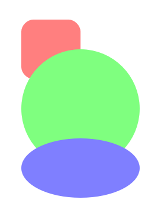

# Grouping

`Tizen.NUI.BaseComponents.VectorGraphics` provides an interface to build `Drawable` groups by composing multiple drawables.
This is useful when you consider a scene-graph structure and manipulate drawables as a control unit.
The code below shows how to use the `DrawableGroup`.

```cs
//generate a drawable group
DrawableGroup drawableGroup = new DrawableGroup();

//generate a round rectangle
Shape rect = new Shape();
rect.AddRect(50.0f, 50.0f, 100.0f, 100.0f, 20.0f, 20.0f);
rect.FillColor = Color.Red;

//add the rectangle into the drawable group
drawableGroup.AddDrawable(rect);

//generate a circle
Shape circle = new Shape();
circle.AddCircle(150.0f, 200.0f, 100.0f, 100.0f);
circle.FillColor = Color.Green;

//add the circle into the drawable group
drawableGroup.AddDrawable(circle);

//generate an ellipse
Shape ellipse = new Shape();
ellipse.AddCircle(150.0f, 300.0f, 100.0f, 50.0f);
ellipse.FillColor = Color.Blue;

//add the eliipse into the drawable group
drawableGroup.AddDrawable(ellipse);

//set the drawable group opacity value
drawableGroup.Opacity = 0.5f;

//add the drawable group into the canvas view
canvasView.AddDrawable(drawableGroup);
```


All kinds of `Drawable` objects (`Shape`, `DrawableGroup` and `Picture`) can be added into the `DrawableGroup` as its children.
You can scale this logic and build a complex scene by compositing multiple `DrawableGroup`.


