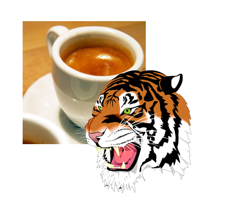

# Picture
The `Picture` is a special drawable that is designed to draw a scene on the `CanvasView` from image data.
`Picture` supports several image formats (`SVG`, `JPG`, `PNG` and `TVG`) including vector-based and bitmap-based formats.

> [!NOTE]
> TVG image format is a binary image format of [ThorVG](https://www.thorvg.org) library which is vector backend engine of NUI VectorGraphics. See [this](https://www.thorvg.org/about) for more information on TVG.

Below is an example of picture.

```cs
//generate a picture
Picture pictureJPG = new Picture();
pictureJPG.Load( JPG_PATH );
pictureJPG.SetSize(new Size2D(250, 250));
pictureJPG.Translate(50.0f, 50.0f);

//add the jpg picture into the canvas view
canvasView.AddDrawable(pictureJPG);

//generate a picture
Picture pictureSVG = new Picture();
pictureSVG.Load( SVG_PATH );
pictureSVG.SetSize(new Size2D(250, 250));
pictureSVG.Translate(150.0f, 150.0f);

//add the svg picture into the canvas view
canvasView.AddDrawable(pictureSVG);
```




## Related Information
- Dependencies
  -   Tizen 6.5 and Higher
