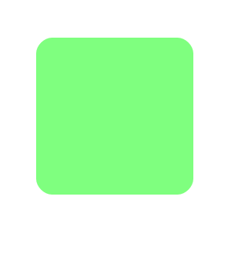
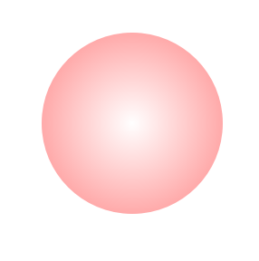
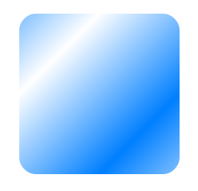
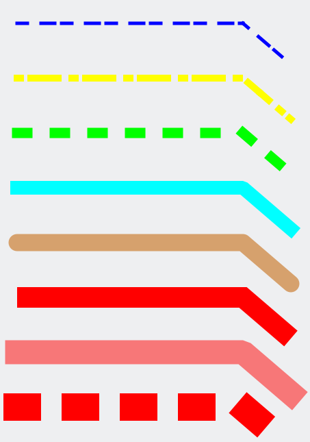

# Shape and Stroke

This page introduces the `Shape` class and the feature to decorate the outline of `Shape`.

## Shapes

Once a `CanvasView` is ready, you can create shapes by adding them to the `CanvasView`.

```cs
//generate a shape
Shape rect = new Shape();

//add a rounded rectangle to the shape (x, y, w, h, rx, ry)
rect.AddRect(50, 50, 200, 200, 20, 20);

//set shape color (r, g, b, a)
rect.FillColor = new Color(0.5f, 1.0f, 0.5f, 1.0f);

//add the shape into the canvas view
canvasView.AddDrawable(rect);
```

In the example above, a shape is generated and then a rounded rectangle is added to it.
NUI vector graphics provides predefined shape types such as rectangle, circle and arc for the user's convenience.

| Type       | API                                                                                                     |
| ---------- | ------------------------------------------------------------------------------------------------------- |
| Rectangle  | `bool AddRect(float x, float y, float width, float height, float roundedCornerX, float roundedCornerY)` |
| Circle     | `bool AddCircle(float x, float y, float radiusX, float radiusY)`                                        |
| Arc        | `bool AddArc(float x, float y, float radius, float startAngle, float sweep, bool pie)`                  |

You can add any custom shape by using `PathCommands`. NUI vector graphics allows you to append multiple forms into a shape, to compose a more complex one.
A complex shape shares its properties, such as color, stroke, fill, etc., among the appended forms.

After a rounded rectangle is added, its color is set and then the shape is added to the `CanvasView`.

This `shape` from the example looks as follows:





## PathCommands
Besides predefined `Shape` types, you can compose arbitrary `Shape` types using a path concept.
A path is a list of commands that are commonly used in traditional 2D vector drawing.
Below you can see an example of how to define your own forms.

```cs
//generate a shape
Shape path = new Shape();

//set sequential path coordinates
path.AddMoveTo(199.0f, 35.0f);
path.AddLineTo(253.0f, 144.0f);
path.AddLineTo(374.0f, 161.0f);
path.AddLineTo(287.0f, 245.0f);
path.AddLineTo(307.0f, 366.0f);
path.AddLineTo(199.0f, 310.0f);
path.AddLineTo(97.0f, 366.0f);
path.AddLineTo(112.0f, 246.0f);
path.AddLineTo(26.0f, 162.0f);
path.AddLineTo(146.0f, 144.0f);

//complete the path
path.Close();

//set shape color (r, g, b, a)
path.FillColor = new Color(1.0f, 0.5f, 0.5f, 1.0f);

//add the shape into the canvas view
canvasView.AddDrawable(path);
```

The output of the example is as follows:


By using the Path, lines and Bezier curves can be drawn. Additionally, you can set preset list using `void AddPath(PathCommands pathCommands)` for optimal data delivery.

```cs
//generate a shape
Shape shape = new Shape();

//set sequential path coordinates
PathCommandType[] commands = new PathCommandType[] { PathCommandType.MoveTo,
                                                    PathCommandType.LineTo,
                                                    PathCommandType.LineTo,
                                                    PathCommandType.LineTo,
                                                    PathCommandType.LineTo,
                                                    PathCommandType.Close };
float[] points = new float[] {200.0f, 40.0f,
                            325.0f, 360.0f,
                            20.0f, 155.0f,
                            380.0f, 155.0f,
                            75.0f, 360.0f };

shape.AddPath(new PathCommands(commands, points));

//set shape color (r, g, b, a)
shape.FillColor = new Color(0.5f, 0.5f, 1.0f, 1.0f);

//add the shape into the canvas view
canvasView.AddDrawable(shape);
```
The output of the example is as follows:


## Gradients


Besides the solid color, `Shape` supports two kinds of gradient `LinearGradient` and `RadialGradient`.
Fundamentally, choosing the gradient fill effect is up to the user. However, it often adds some aesthetics to the shapes.
The example below shows how to create a circle with a shading effect.

```cs
//generate a shape
Shape circle = new Shape();

//add a circle to the shape (cx, cy, rx, ry)
circle.AddCircle(300.0f, 300.0f, 100.0f, 100.0f);

//generate a radial gradient
RadialGradient radialGradient = new RadialGradient();

//set the radial gradient geometry info (center point, radius)
radialGradient.SetBounds(new Position2D(300, 300), 150.0f);

//gradient colors
List<ColorStop> colorStops = new List<ColorStop>() {
                                new ColorStop(0.0f, new Color(1.0f, 1.0f, 1.0f, 1.0f)),
                                new ColorStop(1.0f, new Color(1.0f, 0.5f, 0.5f, 1.0f)) };

radialGradient.ColorStops = colorStops.AsReadOnly();

//set the shape radial gradient
circle.FillGradient = radialGradient;

//add the shape into the canvas view
canvasView.AddDrawable(circle);
```



By setting the `Spread` with `SpreadType`, you can create various gradients style.

| SpreadType | Description                                                                                                 |
| -----------| ----------------------------------------------------------------------------------------------------------- |
| `Pad`      | The remaining area is filled with the closest stop color.                                                   |
| `Reflect`  | The gradient pattern is reflected outside the gradient area until the expected region is filled.            |
| `Repeat`   | The gradient pattern is repeated continuously beyond the gradient area until the expected region is filled. |

```cs
//generate a shape
Shape rect = new Shape();

//add a rectangle to the shape (cx, cy, rx, ry)
rect.AddRect(50, 50, 200, 200, 20, 20);

//generate a linear gradient
LinearGradient linearGradient = new LinearGradient();

//set the linear gradient geometry info (first point, second point)
linearGradient.SetBounds(new Position2D(100, 100), new Position2D(200, 200));

//gradient colors
List<ColorStop> colorStops = new List<ColorStop>() {
                                new ColorStop(0.0f, new Color(1.0f, 1.0f, 1.0f, 1.0f)),
                                new ColorStop(1.0f, new Color(0.0f, 0.5f, 1.5f, 1.0f)) };

linearGradient.ColorStops = colorStops.AsReadOnly();

//set the linear gradient spread type.
linearGradient.Spread = SpreadType.Reflect;

//set the shape linear gradient
rect.FillGradient = linearGradient;

//add the shape into the canvas view
canvasView.AddDrawable(rect);
```
The output of the example is as follows:




## Stroke
You can draw the outline of shapes by simply adding stroke property to a shape if needed.
Stroke supports both, a solid color and a gradient fill; it also 4 has major properties (`StrokeWidth`, `StrokeCap`, `StrokeJoin` and `StrokeDash`).


| StrokeCapType | Description                                                           |
| ------------- | --------------------------------------------------------------------- |
| `Square`      | The end of lines is rendered as a square around the last point.       |
| `Round`       | The end of lines is rendered as a half-circle around the last point.  |
| `Butt`        | The end of lines is rendered as a full stop on the last point itself. |


| StrokeJoinType | Description                        |
| -------------- | ---------------------------------- |
| `Bevel`        | Used to render beveled line joins. |
| `Round`        | Used to render rounded line joins. |
| `Miter`        | Used to render mitered line joins. |

This is an example using various stroke properties of `Shape`.

```cs
//generate shapes
Shape[] shape = new Shape[8];
for(int i = 0; i < 8; i++)
{
    shape[i] = new Shape()
    {
        StrokeColor = Tizen.NUI.Color.Red,
        StrokeWidth = 5.0f + (i * 5.0f)
    };
    shape[i].AddMoveTo(50.0f, 20.0f + i * 80.0f);
    shape[i].AddLineTo(380.0f, 20.0f + i * 80.0f);
    shape[i].AddLineTo(450.0f, 80.0f + i * 80.0f);

    //add shapes into the canvas view
    canvasView.AddDrawable(shape[i]);
}

//set stroke color
shape[0].StrokeColor = Tizen.NUI.Color.Blue;
shape[1].StrokeColor = Tizen.NUI.Color.Yellow;
shape[2].StrokeColor = Tizen.NUI.Color.Green;
shape[3].StrokeColor = Tizen.NUI.Color.Cyan;
shape[4].StrokeColor = new Tizen.NUI.Color(0.8f, 0.5f, 0.2f, 0.7f);

//set stroke cap type
shape[3].StrokeCap = StrokeCapType.Square;
shape[4].StrokeCap = StrokeCapType.Round;
shape[5].StrokeCap = StrokeCapType.Butt;

//set stroke join type
shape[3].StrokeJoin = StrokeJoinType.Bevel;
shape[4].StrokeJoin = StrokeJoinType.Round;
shape[5].StrokeJoin = StrokeJoinType.Miter;

shape[6].Opacity = 0.5f;

//set dash stroke
shape[0].StrokeDash = new List<float>() { 15.0f, 20.0f, 20.0f, 10.0f }.AsReadOnly();
shape[1].StrokeDash = new List<float>() { 5.0f, 15.0f, 20.0f }.AsReadOnly();
shape[2].StrokeDash = new List<float>() { 15.0f, 40.0f }.AsReadOnly();
shape[7].StrokeDash = new List<float>() { 15.0f, 70.0f }.AsReadOnly();
```

The output of the example is as follows:




## Related information
- Dependencies
  -   Tizen 6.5 and Higher

