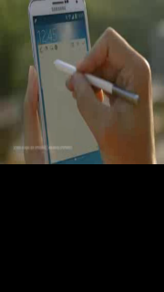

# VideoView

The [VideoView](/application/dotnet/api/TizenFX/latest/api/Tizen.NUI.BaseComponents.VideoView.html) class is a control for video playback and display. It provides minimum functions for playback (play, pause, stop, forward, and backward). Some options, such as volume, can be controlled through the control properties. NUI supports many kinds of video format, such as `.avi`, `.3gp` and `mp4`.

 > [!NOTE] 
 > The `VideoView` control does not use any privileges APIs on its own. However, if you use video files in a specific device storage, the application requires privileges to access the storage.


## Create a VideoView

The following basic example shows how to create a `VideoView` object:

**Figure: Basic VideoView**


1.  To use the `VideoView` class, add the following namespace and assembly:

    ```xaml
    xmlns:base="clr-namespace:Tizen.NUI.BaseComponents;assembly=Tizen.NUI"
    ```
  
2.   The video file is assumed to be in the resources directory. Create an instance of the `VideoView` class and use the `ResourceUrl` property to pass the path to the video file. Set `WidthResizePolicy` to make `VideoView` instance use full width of the window and set `HeightResizePolicy` to maintain aspect ratio of video. And then you can invoke the `Play()` method to start video:

      ```xaml
      <base:VideoView x:Name="player" ResourceUrl="*Resource*/images/sample.3gp" 
                    WidthSpecification="720" HeightSpecification="405"
                    Underlay="False"  />
      <comp:Button x:Name="start_btn" Text="Start Video" Position="0,800" WidthSpecification="-1"
                    HeightSpecification="100" Clicked="start_Clicked"/>
      ```

      ```csharp
      private void start_Clicked(object sender, ClickedEventArgs e)
        {
            player.Play();
        }
      ```



> [!NOTE]  
> You can set the video file to be played in a new `VideoView()`, or by modifying the `Video` property.


## VideoView methods

  The following are the `VideoView` functions for playback:

  - The `Play()` method starts video:

      ```csharp
      player.Play();
      ```

  - The `Pause()` method pauses video. To resume the video, use the `Play()` method:

      ```csharp
      player.Pause();
      ```

  - The `Stop()` method stops video. After the `Stop()` method is called, the video is started from the beginning if `Play()` method is called:

      ```csharp
      player.Stop();
      ```

  - The `Forward(x)` method fast forwards the video for `x` milliseconds:

      ```csharp
      player.Forward(1000); // +1 second
      ```

  - The `Backward(x)` method rewinds the video backward for `x` milliseconds:

      ```csharp
      player.Backward(1000); // -1 second
      ``` 

## VideoView event

The following code shows the `Finished` event, which is emitted when the video playback is finished:

  1. Create handler for `Finished` event:

      ```csharp
      private void OnFinish(object sender, VideoView.FinishedEventArgs e)
      {
          // do something when the video is finished
      }
      ```
  
  2. Add handler to the `player` created in previous section:

      ```xaml
      <base:VideoView x:Name="player" Finished="OnFinish"/>
      ```

## VideoView properties

You can modify the `VideoView` appearance and behavior through its properties.

The following table lists the available `VideoView` properties.

**Table: VideoView properties**

| Property      | Type         | Description                              |
| ------------- | ------------ | ---------------------------------------- |
| `Video`       | PropertyMap  | Video file URL string. This property can also provide additional features, such as a custom shader, by `PropertyMap`. |
| `Looping`     | Boolean      | Enable or disable the looping of the playback. |
| `Muted`       | Boolean      | Whether the playback is muted.            |
| `Volume`      | PropertyMap  | Playback volume. The `PropertyMap` must get left and right volume scalar as a float type. |
| `Underlay`    | Boolean      | Set the underlay either as `true` or `false`, to allow NUI to draw videos on either **Underlay** or **Overlay**. |
| `ResourceUrl` | String       | The video file URL as a string type.            |

## Related information
- Dependencies
  -   Tizen 6.5 and Higher
