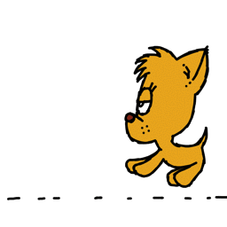
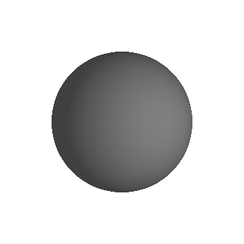
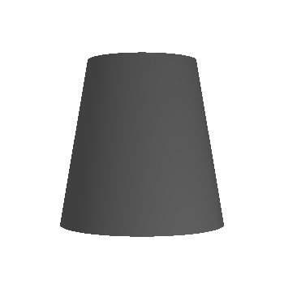
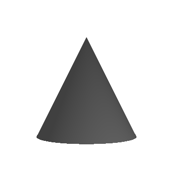
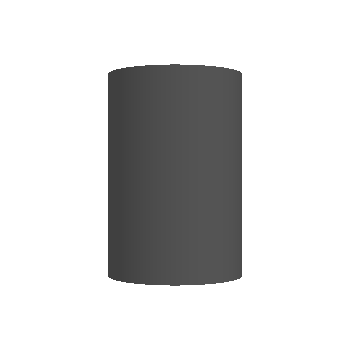
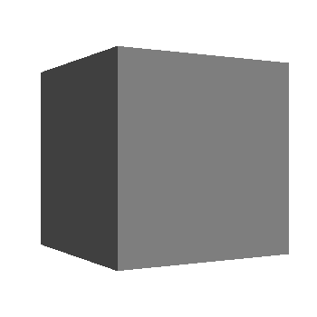
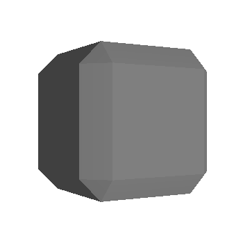
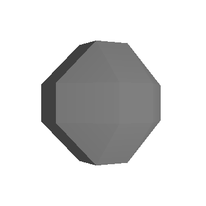
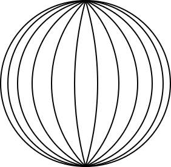
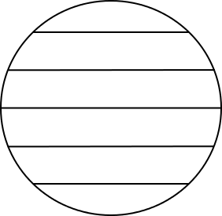

# Visuals

Visuals are the main building blocks for UI components. They provide reusable rendering logic that is controlled by using properties and can be used by all components. They also respond to view size and color changes and can perform clipping at the renderer level.

The properties specific to each visual are encapsulated in the corresponding class, such as a `Border` visual is defined in a `BorderVisual` class, a `Color` visual in a `ColorVisual` class, and so on. The properties that are common for all visual types are inherited from the [Tizen.NUI.VisualMap](/application/dotnet/api/TizenFX/latest/api/Tizen.NUI.VisualMap.html) class. To render a visual, it has to be added to a control. A container class [Tizen.NUI.BaseComponents.VisualView](/application/dotnet/api/TizenFX/latest/api/Tizen.NUI.BaseComponents.VisualView.html) controls any visual that you add.

## Create visual

To create a visual using `BorderVisual` class, follow these steps:

1.  Create a visual object of a desirable type:
    ```csharp
    BorderVisual _borderVisual = new BorderVisual();
    ```

2.  Specify the mandatory properties required for the visual type:
    ```csharp
    // Set the border thickness
    _borderVisual.BorderSize = 10.0f;
    // The border color
    _borderVisual.Color = Color.Blue;
    ```

3.  You can specify the optional properties of a given visual, and also specify the properties that are common for all visual types:
    ```csharp
    // The size of a visual given as a percentage of the size of the parent
    _borderVisual.RelativeSize = new RelativeVector2(0.5f, 0.5f);
    // The parent's reference point
    _borderVisual.Origin = Visual.AlignType.TopBegin;
    // The Visual's reference point
    _borderVisual.AnchorPoint = Visual.AlignType.TopBegin;
    // Shift between Origin and AnchorPoint given as a percentage of a parent size 
    _borderVisual.RelativePosition = new RelativeVector2(0.25f, 0.25f);
    ```

4.  To add a visual to an already existing `VisualView`, use `AddVisual()` as follows:
    ```csharp
    _visualView.AddVisual("name_of_the_visual", _borderVisual);
    ```

## Use VisualView

`VisualView` is a class that inherits the [Tizen.NUI.BaseComponents.View](/application/dotnet/api/TizenFX/latest/api/Tizen.NUI.BaseComponents.View.html) class. Its properties can be used to specify the `VisualView`.
<!-- TO BE DONE:
(the full list of a `View`'s properties can be found in the [View section](./view.md))
-->

A `VisualView` stores the handles to visuals and maps of their properties. You can find the total number of visuals that are added to the `VisualView` using the `NumberOfVisuals` property. The following are some of the useful methods for working with visuals:

-  To add a visual to the `VisualView`, use the `AddVisual(string, VisualMap)`. The method expects the following two parameters:
   - `string`: specifies the name of the visual, by which it is identified within a given `VisualView`.
   - `VisualMap`: specifies the visual, that is added to the `VisualView`. If the visual with a given name already exists in the `VisualView`, it is updated instead of getting added.

-  To remove a visual from a `VisualView`, use the `RemoveVisual(string)`. Its only parameter specifies the name of the visual.

-  To remove all the visuals from a `VisualView`, use `RemoveAll()`.
    
The following example illustrates how to create a `VisualView`, set some of the properties, and use all of the mentioned methods:
   ```csharp
   // Create VisualView
   VisualView _visualView = new VisualView();
   // Set the background color
   _visualView.BackgroundColor = Color.Blue;
   // Set the absolute size of the VisualView
   _visualView.Size2D = new Size2D(300, 300);
   // The parent's reference point
   _visualView.ParentOrigin = ParentOrigin.TopRight;
   // Must be 'true' in order to use the PivotPoint
   _visualView.PositionUsesPivotPoint = true;
   // The VisualView reference point
   _visualView.PivotPoint = PivotPoint.TopRight;
   // Shifting between ParentOrigin and PivotPoint in absolute units
   _visualView.Position2D = new Vector2(-10, 10);

   // Create visual 1
   ColorVisual _colorVisual_1 = new ColorVisual();
   _colorVisual_1.MixColor = Color.Green;
   _colorVisual_1.RelativeSize = new RelativeVector2(0.7f, 0.6f);
   _colorVisual_1.Origin = Visual.AlignType.BottomEnd;
   _colorVisual_1.AnchorPoint = Visual.AlignType.BottomEnd;

   // Add visual 1 to VisualView
   _visualView.AddVisual("colorVisual_1", _colorVisual_1);

   // Create visual 2
   ColorVisual _colorVisual_2 = new ColorVisual();
   _colorVisual_2.MixColor = Color.Magenta;
   _colorVisual_2.RelativeSize = new RelativeVector2(0.2f, 0.3f);
   _colorVisual_2.Origin = Visual.AlignType.Center;
   _colorVisual_2.AnchorPoint = Visual.AlignType.TopBegin;

   // Add visual 2 to VisualView
   _visualView.AddVisual("colorVisual_2", _colorVisual_2);

   // Remove visual 1 - identified by its name
   _visualView.RemoveVisual("colorVisual_1");

   // Remove all visuals if any left
   if (_visualView.NumberOfVisuals > 0)
       _visualView.RemoveAll();
   ```

The final output is as follows:

 | Original VisualView                                         | After `RemoveVisual()` is called                        | After `RemoveAll()` is called                                 |
 |-------------------------------------------------------------|:-------------------------------------------------------:|---------------------------------------------------------------|
 |  |  |  |

## VisualMap properties

The `VisualMap` is a base class for all visuals that encapsulates all the common properties of the visuals.

**Table: VisualMap optional properties**

| Property            | Type                        | Default Value                    | Description                                                                                                       |
|---------------------|-----------------------------|----------------------------------|-------------------------------------------------------------------------------------------------------------------|
| `Size`              | `Size2D`                    | `(1, 1)`                         | The size of the visual interpreted as the relative or the absolute size, depending on the `SizePolicy`.           |
| `RelativeSize`      | `RelativeVector2`           | `(1.0f, 1.0f)`                   | Specifies the relative size of the visual, given as a percentage of the size of the parent.                       |
| `SizePolicy`<br>`SizePolicyWidth`<br>`SizePolicyHeight` | `VisualTransformPolicyType`| `Relative`   | Specifies whether the visual size, or the visual width, or the visual height is relative or absolute. The possible values are `Relative` or `Absolute`. |
| `Position`          | `Vector2`                   | `(0.0f, 0.0f)`                   | The visual offset specified as the shift of the visual reference point with respect to the parent's reference point. The values are interpreted as the relative or the absolute, depending on the `PositionPolicy`. |
| `RelativePosition`  | `RelativeVector2`           | `(0.0f, 0.0f)`                   | The visual offset specified as a percentage of the size of the parent.                                            |
| `PositionPolicy`<br>`PositionPolicyX`<br>`PositionPolicyY` | `VisualTransformPolicyType` | `Relative`   | Specifies whether the x and/or y offsets are relative or absolute. The possible values are `Relative` or `Absolute`. |
| `Origin`            | `Visual.AlignType`          | `Center`                         | Specifies the reference point within the parent's area. The possible values are `TopBegin`, `TopCenter`, `TopEnd`, `CenterBegin`, `Center`, `CenterEnd`, `BottomBegin`, `BottomCenter`, and `BottomEnd`. For more information, see [Reference points](#reference-points). |
| `AnchorPoint`       | `Visual.AlignType`          | `Center`                         | Specifies the reference point within the visual's area. The possible values are `TopBegin`, `TopCenter`, `TopEnd`, `CenterBegin`, `Center`, `CenterEnd`, `BottomBegin`, `BottomCenter`, and `BottomEnd`. For more information, see [Reference points](#reference-points). |
| `DepthIndex`        | `int`                       | `0`                              | Specifies the order in which visuals overlap within the parent.                                                   |
| `MixColor`          | `Color`                     | -                                | The blend color for the visual.                                                                                   |
| `Opacity`           | `float`                     | `1.0f`                           | The alpha value from the `MixColor` property. Value `0.0f` indicates complete transparency.                       |
| `PremultipliedAlpha`| `bool`                      | `false`                          | Enables or disables the premultiplied alpha for `true` or `false` values respectively.                            |
| `VisualFittingMode` | `VisualFittingModeType`     | `FitKeepAspectRatio` - for AnimatedImageVisual, MeshVisual, PrimitiveVisual, TextVisual<br>`Fill` - otherwise | Specifies the visual fitting mode. For more information, see the [VisualFittingMode values table](#table_VisualFittingMode_values). |

<a name="table_VisualFittingMode_values"></a>
**Table: VisualFittingMode values**

| Value                    | Description                                                                                                                       |
|--------------------------|-----------------------------------------------------------------------------------------------------------------------------------|
| `FitKeepAspectRatio`     | The visual is scaled to fit, while preserving the aspect ratio.                                                                             |
| `Fill`                   | The visual is stretched to fill, while not preserving the aspect ratio.                                                                     |

### Reference points

The `Origin` and `AnchorPoint` properties allow determining the position of a visual in the area of the control. The visual and the control are two-dimensional objects, therefore it is necessary to define a reference point for each of them. 

The following figure illustrates the possible reference point positions for both the visual and the control:


The position of the visual is defined as the `AnchorPoint` offset relative to the `Origin` in the reference frame, which is hooked to the upper left corner. The x and the y-axis are directed to the right and the bottom, respectively. Examples of the various arrangements of the visuals within the control are as follows:

Case 1:
   ```csharp
   _visualView.Origin = Visual.AlignType.Center;
   _visualView.AnchorPoint = Visual.AlignType.TopBegin;
   _visualView.RelativePosition = new RelativeVector2(0.0f, 0.0f);
   ```


Case 2:
   ```csharp
   _visualView.Origin = Visual.AlignType.TopEnd;
   _visualView.AnchorPoint = Visual.AlignType.Center;
   _visualView.RelativePosition = new RelativeVector2(0.5f, -0.25f);
   ```


## Visual types provided by NUI

The following visual types are available in NUI:
[Border](#bordervisual),
[Color](#colorvisual),
[Gradient](#gradientvisual),
[Image](#imagevisual),
[NPatch](#npatchvisual),
[SVG](#svgvisual),
[AnimatedImage](#animatedimagevisual),
[Mesh](#meshvisual),
[Primitive](#primitivevisual), and
[Text](#textvisual).

### BorderVisual

The `BorderVisual` renders a rectangular frame with a given thickness. The whole frame is plotted inside the area designated by the `BorderVisual` size as long as it is possible. 

The following examples describe the `BorderVisual` of different sizes: 
- If the `BorderVisual` size is 200x200, and the border width is 100, it appears as a square of the size of 200x200, having the same color as that of the border. 
- If the `BorderVisual` size is 100x200, and the border width is 200, the frame does not fit inside the given size, and it appears as a rectangle of the size of 300x200, having the same color as that of the frame.

The following table lists the supported properties:

**Table: BorderVisual properties**

| Property       | Type      | Required | Description                                                                              |
|----------------|-----------|----------|------------------------------------------------------------------------------------------|
| `Color`        | `Color`   | Yes      |  The color of the border.                                                                |
| `BorderSize`   | `float`   | Yes      |  The width of the border in pixels.                                                      |
| `AntiAliasing` | `bool`    | No       |  Specifies whether antialiasing of the border is required. The default value is `false`. |

The following example illustrates how to use a `BorderVisual`:
   ```csharp
   BorderVisual _borderVisual = new BorderVisual();

   // Obligatory properties
   _borderVisual.Color = Color.Red;
   _borderVisual.BorderSize = 5.0f;

   // Optional properties:
   // the size of the border is interpreted as relative
   _borderVisual.SizePolicy = VisualTransformPolicyType.Relative;
   // The visual size is equal half of the parent size
   _borderVisual.RelativeSize = new RelativeVector2(0.5f, 0.5f);
   // Position interpreted in absolute units
   _borderVisual.PositionPolicy = VisualTransformPolicyType.Absolute;
   // The reference point of the Visual is shifted 50 pixels right and 100 pixels up from the parent's reference point
   _borderVisual.Position = new Vector2(50.0f, -100.0f);
   // The parent's reference point
   _borderVisual.Origin = Visual.AlignType.BottomBegin;
   // Point on the parent with respect to which the visual is placed
   _borderVisual.AnchorPoint = Visual.AlignType.BottomBegin;

   // _visualView is a previously created VisualView
   _visualView.AddVisual("nameOfBorderVisual", _borderVisual);
   ```

The final output after implementing the preceding code, and setting the `_visualView` background color to gray is as follows:


### ColorVisual

The `ColorVisual` renders a solid rectangle.

The following table lists the supported properties:

**Table: ColorVisual properties**

| Property              | Type    | Required | Description                                                                                                       |
|-----------------------|---------|----------|-------------------------------------------------------------------------------------------------------------------|
| `Color`               | `Color` | Yes      | The color of the visual.                                                                                          |
| `RenderIfTransparent` | `bool`  | No       | Specifies whether to render the visual, if the `MixColor` is transparent. The default value is `false`.    |

The following example illustrates how to use a `ColorVisual`:

   ```csharp
   ColorVisual _colorVisual_1 = new ColorVisual();

   // Obligatory properties
   _colorVisual_1.Color = Color.Red;

   // Optional properties:
   _colorVisual_1.Size = new Size2D(400,400);
   _colorVisual_1.DepthIndex = 5;

   _visualView.AddVisual("RedRectangle", _colorVisual_1);

   ColorVisual _colorVisual_2 = new ColorVisual();

   // Obligatory properties
   _colorVisual_2.Color = new Color(0.0f, 0.0f, 1.0f, 0.8f);

   // Optional properties:
   _colorVisual_2.Size = new Size2D(300,300);
   _colorVisual_2.Origin = Visual.AlignType.BottomEnd;
   _colorVisual_2.AnchorPoint = Visual.AlignType.BottomEnd;
   // Shifting the visual left and up 
   _colorVisual_2.RelativePosition = new RelativeVector2(-0.1f, -0.1f);
   // Setting a value lower than for the previous object causes it to be covered
   // Without changing this value, the objects are drawn in the order they were added
   _colorVisual_2.DepthIndex = _colorVisual_1.DepthIndex - 1;

   _visualView.AddVisual("BlueRectangle", _colorVisual_2);
   ```

The final output after implementing the preceding code, and setting the `_visualView` background color to gray is as follows:

 | DepthIndex default values                            | DepthIndex changed values                                            |
 |------------------------------------------------------|----------------------------------------------------------------------|
 |  |  |

### GradientVisual

The `GradientVisual` renders a smooth transition of colors. NUI supports both linear and radial gradients.

The following table lists the supported properties:

**Table: GradientVisual properties**

| Property        | Type                             | Required        | Description                                                                                    |
|-----------------|----------------------------------|-----------------|------------------------------------------------------------------------------------------------|
| `StartPosition` | `Vector2`                        | For linear only | The start position of the linear gradient. The coordinate system depends on the `Units` value. |
| `EndPosition`   | `Vector2`                        | For linear only | The end position of the linear gradient. The coordinate system depends on the `Units` value.   |
| `Center`        | `Vector2`                        | For radial only | The center point of the radial gradient. The coordinate system depends on the `Units` value.   |
| `Radius`        | `float`                          | For radial only | The size of the radial gradient radius. The coordinate system depends on the `Units` value.    |
| `StopColor`     | `PropertyArray` of `Color`       | Yes             | The color at the stop offsets. At least two colors are required to show a gradient.                 |
| `StopOffset`    | `PropertyArray` of `floats`      | No              | The stop offsets in relative units. To see all the colors from the `StopColor`, the lengths of the `StopColor` and the `StopOffset` arrays must be the same. The default values are `0.0` and `1.0`. |
| `Units`         | `GradientVisualUnitsType`        | No              | Defines the coordinate system for the attributes: start and end points for a linear gradient, center point and radius for a radial gradient. The default value is `ObjectBoundingBox`. For more information, see the [Units values table](#table_Units_values). |
| `SpreadMethod`  | `GradientVisualSpreadMethodType` | No              | Indicates what occurs if a gradient starts or ends inside bounds. The default value is `Pad`. For more information, see the [SpreadMethod values table](#table_SpreadMethod_values). |

<a name="table_Units_values"></a>
**Table: Units values**

| Value               | Description                                                                                                                                                              |
|---------------------|--------------------------------------------------------------------------------------------------------------------------------------------------------------------------|
| `ObjectBoundingBox` | The reference frame in which the top-left corner has the coordinates (-0.5, -0.5) and the bottom-right (0.5, 0.5).                                                       |
| `UserSpace`         | The reference frame with the top-left corner having the coordinates (0, 0) and the coordinates of the bottom-right corner are indicated by the control width and height. |

<a name="table_SpreadMethod_values"></a>
**Table: SpreadMethod values**

| Value               | Description                                                                                                  |
|---------------------|--------------------------------------------------------------------------------------------------------------|
| `Pad`               | Uses the terminal colors of the gradient to fill the remainder of the area.                                  |
| `Reflect`           | Reflects the gradient pattern start-to-end, end-to-start, start-to-end, and so on, until the area is filled. |
| `Repeat`            | Repeats the gradient pattern start-to-end, start-to-end, start-to-end, and so on, until the area is filled.  |

You must know the difference in the radial gradients drawn for different `Units` values. In the case of the `ObjectBoundingBox` value, the given radius value is treated independently in the vertical and horizontal directions. For non-squared visuals, the resulting gradient takes the shape of an ellipse, as shown in case 1. For the `UserSpace` value, the given radius is applied in all dimensions, and it always takes the shape of concentric circles, as shown in case 2.

The following examples illustrate how to set radial and linear `GradientVisual`:

Case 1: The radial `GradientVisual` in the relative coordinate system:
   ```csharp
   GradientVisual _radialGradientVisual = new GradientVisual();

   // Obligatory properties
   // Gradient centered to the center of the area
   _radialGradientVisual.Center = new Vector2(0.0f, 0.0f);
   // Radius set to 90% of the visual size - for rectangular visual size the result is ellipse
   _radialGradientVisual.Radius = 0.9f;

   // Optional properties
   // Coordinate system: top-left - (-0.5,-0.5); bottom-right - (0.5,0.5)
   _radialGradientVisual.Units = GradientVisualUnitsType.ObjectBoundingBox;
   // Colors of the gradient
   PropertyArray _stopColor = new PropertyArray();
   _stopColor.Add(new PropertyValue(Color.Yellow));
   _stopColor.Add(new PropertyValue(Color.Blue));
   _stopColor.Add(new PropertyValue(new Color(0, 1, 0, 1)));
   _stopColor.Add(new PropertyValue(new Vector4(120.0f, 0.0f, 255.0f, 255.0f) / 255.0f));
   _radialGradientVisual.StopColor = _stopColor;
   // Color limits in a relative coordinate system
   PropertyArray _stopOffset = new PropertyArray();
   _stopOffset.Add(new PropertyValue(0.0f));
   _stopOffset.Add(new PropertyValue(0.25f));
   _stopOffset.Add(new PropertyValue(0.5f));
   _stopOffset.Add(new PropertyValue(0.75f));
   _radialGradientVisual.StopOffset = _stopOffset;

   _visualView.AddVisual("Radial_Gradient", _radialGradientVisual);
   ```

Case 2: The radial `GradientVisual` in the absolute coordinate system, with the variables declaration independent as that of case 1:
   ```csharp
   GradientVisual _radialGradientVisual = new GradientVisual();

   // Obligatory properties
   _radialGradientVisual.Center = new Vector2(0.0f, 50.0f);
   _radialGradientVisual.Radius = 50.0f;

   // Optional properties
   _radialGradientVisual.Units = GradientVisualUnitsType.UserSpace;
   _radialGradientVisual.SpreadMethod = GradientVisualSpreadMethodType.Reflect;
   PropertyArray stopColor = new PropertyArray();
   stopColor.Add(new PropertyValue(new Color(0.0f, 0.8f, 0.0f, 1)));
   stopColor.Add(new PropertyValue(new Color(0.4f, 0.0f, 0.8f, 1)));
   stopColor.Add(new PropertyValue(new Color(0.0f, 0.6f, 0.8f, 1)));
   _radialGradientVisual.StopColor = stopColor;
   PropertyArray stopOffset = new PropertyArray();
   stopOffset.Add(new PropertyValue(0.0f));
   stopOffset.Add(new PropertyValue(0.5f));
   stopOffset.Add(new PropertyValue(1.0f));
   _radialGradientVisual.StopOffset = stopOffset;

   _visualView.AddVisual("Radial_Gradient", _radialGradientVisual);
   ```

In the case of the linear gradient, the start and end points define the direction of the gradient, and the colors are plotted perpendicular to this line. In the following example, the `SpreadMethod` is set to `Repeat`. As a result, other colors are plotted in the corners below and above the lines passing through the start and the end points:
   ```csharp
   GradientVisual _linearGradientVisual = new GradientVisual();

   // Obligatory properties
   // Two points defining the direction of the gradient; the colors are plotted perpendicular
   _linearGradientVisual.StartPosition = new Vector2(0.0f, 0.5f);
   _linearGradientVisual.EndPosition = new Vector2(0.5f, -0.5f);

   // Optional properties
   _linearGradientVisual.StopColor = new PropertyArray();
   _linearGradientVisual.StopColor.Add(new PropertyValue(Color.Green));
   _linearGradientVisual.StopColor.Add(new PropertyValue(Color.Blue));

   _linearGradientVisual.Opacity = 0.4f;
   _linearGradientVisual.SpreadMethod = GradientVisualSpreadMethodType.Repeat;

   _visualView.AddVisual("Linear_Gradient", _linearGradientVisual);
   ```

The final output after implementing the preceding code is as follows:

 | Radial gradient - Case 1                                    | Radial gradient - Case 2                                    | Linear gradient                                    |
 |:-----------------------------------------------------------:|:-----------------------------------------------------------:|:--------------------------------------------------:|
 |  |  |  |

### ImageVisual

The `ImageVisual` renders a raster image, such as JPG or PNG into the control.

The following table lists the supported properties:

**Table: ImageVisual properties**

| Property            | Type               | Required | Description                                                                                                                                            |
|---------------------|--------------------|----------|--------------------------------------------------------------------------------------------------------------------------------------------------------|
| `URL`               | `string`           | Yes      | The URL of the image.                                                                                                                                  |
| `AlphaMaskURL`      | `string`           | No       | The URL of the alpha mask.                                                                                                                             |
| `AuxiliaryImageURL` | `string`           | No       | The URL of the auxiliary image on top of an N-Patch image.                                                                                             |
| `FittingMode`       | `FittingModeType`  | No       | Fitting options used when resizing the images to fit the specified dimensions. The possible values are `ShrinkToFit`, `ScaleToFill`, `FitWidth`, and `FitHeight`. |
| `SamplingMode`      | `SamplingModeType` | No       | Filtering options used when sampling original pixels to resize images. The possible values are `Box`, `Nearest`, `Linear`, `BoxThenNearest`, `BoxThenLinear`, `NoFilter`, and `DontCare`. |
| `DesiredWidth`      | `int`              | No       | The desired width of the image. The actual image width is used, if no value is specified.                                                                     |
| `DesiredHeight`     | `int`              | No       | The desired height of the image. The actual image height is used, if no value is specified.                                                                   |
| `SynchronousLoading`| `bool`             | No       | Specifies whether to load the image synchronously or not. Used for normal quad images only. The default value is `false`.                              |
| `PixelArea`         | `Vector4`          | No       | Specifies the part of the image that is displayed. The desired area to be plotted is defined by the relative coordinates of the upper left and the bottom right corners. The default value is `[0.0, 0.0, 1.0, 1.0]`, which implies that the whole image is plotted. |
| `WrapModeU`<br>`WrapModeV` | `WrapModeType` | No    | Specifies the wrap mode for the U or V coordinate, respectively, and how the texture is sampled when the U or V coordinate exceeds the range of `0.0` to `1.0`. The possible values are `Default`, `ClampToEdge`, `Repeat`, and `MirroredRepeat`. |
| `MaskContentScale`  | `float`            | No       | Specifies the scale factor to apply to the content image before masking.                                                                               |
| `CropToMask`        | `bool`             | No       | Specifies whether to crop image to mask or scale mask to fit image.                                                                                    |
| `AuxiliaryImageAlpha` | `float`          | No       | An alpha value for mixing between the masked main N-patch image and the auxiliary image.                                                               |
| `ReleasePolicy`     | `ReleasePolicyType`| No       | Specifies whether to release the texture from the cache or to keep it to reduce the loading time. The possible values are `Detached`, `Destroyed`, and `Never`. |
| `LoadPolicy`        | `LoadPolicyType`   | No       | Specifies whether to load the texture immediately after the source is set or only after the visual is added to the window. The possible values are `Immediate` or `Attached`. |
| `OrientationCorrection` | `bool`         | No       | Specifies whether to automatically correct the orientation based on the Exchangeable Image File (EXIF) data. The default value is `true`.              |
| `Atlasing`          | `bool`             | No       | Specifies whether to use the texture atlas or not. The default value is `false`.                                                                       |

The following example illustrates how to use `ImageVisual`. The image is placed in an `images` subdirectory under the `res` directory. The absolute path to the application shared resource directory can be resolved by `Tizen.Applications.Application.Current.DirectoryInfo.Resource`. For more information, see the [Tizen.Applications.Application](/application/dotnet/api/TizenFX/latest/api/Tizen.Applications.Application.html) class and the [Tizen.Applications.DirectoryInfo](/application/dotnet/api/TizenFX/latest/api/Tizen.Applications.DirectoryInfo.html) class:
   ```csharp
   string _imageUrl = Tizen.Applications.Application.Current.DirectoryInfo.Resource + "images/";

   ImageVisual _imageVisual = new ImageVisual();
   _imageVisual.URL = _imageUrl + "picture.jpg";
   _imageVisual.RelativeSize = new RelativeVector2(1, 1);
   _imageVisual.Origin = Visual.AlignType.TopBegin;
   _imageVisual.AnchorPoint = Visual.AlignType.TopBegin;

   _visualView.AddVisual("Image", _imageVisual);
   ```

The final output after implementing the preceding code is as follows:


### NPatchVisual

The `NPatchVisual` renders an N-patch or a 9-patch image. It uses non quad geometry. Both geometry and texture are cached to reduce memory consumption, if the same N-patch image is used elsewhere.

The following table lists the supported properties:

**Table: NPatchVisual properties**

| Property            | Type               | Required | Description                                                     |
|---------------------|--------------------|----------|-----------------------------------------------------------------|
| `URL`               | `string`           | Yes      | The URL of the image.                                           |
| `BorderOnly`        | `bool`             | No       | If `true` only borders are drawn. The default value is `false`. |
| `Border`            | `Rectangle`        | No       | The border of the image in the order: left, right, bottom and top. |

The following code illustrates how to use the `NPatchVisual`. The absolute path to the image is set as in case of the [`ImageVisual`](#imagevisual):
   ```csharp
   string _imageUrl = Tizen.Applications.Application.Current.DirectoryInfo.Resource + "images/";

   NPatchVisual _nPatchVisual = null;

   _nPatchVisual = new NPatchVisual();
   _nPatchVisual.URL = _imageUrl + "heartsframe.png";
   _nPatchVisual.RelativeSize = new RelativeVector2(1.0f, 0.3f);
   _nPatchVisual.Origin = Visual.AlignType.BottomEnd;
   _nPatchVisual.AnchorPoint = Visual.AlignType.BottomEnd;

   _visualView.AddVisual("NPatch-Image1", _nPatchVisual);

   _nPatchVisual = new NPatchVisual();
   _nPatchVisual.URL = _imageUrl + "heartsframe.png";
   _nPatchVisual.RelativeSize = new RelativeVector2(0.3f, 0.6f);
   _nPatchVisual.Origin = Visual.AlignType.TopCenter;
   _nPatchVisual.AnchorPoint = Visual.AlignType.TopCenter;

   _visualView.AddVisual("NPatch-Image2", _nPatchVisual);
   ```

The final output after implementing the preceding code, and setting the `_visualView` background color to gray is as follows:


### SVGVisual

The `SVGVisual` renders an SVG image into the control.
`SVGVisual` supports the following features from the [SVG Tiny 1.2 Specification](https://www.w3.org/TR/SVGTiny12):
-   Basic shapes
-   Paths
-   Solid color fill
-   Gradient color fill
-   Solid color stroke

The following features are not supported:

-   Gradient color stroke
-   Dash array stroke
-   View box
-   Text
-   Clip path

The following table lists the supported properties:

**Table: SVGVisual properties**

| Property            | Type               | Required | Description                                                     |
|---------------------|--------------------|----------|-----------------------------------------------------------------|
| `URL`               | `string`           | Yes      | The URL of the image.                                           |

The following example illustrates how to use the `SVGVisual`:
   ```csharp
   string _imageUrl = Tizen.Applications.Application.Current.DirectoryInfo.Resource + "images/";

   SVGVisual _svgVisual = new SVGVisual();
   _svgVisual.URL = _imageUrl + "tiger.svg";

   _visualView.AddVisual("SVG-Image", _svgVisual);
   ```

The final output after implementing the preceding code, and setting the `_visualView` background color to gray is as follows:


### AnimatedImageVisual

The `AnimatedImageVisual` renders an animated image into the control. Currently, only the GIF format is supported.

The following table lists the supported properties:

**Table: AnimatedImageVisual properties**

| Property            | Type               | Required | Description                                                                                                                 |
|---------------------|--------------------|----------|-----------------------------------------------------------------------------------------------------------------------------|
| `URL`               | `string`           | Yes, if `URLS` is not specified | The URL of the image.                                                                                |
| `URLS`              | `List<string>`     | Yes, if `URL` is not specified  | The list of URLs of the animated images.                                                             |
| `BatchSize`         | `int`              | No       | The batch size for pre-loading images in the visual. The default value is `1`.                                              |
| `CacheSize`         | `int`              | No       | The cache size for loading images in the visual. The default value is `1`.                                                  |
| `FrameDelay`        | `float`            | No       | The number of milliseconds between each frame in the visual. The default value is `0.1`.                                    |
| `LoopCount`         | `float`            | No       | The number of iterations in a loop. For values less than `0`, the loop is infinite. The default value is `-1`.              |

The following example illustrates how to use the `AnimatedImageVisual`:
   ```csharp
   string _imageUrl = Tizen.Applications.Application.Current.DirectoryInfo.Resource + "images/";

   AnimatedImageVisual _animatedVisual = new AnimatedImageVisual();
   _animatedVisual.URL = _imageUrl + "animated-image-visual.gif";

   _visualView.AddVisual("Animated-Image", _animatedVisual);
   ```

The final output after implementing the preceding code is as follows:



### MeshVisual

The `MeshVisual` renders a mesh using an OBJ file, optionally with materials provided in an MTL file and textures stored in the provided directory.

> [!NOTE]
> Due to a typographical mistake in the source code, it is advised to use `MaterialtURL` instead of `MaterialURL` as the property name.

The following table lists the supported properties:

**Table: MeshVisual properties**

| Property         | Type                | Required              | Description                                                                                                                       |
|------------------|---------------------|-----------------------|-----------------------------------------------------------------------------------------------------------------------------------|
| `ObjectURL`      | `string`            | Yes                   | The location of the OBJ file.                                                                                                  |
| `MaterialtURL`   | `string`            | No                    | The location of the MTL file. Leave blank for a textureless object.                                                            |
| `TexturesPath`   | `string`            | Yes, if using materials| The path to the directory where the textures including gloss and normal are stored.                                              |
| `ShadingMode`    | `MeshVisualShadingModeValue` | No           | The type of the shading mode that the mesh uses. For more information, see the [ShadingMode values table](#table_ShadingMode_values).                |
| `UseMipmapping`  | `bool`              | No                    | Specifies whether to use mipmaps for textures. The default value is `true`.                                                       |
| `UseSoftNormals` | `bool`              | No                    | Specifies whether to average normals at each point to smooth the textures. The default value is `true`.                           |
| `LightPosition`  | `Vector3`           | No                    | The position of the light source, which illuminates the object. All zeros indicate the top-left corner in the visual plane.       |

The `ShadingMode` property defines the shading mode type used by the mesh.

<a name="table_ShadingMode_values"></a>
**Table: ShadingMode values**

| Enumeration value                      | Description                                                                                                               |
|----------------------------------------|---------------------------------------------------------------------------------------------------------------------------|
| `TexturelessWithDiffuseLighting`       | Uses one color that is lit by ambient and diffuse lighting.                                                               |
| `TexturedWithSpecularLighting`         | Uses only the visual image textures provided with specular lighting in addition to ambient and diffuse lighting.          |
| `TexturedWithDetailedSpecularLighting` | Uses all textures provided including a gloss, normal, and texture map along with specular, ambient, and diffuse lighting. |

The following example illustrates how to use the `MeshVisual`. The OBJ, MTL files, and directory with textures use the same path as used for the [`ImageVisual`](#imagevisual):
   ```csharp
   string _imageUrl = Tizen.Applications.Application.Current.DirectoryInfo.Resource + "images/";

   MeshVisual _meshVisual = new MeshVisual();

   _meshVisual.ObjectURL    = _imageUrl + "Dino.obj";
   _meshVisual.MaterialtURL = _imageUrl + "Dino.mtl";
   _meshVisual.TexturesPath = _imageUrl + "textures/";

   _visualView.AddVisual("Mesh-Image", _meshVisual);
   ```

The final output after implementing the preceding code is as follows:


### PrimitiveVisual

The `PrimitiveVisual` renders a simple three-dimensional shape, such as cube or sphere. By default, shapes are generated with clockwise winding and back-face culling.

> [!NOTE]
> Due to a typographical mistake in the source code, it is advised to use `ConicalFrustrum` instead of `ConicalFrustum` as one of the `Shape` names. 

The following table lists the supported properties:

**Table: PrimitiveVisual optional properties**

| Property            | Type                       | Shape to which the property applies  | Description                                                                                                        |
|---------------------|----------------------------|--------------------------------------|--------------------------------------------------------------------------------------------------------------------|
| `Shape`             | `PrimitiveVisualShapeType` | all                                  | The shape to render. The default value is `Sphere`. For more information, see the [Shape values table](#table_Shape_values).    |
| `MixColor`          | `Color`                    | all                                  | The color of the shape. The default value is `[0.5f, 0.5f, 0.5f, 1.0f]`.                                           |
| `Slices`            | `int` in a range 1-255     | all                                  | The number of slices going around the shape. The default value is `128`.                                           |
| `Stacks`            | `int` in a range 1-255     | all                                  | The number of layers going down the shape. The default value is `128`.                                             |
| `ScaleTopRadius`    | `float` greater than or equal to 0 | `ConicalFrustrum`                         | The scale of the radius of the top circle of the conical frustum. The default value is `1.0`.                |
| `ScaleBottomRadius` | `float` greater than or equal to 0 | `ConicalFrustrum`<br>`Cone`               | The scale of the radius of the bottom circle of the conic. The default value is `1.5`.                       |
| `ScaleHeight`       | `float` greater than or equal to 0 | `ConicalFrustrum`<br>`Cone`<br>`Cylinder` | The scale of the height of the conic. The default value is `3.0`.                                            |
| `ScaleRadius`       | `float` greater than or equal to 0 | `Cylinder`                                | The scale of the radius of the cylinder. The default value is `1.0`.                                         |
| `ScaleDimensions`   | `Vector3`                  | `Cube`<br>`Octahedron`<br>`BevelledCube`          | The dimensions of the cuboid. Scales in the same way as for a 9-patch image. The default value is `[1, 1, 1]`.     |
| `BevelPercentage`   | `float` in a range 0-1     | `BevelledCube`                       | Specifies the degree of bevel of the cuboid, based on the smallest dimension. It determines the ratio of the width of the bevelled part to the width of the cube. The default value is `0.0`, which specifies no bevel. |
| `BevelSmoothness`   | `float` in a range 0-1     | `BevelledCube`                       | Specifies the smoothness of the bevelled edges. The default value is `0.0`, which specifies sharp edges.        |
| `LightPosition`     | `Vector3`                  | all                                  | The position of the light source, which illuminates the object. All zeros indicate the top-left corner in the visual plane. |

<a name="table_Shape_values"></a>
**Table: Shape values**

| Enumeration value | Description                                                                          |
|-------------------|--------------------------------------------------------------------------------------|
| `Sphere`          | The default shape.                                                                   |
| `ConicalFrustrum` | The area bound between two circles, a cone with the tip removed.                     |
| `Cone`            | Equivalent to a `ConicalFrustrum` with a top radius of `0`.                          |
| `Cylinder`        | Equivalent to a `ConicalFrustrum` with equal radii for the top and bottom circles.   |
| `BevelledCube`    | A cube or cuboid with all edges flattened to some degree.                            |
| `Cube`            | Equivalent to a `BevelledCube` with a `BevelPercentage` of `0`.                      |
| `Octahedron`      | Equivalent to a `BevelledCube` with a `BevelPercentage` of `1`.                      |

Examples of primitives are as follows:

- **Sphere:**

    

- **Conics:**

    | Frustum                                 | Cone                    | Cylinder                        |
    |-----------------------------------------|-------------------------|---------------------------------|
    |   |  |  |

- **Bevel:**

   Figures based on different values of the `BevelPercentage` property:

    | BevelPercentage = 0.0 (cube)                | BevelPercentage = 0.3                     |
    |---------------------------------------------|-------------------------------------------|
    |                      |  |
    | **BevelPercentage = 0.7**                   | **BevelPercentage = 1.0 (octahedron)**    |
    |  |        |

- **Slices:**

    For spheres and conical frustums, `Slices` define how many divisions there are going around the shape:

    

- **Stacks:**

    For spheres, `Stacks` defines how many layers there are going down the shape:

    

The following example illustrates how to draw a `BevelledCube`:
   ```csharp
   PrimitiveVisual _primitiveVisual = new PrimitiveVisual();
   _primitiveVisual.Shape = PrimitiveVisualShapeType.BevelledCube;
   _primitiveVisual.MixColor = new Vector4(0.4f, 0.4f, 1.0f, 1.0f);
   // Two initial coordinates indicate the top-left corner; the third one indicates the shift toward the observer
   _primitiveVisual.LightPosition = new Vector3(0, 0, 1000);
   _primitiveVisual.ScaleDimensions = new Vector3(1.0f, 0.5f, 1.4f);
   _primitiveVisual.BevelPercentage = 0.5f;
   _primitiveVisual.BevelSmoothness = 0.0f;

   _visualView.AddVisual("BevelledCube", _primitiveVisual);
   ```

The final output after implementing the preceding code is as follows:


### TextVisual

The `TextVisual` renders text within a control.

The following table lists the supported properties:

**Table: TextVisual properties**

| Property              | Type                  | Required | Description                                                                                                         |
|-----------------------|-----------------------|----------|---------------------------------------------------------------------------------------------------------------------|
| `Text`                | `string`              | Yes      | The text to display in UTF-8 encoding.                                                                              |
| `FontFamily`          | `string`              | No       | The requested font family to use.                                                                                   |
| `FontStyle`           | `PropertyMap`         | No       | The requested font style to use.                                                                                    |
| `PointSize`           | `float`               | Yes      | The font size in points.                                                                                            |
| `MultiLine`           | `bool`                | No       | Specifies whether to use a multi-line layout. The default value is `false`.                                         |
| `HorizontalAlignment` | `HorizontalAlignment` | No       | The horizontal line alignment. The possible values are `Begin`, `Center`, and `End`. The default value is `Begin`.  |
| `VerticalAlignment`   | `VerticalAlignment`   | No       | The vertical line alignment. The possible values are `Top`, `Center`, and  `Bottom`. The default value is `Top`.    |
| `TextColor`           | `Color`               | No       | Specifies the text color.                                                                                           |
| `EnableMarkup`        | `bool`                | No       | Specifies whether markup processing is enabled. The default value is `false`.                                       |
| `Shadow`              | `PropertyMap`         | No       | Specifies the shadow parameters.                                                                                    |
| `Underline`           | `PropertyMap`         | No       | Specifies the underline parameters.                                                                                 |
| `Outline`             | `PropertyMap`         | No       | Specifies the outline parameters.                                                                                   |
| `Background`          | `PropertyMap`         | No       | Specifies the background parameters.                                                                                |

The following example illustrates how to set the `TextVisual`:
   ```csharp
   TextVisual _textVisual = new TextVisual();
   _textVisual.Text = "a very long sample text ...";
   _textVisual.PointSize = 18;
   _textVisual.MultiLine = true;
   _textVisual.TextColor = Color.Blue;
   _textVisual.FontFamily = "Arial";
   // Text centered horizontally within its area
   _textVisual.HorizontalAlignment = HorizontalAlignment.Center;
   // Text aligned to the top edge of its area
   _textVisual.VerticalAlignment = VerticalAlignment.Top;
   // Parent's reference point in the top-left corner
   _textVisual.Origin = Visual.AlignType.TopBegin;
   // Visual's reference point - top-center
   _textVisual.AnchorPoint = Visual.AlignType.TopCenter;
   // Visual's reference point shifted horizontally to the center
   _textVisual.RelativePosition = new RelativeVector2(0.5f, 0);

   PropertyMap _fontStyle = new PropertyMap();
   _fontStyle.Add("weight", new PropertyValue("extrabold"));
   _fontStyle.Add("width", new PropertyValue("ultracondensed"));
   _fontStyle.Add("slant", new PropertyValue("italic"));
   _textVisual.FontStyle = _fontStyle;

   PropertyMap _underline = new PropertyMap();
   _underline.Insert("enable", new PropertyValue("true"));
   _underline.Insert("color", new PropertyValue(Color.Black));
   _underline.Insert("height", new PropertyValue("10"));
   _textVisual.Underline = _underline;

   PropertyMap _shadow = new PropertyMap();
   _shadow.Insert("color", new PropertyValue(new Color(0.4f, 0.4f, 1.0f, 1.0f)));
   _shadow.Insert("offset", new PropertyValue(new Vector2(5,5)));
   _shadow.Insert("blurRadius", new PropertyValue(3));
   _textVisual.Shadow = _shadow;

   _visualView.AddVisual("sample_text", _textVisual);
   ```

The final output after implementing the preceding code, and setting the `_visualView` background color to gray is as follows:


## Related information
- Dependencies
  -   Tizen 4.0 and Higher
