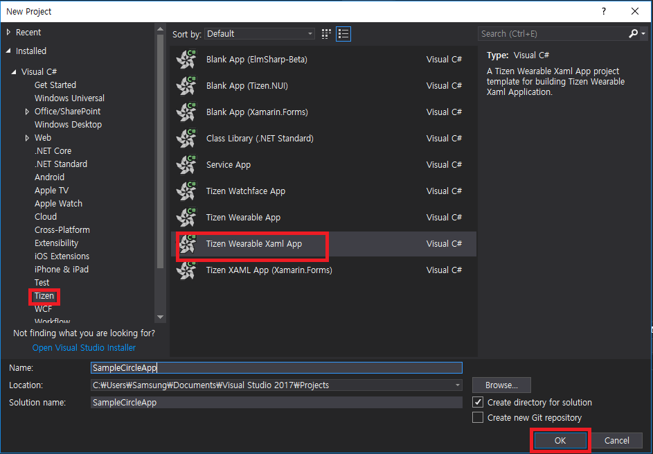

# Tizen Wearable XAML App Template

Following are the steps to create a Tizen Wearable XAML App Template:

- [Create Project](#create-project)
- [Insert CircularUI Control Code](#insert-circularui-control-code)
- [Build and Launch Your Application](#build-and-launch-your-application)

## Create Project

1. In **New project** menu, select **Tizen** > **Tizen Wearable XAML App**.  Click **OK**.
    

2. Search Xamarin.Forms NuGet package and install the latest version
(supports version 3.1.0.583944 and higher) via NuGet package manager. Package source is [Nuget.org](https://api.nuget.org/v3/index.json).

    

3. Search Tizen.Wearable.CircularUI NuGet package and install latest version via NuGet package manager. Package source is [Nuget.org](https://api.nuget.org/v3/index.json).

    

## Insert CircularUI Control Code

1. In **App.xaml** file, remove all of the template code and replace it with the following code. This code defines the user interface for the page:

    **App.xaml** file

    ```xml
    <?xml version="1.0" encoding="utf-8" ?>
    <Application
        x:Class="SampleCircleApp.App"
        xmlns="http://xamarin.com/schemas/2014/forms"
        xmlns:x="http://schemas.microsoft.com/winfx/2009/xaml"
        xmlns:local="clr-namespace:SimpleCircleApp"
        xmlns:w="clr-namespace:Tizen.Wearable.CircularUI.Forms;assembly=Tizen.Wearable.CircularUI.Forms">
        <Application.MainPage>
            <NavigationPage x:Name="MainNavigation">
                <x:Arguments>
                    <w:CirclePage
                        x:Name="page"
                        NavigationPage.HasNavigationBar="False"
                        RotaryFocusObject="{x:Reference slider}">
                        <w:CirclePage.Content>
                            <StackLayout
                                HorizontalOptions="Center"
                                Orientation="Vertical"
                                VerticalOptions="Center">
                                <Label HorizontalTextAlignment="Center" Text="Welcome to Xamarin Forms!" />
                                <Button Clicked="OnButtonClicked" Text="show toast" />
                            </StackLayout>
                        </w:CirclePage.Content>
                        <w:CirclePage.CircleSurfaceItems>
                            <w:CircleSliderSurfaceItem
                                x:Name="slider"
                                Increment="0.5"
                                IsVisible="True"
                                Maximum="15"
                                Minimum="0"
                                Value="3" />
                        </w:CirclePage.CircleSurfaceItems>
                    </w:CirclePage>
                </x:Arguments>
            </NavigationPage>
        </Application.MainPage>
    </Application>
    ```

    - `xmlns:w=clr-namespace:Tizen.Wearable.CircularUI.Forms` : `w` prefix means `Tizen.Wearable.CircularUI.Forms` namespace.
    - `<w:CirclePage>` : `CirclePage` is derived from `Xamarin.Forms.Page`. This page content area has `Label` and `Button`.
    - `<w:CirclePage.CircleSurfaceItems>` : `CircleSliderSurfaceItem` is attached to `CircleSurfaceItem` of  `CirclePage`.
    - `RotaryFocusObject` is set reference of the `slider`. `CircleSliderSurfaceItem` has rotary focus. `CircleSliderSurfaceItem` can receive a Rotary Event from the wearable device's bezel interaction.

    For more information, see [CirclePage guide](https://samsung.github.io/Tizen.CircularUI/guide/CirclePage.html).

2. In **App.xaml.cs**, remove all of the template code and replace it with the following code:

    **App.xaml.cs** file
    ```cs
    using Tizen.Wearable.CircularUI.Forms;
    using System;

    using Xamarin.Forms;
    using Xamarin.Forms.Xaml;

    namespace SampleCircleApp
    {
        [XamlCompilation(XamlCompilationOptions.Compile)]
        public partial class App : Application
        {
            public App()
            {
                InitializeComponent();
            }

            public void OnButtonClicked(object sender, EventArgs e)
            {
                Toast.DisplayText("Toast popup", 3000);
            }
        }
    }
    ```

    - This code displays Toast popup during three seconds.
    - `OnButtonClicked` is an event handler of `Button` `Clicked` event.

## Build and Launch Your Application

1. Build the solution
    - In the Visual Studio menu, select **Build** > **Build Solution**.
    - In the Solution Explorer view, right-click the solution name and select **Build**.

2. Launch Tizen Emulator

    - Click **Launch Tizen Emulator** button, as displayed in the following image:
        

    - Select your device type and click **Launch** button, as displayed in the following image:
        

3. Copy the application

    For Windows OS, copy the application tpk file from the project binary path to sdb tool path.
    - `SampleCircleApp` tpk file is located in `ProjectPath\SampleCircleApp\SampleCircleApp\bin\Debug\tizen40\org.tizen.example.SampleCircleApp-1.0.0.tpk`.
    - To locate the project path, in the Solution Explorer view, right-click the solution name and click **open folder in file explorer**.
    - SDB tool is located in `c:\tizen\tools\sdb.exe`.

4. Launch Tizen SDB command prompt

    - For Windows OS, launch Tizen SDB command prompt (**Tool** > **Tizen** > **Tizen Sdb Command Prompt**).
    - For Linux, you can use SDB command directly in your project path.

5. Install your application with SDB command

    ```
    sdb install org.tizen.example.SampleCircleApp-1.0.0.tpk
    ```

6. Launch wearable emulator to verify the application

    

    

## Related Information

- Dependencies
  - Tizen 4.0 and Higher
