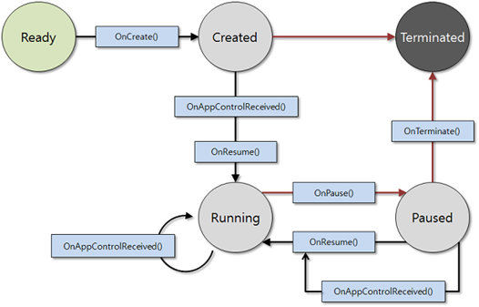
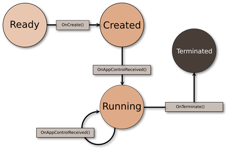

# Tizen .NET Application

Tizen .NET Applications help you develop powerful and efficient applications on Tizen devices using .NET technologies. This guide covers the Tizen .NET Application model, life-cycle, packaging policy, Tizen .NET APIs, and provides essential information for building and deploying applications on the Tizen platform.

* * *

## 1\. Tizen .NET Application Model

The Tizen .NET Application model is based on the .NET runtime and allows developers to develop applications by leveraging C# and .NET libraries. This model supports platform-specific implementations and seamlessly integrates with Tizen's native features, providing a familiar experience for .NET developers.

* * *

## 2\. **Tizen .NET Application Life-cycle**

The life-cycle of a Tizen .NET Application depends on the type of application (UI Application and the Service Application). Below, we will explain and elaborate on the differences between each type.

* * *

### UI Application

UI applications are designed to interact directly with users with graphical user interfaces (GUIs). They follow the standard Tizen Application Life-cycle and include the following states:

**Table: state**

| State | Description |
| --- | --- |
| READY | Application has been executed. |
| CREATED | The main loop of the application has started. |
| RUNNING | The application is active and running in the foreground. Interact with the user with focus. |
| PAUSED | The application is in the background and is not displayed on the screen. Occurs when an application is completely obscured by another application or system interface |
| TERMINATED | The application terminated itself or was terminated by the system |

**Figure: Application state transitions**

#### Callback Functions

*   `OnCreate():` Called when the application starts. This is where you initialize the UI and set up the main event loop.
*   `OnAppControlReceived():` Called when an application receives app control from another application. app control is a mechanism used when sending and receiving data between applications
*   `OnPause():` Called when an application loses focus and enters a paused state. This callback saves the state or pauses the work in progress.
*   `OnResume():` Called when the application gains focus again and returns to the running state. Restore the application state from this callback.
*   `OnTerminate():` Executes when the application is terminated. This callback cleans up the resources and stores the final data.

* * *

### Service Application

Service application has no UI and is designed to work in the background. They perform tasks without user interaction and follow a slightly different lifecycle:

**Table: state**

| State | Description |
| --- | --- |
| READY | Application has been executed. |
| CREATED | The main loop of the application has started. |
| RUNNING | Application is active and running in the background. |
| TERMINATED | The application terminated itself or was terminated by the system |

**Figure: Service life cycle**

#### Callback Functions

*   `OnCreate():` Called when the application starts. This is where you set up the main event loop.
*   `OnAppControlReceived():` Called when an application receives app control from another application. app control is a mechanism used when sending and receiving data between applications
*   `OnTerminate():` Executes when the application is terminated. This callback cleans up the resources and stores the final data.

#### Background Category

The service application must define a background category in the manifest in order to work with the background.

* * *

## 3\. Tizen .NET Application packaging

The process of packaging a Tizen .NET Application involves creating a "tpk" file, which is the standard package format for Tizen Application. The packaging process follows the same policies as Tizen Native Application, but There are additional considerations specific to .NET Application.

**Package ID & Application ID**

*   The Package ID and Application ID are unique identifiers for an application and follow the same naming conventions as Tizen Native Application.  
      
    

**Application Directory Policy**

*   **"bin"** **directory**: Contains all published output files (dlls and files of the .NET build process, app.deps.json, etc.).

·         The rest of the directory is the same as the Tizen Native Application.

**Manifest file**

*   A manifest file (tizen-manifest.xml) defines the metadata, permissions, and functionality of the application. It follows the same structure as the Tizen Native application, but contains additional properties specific to the .NET application.
*   **Platform version and API version**: Ensure that your application targets the correct Tizen platform version and API level to access the features you need.

**Signature Policy**

*   To install an application on a Tizen device, you must sign it with a valid certificate. The signing process is the same as for Tizen Native Application.

* * *

## 4\. Tizen .NET API

The Tizen .NET API is based on the .NET Standard and provides platform-specific functionality through TizenFX. TizenFX exposes specific features of the Tizen platform as APIs, allowing developers to leverage the unique features of Tizen devices.

**.NET Standard API**

*   The Tizen .NET API is based on the .NET Standard and offers cross-platform compatibility. It allows developers to write code that can be reused across various platforms.

**TizenFX API (Tizen .NET)**

*   TizenFX provides specific features of the Tizen platform as APIs, with APIs optimized for each platform version. This allows developers to take advantage of the unique features of Tizen devices (e.g., Sensor, Multimedia, Network, etc.).
*   For full specifications, see the TizenFX API reference.

* * *

## 5\. Tizen .NET Application Development

To start developing a Tizen .NET Application, follow these steps:

1.  **Preferences**: Install Visual Studio with the Tizen SDK and Tizen extensions.
2.  **Create a new project**: Use Visual Studio to create a new Tizen .NET project.
3.  **Code Writing**: Use C# and .NET libraries to develop application logic.
4.  **Build and deploy**: Build and test your application by deploying it to Tizen devices or emulators.

The entry point for a Tizen .NET Application is typically defined in the “Main” method of the Application class, where the Application is initialized and the main UI thread is started.
