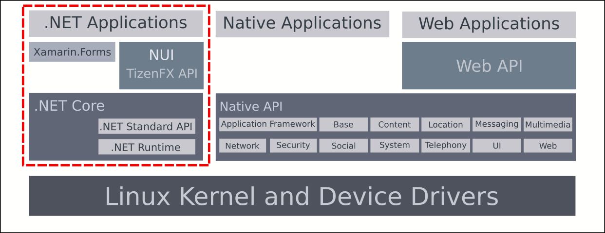

# Tizen .NET API Overview

TizenFX is a comprehensive .NET-based framework designed for developing applications for the Tizen operating system using C# and .NET technologies. It enables developers to create powerful, performant applications with seamless integration to Tizen platform features and services.

## What is TizenFX?

TizenFX provides C# bindings to Tizen's native C APIs, offering a managed runtime environment that combines the power of .NET with the device-specific capabilities of Tizen. This framework allows you to leverage modern .NET development practices while accessing hardware features and platform services unique to Tizen devices.

## Key Advantages

### Managed Runtime Benefits

TizenFX's managed runtime environment offers several advantages for application development:

- **Faster Development**: The managed runtime handles many low-level functions automatically, accelerating development cycles and allowing developers to focus on business logic.

- **Safer Code**: Features like bound checking, type safety, garbage collection, and memory protection services reduce common programming errors and enhance application security.

- **Lower Deployment Costs**: Component-based architecture simplifies deployment across multiple platforms, devices, and legacy systems in enterprise environments.

- **Better Code Quality**: By handling system-level tasks, the managed runtime enables developers to concentrate on application-specific logic, resulting in cleaner, more maintainable code.

## TizenFX Architecture

TizenFX consists of several key components that work together to provide a complete development platform:

**Figure: Tizen .NET architecture**

### .NET Core Foundation

The foundation of TizenFX is [.NET Core](https://docs.microsoft.com/en-us/dotnet/core/about), a general-purpose development platform that provides:

- **.NET Standard 2.0 API**: Implements the .NET Base Class Library, giving access to standard .NET APIs
- **Cross-platform runtime**: Applications can be developed on Windows, macOS, or Linux
- **High performance**: Optimized for efficient code execution and memory management

> [!NOTE]
> Some .NET Standard APIs have limitations on Tizen. For more information, see [Limitations of .NET Standard API](../reference/dotnet-standard-limitations.md).

### TizenFX API

The TizenFX API exposes Tizen-specific platform features through C# interfaces, enabling applications to access device hardware and system services. These APIs are organized into logical namespaces:

- **Tizen.Account**: Account management, OAuth authentication, and synchronization
- **Tizen.Applications**: Application lifecycle, inter-app communication, and notifications
- **Tizen.Content**: Media content management and downloads
- **Tizen.Location**: GPS location services and geofencing
- **Tizen.Maps**: Mapping and location-based services
- **Tizen.Messaging**: Email, messages, and push notifications
- **Tizen.Multimedia**: Audio/video playback, recording, camera, and media processing
- **Tizen.NUI**: Natural User Interface toolkit for rich GUI applications
- **Tizen.Network**: Bluetooth, Wi-Fi, NFC, and IoT connectivity
- **Tizen.Pims**: Calendar and contacts management
- **Tizen.Security**: Secure storage and cryptographic operations
- **Tizen.Sensor**: Access to device sensors (accelerometer, gyroscope, etc.)
- **Tizen.System**: Device information, settings, and system services
- **Tizen.Telephony**: Call, modem, network, and SIM information
- **Tizen.Uix**: Text-to-speech, speech-to-text, and input methods
- **Tizen.Webview**: Embedded web browsing functionality

For the complete API reference, see the [TizenFX API documentation](/application/dotnet/api/TizenFX/latest/api/Tizen.html).

### Natural User Interface (NUI)

[NUI](../guides/user-interface/nui/overview.md) is a high-performance C# GUI toolkit built on top of the DALi (Dynamic Animation Library) graphics engine. NUI provides:

- **2D and 3D graphics support**: Create visually stunning applications with hardware-accelerated rendering
- **Smooth animations**: Multi-threaded architecture enables realistic animations
- **Optimized performance**: Low CPU and GPU usage through advanced optimization techniques
- **Rich components**: Pre-built UI components including buttons, lists, sliders, video views, and more
- **Vector graphics**: Support for scalable vector graphics rendering
- **Flexible layouts**: Advanced layout system for responsive designs

NUI is ideal for creating image galleries, music players, home screens, watch faces, and other visually rich applications.

## Application Models

TizenFX supports multiple application models to suit different use cases:

### UI Application

UI applications feature a graphical user interface and are suitable for most interactive applications. They can:

- Display rich interfaces with text, graphics, and multimedia
- Access device sensors and hardware features
- Manage content and media files
- Use network and social services
- Provide messaging and web browsing functionality
- Implement complex user interactions

### Service Application

Service applications run in the background without a user interface. They are ideal for:

- Periodic background tasks
- Continuous data collection (e.g., sensor data)
- System monitoring
- Background processing
- Long-running operations without user interaction

## Application Packaging

A Tizen .NET application is packaged as a `tpk` file, the standard Tizen package format. The packaging policy is the same as for a Tizen native application, with a few additions specific to .NET:

- **Package ID and application ID**: Unique identifiers for the application, following the same naming conventions as a native application.
- **Application directory**: The `bin` directory holds the published output of the .NET build, such as the assemblies and `app.deps.json`. The remaining directories are the same as in a native application.
- **Manifest**: `tizen-manifest.xml` declares the metadata, privileges, and features of the application. It has the same structure as a native manifest, and additionally records the platform version and API version the application targets.
- **Signature**: The package must be signed with a valid certificate before it can be installed on a device. The procedure is the same as for a native application; see [Certificates](../guides/concepts/signing-certificates/index.md).

## Development Tools

Visual Studio Tools for Tizen provides the project templates, build integration, and device tooling for .NET application development. See [Visual Studio Tools for Tizen](../../../sdk-tools/vstools/index.md), or go straight to [installing the extension](../../../sdk-tools/vstools/install.md).

## Related Documentation

- **[API Reference](/application/dotnet/api/TizenFX/latest/api/Tizen.html)**: Complete API documentation
- **[Guides](../guides/index.md)**: Detailed feature tutorials and examples
