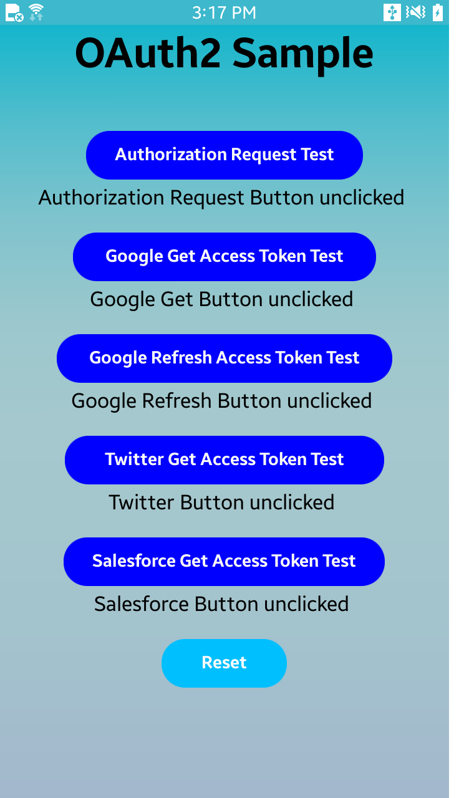
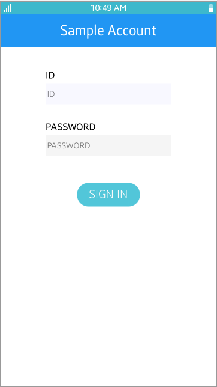
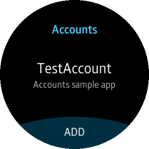

# Account

<!--
For MD:
-->

<link href="../css/dotnet-samples.css" ref="stylesheet">

<!--
for TD:

<style type="text/css">
    Please copy dotnet-samples.css and paste it here
</script>
-->

<button class="tablinks" onclick="openProfile(event, 'Mobile')" id="defaultOpen">Mobile</button> <button class="tablinks" onclick="openProfile(event, 'Wearable')">Wearable</button> <button class="tablinks" onclick="openProfile(event, 'TV')">TV</button>

<!-- Tab content -->

<table>
	<tbody>
		<tr>
			<td></td>
			<td>
			
<strong>(M) OAuth2Sample</strong> [In progress]

			
This sample application demonstrates how to manage access code and token using <a href="https://developer.tizen.org/dev-guide/csapi/api/Tizen.Account.OAuth2.html" target="_blank">Tizen.Account.OAuth2 C# API</a>.

			</td>
		</tr>
		<tr>
			<td></td>
			<td>
			
<strong>(M) SampleAccount</strong> [In progress]

			
This sample application demonstrates how to implement an account provider, which adds and configures an account.

			</td>
		</tr>
		<tr>
			<td></td>
			<td>
			
<a href="https://github.com/Samsung/Tizen-CSharp-Samples/tree/master/Mobile/SampleSync" target="_blank"><strong>(M) SampleSync</strong></a>

			
This sample application demonstrates how to manage data synchronization schedule between the target device and the server.

			</td>
		</tr>
	</tbody>
</table>

<table>
	<tbody>
		<tr>
			<td></td>
			<td>
                        
<a href="https://github.com/Samsung/Tizen-CSharp-Samples/tree/master/Wearable/Accounts" target="_blank"><strong>(W) Accounts</strong></a>

			
This sample application demonstrates how to implement an account provider, which can add and configure an account. It also demonstrates how to create circular UI using <a href="https://github.com/Samsung/Tizen.CircularUI/" target="_blank">Tizen.Wearable.CircularUI C# API</a>.

			</td>
		</tr>
		<tr>
	</tbody>
</table>

<table>
	<tbody>
		<tr>
			<td>There is no sample.</td>
		</tr>
	</tbody>
</table>

<!--
For MD:
-->

<!--
for TD:

-->
