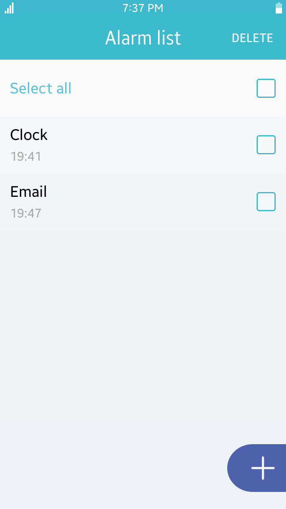
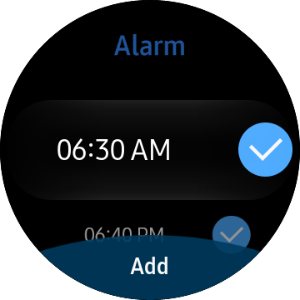
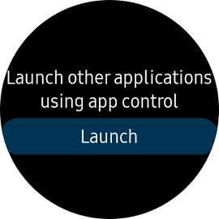
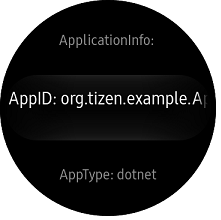
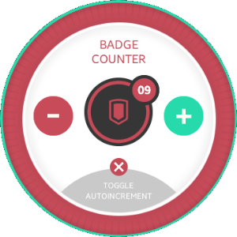
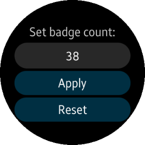
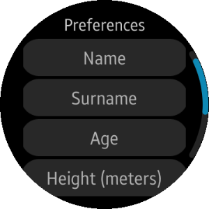

# AppFW

<!--
For MD:
-->

<link href="../css/dotnet-samples.css" ref="stylesheet">

<!--
for TD:

<style type="text/css">
    Please copy dotnet-samples.css and paste it here
</script>
-->

<button class="tablinks" onclick="openProfile(event, 'Mobile')" id="defaultOpen">Mobile</button> <button class="tablinks" onclick="openProfile(event, 'Wearable')">Wearable</button> <button class="tablinks" onclick="openProfile(event, 'TV')">TV</button>

<!-- Tab content -->

<table>
	<tbody>
		<tr>
			<td></td>
			<td>
			
<strong>(M) Alarms</strong> [In progress]

			
This sample application demonstrates how to schedule start of an application at a specified date and time or after a delay using <a href="/application/dotnet/api/TizenFX/latest/api/Tizen.Applications.html" target="_blank">Tizen.Applications</a>.

			</td>
		</tr>
		<tr>
			<td></td>
			<td>
			
<a href="https://github.com/Samsung/Tizen-CSharp-Samples/tree/master/Mobile/Xamarin.Forms/UI/AppCommon" target="_blank"><strong>(M) App-common</strong></a>

			
This sample application demonstrates how to work with <a href="/application/dotnet/api/TizenFX/latest/api/Tizen.Applications.html" target="_blank">Tizen.Applications</a> and <a href="/application/dotnet/api/TizenFX/latest/api/Tizen.System.html" target="_blank">Tizen.System</a> to obtain application-specific information.

			</td>
		</tr>
		<tr>
			<td></td>
			<td>
			
<a href="https://github.com/Samsung/Tizen-CSharp-Samples/tree/master/Mobile/Xamarin.Forms/UI/ApplicationControl" target="_blank"><strong>(M) Application Control</strong></a>

			
This sample application demonstrates how to call operations of other applications. It also provides operations such as pick, view, or compose.

			</td>
		</tr>
		<tr>
			<td></td>
			<td>
			
<a href="https://github.com/Samsung/Tizen-CSharp-Samples/tree/master/Mobile/Xamarin.Forms/Badges" target="_blank"><strong>(M) Badges</strong></a>

			
This sample application demonstrates how to manage the application badge counter using <a href="/application/dotnet/api/TizenFX/latest/api/Tizen.Applications.html" target="_blank">Tizen.Applications</a>.

			
In addition, there is similar native sample application. 
			<ul>
				<li><a href="/development/sample/native/AppFW/Badges" target="_blank">Native version</a></li>
			</ul>

			</td>
		</tr>
		<tr>
			<td></td>
			<td>
			
<strong>(M) NotificationManager</strong> [In progress]

			
This sample application demonstrates how to create and manage notifications using <a href="/application/dotnet/api/TizenFX/latest/api/Tizen.Applications.Notifications.html" target="_blank">Tizen.Applications.Notifications</a>.

			</td>
		</tr>
		<tr>
			<td></td>
			<td>
                        
<a href="https://github.com/Samsung/Tizen-CSharp-Samples/tree/master/Mobile/Xamarin.Forms/Preference" target="_blank"><strong>(M) Preference</strong></a>

			
This sample application demonstrates how to store and retrieve application specific data and preferences using <a href="/application/dotnet/api/TizenFX/latest/api/Tizen.Applications.Preference.html" target="_blank">Tizen.Applications.Preference</a>.

			
In addition, there is similar native sample application. 
			<ul>
				<li><a href="/development/sample/native/AppFW/Preference" target="_blank">Native version</a></li>
			</ul>

			</td>
		</tr>
	</tbody>
</table>

<table>
	<tbody>
		<tr>
			<td></td>
			<td>
                        
<a href="https://github.com/Samsung/Tizen-CSharp-Samples/tree/master/Wearable/Xamarin.Forms/Alarm" target="_blank"><strong>(W) Alarm</strong></a>

			
This sample application demonstrates how to create and manage several alarms and save the alarm data. It also demonstrates how to create an application using Xamarin.Forms and <a href="https://samsung.github.io/Tizen.CircularUI/api/index.html" target="_blank">Tizen.Wearable.CircularUI</a>.

			
In addition, there are similar native and web sample applications. 
			<ul>
				<li><a href="/development/sample/native/UI/%28Circle%29_Alarm" target="_blank">Native version</a></li>
				<li><a href="/development/sample/web/UI/Alarm_UI" target="_blank">Web version</a></li>
			</ul>

			</td>
		</tr>
		<tr>
			<td></td>
			<td>
                        
<a href="https://github.com/Samsung/Tizen-CSharp-Samples/tree/master/Wearable/Xamarin.Forms/AppControl" target="_blank"><strong>(W) AppControl</strong></a>

			
This sample application demonstrates how to launch an application, get a result for the launch request, and create circular UI using <a href="https://samsung.github.io/Tizen.CircularUI/api/index.html" target="_blank">Tizen.Wearable.CircularUI</a>. When you press <strong>Launch</strong>, the AppInformation sample application will be launched.

			
<strong>Prerequisites</strong> 
			First of all, you need to install <a href="https://github.com/Samsung/Tizen-CSharp-Samples/tree/master/Wearable/Xamarin.Forms/AppInformation" target="_blank">AppInformation sample application</a> because it is what would be launched by AppControl sample application.
			You can install it by using Visual Studio or the sdb command line as follows: 
			<code>$ sdb install org.tizen.example.AppInformation-1.0.0.tpk</code>
			

			
This application uses <a href="/application/dotnet/api/TizenFX/latest/api/Tizen.Applications.html" target="_blank">Tizen.Applications</a>. 
			<ul>
				<li><a href="/application/dotnet/api/TizenFX/latest/api/Tizen.Applications.AppControl.html" target="_blank">Class AppControl</a></li>
				<li><a href="/application/dotnet/api/TizenFX/latest/api/Tizen.Applications.AppControlLaunchMode.html" target="_blank">Class AppControlLaunchMode</a></li>
			</ul>

			
In addition, there are similar native and web sample applications. 
			<ul>
				<li><a href="/development/sample/native/AppFW/Application_control" target="_blank">Native version</a></li>
				<li><a href="/development/sample/web/Application/App_Control" target="_blank">Web version</a>
			</li>

			</td>
		</tr>
		<tr>
			<td></td>
			<td>
                        
<a href="https://github.com/Samsung/Tizen-CSharp-Samples/tree/master/Wearable/Xamarin.Forms/AppInformation" target="_blank"><strong>(W) AppInformation</strong></a>

			
This sample application demonstrates how to get the specific information such as AppId, Package ID, and shared directory path. It also demonstrates how to get the directory information such as resource, cache, and app data and how to create circular UI using <a href="https://samsung.github.io/Tizen.CircularUI/api/index.html" target="_blank">Tizen.Wearable.CircularUI</a>.

			
This application uses <a href="/application/dotnet/api/TizenFX/latest/api/Tizen.Applications.html" target="_blank">Tizen.Applications</a>. 
			<ul>
				<li><a href="/application/dotnet/api/TizenFX/latest/api/Tizen.Applications.ApplicationInfo.html" target="_blank">Class ApplicationInfo</a></li>
				<li><a href="/application/dotnet/api/TizenFX/latest/api/Tizen.Applications.DirectoryInfo.html" target="_blank">Class DirectoryInfo</a></li>
			</ul>

			
In addition, there is similar native sample application. 
			<ul>
				<li><a href="/development/sample/native/AppFW/App-common" target="_blank">Native version</a></li>
			</ul>

			</td>
		</tr>
		<tr>
			<td></td>
			<td>
                        
<a href="https://github.com/Samsung/Tizen-CSharp-Samples/tree/master/Wearable/Xamarin.Forms/BadgeCounter" target="_blank"><strong>(W) BadgeCounter</strong></a>

			
This sample application demonstrates how to manage badge counter of the application using <a href="/application/dotnet/api/TizenFX/latest/api/Tizen.Applications.html" target="_blank">Tizen.Applications</a> and how to create circular UI using <a href="https://samsung.github.io/Tizen.CircularUI/api/index.html" target="_blank">Tizen.Wearable.CircularUI</a>.

			
In addition, there is similar web sample application. 
			<ul>
				<li><a href="/development/sample/web/Application/Badges" target="_blank">Web version</a></li>
			</ul>

			</td>
		</tr>
		<tr>
			<td></td>
			<td>
                        
<a href="https://github.com/Samsung/Tizen-CSharp-Samples/tree/master/Wearable/Xamarin.Forms/Badges" target="_blank"><strong>(W) Badges</strong></a>

			
This sample application demonstrates how to use application badge and how to create circular UI using <a href="https://samsung.github.io/Tizen.CircularUI/api/index.html" target="_blank">Tizen.Wearable.CircularUI</a>.

			</td>
		</tr>
		<tr>
			<td></td>
			<td>
                        
<a href="https://github.com/Samsung/Tizen-CSharp-Samples/tree/master/Wearable/Xamarin.Forms/MessagePortSampleApp" target="_blank"><strong>(W) MessagePortSampleApp</strong></a>

			
This sample application demonstrates how to send and receive messages between applications and how to create circular UI using <a href="https://samsung.github.io/Tizen.CircularUI/api/index.html" target="_blank">Tizen.Wearable.CircularUI</a>.

			

			<ul>
				<li>Send a message to Tizen .Net Service sample application when <strong>Send a message</strong> button is clicked.</li>
				<li>Receive a message from <a href="https://github.com/Samsung/Tizen-CSharp-Samples/tree/master/Wearable/Xamarin.Forms/ServiceApp" target="_blank">Tizen .Net Service sample application</a></li>
			</ul>

			
<strong>Prerequisites</strong> 
			First of all, you need to install and execute <a href="https://github.com/Samsung/Tizen-CSharp-Samples/tree/master/Wearable/Xamarin.Forms/ServiceApp" target="_blank">Tizen .Net Service sample application</a> because it is used to communicate each other. 
			You can install it by using Visual Studio or the sdb command line as follows: 
			<code>$ sdb install org.tizen.example.ServiceApp-1.0.0.tpk</code> 
			<code>$ sdb shell</code> 
			<code>$ app_launcher -s org.tizen.example.ServiceApp</code> 
			If you do not install the Tizen .Net service application, an exception occurs when you press <strong>Send a message</strong>.
			

			
This application uses <a href="/application/dotnet/api/TizenFX/latest/api/Tizen.Applications.Messages.html" target="_blank">Tizen.Applications.Messages</a>. 
			<ul>
				<li><a href="/application/dotnet/api/TizenFX/latest/api/Tizen.Applications.Messages.MessagePort.html" target="_blank">Class MessagePort</a></li>
			</ul>

			
In addition, there is similar native sample application. 
			<ul>
				<li><a href="/development/sample/native/AppFW/%28Tutorial%29_Message_Port" target="_blank">Native version</a></li>
			</ul>

			</td>
		</tr>
		<tr>
			<td></td>
			<td>
                        
<a href="https://github.com/Samsung/Tizen-CSharp-Samples/tree/master/Wearable/Xamarin.Forms/Preference" target="_blank"><strong>(W) Preference</strong></a>

			
This sample application demonstrates how to use <a href="/application/dotnet/api/TizenFX/latest/api/Tizen.Applications.Preference.html" target="_blank">Tizen.Applications.Preference</a> and how to create circular UI using <a href="https://samsung.github.io/Tizen.CircularUI/api/index.html" target="_blank">Tizen.Wearable.CircularUI</a>.

			</td>
		</tr>
		<tr>
			<td>
			
Service application - no UI

			</td>
			<td>
                        
<a href="https://github.com/Samsung/Tizen-CSharp-Samples/tree/master/Wearable/Xamarin.Forms/ServiceApp" target="_blank"><strong>(W) ServiceApp</strong></a>

			
This sample application demonstrates how to create a service application which has no UI.

			
This application uses <a href="/application/dotnet/api/TizenFX/latest/api/Tizen.Applications.html" target="_blank">Tizen.Applications</a>. 
			<ul>
				<li><a href="/application/dotnet/api/TizenFX/latest/api/Tizen.Applications.ServiceApplication.html" target="_blank">Class ServiceApplication</a></li>
			</ul>

			
In addition, there is similar native sample application. 
			<ul>
				<li><a href="/development/sample/native/AppFW/%28Tutorial%29_Service_Application" target="_blank">Native version</a></li>
			</ul>

			<table>
				<tbody>
				<tr>
					<td>App Type</td>
					<td>Guide</td>
				</tr>
				<tr>
					<td>Native</td>
					<td><a href="../../../native/guides/applications/service-app.md" target="_blank">Service Application</a></td>
				</tr>
				<tr>
					<td>Web</td>
					<td><a href="../../../web/guides/applications/service-app.md" target="_blank">Service Application</a></td>
				</tr>
				</tbody>
			</table>
			</td>
		</tr>
	</tbody>
</table>

<table>
	<tbody>
		<tr>
			<td>
			

			</td>
			<td>
			
<a href="https://github.com/Samsung/Tizen-CSharp-Samples/tree/master/TV/Xamarin.Forms/AppInfo" target="_blank"><strong>(T) AppInfo</strong></a>

			
This sample application demonstrates how to obtain information about installed applications using <a href="/application/dotnet/api/TizenFX/latest/api/Tizen.Applications.html" target="_blank">Tizen.Applications</a>.

			</td>
		</tr>
		<tr>
			<td>
			
Service application - no UI

			</td>
			<td>
			
<strong>(T) MessagePortMiami</strong> [In progress]

			
This sample application demonstrates how to use <a href="/application/dotnet/api/TizenFX/latest/api/Tizen.Applications.Messages.html" target="_blank">Tizen.Applications.Messages</a> to communicate between applications and services.

			
The MessagePortMiami service cannot be tested as a standalone application. It is one of the applications available in the set of three sample applications:
			<ul>
				<li>MessagePort application - Web application (available in Tizen Studio) that shows the graphical interface and handles the Havana port communications.</li>
				<li>MessagePortNassau service - C# service application that handles the Nassau port communications.</li>
				<li>MessagePortMiami service - C# service application that handles the Miami port communications.</li>
			</ul>
			

			</td>
		</tr>
		<tr>
			<td>
			
Service application - no UI

			</td>
			<td>
			
<strong>(T) MessagePortNassau</strong> [In progress]

			
This sample application demonstrates how to use <a href="/application/dotnet/api/TizenFX/latest/api/Tizen.Applications.Messages.html" target="_blank">Tizen.Applications.Messages</a> to communicate between applications and services.

			
The MessagePortNassau service cannot be tested as a standalone application. It is one of the applications available in the set of three sample applications:
			<ul>
				<li>MessagePort application - Web application (available in Tizen Studio) that shows the graphical interface and handles the Havana port communications.</li>
				<li>MessagePortNassau service - C# service application that handles the Nassau port communications.</li>
				<li>MessagePortMiami service - C# service application that handles the Miami port communications.</li>
			</ul>
			

			</td>
		</tr>
		<tr>
			<td>
			

			</td>
			<td>
			
<a href="https://github.com/Samsung/Tizen-CSharp-Samples/tree/master/TV/Xamarin.Forms/Preference" target="_blank"><strong>(T) Preference</strong></a>

			
This sample application demonstrates how to store and retrieve an application specific data and preference using <a href="/application/dotnet/api/TizenFX/latest/api/Tizen.Applications.Preference.html" target="_blank">Tizen.Applications.Preference</a>.

			</td>
		</tr>
	</tbody>
</table>

<!--
For MD:
-->

<!--
for TD:

-->
