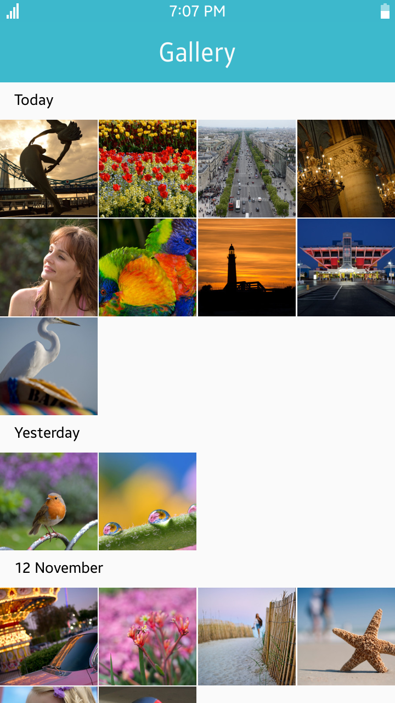
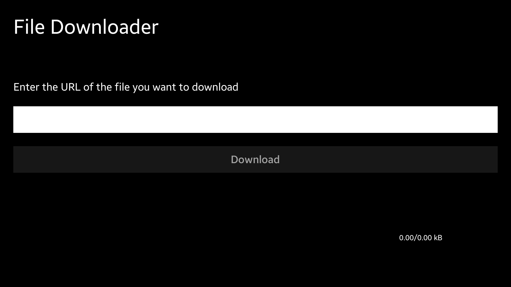
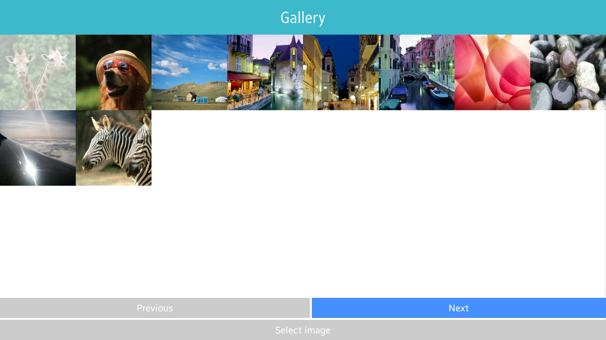
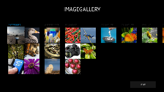
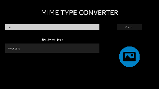

# Content

<!--
For MD:
-->

<link href="../css/dotnet-samples.css" ref="stylesheet">

<!--
for TD:

<style type="text/css">
    Please copy dotnet-samples.css and paste it here
</script>
-->

<button class="tablinks" onclick="openProfile(event, 'Mobile')" id="defaultOpen">Mobile</button> <button class="tablinks" onclick="openProfile(event, 'Wearable')">Wearable</button> <button class="tablinks" onclick="openProfile(event, 'TV')">TV</button>

<!-- Tab content -->

<table>
	<tbody>
		<tr>
			<td></td>
			<td>
			
<a href="https://github.com/Samsung/Tizen-CSharp-Samples/tree/master/Mobile/Xamarin.Forms/Downloader" target="_blank"><strong>(M) Downloader</strong></a>

			
This sample application demonstrates how to download content from Web and get the downloaded information.

			</td>
		</tr>
		<tr>
			<td></td>
			<td>
			
<strong>(M) Gallery</strong> [In progress]

			
This sample application demonstrates how to create an image viewer using <a href="/application/dotnet/api/TizenFX/latest/api/Tizen.Content.MediaContent.html" target="_blank">Tizen.Content.MediaContent</a>.

			</td>
		</tr>
		<tr>
			<td></td>
			<td>
                        
<a href="https://github.com/Samsung/Tizen-CSharp-Samples/tree/master/Mobile/Xamarin.Forms/MediaContent" target="_blank"><strong>(M) MediaContent</strong></a>

			
This sample application demonstrates how to obtain and filter media content information from internal and external storages using <a href="/application/dotnet/api/TizenFX/latest/api/Tizen.Content.MediaContent.html" target="_blank">Tizen.Content.MediaContent</a>.

			</td>
		</tr>
	</tbody>
</table>

<table>
	<tbody>
		<tr>
			<td>There is no sample.</td>
		</tr>
	</tbody>
</table>

<table>
	<tbody>
		<tr>
			<td>
			

			</td>
			<td>
			
<strong>(T) FileDownloader</strong> [In progress]

			
This sample application demonstrates how to download a file using <a href="/application/dotnet/api/TizenFX/latest/api/Tizen.Content.MediaContent.html" target="_blank">Tizen.Content.MediaContent</a>.

			</td>
		</tr>
		<tr>
			<td>
			

			</td>
			<td>
			
<a href="https://github.com/Samsung/Tizen-CSharp-Samples/tree/master/TV/Xamarin.Forms/Gallery" target="_blank"><strong>(T) Gallery</strong></a>

			
This sample application demonstrates how to create a grid of images and a scrollable slideshow on a TV. 
			It also shows how to change the layout depending on the device type.

			</td>
		</tr>
		<tr>
			<td>
			

			</td>
			<td>
			
<strong>(T) ImageGallery</strong> [In progress]

			
This sample application demonstrates how to create an image viewer using <a href="/application/dotnet/api/TizenFX/latest/api/Tizen.Content.MediaContent.html" target="_blank">Tizen.Content.MediaContent</a>.

			</td>
		</tr>
		<tr>
			<td>
			

			</td>
			<td>
                        
<a href="https://github.com/Samsung/Tizen-CSharp-Samples/tree/master/TV/Xamarin.Forms/MediaContent" target="_blank"><strong>(T) MediaContent</strong></a>

			
This sample application demonstrates how to obtain and filter media content information from internal and external storages using <a href="/application/dotnet/api/TizenFX/latest/api/Tizen.Content.MediaContent.html" target="_blank">Tizen.Content.MediaContent</a>.

			</td>
		</tr>
		<tr>
			<td>
			

			</td>
			<td>
                        
<a href="https://github.com/Samsung/Tizen-CSharp-Samples/tree/master/TV/NUI/MediaHubSample" target="_blank"><strong>(T) MediaHubSample (NUI)</strong></a>

			
This sample application demonstrates how to obtain and filter media content information from internal storages.

			</td>
		</tr>
		<tr>
		<td>
			

			</td>
			<td>
                        
<a href="https://github.com/Samsung/Tizen-CSharp-Samples/tree/master/TV/Xamarin.Forms/MimeTypeConverter" target="_blank"><strong>(T) MimeTypeConverter</strong></a>

			
This sample application demonstrates how to convert file extensions to MIME type and MIME type to file extensions using <a href="/application/dotnet/api/TizenFX/latest/api/Tizen.Content.MimeType.html" target="_blank">Tizen.Content.MimeType</a>.

			</td>
		</tr>
	</tbody>
</table>

<!--
For MD:
-->

<!--
for TD:

-->
