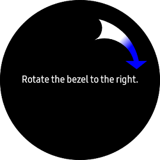
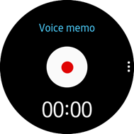
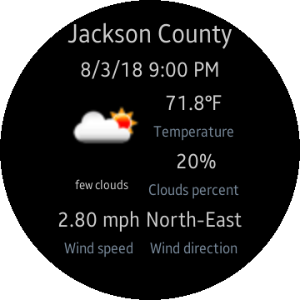
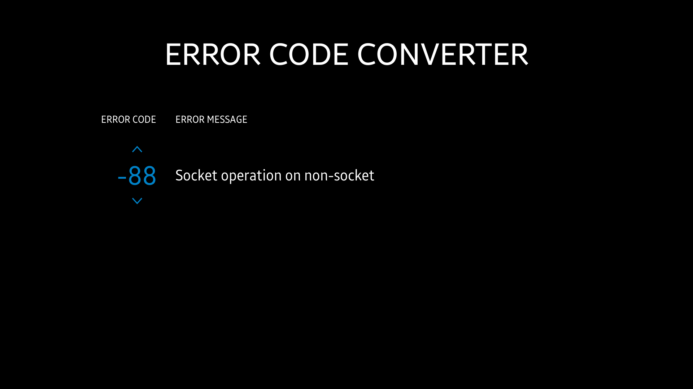

# General

<!--
For MD:
-->

<link href="../css/dotnet-samples.css" ref="stylesheet">

<!--
for TD:

<style type="text/css">
    Please copy dotnet-samples.css and paste it here
</script>
-->

<button class="tablinks" onclick="openProfile(event, 'Mobile')" id="defaultOpen">Mobile</button> <button class="tablinks" onclick="openProfile(event, 'Wearable')">Wearable</button> <button class="tablinks" onclick="openProfile(event, 'TV')">TV</button>

<!-- Tab content -->

<table>
	<tbody>
		<tr>
			<td></td>
			<td>
			
<a href="https://github.com/Samsung/Tizen-CSharp-Samples/tree/master/Mobile/Xamarin.Forms/Weather" target="_blank"><strong>(M) Weather</strong></a>

			
This sample application demonstrates how to obtain the data provided by the RESTful API using <a href="https://openweathermap.org/" target="_blank">OpenWeatherMap</a>.

			</td>
		</tr>
	</tbody>
</table>

<table>
	<tbody>
		<tr>
			<td></td>
			<td>
                        
<a href="https://github.com/Samsung/Tizen-CSharp-Samples/tree/master/Wearable/Xamarin.Forms/PlayingWithHWInputs" target="_blank"><strong>(W) PlayingWithHWInputs</strong></a>

			
This sample application demonstrates how to handle rotary events from bezel of a wearable device and how to create circular UI using <a href="https://samsung.github.io/Tizen.CircularUI/api/index.html" target="_blank">Tizen.Wearable.CircularUI</a>. In addition, it demonstrates how to use the rotating bezel.

			
This application uses <a href="https://samsung.github.io/Tizen.CircularUI/api/index.html" target="_blank">Tizen.Wearable.CircularUI</a>. 
			<ul>
				<li><a href="https://samsung.github.io/Tizen.CircularUI/api/Tizen.Wearable.CircularUI.Forms.IRotaryEventReceiver.html" target="_blank">Interface IRotaryEventReceiver</a></li>
			</ul>

			
Also, you can get details about managing rotary event for Tizen native and web applications.

			<table>
				<tbody>
				<tr>
					<td>App Type</td>
					<td>Guide</td>
				</tr>
				<tr>
					<td>Native</td>
					<td><a href="../../../native/guides/ui/efl/rotary-events.md" target="_blank">Managing rotary events</a></td>
				</tr>
				<tr>
					<td>Web</td>
					<td><a href="../../../web/guides/tau/tau-rotary.md" target="_blank">Handling rotary events</a></td>
				</tr>
				</tbody>
			</table>
			</td>
		</tr>
		<tr>
			<td></td>
			<td>
                        
<a href="https://github.com/Samsung/Tizen-CSharp-Samples/tree/master/Wearable/Xamarin.Forms/SQLite.NET.Sample" target="_blank"><strong>(W) SQLite.Net.Sample</strong></a>

			
This sample application demonstrates how to create and connect to an SQLite database and use it in Tizen .Net application.

			
This application uses <a href="/application/dotnet/api/TizenFX/latest/api/Tizen.Applications.html" target="_blank">Tizen.Applications</a>. 
			<ul>
				<li>Create and connect to an SQLite database</li>
				<li>Create and modify a DB table</li>
				<li>Create and insert a DB table</li>
			</ul>

			
Whenever you relaunch this sample application, two new items are inserted to SQLite database.

			</td>
		</tr>
		<tr>
			<td>
			

			</td>
			<td>
                        
<a href="https://github.com/Samsung/Tizen-CSharp-Samples/tree/master/Wearable/Xamarin.Forms/VoiceMemo" target="_blank"><strong>(W) VoiceMemo</strong></a>

			
This sample application demonstrates how to create an application using Xamarin.Forms, <a href="https://samsung.github.io/Tizen.CircularUI/api/index.html" target="_blank">Tizen.Wearable.CircularUI</a>, SQLite, and Tizen FX (Tizen.Applications, Tizen.Content.MediaContent, Tizen.Multimedia, Tizen.System, Tizen.Uix.Stt, Tizen.Security, and so on).

			
The sample requires network connection (for example, Wi-Fi) at runtime.

			
In addition, there are similar native and web sample applications. 
			<ul>
				<li><a href="/development/sample/native/UI/(Circle)_Voice_Memo" target="_blank">Native version</a></li>
				<li><a href="/development/sample/web/UI/Voice_Memo_UI" target="_blank">Web version</a></li>
			</ul>

			</td>
		</tr>
		<tr>
			<td>
			

			</td>
			<td>
                        
<a href="https://github.com/Samsung/Tizen-CSharp-Samples/tree/master/Wearable/Xamarin.Forms/Weather" target="_blank"><strong>(W) Weather</strong></a>

			
This sample application demonstrates how to obtain the data provided by the RESTful API using <a href="https://openweathermap.org/" target="_blank">OpenWeatherMap</a> and how to create circular UI using <a href="https://samsung.github.io/Tizen.CircularUI/api/index.html" target="_blank">Tizen.Wearable.CircularUI</a>.

			</td>
		</tr>
		<tr>
			<td>
			

			</td>
			<td>
                        
<a href="https://github.com/Samsung/Tizen-CSharp-Samples/tree/master/Wearable/Xamarin.Forms/WebWidgetHybrid" target="_blank"><strong>(W) WebWidgetHybrid</strong></a>

			
This sample application demonstrates how to create a Tizen hybrid application, which is packaged with Tizen Web and .Net applications.

			</td>
		</tr>
	</tbody>
</table>

<table>
        <tbody>
                <tr>
                        <td>
                        

                        </td>
                        <td>
                        
<a href="https://github.com/Samsung/Tizen-CSharp-Samples/tree/master/TV/Xamarin.Forms/ErrorCodeConverter" target="_blank"><strong>(T) ErrorCodeConverter</strong></a>

                        
This sample application demonstrates how to get the message for a specific error code.

                        </td>
                </tr>
        </tbody>
</table>

<!--
For MD:
-->

<!--
for TD:

-->
