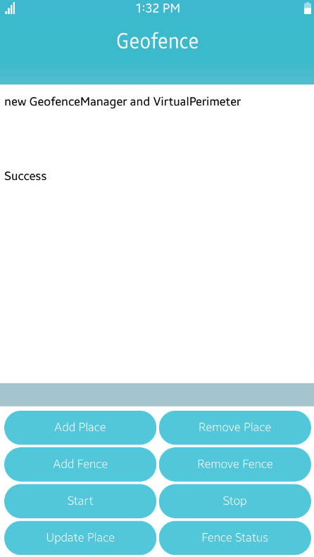
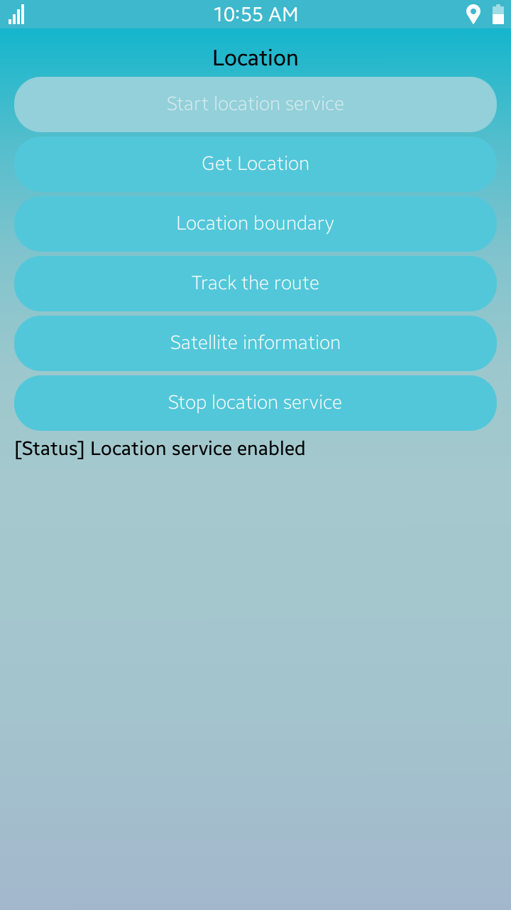
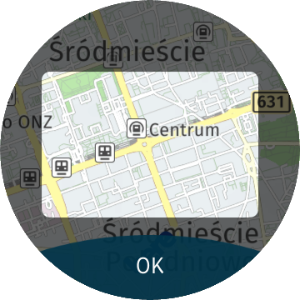
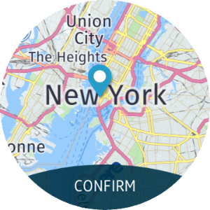
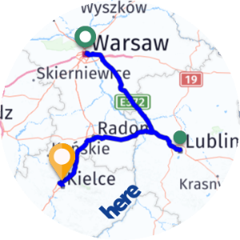

# Location

<!--
For MD:
-->

<link href="../css/dotnet-samples.css" ref="stylesheet">

<!--
for TD:

<style type="text/css">
    Please copy dotnet-samples.css and paste it here
</script>
-->

<button class="tablinks" onclick="openProfile(event, 'Mobile')" id="defaultOpen">Mobile</button> <button class="tablinks" onclick="openProfile(event, 'Wearable')">Wearable</button> <button class="tablinks" onclick="openProfile(event, 'TV')">TV</button>

<!-- Tab content -->

<table>
	<tbody>
		<tr>
			<td></td>
			<td>
			
<a href="https://github.com/Samsung/Tizen-CSharp-Samples/tree/master/Mobile/Xamarin.Forms/Geofence" target="_blank"><strong>(M) Geofence</strong></a>

			
This sample application demonstrates how to use the geofence using <a href="/application/dotnet/api/TizenFX/latest/api/Tizen.Location.Geofence.html" target="_blank">Tizen.Location.Geofence</a>.

			</td>
		</tr>
		<tr>
			<td></td>
			<td>
			
<a href="https://github.com/Samsung/Tizen-CSharp-Samples/tree/master/Mobile/Xamarin.Forms/Location" target="_blank"><strong>(M) Location</strong></a>

			
This sample application demonstrates how to use the location service.

			</td>
		</tr>
		<tr>
			<td></td>
			<td>
			
<a href="https://github.com/Samsung/Tizen-CSharp-Samples/tree/master/Mobile/Xamarin.Forms/Maps" target="_blank"><strong>(M) Maps</strong></a>

			
This sample application demonstrates how to use the maps.

			</td>
		</tr>
		<tr>
			<td></td>
			<td>
                        
<a href="https://github.com/Samsung/Tizen-CSharp-Samples/tree/master/Mobile/Xamarin.Forms/MapsView" target="_blank"><strong>(M) MapsView</strong></a>

			
This sample application demonstrates how to display and control the map components.

			</td>
		</tr>
	</tbody>
</table>

<table>
	<tbody>
		<tr>
			<td>
			

			</td>
			<td>
                        
<a href="https://github.com/Samsung/Tizen-CSharp-Samples/tree/master/Wearable/Xamarin.Forms/FindPlace" target="_blank"><strong>(W) FindPlace</strong></a>

			
This sample application demonstrates how to search for places within a specified area using <a href="/application/dotnet/api/TizenFX/latest/api/Tizen.Maps.html" target="_blank">Tizen.Maps</a> and how to create a circular UI using <a href="https://samsung.github.io/Tizen.CircularUI/api/index.html" target="_blank">Tizen.Wearable.CircularUI</a>.

			</td>
		</tr>
		<tr>
			<td>
			

			</td>
			<td>
                        
<a href="https://github.com/Samsung/Tizen-CSharp-Samples/tree/master/Wearable/Xamarin.Forms/Geocoding" target="_blank"><strong>(W) Geocoding</strong></a>

			
This sample application demonstrates how to translate an address to its geographical location using <a href="/application/dotnet/api/TizenFX/latest/api/Tizen.Maps.html" target="_blank">Tizen.Maps</a>.

			</td>
		</tr>
		<tr>
			<td>
			

			</td>
			<td>
			
<a href="https://github.com/Samsung/Tizen-CSharp-Samples/tree/master/Wearable/Xamarin.Forms/Location" target="_blank"><strong>(W) Location</strong></a>

			
This sample application demonstrates how to use the location service.

			</td>
		</tr>
		<tr>
			<td>
			

			</td>
			<td>
			
<a href="https://github.com/Samsung/Tizen-CSharp-Samples/tree/master/Wearable/Xamarin.Forms/Maps" target="_blank"><strong>(W) Maps</strong></a>

			
This sample application demonstrates how to use the maps.

			</td>
		</tr>
		<tr>
			<td>
                        
                        </td>
			<td>
                        
<a href="https://github.com/Samsung/Tizen-CSharp-Samples/tree/master/Wearable/Xamarin.Forms/MapsView" target="_blank"><strong>(W) MapsView</strong></a>

			
This sample application demonstrates how to display and control the map components and how to create circular UI using <a href="https://samsung.github.io/Tizen.CircularUI/api/index.html" target="_blank">Tizen.Wearable.CircularUI</a>.

			</td>
		</tr>
		<tr>
			<td>
			

			</td>
			<td>
                       
<a href="https://github.com/Samsung/Tizen-CSharp-Samples/tree/master/Wearable/Xamarin.Forms/ReverseGeocoding" target="_blank"><strong>(W) ReverseGeocoding</strong></a>

			
This sample application demonstrates how to get the address of a selected geographical location using <a href="/application/dotnet/api/TizenFX/latest/api/Tizen.Maps.html" target="_blank">Tizen.Maps</a>.

			</td>
		</tr>
		<tr>
			<td>
			

			</td>
			<td>
                       
<strong>(W) Routing</strong> [In progress]

			
This sample application demonstrates how to use <a href="/application/dotnet/api/TizenFX/latest/api/Tizen.Maps.html" target="_blank">Tizen.Maps</a>.

			</td>
		</tr>
	</tbody>
</table>

<table>
	<tbody>
		<tr>
			<td>
			

			</td>
			<td>
			
<strong>(T) Maps</strong> [In progress]

			
This sample application demonstrates how to use the maps.

			</td>
		</tr>
		<tr>
			<td>
			

			</td>
			<td>
			
<a href="https://github.com/Samsung/Tizen-CSharp-Samples/tree/master/TV/Xamarin.Forms/MapView" target="_blank"><strong>(T) MapsView</strong></a>

			
This sample application demonstrates how to display and control the map components.

			</td>
		</tr>
	</tbody>
</table>

<!--
For MD:
-->

<!--
for TD:

-->
