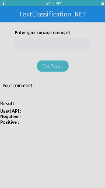

# Machine Learning

<!--
For MD:
-->

<link href="../css/dotnet-samples.css" ref="stylesheet">

<!--
for TD:

<style type="text/css">
    Please copy dotnet-samples.css and paste it here
</script>
-->

<button class="tablinks" onclick="openProfile(event, 'Mobile')" id="defaultOpen">Mobile</button> <button class="tablinks" onclick="openProfile(event, 'Wearable')">Wearable</button> <button class="tablinks" onclick="openProfile(event, 'TV')">TV</button>

<!-- Tab content -->

<table>
	<tbody>
		<tr>
			<td></td>
			<td>
			
<a href="https://github.com/Samsung/Tizen-CSharp-Samples/tree/master/Mobile/Xamarin.Forms/MachineLearning/TextClassification" target="_blank"><strong>(M) TextClassification</strong></a>

			
This sample application demonstrates how to use the NNStreamer single-shot API using <a href="/application/dotnet/api/TizenFX/latest/api/Tizen.MachineLearning.Inference.SingleShot.html" target="_blank">Tizen.MachineLearning.Inference.SingleShot</a>.

			
Based on the given sentences, the text is classified into predefined groups. These predefined groups serve as an input to the pre-trained models to predict whether a paragraph is positive or negative.

			</td>
		</tr>
	</tbody>
</table>

<table>
	<tbody>
		<tr>
			<td></td>
			<td>
			
<a href="https://github.com/Samsung/Tizen-CSharp-Samples/tree/master/Wearable/Xamarin.Forms/MachineLearning/OrientationDetection" target="_blank"><strong>(W) OrientationDetection</strong></a>

			
This sample application demonstrates how to use machine learning and sensor data using <a href="/application/dotnet/api/TizenFX/latest/api/Tizen.MachineLearning.Inference.Pipeline.html" target="_blank">Tizen.MachineLearning.Inference.Pipeline</a>.

			
It passes accelerometer sensor data stream to a neural network (tensorflow-lite model) and predicts one of four orientations of the device:  
			<ul start="1">
				<li>12 o'clock is upward.</li>
				<li>3 o'clock is upward.</li>
				<li>6 o'clock is upward.</li>
				<li>9 o'clock is upward.</li>
			</ul>

			</td>
		</tr>
	</tbody>
</table>

<table>
	<tbody>
		<tr>
			<td>There is no sample.</td>
		</tr>
	</tbody>
</table>

<!--
For MD:
-->

<!--
for TD:

-->
