# Multimedia

<!--
For MD:
-->

<link href="../css/dotnet-samples.css" ref="stylesheet">

<!--
for TD:

<style type="text/css">
    Please copy dotnet-samples.css and paste it here
</script>
-->

<button class="tablinks" onclick="openProfile(event, 'Mobile')" id="defaultOpen">Mobile</button> <button class="tablinks" onclick="openProfile(event, 'Wearable')">Wearable</button> <button class="tablinks" onclick="openProfile(event, 'TV')">TV</button>

<!-- Tab content -->

<table>
	<tbody>
		<tr>
			<td></td>
			<td>
                        
<a href="https://github.com/Samsung/Tizen-CSharp-Samples/tree/master/Mobile/Xamarin.Forms/AudioIOSample" target="_blank"><strong>(M) AudioIOSample</strong></a>

			
This sample application demonstrates how to capture an audio and play it using <a href="/application/dotnet/api/TizenFX/latest/api/Tizen.Multimedia.html"  target="_blank">Tizen.Multimedia</a>.

			</td>
		</tr>
		<tr>
			<td>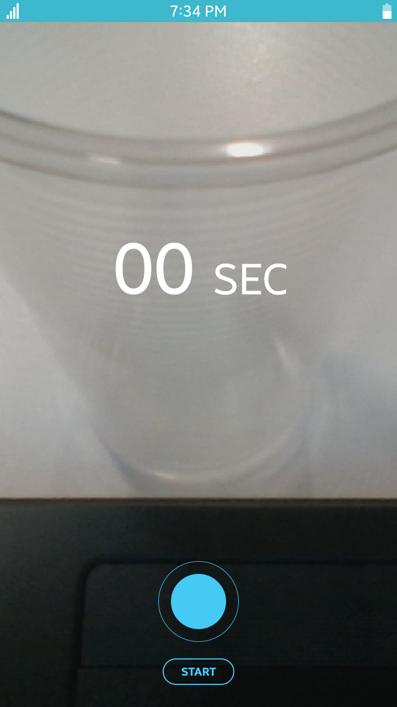</td>
			<td>
                        
<a href="https://github.com/Samsung/Tizen-CSharp-Samples/tree/master/Mobile/Xamarin.Forms/Camera" target="_blank"><strong>(M) Camera</strong></a>

			
This sample application demonstrates how to take a picture using <a href="/application/dotnet/api/TizenFX/latest/api/Tizen.Multimedia.html" target="_blank">Tizen.Multimedia</a>.

			</td>
		</tr>
		<tr>
			<td></td>
			<td>
			
<strong>(M) ImageUtilSample</strong> [In progress]

			
This sample application demonstrates how to transform an image using <a href="/application/dotnet/api/TizenFX/latest/api/Tizen.Multimedia.html"  target="_blank">Tizen.Multimedia</a>.

			</td>
		</tr>
		<tr>
			<td>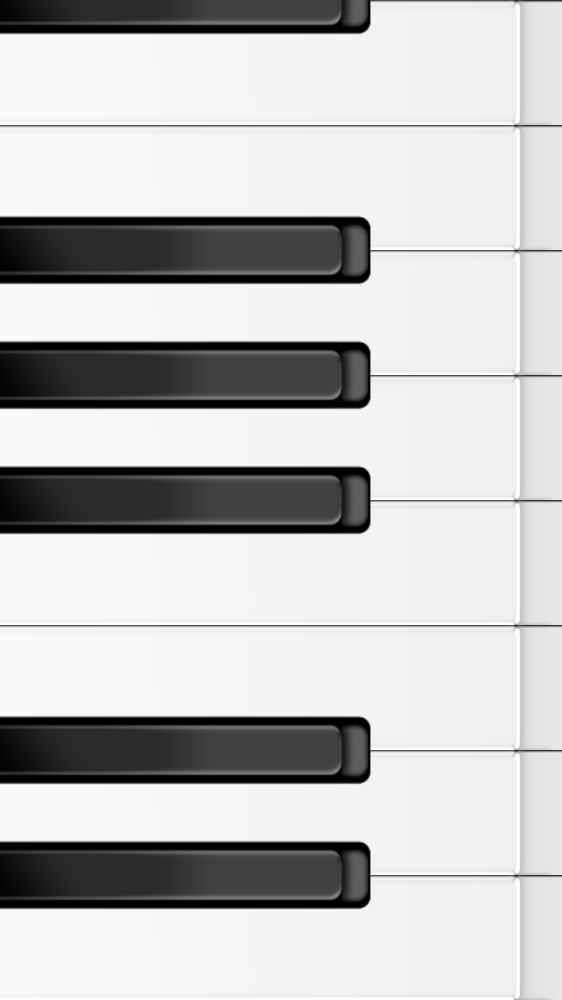</td>
			<td>
			
<a href="https://github.com/Samsung/Tizen-CSharp-Samples/tree/master/Mobile/Xamarin.Forms/Piano" target="_blank"><strong>(M) Piano</strong></a>

			
This sample application demonstrates how to play sounds using <a href="/application/dotnet/api/TizenFX/latest/api/Tizen.Multimedia.html" target="_blank">Tizen.Multimedia</a>.

			</td>
		</tr>
		<tr>
			<td>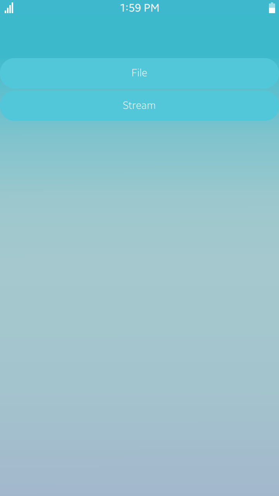</td>
			<td>
                        
<a href="https://github.com/Samsung/Tizen-CSharp-Samples/tree/master/Mobile/Xamarin.Forms/PlayerSample" target="_blank"><strong>(M) PlayerSample</strong></a>

			
This sample application demonstrates how to play an audio or a video and stream it using <a href="/application/dotnet/api/TizenFX/latest/api/Tizen.Multimedia.html"  target="_blank">Tizen.Multimedia</a>.

			</td>
		</tr>
		<tr>
			<td>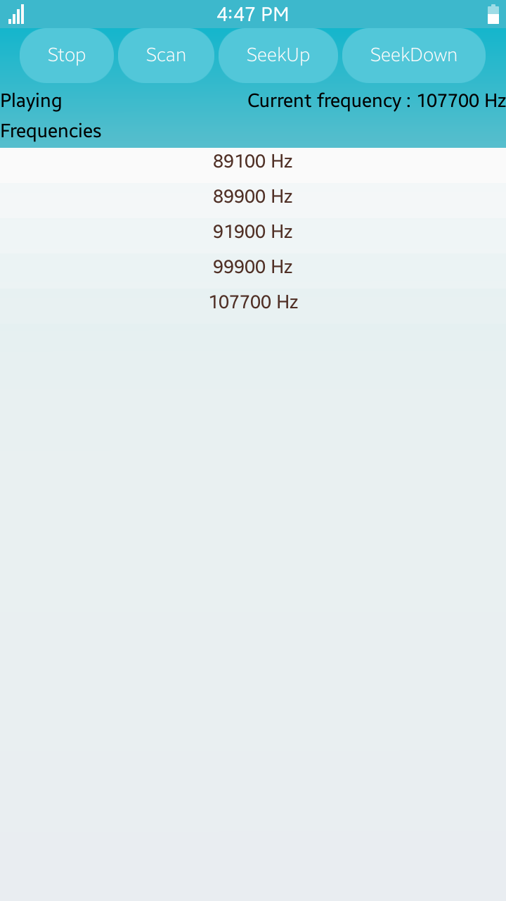</td>
			<td>
                        
<a href="https://github.com/Samsung/Tizen-CSharp-Samples/tree/master/Mobile/Xamarin.Forms/RadioSample" target="_blank"><strong>(M) RadioSample</strong></a>

			
This sample application demonstrates how to play the radio using <a href="/application/dotnet/api/TizenFX/latest/api/Tizen.Multimedia.html"  target="_blank">Tizen.Multimedia</a>.

			</td>
		</tr>
		<tr>
			<td></td>
			<td>
			
<strong>(M) RecorderSample</strong> [In progress]

			
This sample application demonstrates how to record audio and video.

			</td>
		</tr>
		<tr>
			<td></td>
			<td>
			
<strong>(M) ScreenMirroringSample</strong> [In progress]

			
This sample application demonstrates how to use 'SINK' function of Tizen mobile.

			</td>
		</tr>
		<tr>
			<td>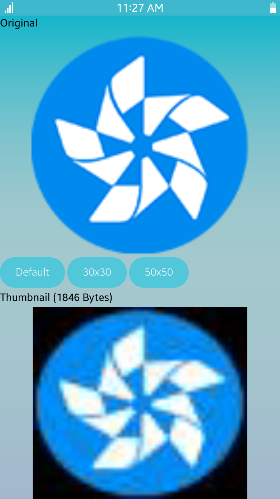</td>
			<td>
                        
<a href="https://github.com/Samsung/Tizen-CSharp-Samples/tree/master/Mobile/Xamarin.Forms/ThumbnailExtractorSample" target="_blank"><strong>(M) ThumbnailExtractorSample</strong></a>

			
This sample application demonstrates how to extract thumbnails from an image using <a href="/application/dotnet/api/TizenFX/latest/api/Tizen.Multimedia.html"  target="_blank">Tizen.Multimedia</a>.

			</td>
		</tr>
		<tr>
			<td></td>
			<td>
                        
<a href="https://github.com/Samsung/Tizen-CSharp-Samples/tree/master/Mobile/Xamarin.Forms/VisionApplicationSamples" target="_blank"><strong>(M) VisionApplicationSample</strong></a>

			
This sample application demonstrates how to implement barcode generation or detection, face detection, and image recognition.

			</td>
		</tr>
		<tr>
			<td></td>
			<td>
                        
<a href="https://github.com/Samsung/Tizen-CSharp-Samples/tree/master/Mobile/Xamarin.Forms/VoiceRecorder" target="_blank"><strong>(M) VoiceRecorder</strong></a>

			
This sample application demonstrates how to record an audio using <a href="/application/dotnet/api/TizenFX/latest/api/Tizen.Multimedia.html" target="_blank">Tizen.Multimedia</a>.

			</td>
		</tr>
		<tr>
			<td>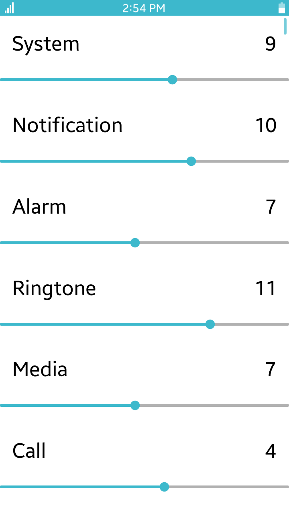</td>
			<td>
			
<a href="https://github.com/Samsung/Tizen-CSharp-Samples/tree/master/Mobile/Xamarin.Forms/UI/VolumeController" target="_blank"><strong>(M) Volume</strong></a>

			
This sample application demonstrates how to retrieve and set the device volume levels.

			</td>
		</tr>
	</tbody>
</table>

<table>
	<tbody>
                <tr>
                        <td>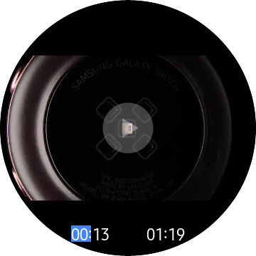</td>
                        <td>
                        
<a href="https://github.com/Samsung/Tizen-CSharp-Samples/tree/master/Wearable/Xamarin.Forms/CircularUIMediaPlayer" target="_blank"><strong>(W) CircularUIMediaPlayer</strong></a>

                        
This sample application demonstrates how to build a video player for Tizen Wearables. For more information, see <a href="https://samsung.github.io/Tizen.NET/wearables/CircularUI-MediaPlayer" target="_blank">Tizen .NET Portal</a>.

                        </td>
                </tr>
		<tr>
			<td></td>
			<td>
                        
<a href="https://github.com/Samsung/Tizen-CSharp-Samples/tree/master/Wearable/Xamarin.Forms/ImageViewer" target="_blank"><strong>(W) ImageViewer</strong></a>

			
This sample application demonstrates how to make a circle thumbnail view and how to retrieve an image content on a Tizen wearable device.

			</td>
		</tr>
                <tr>
                        <td>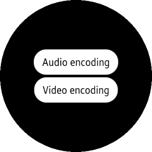</td>
                        <td>
                        
<strong>(W) MediaCodecSample</strong> [In progress]

                        
This sample application demonstrates how to encode audio and video data using <a href="/application/dotnet/api/TizenFX/latest/api/Tizen.Multimedia.MediaCodec.html" target="_blank">Tizen.Multimedia.MediaCodec</a>.

                        </td>
                </tr>
                <tr>
                        <td>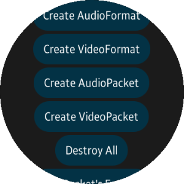</td>
                        <td>
                        
<strong>(W) MediaToolSample</strong> [In progress]

                        
This sample application demonstrates how to create <code>MediaFormat</code> and <code>MediaPacket</code> using <a href="/application/dotnet/api/TizenFX/latest/api/Tizen.Multimedia.html" target="_blank">Tizen.Multimedia</a>.

                        </td>
                </tr>
                <tr>
                        <td>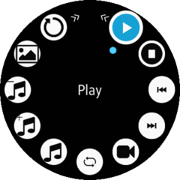</td>
                        <td>
                        
<strong>(W) PlayerSample</strong> [In progress]

                        
This sample application demonstrates how to create a music player using <a href="/application/dotnet/api/TizenFX/latest/api/Tizen.Multimedia.Player.html" target="_blank">Tizen.Multimedia.Player</a>.

                        </td>
                </tr>
                <tr>
                        <td></td>
                        <td>
                        
<a href="https://github.com/Samsung/Tizen-CSharp-Samples/tree/master/Wearable/Xamarin.Forms/QRCodeGenerator" target="_blank"><strong>(W) QRCodeGenerator</strong></a>

                        
This sample application demonstrates how to use <a href="https://samsung.github.io/Tizen.CircularUI/api/index.html" target="_blank">Tizen.Wearable.CircularUI</a> and <a href="/application/dotnet/api/TizenFX/latest/api/Tizen.Multimedia.Vision.html" target="_blank">Tizen.Multimedia.Vision</a>.

                        
This application also demonstrates how to generate Wi-Fi type QR code. After scanning the code with any widely available QR code scanner, the <strong>Connect to a Wi-Fi</strong> option appears.

                        </td>
                </tr>
                <tr>
                        <td>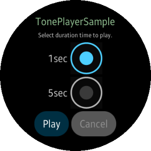</td>
                        <td>
                        
<a href="https://github.com/Samsung/Tizen-CSharp-Samples/tree/master/Wearable/Xamarin.Forms/TonePlayerSample" target="_blank"><strong>(W) TonePlayerSample</strong></a>

                        
This sample application demonstrates how to play audio using <a href="/application/dotnet/api/TizenFX/latest/api/Tizen.Multimedia.TonePlayer.html" target="_blank">Tizen.Multimedia.TonePlayer</a>.

                        </td>
                </tr>
		<tr>
			<td>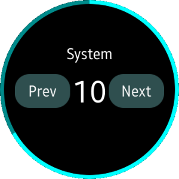</td>
			<td>
                        
<a href="https://github.com/Samsung/Tizen-CSharp-Samples/tree/master/Wearable/Xamarin.Forms/VolumeController" target="_blank"><strong>(W) VolumeController</strong></a>

			
This sample application demonstrates how to retrieve and set the device volume levels. It also demonstrates how to create circular UI using <a href="https://samsung.github.io/Tizen.CircularUI/api/index.html" target="_blank">Tizen.Wearable.CircularUI</a>.

			</td>
		</tr>
                <tr>
                        <td></td>
                        <td>
                        
<a href="https://github.com/Samsung/Tizen-CSharp-Samples/tree/master/Wearable/Xamarin.Forms/WavPlayerSample" target="_blank"><strong>(W) WavPlayerSample</strong></a>

                        
This sample application demonstrates how to play audio using <a href="/application/dotnet/api/TizenFX/latest/api/Tizen.Multimedia.WavPlayer.html" target="_blank">Tizen.Multimedia.WavPlayer</a>.

                        </td>
                </tr>
	</tbody>
</table>

<table>
	<tbody>
		<tr>
			<td>
			
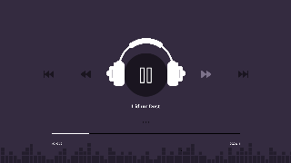

			</td>
			<td>
			
<strong>(T) MediaControlClient</strong> [In progress]

			
This sample application demonstrates how to control MediaControlServer using <a href="/application/dotnet/api/TizenFX/latest/api/Tizen.Multimedia.Remoting.html" target="_blank">Tizen.Multimedia.Remoting</a>.

			
This application is dedicated to control MediaControlServer service application.

			</td>
		</tr>
		<tr>
			<td>
			
Service application - no UI

			</td>
			<td>
			
<strong>(T) MediaControlServer</strong> [In progress]

			
This sample application demonstrates how to set up a music player. It also shows how to control the music player using <a href="/application/dotnet/api/TizenFX/latest/api/Tizen.Multimedia.Remoting.html" target="_blank">Tizen.Multimedia.Remoting</a> to play the stored music files.

			
MediaControlClient UI application is required to control this application.

			</td>
		</tr>
		<tr>
			<td>
			

			</td>
			<td>
                        
<a href="https://github.com/Samsung/Tizen-CSharp-Samples/tree/master/TV/Xamarin.Forms/MusicPlayer" target="_blank"><strong>(T) MusicPlayer</strong></a>

			
This sample application demonstrates how to create a music player application that plays music stored on a device.

			</td>
		</tr>
	</tbody>
</table>

<!--
For MD:
-->

<!--
for TD:

-->
