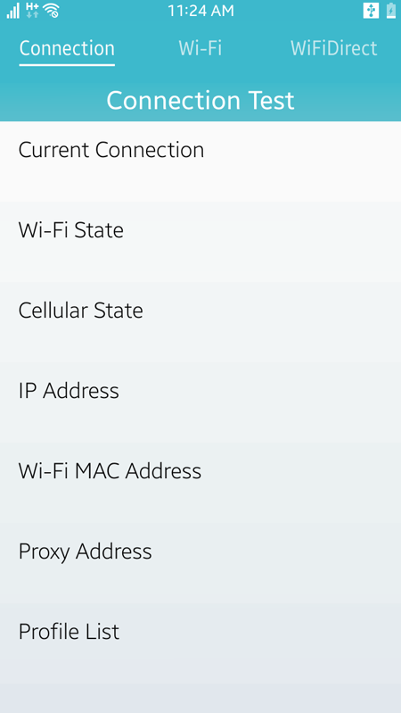
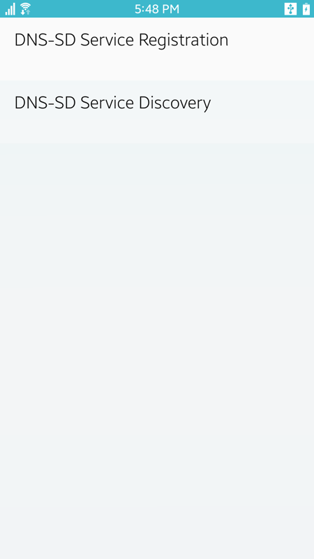
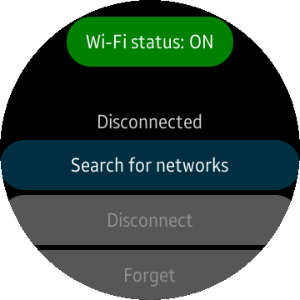
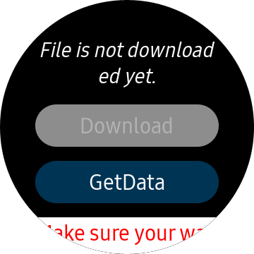

# Network

<!--
For MD:
-->

<link href="../css/dotnet-samples.css" ref="stylesheet">

<!--
for TD:

<style type="text/css">
    Please copy dotnet-samples.css and paste it here
</script>
-->

<button class="tablinks" onclick="openProfile(event, 'Mobile')" id="defaultOpen">Mobile</button> <button class="tablinks" onclick="openProfile(event, 'Wearable')">Wearable</button> <button class="tablinks" onclick="openProfile(event, 'TV')">TV</button>

<!-- Tab content -->

<table>
	<tbody>
		<tr>
			<td></td>
			<td>
                        
<a href="https://github.com/Samsung/Tizen-CSharp-Samples/tree/master/Mobile/Xamarin.Forms/Lescanner" target="_blank"><strong>(M) Lescanner</strong></a>

			
This sample application demonstrates how to scan the Bluetooth Low Energy (BLE) devices.

			</td>
		</tr>
		<tr>
			<td></td>
			<td>
			
<a href="https://github.com/Samsung/Tizen-CSharp-Samples/tree/master/Mobile/Xamarin.Forms/NetworkApp" target="_blank"><strong>(M) NetworkApp</strong></a>

			
This sample application demonstrates how to use <a href="/application/dotnet/api/TizenFX/latest/api/Tizen.Network.Connection.html" target="_blank">Tizen.Network.Connection</a>, Wi-Fi, and Wi-Fi Direct. 
			This application provides network information such as IP address, network state, and list of available networks. Using this information, you can connect to Wi-Fi.

			</td>
		</tr>
		<tr>
			<td></td>
			<td>
			
<a href="https://github.com/Samsung/Tizen-CSharp-Samples/tree/master/Mobile/Xamarin.Forms/NFCSampleApp" target="_blank"><strong>(M) NFC</strong></a>

			
This sample application demonstrates how to work with Near Field Communication (NFC) (<a href="/application/dotnet/api/TizenFX/latest/api/Tizen.Network.Nfc.html" target="_blank">Tizen.Network.Nfc</a>) to send information to the NFC peer-to-peer (P2P) device. It also demonstrates how to read and write the nfc tags.

			</td>
		</tr>
		<tr>
			<td></td>
			<td>
                        
<a href="https://github.com/Samsung/Tizen-CSharp-Samples/tree/master/Mobile/Xamarin.Forms/ServiceDiscovery" target="_blank"><strong>(M) ServiceDiscovery</strong></a>

			
This sample application demonstrates how to register and discover a Domain Name System - Service Discovery (DNS-SD) service within the local network.

			</td>
		</tr>
		<tr>
			<td></td>
			<td>
                        
<a href="https://github.com/Samsung/Tizen-CSharp-Samples/tree/master/Mobile/Xamarin.Forms/SmartCardSampleApp" target="_blank"><strong>(M) Smartcard</strong></a>

			
This sample application demonstrates how to send command to Secure Element (SE) using <a href="/application/dotnet/api/TizenFX/latest/api/Tizen.Network.Smartcard.html" target="_blank">Tizen.Network.Smartcard</a>.

			</td>
		</tr>
	</tbody>
</table>

<table>
	<tbody>
		<tr>
			<td></td>
			<td>
                        
<a href="https://github.com/Samsung/Tizen-CSharp-Samples/tree/master/Wearable/Xamarin.Forms/Lescanner" target="_blank"><strong>(W) Lescanner</strong></a>

			
This sample application demonstrates how to use <a href="/application/dotnet/api/TizenFX/latest/api/Tizen.Network.Bluetooth.html" target="_blank">Tizen.Network.Bluetooth</a> to connect with the Bluetooth Low Energy devices. It also demonstrates how to create circular UI using <a href="https://samsung.github.io/Tizen.CircularUI/api/index.html" target="_blank">Tizen.Wearable.CircularUI</a>.

			</td>
		</tr>
		<tr>
			<td></td>
			<td>
                        
<a href="https://github.com/Samsung/Tizen-CSharp-Samples/tree/master/Wearable/Xamarin.Forms/NetworkApp" target="_blank"><strong>(W) NetworkApp</strong></a>

			
This sample application demonstrates how to verify information about your connection and manage your Wi-Fi settings. It also demonstrates how to create circular UI using <a href="https://samsung.github.io/Tizen.CircularUI/api/index.html" target="_blank">Tizen.Wearable.CircularUI</a>.

			</td>
		</tr>
		<tr>
			<td></td>
			<td>
                        
<a href="https://github.com/Samsung/Tizen-CSharp-Samples/tree/master/Wearable/Xamarin.Forms/NFCSampleApp" target="_blank"><strong>(W) NFCSampleApp</strong></a>

			
This sample application demonstrates how to send and receive a NFC Data Exchange Format (NDEF) message from a remote NFC device and read the NDEF message from the NFC tag. It also demonstrates how to create circular UI using <a href="https://samsung.github.io/Tizen.CircularUI/api/index.html" target="_blank">Tizen.Wearable.CircularUI</a>.

			</td>
		</tr>
		<tr>
			<td></td>
			<td>
                        
<a href="https://github.com/Samsung/Tizen-CSharp-Samples/tree/master/Wearable/Xamarin.Forms/WebProxySample" target="_blank"><strong>(W) WebProxySample</strong></a>

                        
This sample application demonstrates how to use WebProxy to access the internet when Samsung Galaxy Watch is connected to a mobile phone through Bluetooth. For more information, see <a href="https://samsung.github.io/Tizen.NET/wearables/web-proxy/" target="_blank">content on Tizen .NET portal</a>.
                           
			</td>
		</tr>
	</tbody>
</table>

<table>
	<tbody>
		<tr>
			<td>There is no sample.</td>
		</tr>
	</tbody>
</table>

<!--
For MD:
-->

<!--
for TD:

-->
