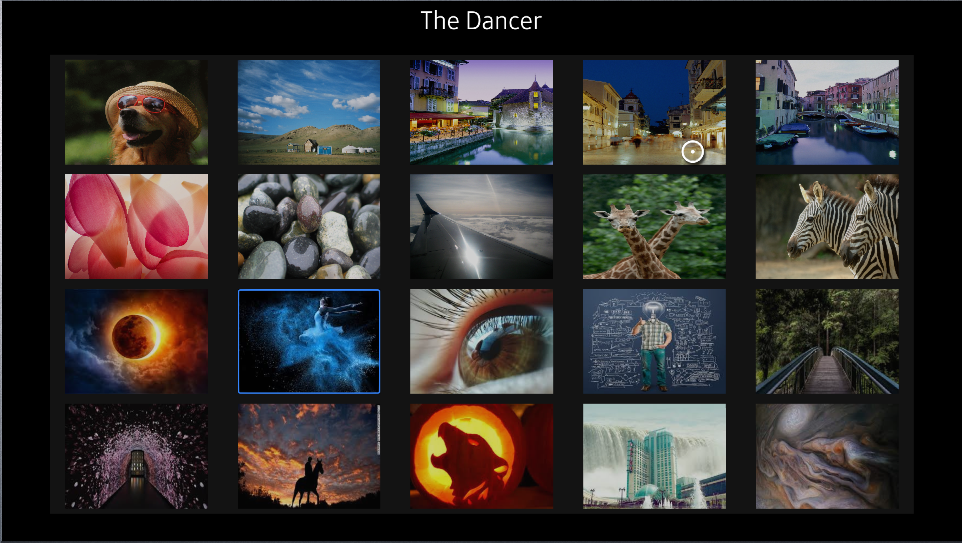
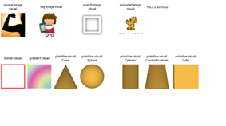
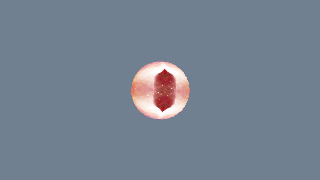
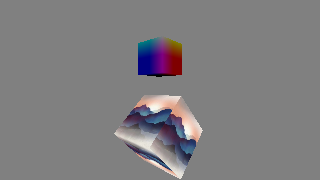
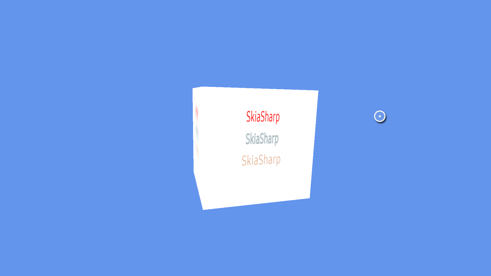
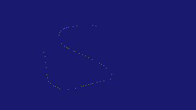
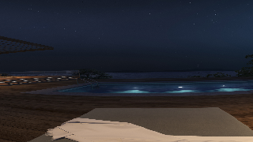
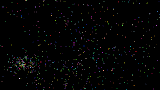
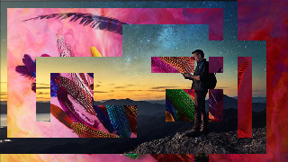

# UI

<!--
For MD:
-->

<link href="../css/dotnet-samples.css" ref="stylesheet">

<!--
for TD:

<style type="text/css">
    Please copy dotnet-samples.css and paste it here
</script>
-->

<button class="tablinks" onclick="openProfile(event, 'TV')" id="defaultOpen">TV</button>

<!-- Tab content -->

<table>
	<tbody>
		<tr>
			<td>
			

			</td>
			<td>
			
<a href="https://github.com/Samsung/Tizen-CSharp-Samples/tree/master/TV/NUI/MovieLibrary" target="_blank"><strong>(T) MovieLibrary</strong></a>

			
This sample application demonstrates how to show collection of available movies and display the title of a focused movie using <a href="/application/dotnet/api/TizenFX/latest/api/Tizen.NUI.BaseComponents.TableView.html" target="_blank">TableView</a>.

			</td>
		</tr>
		<tr>
			<td>
			

			</td>
			<td>
			
<a href="https://github.com/Samsung/Tizen-CSharp-Samples/tree/master/TV/NUI/VisualSample" target="_blank"><strong>(T) Visual Sample</strong></a>

			
This sample application demonstrates how to use various kinds of visuals.

			</td>
		</tr>
		<tr>
			<td>
			

			</td>
			<td>
			
<a href="https://github.com/Samsung/Tizen-CSharp-Samples/tree/master/TV/OpenTK/Ball3D" target="_blank"><strong>(T) Ball3D (OpenTK)</strong></a>

			
This sample application demonstrates how to draw a spherical 3D model, add texture to the model, and realize rotation of the model.

			</td>
		</tr>
		<tr>
			<td>
			

			</td>
			<td>
			
<a href="https://github.com/Samsung/Tizen-CSharp-Samples/tree/master/TV/OpenTK/CubeTexture" target="_blank"><strong>(T) CubeTexture (OpenTK)</strong></a>

			
This sample application demonstrates how to draw a 3D model (cube), realize rotation of the model, and add texture to the model.

                        
It also demonstrates how the application implements two cubes independently drawn using two programs.

			</td>
		</tr>
		<tr>
			<td>
			

			</td>
			<td>
                        
<a href="https://github.com/Samsung/Tizen-CSharp-Samples/tree/master/TV/OpenTK/CubeWithSkiaSharp" target="_blank"><strong>(T) CubeWithSkiaSharp (OpenTK)</strong></a>

			
This sample application demonstrates how to draw a text with SkiaSharp on the target memory, to generates 2D texture on the target memory block, and to shows 2D texture in the OpenTK app (drawing text on a rotating cube).

			</td>
		</tr>
		<tr>
			<td>
			

			</td>
			<td>
                        
<a href="https://github.com/Samsung/Tizen-CSharp-Samples/tree/master/TV/OpenTK/Graffiti" target="_blank"><strong>(T) Graffiti (OpenTK)</strong></a>

			
This sample application demonstrates how to respond to click events or button events and how to draw a dot or line at the corresponding position on the screen.

			</td>
		</tr>
		<tr>
			<td>
			

			</td>
			<td>
			
<a href="https://github.com/Samsung/Tizen-CSharp-Samples/tree/master/TV/OpenTK/Panorama360" target="_blank"><strong>(T) Panorama360 (OpenTK)</strong></a>

			
This sample application demonstrates how to achieve 360-degree panorama effect.

			</td>
		</tr>
		<tr>
			<td>
			

			</td>
			<td>
			
<a href="https://github.com/Samsung/Tizen-CSharp-Samples/tree/master/TV/OpenTK/ParticleDynamic" target="_blank"><strong>(T) ParticleDynamic (OpenTK)</strong></a>

			
This sample application demonstrates how to implement a dynamic particle scenario.

			</td>
		</tr>
		<tr>
			<td>
			

			</td>
			<td>
			
<a href="https://github.com/Samsung/Tizen-CSharp-Samples/tree/master/TV/OpenTK/ScratchPaper" target="_blank"><strong>(T) ScratchPaper (OpenTK)</strong></a>

			
This sample application demonstrates how to respond to click events or button events and how to draw corresponding textures at the corresponding position on the screen.

			</td>
		</tr>
		<tr>
			<td>
			

			</td>
			<td>
			
<a href="https://github.com/Samsung/Tizen-CSharp-Samples/tree/master/TV/OpenTK/Star" target="_blank"><strong>(T) Star (OpenTK)</strong></a>

			
This sample application demonstrates how to implement shaders loading, program creation, linking, vertex data loading, texture data loading, and other preliminary operations of drawing. It also demonstrates how to draw a multilateral graph (five-pointed star) with the DrawElements API.

			</td>
		</tr>
		<tr>
			<td>
			

			</td>
			<td>
			
<a href="https://github.com/Samsung/Tizen-CSharp-Samples/tree/master/TV/OpenTK/Triangle" target="_blank"><strong>(T) Triangle (OpenTK)</strong></a>

			
This sample application demonstrates how to implement shaders loading, program creation, linking, vertex data loading, texture data loading, and other preliminary operations of drawing. It also demonstrates how to implement a basic graph drawing (drawing triangles) with the DrawArrays API.

			</td>
		</tr>
	</tbody>
</table>

<!--
For MD:
-->

<!--
for TD:

-->
