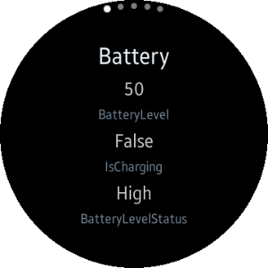

# System

(M) : for mobile profile, (W) : for wearable profile, (T) : for TV profile
<table>
	<tbody>
		<tr>
			<td></td>
			<td>
			
<strong>(W) Compass</strong> [In progress]

			
This sample application demonstrates how to retrieve information about the physical orientation of the device using <a href="https://developer.tizen.org/dev-guide/csapi/api/Tizen.Sensor.OrientationSensor.html"  target="_blank"> Tizen Orientation Sensor API</a>.

			</td>
		</tr>
		<tr>
			<td></td>
			<td>
			
<a href="https://github.com/Samsung/Tizen-CSharp-Samples/tree/master/Mobile/FeedbackApp" target="_blank"><strong>(M) FeedbackApp</strong></a>

			
This sample application demonstrates how to play feedback using <a href="https://developer.tizen.org/dev-guide/csapi/api/Tizen.System.Feedback.html"  target="_blank">Tizen.System.Feedback C# API</a>.

			</td>
		</tr>
		<tr>
			<td></td>
			<td>
			
<strong>(W) FeedbackApp</strong> [In progress]

			
This sample application demonstrates how to play sound and vibration feedback and how to create circular UI using <a href="https://github.com/Samsung/Tizen.CircularUI/" target="_blank">Tizen.Wearable.CircularUI C# API</a>.

			</td>
		</tr>
		<tr>
			<td></td>
			<td>
			
<a href="https://github.com/Samsung/Tizen-CSharp-Samples/tree/master/Mobile/HeartRateMonitor" target="_blank"><strong>(M) HeartRateMonitor</strong></a>

			
This sample application demonstrates how to obtain data provided by the Heart Rate Monitor (HRM) using <a href="https://developer.tizen.org/dev-guide/csapi/api/Tizen.Sensor.html" target="_blank">Tizen.Sensor C# API</a>.

			</td>
		</tr>
		<tr>
			<td></td>
			<td>
			
<strong>(W) HeartRateMonitor</strong> [In progress]

			
This sample application demonstrates how to obtain data provided by the Heart Rate Monitor (HRM) sensor using <a href="https://developer.tizen.org/dev-guide/csapi/api/Tizen.Sensor.html" target="_blank">Tizen.Sensor C# API</a> and how to create circular UI using <a href="https://github.com/Samsung/Tizen.CircularUI/" target="_blank">Tizen.Wearable.CircularUI C# API</a>.

			</td>
		</tr>
		<tr>
			<td></td>
			<td>
			
<strong>(W) MetalDetector</strong> [In progress]

			
This sample application demonstrates how to obtain the magnetometer sensor data using <a href="https://developer.tizen.org/dev-guide/csapi/api/Tizen.Sensor.html" target="_blank">Tizen.Sensor C# API</a>.

			</td>
		</tr>		
		<tr>
			<td></td>
			<td>
			
<strong>(M) Sensor</strong> [In progress]

			
This sample application demonstrates how to manage sensors and receive sensor data from the sensor device.

			</td>
		</tr>
		<tr>
			<td></td>
			<td>
			
<a href="https://github.com/Samsung/Tizen-CSharp-Samples/tree/master/Mobile/UI/System-info" target="_blank"><strong>(M) System-info</strong></a>

			
This sample application demonstrates how to get information about the system properties and capabilities of the device.

			</td>
		</tr>
		<tr>
			<td></td>
			<td>
			
<a href="https://github.com/Samsung/Tizen-CSharp-Samples/tree/master/Mobile/SystemInfo" target="_blank"><strong>(M) SystemInfo</strong></a>

			
This sample application demonstrates how to obtain the data provided by the system using <a href="https://developer.tizen.org/dev-guide/csapi/api/Tizen.System.html" target="_blank">Tizen.System C# API</a>.

			</td>
		</tr>
		<tr>
			<td></td>
			<td>
			
<strong>(W) SystemInfo</strong> [In progress]

			
This sample application demonstrates how to obtain data provided by the system using <a href="https://developer.tizen.org/dev-guide/csapi/api/Tizen.System.html" target="_blank">Tizen.System C# API</a> and how to create circular UI using <a href="https://github.com/Samsung/Tizen.CircularUI/" target="_blank">Tizen.Wearable.CircularUI C# API</a>.

			</td>
		</tr>
		<tr>
			<td></td>
			<td>
			
<strong>(W) SystemInfo</strong> [In progress]

			
This sample application demonstrates how to obtain data provided by the system using <a href="https://developer.tizen.org/dev-guide/csapi/api/Tizen.System.html" target="_blank">Tizen.System C# API</a> and how to create circular UI using <a href="https://github.com/Samsung/Tizen.CircularUI/" target="_blank">Tizen.Wearable.CircularUI C# API</a>.

			</td>
		</tr>
		<tr>
			<td>
			

			</td>
			<td>
			
<a href="https://github.com/Samsung/Tizen-CSharp-Samples/tree/master/TV/SystemInfo" target="_blank"><strong>(T) SystemInfo</strong></a>

			
This sample application demonstrates how to obtain data provided by the system using <a href="https://developer.tizen.org/dev-guide/csapi/api/Tizen.System.html" target="_blank">Tizen.System C# API</a>.

			</td>
		</tr>
	</tbody>
</table>