# System

<!--
For MD:
-->

<link href="../css/dotnet-samples.css" ref="stylesheet">

<!--
for TD:

<style type="text/css">
    Please copy dotnet-samples.css and paste it here
</script>
-->

<button class="tablinks" onclick="openProfile(event, 'Mobile')" id="defaultOpen">Mobile</button> <button class="tablinks" onclick="openProfile(event, 'Wearable')">Wearable</button> <button class="tablinks" onclick="openProfile(event, 'TV')">TV</button>

<!-- Tab content -->

<table>
	<tbody>
		<tr>
			<td></td>
			<td>
			
<a href="https://github.com/Samsung/Tizen-CSharp-Samples/tree/master/Mobile/Xamarin.Forms/FeedbackApp" target="_blank"><strong>(M) FeedbackApp</strong></a>

			
This sample application demonstrates how to play feedback using <a href="/application/dotnet/api/TizenFX/latest/api/Tizen.System.Feedback.html"  target="_blank">Tizen.System.Feedback</a>.

			</td>
		</tr>
		<tr>
			<td></td>
			<td>
			
<a href="https://github.com/Samsung/Tizen-CSharp-Samples/tree/master/Mobile/Xamarin.Forms/HeartRateMonitor" target="_blank"><strong>(M) HeartRateMonitor</strong></a>

			
This sample application demonstrates how to obtain data provided by the Heart Rate Monitor (HRM) using <a href="/application/dotnet/api/TizenFX/latest/api/Tizen.Sensor.html" target="_blank">Tizen.Sensor</a>.

			</td>
		</tr>
		<tr>
			<td></td>
			<td>
			
<strong>(M) Sensor</strong> [In progress]

			
This sample application demonstrates how to manage sensors and receive sensor data from the sensor device.

			</td>
		</tr>
		<tr>
			<td>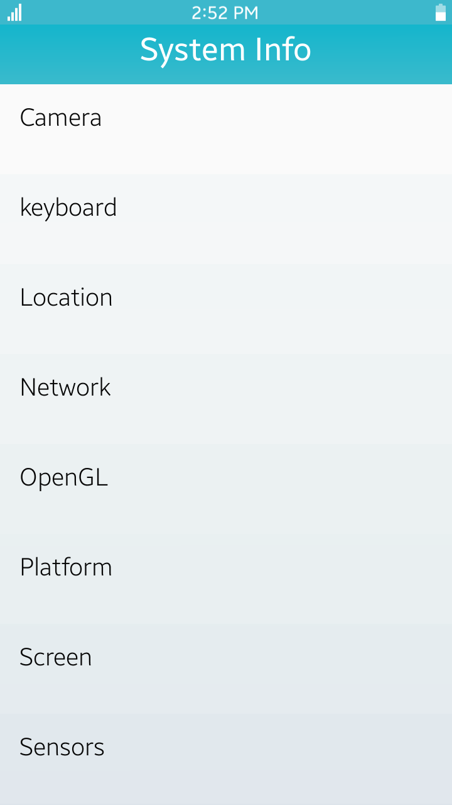</td>
			<td>
			
<a href="https://github.com/Samsung/Tizen-CSharp-Samples/tree/master/Mobile/Xamarin.Forms/UI/System-info" target="_blank"><strong>(M) System-info</strong></a>

			
This sample application demonstrates how to get information about the system properties and capabilities of the device.

			</td>
		</tr>
		<tr>
			<td></td>
			<td>
			
<a href="https://github.com/Samsung/Tizen-CSharp-Samples/tree/master/Mobile/Xamarin.Forms/SystemInfo" target="_blank"><strong>(M) SystemInfo</strong></a>

			
This sample application demonstrates how to obtain the data provided by the system using <a href="/application/dotnet/api/TizenFX/latest/api/Tizen.System.html" target="_blank">Tizen.System</a>.

			</td>
		</tr>
	</tbody>
</table>

<table>
	<tbody>
		<tr>
			<td>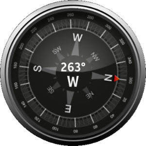</td>
			<td>
                        
<a href="https://github.com/Samsung/Tizen-CSharp-Samples/tree/master/Wearable/Xamarin.Forms/Compass" target="_blank"><strong>(W) Compass</strong></a>

			
This sample application demonstrates how to retrieve information about the physical orientation of the device using <a href="/application/dotnet/api/TizenFX/latest/api/Tizen.Sensor.OrientationSensor.html"  target="_blank">Tizen.Sensor.OrientationSensor</a>.

			</td>
		</tr>
		<tr>
			<td>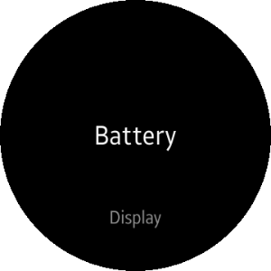</td>
			<td>
			
<a href="https://github.com/Samsung/Tizen-CSharp-Samples/tree/master/Wearable/Xamarin.Forms/DeviceApp" target="_blank"><strong>(W) DeviceApp</strong></a>

			
This sample application shows the list of device features, such as battery, display, haptic, IR, LED, and the camera back flash. It also tests their basic operations.

			</td>
		</tr>
		<tr>
			<td>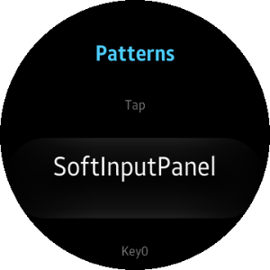</td>
			<td>
			
<a href="https://github.com/Samsung/Tizen-CSharp-Samples/tree/master/Wearable/Xamarin.Forms/FeedbackApp" target="_blank"><strong>(W) FeedbackApp</strong></a>

			
This sample application demonstrates how to play sound and vibration feedback and how to create circular UI using <a href="https://samsung.github.io/Tizen.CircularUI/api/index.html" target="_blank">Tizen.Wearable.CircularUI</a>.

			</td>
		</tr>
		<tr>
			<td>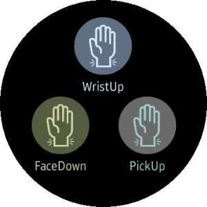</td>
			<td>
			
<a href="https://github.com/Samsung/Tizen-CSharp-Samples/tree/master/Wearable/Xamarin.Forms/GestureSensor" target="_blank"><strong>(W) GestureSensor</strong></a>

			
This sample application demonstrates how to detect gestures such as face down, pick up, and wrist up using <a href="/application/dotnet/api/TizenFX/latest/api/Tizen.Sensor.html" target="_blank">Tizen.Sensor</a>.

			</td>
		</tr>
		<tr>
			<td>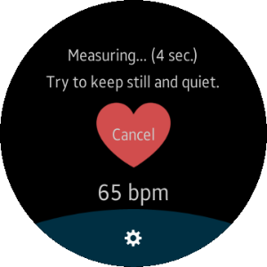</td>
			<td>
			
<a href="https://github.com/Samsung/Tizen-CSharp-Samples/tree/master/Wearable/Xamarin.Forms/HeartRateMonitor" target="_blank"><strong>(W) HeartRateMonitor</strong></a>

			
This sample application demonstrates how to obtain data provided by the Heart Rate Monitor (HRM) sensor using <a href="/application/dotnet/api/TizenFX/latest/api/Tizen.Sensor.html" target="_blank">Tizen.Sensor</a> and how to create circular UI using <a href="https://samsung.github.io/Tizen.CircularUI/api/index.html" target="_blank">Tizen.Wearable.CircularUI</a>.

			</td>
		</tr>
		<tr>
			<td></td>
			<td>
			
<a href="https://github.com/Samsung/Tizen-CSharp-Samples/tree/master/Wearable/Xamarin.Forms/Level" target="_blank"><strong>(W) Level</strong></a>

			
This sample application demonstrates how to obtain the accelerometer sensor data and level objects using <a href="/application/dotnet/api/TizenFX/latest/api/Tizen.Sensor.Accelerometer.html" target="_blank">Tizen.Sensor.Accelerometer</a>.

			</td>
		</tr>
		<tr>
			<td>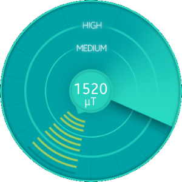</td>
			<td>
                        
<a href="https://github.com/Samsung/Tizen-CSharp-Samples/tree/master/Wearable/Xamarin.Forms/MetalDetector" target="_blank"><strong>(W) MetalDetector</strong></a>

			
This sample application demonstrates how to obtain the magnetometer sensor data using <a href="/application/dotnet/api/TizenFX/latest/api/Tizen.Sensor.html" target="_blank">Tizen.Sensor</a>.

			</td>
		</tr>
		<tr>
			<td>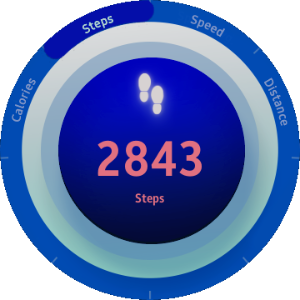</td>
			<td>
			
<a href="https://github.com/Samsung/Tizen-CSharp-Samples/tree/master/Wearable/Xamarin.Forms/Pedometer" target="_blank"><strong>(W) Pedometer</strong></a>

			
This sample application demonstrates how to obtain the pedometer sensor data using <a href="/application/dotnet/api/TizenFX/latest/api/Tizen.Sensor.Pedometer.html" target="_blank">Tizen.Sensor.Pedometer</a>.

			</td>
		</tr>
		<tr>
			<td>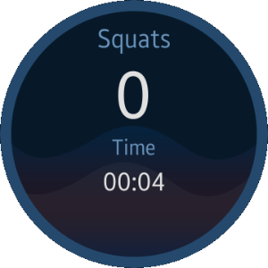</td>
			<td>
			
<a href="https://github.com/Samsung/Tizen-CSharp-Samples/tree/master/Wearable/Xamarin.Forms/SquatCounter" target="_blank"><strong>(W) SquatCounter</strong></a>

			
This sample application demonstrates how to obtain the pressure sensor data using <a href="/application/dotnet/api/TizenFX/latest/api/Tizen.Sensor.PressureSensor.html" target="_blank">Tizen.Sensor.PressureSensor</a>.

			</td>
		</tr>
		<tr>
			<td></td>
			<td>
			
<a href="https://github.com/Samsung/Tizen-CSharp-Samples/tree/master/Wearable/Xamarin.Forms/StorageApp" target="_blank"><strong>(W) StorageApp</strong></a>

			
This sample application shows the device storages and the information such as ID, type, root directory, total space, available space, and state.

			</td>
		</tr>
		<tr>
			<td>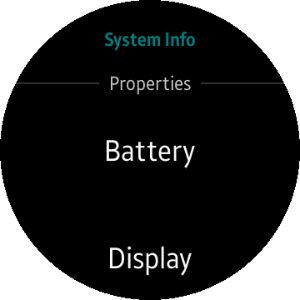</td>
			<td>
                        
<a href="https://github.com/Samsung/Tizen-CSharp-Samples/tree/master/Wearable/Xamarin.Forms/SystemInfo" target="_blank"><strong>(W) SystemInfo</strong></a>

			
This sample application demonstrates how to obtain data provided by the system using <a href="/application/dotnet/api/TizenFX/latest/api/Tizen.System.html" target="_blank">Tizen.System</a> and how to use CirclePage of <a href="https://samsung.github.io/Tizen.CircularUI/api/index.html" target="_blank">Tizen.Wearable.CircularUI</a>.

			</td>
		</tr>
		<tr>
			<td>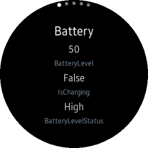</td>
			<td>
                        
<a href="https://github.com/Samsung/Tizen-CSharp-Samples/tree/master/Wearable/Xamarin.Forms/SystemInfo2/SystemInfo2" target="_blank"><strong>(W) SystemInfo2</strong></a>

			
This sample application demonstrates how to obtain data provided by the system using <a href="/application/dotnet/api/TizenFX/latest/api/Tizen.System.html" target="_blank">Tizen.System</a> and how to use the IndexPage of <a href="https://samsung.github.io/Tizen.CircularUI/api/index.html" target="_blank">Tizen.Wearable.CircularUI</a>.

			</td>
		</tr>
		<tr>
			<td>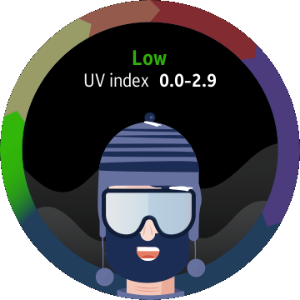</td>
			<td>
                       
<a href="https://github.com/Samsung/Tizen-CSharp-Samples/tree/master/Wearable/Xamarin.Forms/Ultraviolet" target="_blank"><strong>(W) Ultraviolet</strong></a>

			
This sample application demonstrates how to obtain the ultraviolet sensor data using <a href="/application/dotnet/api/TizenFX/latest/api/Tizen.Sensor.html" target="_blank">Tizen.Sensor</a>.

			</td>
		</tr>
		<tr>
			<td>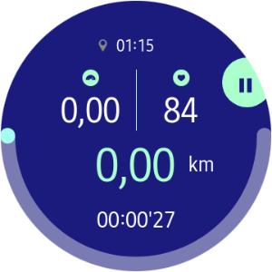</td>
			<td>
			
<a href="https://github.com/Samsung/Tizen-CSharp-Samples/tree/master/Wearable/Xamarin.Forms/Workout" target="_blank"><strong>(W) Workout</strong></a>

			
This sample application demonstrates how to create an application that utilizes the HRM sensor and location to track workout using <a href="/application/dotnet/api/TizenFX/latest/api/Tizen.Sensor.html" target="_blank">Tizen.Sensor</a>.

			</td>
		</tr>
	</tbody>
</table>

<table>
	<tbody>
		<tr>
			<td>
			

			</td>
			<td>
			
<a href="https://github.com/Samsung/Tizen-CSharp-Samples/tree/master/TV/Xamarin.Forms/SystemInfo" target="_blank"><strong>(T) SystemInfo</strong></a>

			
This sample application demonstrates how to obtain data provided by the system using <a href="/application/dotnet/api/TizenFX/latest/api/Tizen.System.html" target="_blank">Tizen.System</a>.

			</td>
		</tr>
	</tbody>
</table>

<!--
For MD:
-->

<!--
for TD:

-->

