# Tizen Samples

## Wearable Application Samples

<table>
	<tbody>
		<tr>
			<td>
			

			</td>
			<td>
			
<a href="https://github.com/Samsung/Tizen-CSharp-Samples/tree/master/Wearable/Maps" target="_blank"><strong>Maps</strong></a>

			
This sample application demonstrates how an user can use the maps.

			</td>
		</tr>
		<tr>
			<td>
			

			</td>
			<td>
			
<a href="https://github.com/Samsung/Tizen-CSharp-Samples/tree/master/Wearable/Location" target="_blank"><strong>Location</strong></a>

			
This sample application demonstrates how an user can use the location service.

			</td>
		</tr>
		<tr>
			<td>
			

			</td>
			<td>
			
<a href="https://github.com/Samsung/Tizen-CSharp-Samples/tree/master/Wearable/SecureRepository" target="_blank"><strong>SecureRepository</strong></a>

			
This sample application demonstrates how to securely store data, certificates, and cryptographic keys using <a href="https://developer.tizen.org/dev-guide/csapi/api/Tizen.Security.SecureRepository.html" target="_blank">Tizen.Security.SecureRepository C# API</a>.

			</td>
		</tr>
		<tr>
			<td>
			
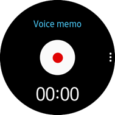

			</td>
			<td>
			
<strong>VoiceMemo</strong> [In progress]

			
This sample application demonstrates how you can create an application using Xamarin.Forms, Tizen.Wearable.CircularUI.Forms, SQLite, and Tizen FX (Tizen.Applications, Tizen.Content.MediaContent, Tizen.Multimedia, Tizen.System, Tizen.Uix.Stt, Tizen.Security, etc).

			
Network Connection(for example, Wi-Fi) is required at runtime.

			
<a href="https://developer.tizen.org/ko/development/sample/native/UI/%28Circle%29_Voice_Memo" target="_blank">Native version</a>

			
<a href="https://developer.tizen.org/ko/development/sample/web/UI/Voice_Memo_UI" target="_blank">Web version</a>

			</td>
		</tr>
	</tbody>
</table>

## TV Application Samples

<table>
	<tbody>
		<tr>
			<td>
			

			</td>
			<td>
			
<a href="https://github.com/Samsung/Tizen-CSharp-Samples/tree/master/TV/MusicPlayerUI" target="_blank"><strong>Music Player UI</strong></a>

			
This sample application demonstrates how to use ListViews and a TabbedPage to create intuitive and complex layouts on a TV.

			</td>
		</tr>
		<tr>
			<td>
			

			</td>
			<td>
			
<a href="https://github.com/Samsung/Tizen-CSharp-Samples/tree/master/TV/Gallery" target="_blank"><strong>Gallery</strong></a>

			
This sample application demonstrates how to create a Grid of Views and how to create a scrollable slideshow on a TV. 
			It also shows how to change the layout depending on the device type.

			</td>
		</tr>
		<tr>
			<td>
			
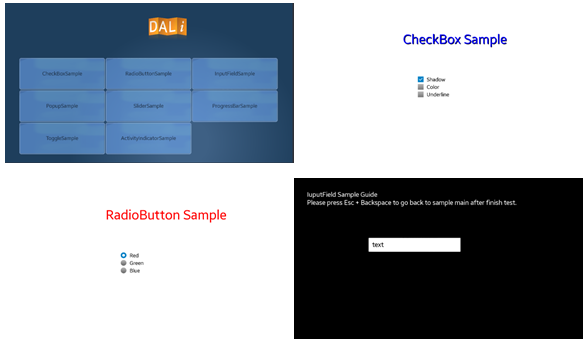

			</td>
			<td>
			
<a href="https://github.com/Samsung/Tizen-CSharp-Samples/tree/master/TV/UIControlSample" target="_blank"><strong>UIControl Sample (NUI)</strong></a>

			
This sample application demonstrates how NUI views work on TV. 
			User can navigate and interact NUI views.

			</td>
		</tr>
		<tr>
			<td>
			

			</td>
			<td>
			
<a href="https://github.com/Samsung/Tizen-CSharp-Samples/tree/master/TV/AnimationSample" target="_blank"><strong>Animaton Sample (NUI)</strong></a>

			
This sample application demonstrates how to use the animation class to create and cancel animations.

			</td>
		</tr>
		<tr>
			<td>
			

			</td>
			<td>
                        
<a href="https://github.com/Samsung/Tizen-CSharp-Samples/tree/master/TV/TextSample" target="_blank"><strong>Text Sample (NUI)</strong></a>

			
This sample application demonstrates how to use each of the text controls and a few common text entry scenarios.

			</td>
		</tr>
		<tr>
			<td>
			

			</td>
			<td>
			
<a href="https://github.com/Samsung/Tizen-CSharp-Samples/tree/master/TV/ImageSample" target="_blank"><strong>Image Sample (NUI)</strong></a>

			
This sample application demonstrates how to use image view and shows some properties of image view.

			</td>
		</tr>
		<tr>
			<td>
			

			</td>
			<td>
			
<a href="https://github.com/Samsung/Tizen-CSharp-Samples/tree/master/TV/FlexContainerSample" target="_blank"><strong>FlexContainer Sample (NUI)</strong></a>

			
This sample application demonstrates how to use FlexContainer and shows results of  applied properties.

			</td>
		</tr>
		<tr>
			<td>
			

			</td>
			<td>
			
<a href="https://github.com/Samsung/Tizen-CSharp-Samples/tree/master/TV/ScriptLayoutSample" target="_blank"><strong>Script Layout Sample (NUI)</strong></a>

			
This sample application demonstrates how to use JSON file to create styles. 
                        Applications often contain multiple controls that have an identical appearance. 
			Setting the appearance of each individual control can be repetitive and error prone. 
			Instead, styles can be created that customize control appearance by grouping and settings properties available on the control type.
			

			</td>
		</tr>
		<tr>
			<td>
			

			</td>
			<td>
                        
<a href="https://github.com/Samsung/Tizen-CSharp-Samples/tree/master/TV/VisualSample" target="_blank"><strong>Visual Sample (NUI)</strong></a>

			
This sample application demonstrates how to use many kinds of visuals.

			</td>
		</tr>
		<tr>
			<td>
			

			</td>
			<td>
			
<strong>Maps</strong> [In progress]

			
This sample application demonstrates how an user can use the maps.

			</td>
		</tr>
		<tr>
			<td>
			

			</td>
			<td>
                        
<a href="https://github.com/Samsung/Tizen-CSharp-Samples/tree/master/TV/SecureRepository" target="_blank"><strong>SecureRepository</strong></a>

			
This sample application demonstrates how to securely store data, certificates, and cryptographic keys using <a href="https://developer.tizen.org/dev-guide/csapi/api/Tizen.Security.SecureRepository.html" target="_blank">Tizen.Security.SecureRepository C# API</a>.

			</td>
		</tr>
		<tr>
			<td>
			

			</td>
			<td>
			
<a href="https://github.com/Samsung/Tizen-CSharp-Samples/tree/master/TV/Stopwatch" target="_blank"><strong>Stopwatch</strong></a>

			
This sample application demonstrates how to create an application that measures the amount of time something takes using Xamarin.Forms.

			</td>
		</tr>
		<tr>
			<td>
			

			</td>
			<td>
			
<a href="https://github.com/Samsung/Tizen-CSharp-Samples/tree/master/TV/TextReader" target="_blank"><strong>TextReader</strong></a>

			
This sample application demonstrates how to synthesize voice from text using <a href="https://developer.tizen.org/dev-guide/csapi/api/Tizen.Uix.Tts.html">Tizen.Uix.Tts C# API</a>.

			</td>
		</tr>
		<tr>
			<td>
			

			</td>
			<td>
			
<a href="https://github.com/Samsung/Tizen-CSharp-Samples/tree/master/TV/MapView" target="_blank"><strong>MapsView</strong></a>

			
This sample application demonstrates how to display and control Map component.

			</td>
		</tr>
		<tr>
			<td>
			

			</td>
			<td>
			
<a href="https://github.com/Samsung/Tizen-CSharp-Samples/tree/master/TV/Preference" target="_blank"><strong>Preference</strong></a>

			
This sample application demonstrates how to store and retrieve an application specific data and preference using <a href="https://developer.tizen.org/dev-guide/csapi/api/Tizen.Applications.Preference.html" target="_blank">Tizen.Applications.Preference C# API</a>.

			</td>
		</tr>
		<tr>
			<td>
			

			</td>
			<td>
                        
<a href="https://github.com/Samsung/Tizen-CSharp-Samples/tree/master/TV/AppInfo" target="_blank"><strong>AppInfo</strong></a>

			
This sample application demonstrates how to obtain information about installed applications using <a href="https://developer.tizen.org/dev-guide/csapi/api/Tizen.Applications.html" target="_blank">Tizen.Applications C# API</a>.

			</td>
		</tr>
		<tr>
			<td>
			

			</td>
			<td>
                        
<a href="https://github.com/Samsung/Tizen-CSharp-Samples/tree/master/TV/BasicCalculator" target="_blank"><strong>BasicCalculator</strong></a>

			
This sample application demonstrates how to create a calculator with basic mathematical operations using Xamarin.Forms library.

			</td>
		</tr>
		<tr>
			<td>
			

			</td>
			<td>
			
<a href="https://github.com/Samsung/Tizen-CSharp-Samples/tree/master/TV/SystemInfo" target="_blank"><strong>SystemInfo</strong></a>

			
This sample application demonstrates how to obtain data provided by the system using <a href="https://developer.tizen.org/dev-guide/csapi/api/Tizen.System.html" target="_blank">Tizen.System C# API</a>.

			</td>
		</tr>
		<tr>
			<td>
			

			</td>
			<td>
			
<strong>File Downloader</strong> [In progress]

			
This sample application demonstrates how to download file using <a href="https://developer.tizen.org/dev-guide/csapi/api/Tizen.Content.MediaContent.html" target="_blank">Tizen.Content.MediaContent C# API</a>.

			</td>
		</tr>
		<tr>
			<td>
			

			</td>
			<td>
                        
<a href="https://github.com/Samsung/Tizen-CSharp-Samples/tree/master/TV/MediaContent" target="_blank"><strong>MediaContent</strong></a>

			
This sample application demonstrates how to obtain and filter media content information from internal and external storages using <a href="https://developer.tizen.org/dev-guide/csapi/api/Tizen.Content.MediaContent.html" target="_blank">Tizen.Content.MediaContent C# API</a>.

			</td>
		</tr>
		<tr>
			<td>
			
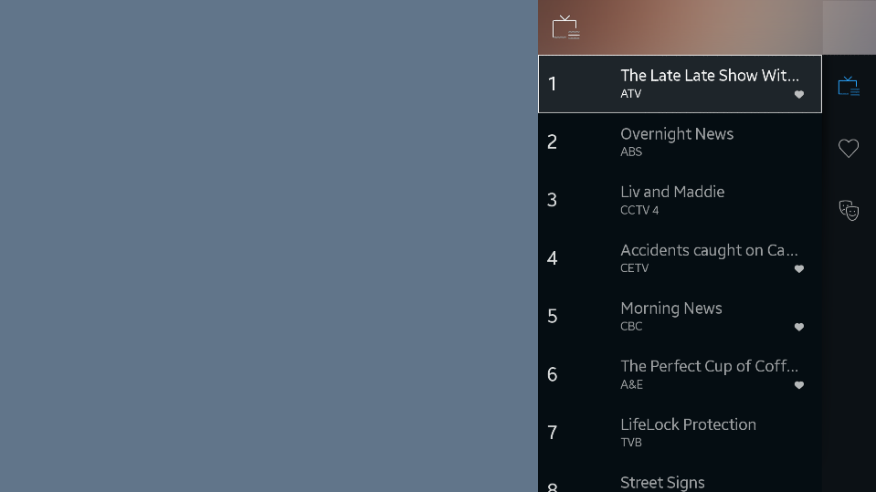

			</td>
			<td>
                        
<a href="https://github.com/Samsung/Tizen-CSharp-Samples/tree/master/TV/ChannelList" target="_blank"><strong>ChannelList (NUI)</strong></a>

			
This sample application demonstrates how to obtain and filter TV channel information.

			</td>
		</tr>
		<tr>
			<td>
			
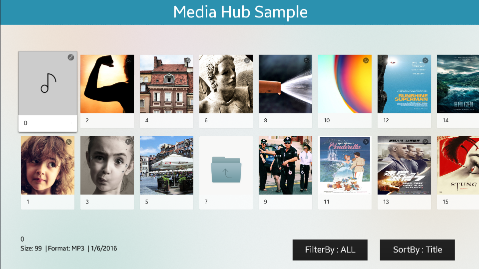

			</td>
			<td>
                        
<a href="https://github.com/Samsung/Tizen-CSharp-Samples/tree/master/TV/MediaHubSample" target="_blank"><strong>MediaHubSample (NUI)</strong></a>

			
This sample application demonstrates how to obtain and filter media content information from internal storages.

			</td>
		</tr>
		<tr>
			<td>
			
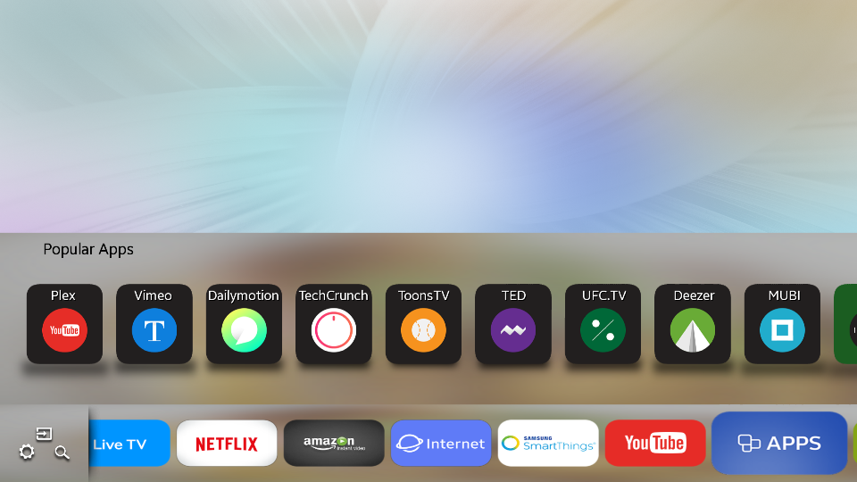

			</td>
			<td>
			
<a href="https://github.com/Samsung/Tizen-CSharp-Samples/tree/master/TV/FirstScreen" target="_blank"><strong>FirstScreen (NUI)</strong></a>

                        
This sample application demonstrates how to launch the apps on the TV.

			</td>
		</tr>
	</tbody>
</table>

## Mobile Application Samples

<table>
	<tbody>
		<tr>
			<td>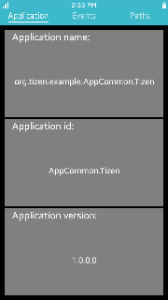</td>
			<td>
			
<a href="https://github.com/Samsung/Tizen-CSharp-Samples/tree/master/Mobile/UI/AppCommon" target="_blank"><strong>App-common</strong></a>

			
This sample application demonstrates how to work with app-common API in order to obtain application-specific information.

			</td>
		</tr>
		<tr>
			<td>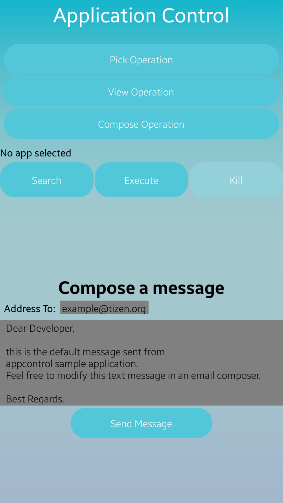</td>
			<td>
			
<a href="https://github.com/Samsung/Tizen-CSharp-Samples/tree/master/Mobile/UI/ApplicationControl" target="_blank"><strong>Application Control</strong></a>

			
This sample application demonstrates how you can call the operation of other applications that provide operations such as pick, view, or compose.

			</td>
		</tr>
		<tr>
			<td></td>
			<td>
			
<a href="https://github.com/Samsung/Tizen-CSharp-Samples/tree/master/Mobile/UI/VolumeController" target="_blank"><strong>Volume</strong></a>

			
This sample application demonstrates how to retrieve and set the device volume levels.

			</td>
		</tr>
		<tr>
			<td></td>
			<td>
			
<a href="https://github.com/Samsung/Tizen-CSharp-Samples/tree/master/Mobile/UI/System-info" target="_blank"><strong>System-info</strong></a>

			
This sample application demonstrates how to get information about system properties and capabilities of the device.

			</td>
		</tr>
		<tr>
			<td></td>
			<td>
			
<a href="https://github.com/Samsung/Tizen-CSharp-Samples/tree/master/Mobile/UI/EmailUI" target="_blank"><strong>Email UI</strong></a>

			
This sample application demonstrates how to configure the screen using a variety of objects. 
			(This sample is only a reference for creating the UI layout of an application. Some menus and UI components do not provide the real functions of an application.)

			</td>
		</tr>
		<tr>
			<td>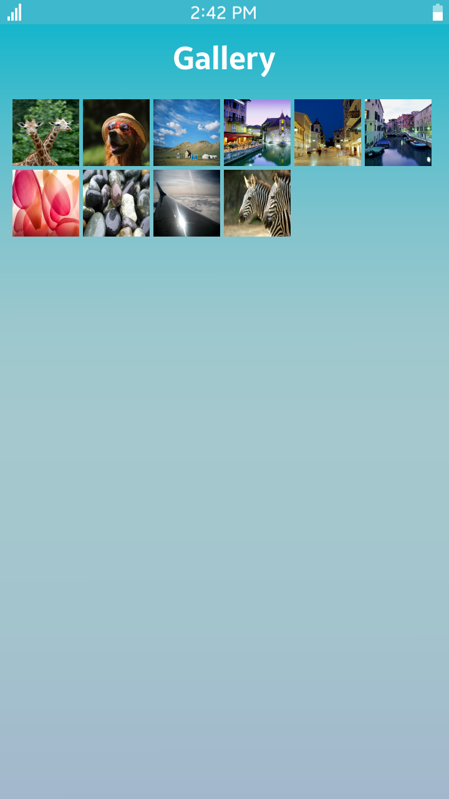</td>
			<td>
			
<a href="https://github.com/Samsung/Tizen-CSharp-Samples/tree/master/Mobile/UI/GalleryUI" target="_blank"><strong>Gallery UI</strong></a>

			
This sample application demonstrates how to configure the screen using a variety of objects. 
			(This sample is intended to guide how to make your UI application but not the functionality of your application.)

			</td>
		</tr>
		<tr>
			<td></td>
			<td>
			
<a href="https://github.com/Samsung/Tizen-CSharp-Samples/tree/master/Mobile/UI/Puzzle" target="_blank"><strong>Puzzle</strong></a>

			
This sample application demonstrates the basic UI sample application.

			</td>
		</tr>
		<tr>
			<td>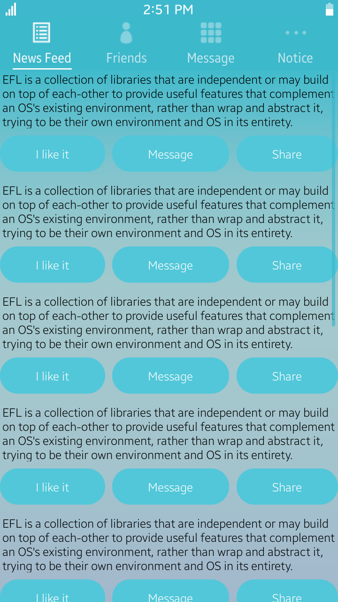</td>
			<td>
			
<a href="https://github.com/Samsung/Tizen-CSharp-Samples/tree/master/Mobile/UI/SNSUI" target="_blank"><strong>SNS UI</strong></a>

			
This sample application demonstrates how to configure the screen using a variety of objects. 
			It shows how to compose the view by using a scroller, a toolbar, and a drawer. 
			(This sample is only a reference for creating the UI layout of an application. Some menus and UI components do not provide the real functions of an application.)

			</td>
		</tr>
		<tr>
			<td></td>
			<td>
			
<a href="https://github.com/Samsung/Tizen-CSharp-Samples/tree/master/Mobile/UI/Settings" target="_blank"><strong>Settings UI</strong></a>

			
This sample application demonstrates how to configure the screen using a variety of objects. 
			(This sample is only a reference for creating the UI layout of an application. Some menus and UI components do not provide the real functions of an application.)

			</td>
		</tr>
		<tr>
			<td></td>
			<td>
			
<a href="https://github.com/Samsung/Tizen-CSharp-Samples/tree/master/Mobile/UI/ApplicationStoreUI" target="_blank"><strong>Application Store UI</strong></a>

			
This sample application demonstrates how to make a complex view.

			</td>
		</tr>
		<tr>
			<td></td>
			<td>
			
<a href="https://github.com/Samsung/Tizen-CSharp-Samples/tree/master/Mobile/Calculator" target="_blank"><strong>Calculator</strong></a>

			
This sample application demonstrates the regular calculator and the scientific calculator. 
			This sample is following Portable Class Libraries (PCL) application model and using some Xamarin.Forms features such as XAML files for GUI, Custom Renderers for the image buttons, and subsystem ports by using the Dependency Service.

			</td>
		</tr>
		<tr>
			<td>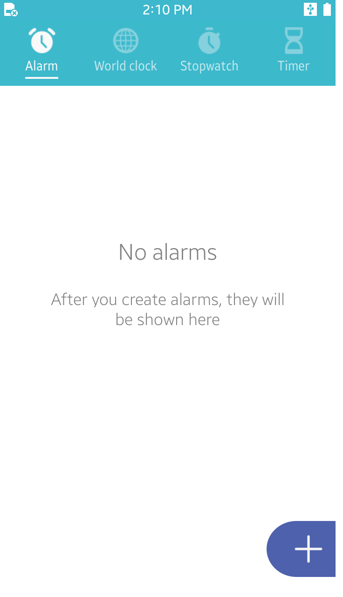</td>
			<td>
			
<strong>Clock</strong> [In progress]

			
This sample application demonstrates how an user can use the clock.

			</td>
		</tr>
		<tr>
			<td></td>
			<td>
			
<a href="https://github.com/Samsung/Tizen-CSharp-Samples/tree/master/Mobile/Geofence" target="_blank"><strong>Geofence</strong></a>

			
This sample application demonstrates how an user can use the geofence.

			</td>
		</tr>
		<tr>
			<td></td>
			<td>
			
<a href="https://github.com/Samsung/Tizen-CSharp-Samples/tree/master/Mobile/Location" target="_blank"><strong>Location</strong></a>

			
This sample application demonstrates how an user can use the location service.

			</td>
		</tr>
		<tr>
			<td>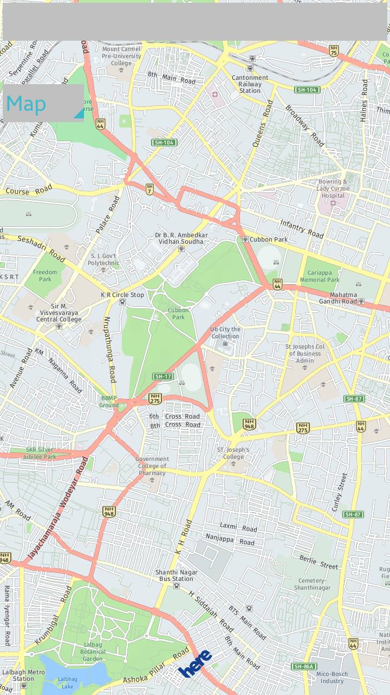</td>
			<td>
			
<a href="https://github.com/Samsung/Tizen-CSharp-Samples/tree/master/Mobile/Maps" target="_blank"><strong>Maps</strong></a>

			
This sample application demonstrates how an user can use the maps.

			</td>
		</tr>
		<tr>
			<td>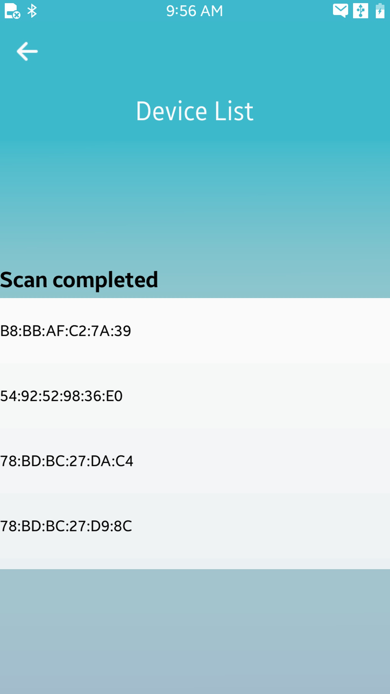</td>
			<td>
			
<strong>Lescanner</strong> [In progress]

			
This sample application demonstrates how to scan the BLE devices.

			</td>
		</tr>
		<tr>
			<td></td>
			<td>
			
<a href="https://github.com/Samsung/Tizen-CSharp-Samples/tree/master/Mobile/NetworkApp" target="_blank"><strong>NetworkApp</strong></a>

			
This sample application demonstrates how an user can use Connection, Wi-Fi, and Wi-Fi Direct. 
			User can get network information such as IP address, network state, and available network lists and make Wi-Fi connection.

			</td>
		</tr>
		<tr>
			<td></td>
			<td>
			
<a href="https://github.com/Samsung/Tizen-CSharp-Samples/tree/master/Mobile/Downloader" target="_blank"><strong>Downloader</strong></a>

			
This sample application demonstrates how an user can download contents and get the download information.

			</td>
		</tr>
		<tr>
			<td></td>
			<td>
			
<a href="https://github.com/Samsung/Tizen-CSharp-Samples/tree/master/Mobile/PushReceiver" target="_blank"><strong>PushReceiver</strong></a>

			
This sample application demonstrates how an user can receive push notification from the application server through the push server.

			</td>
		</tr>
		<tr>
			<td></td>
			<td>
			
<a href="https://github.com/Samsung/Tizen-CSharp-Samples/tree/master/Mobile/SampleSync" target="_blank"><strong>SampleSync</strong></a>

			
This sample application demonstrates how you can manage data synchronization schedule between the target device and the server.

			</td>
		</tr>
		<tr>
			<td></td>
			<td>
			
<strong>SampleAccount</strong> [In progress]

			
This sample application demonstrates how to implement an account provider which can add and configure an account.

			</td>
		</tr>
		<tr>
			<td></td>
			<td>
			
<a href="https://github.com/Samsung/Tizen-CSharp-Samples/tree/master/Mobile/AppHistory" target="_blank"><strong>AppHistory</strong></a>

			
This sample application demonstrates how you can retrieve the user's application usage patterns.

			</td>
		</tr>
		<tr>
			<td></td>
			<td>
			
<strong>Sensor</strong> [In progress]

			
This sample application demonstrates how you can managing sensors and receiving sensor data from the sensor device.

			</td>
		</tr>
		<tr>
			<td></td>
			<td>
			
<strong>Calendar</strong> [In progress]

			
This sample application demonstrates how to implement an calendar provider which can add and configure an event.

			</td>
		</tr>
		<tr>
			<td></td>
			<td>
			
<strong>Contacts</strong> [In progress]

			
This sample application demonstrates how to implement an contacts provider which can add and configure an contact.

			</td>
		</tr>
		<tr>
			<td></td>
			<td>
			
<strong>SecureRepository</strong> [In progress]

			
This sample application demonstrates how to securely store data, certificates, and cryptographic keys using <a href="https://developer.tizen.org/dev-guide/csapi/api/Tizen.Security.SecureRepository.html" target="_blank">Tizen SecureRepository C# API</a>.

			</td>
		</tr>
		<tr>
			<td></td>
			<td>
			
<a href="https://github.com/Samsung/Tizen-CSharp-Samples/tree/master/Mobile/HeartRateMonitor" target="_blank"><strong>HeartRateMonitor</strong></a>

			
This sample application demonstrates how to obtain data provided by the HRM sensor (heart rate sensor) using <a href="https://developer.tizen.org/dev-guide/csapi/api/Tizen.Sensor.html" target="_blank">Tizen.Sensor C# API</a>.

			</td>
		</tr>
		<tr>
			<td></td>
			<td>
            
<a href="https://github.com/Samsung/Tizen-CSharp-Samples/tree/master/Mobile/TextReader" target="_blank"><strong>TextReader</strong></a>

			
This sample application demonstrates how to synthesize voice from text using <a href="https://developer.tizen.org/dev-guide/csapi/api/Tizen.Uix.Tts.html" target="_blank">Tizen.Uix.Tts C# API</a>.

			</td>
		</tr>
		<tr>
			<td></td>
			<td>
			
<strong>MapsView</strong> [In progress]

			
This sample application demonstrates how to display and control Map component.

			</td>
		</tr>
		<tr>
			<td></td>
			<td>
			
<strong>Preference</strong> [In progress]

			
This sample application demonstrates how to store and retrieve an application specific data and preference using <a href="https://developer.tizen.org/dev-guide/csapi/api/Tizen.Applications.Preference.html" target="_blank">Tizen.Applications.Preference C# API</a>.

			</td>
		</tr>
		<tr>
			<td></td>
			<td>
			
<a href="https://github.com/Samsung/Tizen-CSharp-Samples/tree/master/Mobile/SpeechToText" target="_blank"><strong>SpeechToText</strong></a>

			
This sample application demonstrates how to record and recognize sound data using <a href="https://developer.tizen.org/dev-guide/csapi/api/Tizen.Uix.Stt.html" target="_blank">Tizen.Uix.Stt C# API</a>.

			</td>
		</tr>
		<tr>
			<td></td>
			<td>
			
<strong>Smartcard</strong> [In progress]

			
This sample application demonstrates how to work with Smartcard API in order to send command to Secure Element (SE).

			</td>
		</tr>
		<tr>
			<td></td>
			<td>
			
<strong>Gallery</strong> [In progress]

			
This sample application demonstrates how to create image viewer using <a href="https://developer.tizen.org/dev-guide/csapi/api/Tizen.Content.MediaContent.html" target="_blank">Tizen.Content.MediaContent C# API</a>.

			</td>
		</tr>
		<tr>
			<td></td>
			<td>
			
<a href="https://github.com/Samsung/Tizen-CSharp-Samples/tree/master/Mobile/NFCSampleApp" target="_blank"><strong>NFC</strong></a>

			
This sample application demonstrates how to work with NFC API in order to send information to nfc p2p device, read &amp; write nfc tag.

			</td>
		</tr>
		<tr>
			<td></td>
			<td>
			
<a href="https://github.com/Samsung/Tizen-CSharp-Samples/tree/master/Mobile/Badges" target="_blank"><strong>Badges</strong></a>

			
This sample application demonstrates how to manage applications badge counter using <a href="https://developer.tizen.org/dev-guide/csapi/api/Tizen.Applications.html" target="_blank">Tizen.Applications C# API</a>.

			</td>
		</tr>
		<tr>
			<td></td>
			<td>
			
<a href="https://github.com/Samsung/Tizen-CSharp-Samples/tree/master/Mobile/Weather" target="_blank"><strong>Weather</strong></a>

			
This sample application demonstrates how to obtain data provided by the RESTful API using <a href="https://openweathermap.org/" target="_blank">OpenWeatherMap API</a>.

			</td>
		</tr>
		<tr>
			<td></td>
			<td>
			
<strong>BasicCalculator</strong> [In progress]

			
This sample application demonstrates how to create a calculator with basic mathematical operations using Xamarin.Forms library.

			</td>
		</tr>
		<tr>
			<td></td>
			<td>
			
<strong>OAuth2Sample</strong> [In progress]

			
This sample application demonstrates how to manager access code and token using <a href="https://developer.tizen.org/dev-guide/csapi/api/Tizen.Account.OAuth2.html" target="_blank">Tizen.Account.OAuth2 C# API</a>.

			</td>
		</tr>
		<tr>
			<td></td>
			<td>
			
<strong>Alarms</strong> [In progress]

			
This sample application demonstrates how to schedule start of application at specified date and time or after delay using <a href="https://developer.tizen.org/dev-guide/csapi/api/Tizen.Applications.html" target="_blank">Tizen.Applications C# API</a>.

			</td>
		</tr>
		<tr>
			<td></td>
			<td>
			
<strong>Camera</strong> [In progress]

			
This sample application demonstrates how to take a picture using <a href="https://developer.tizen.org/dev-guide/csapi/api/Tizen.Multimedia.html" target="_blank">Tizen. Multimedia C# API</a>.

			</td>
		</tr>
		<tr>
			<td>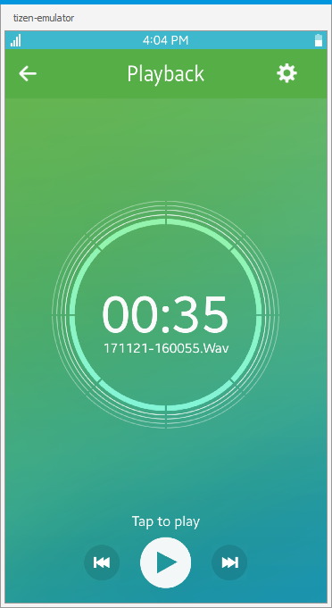</td>
			<td>
			
<strong>VoiceRecorder</strong> [In progress]

			
This sample application demonstrates how to control audio recording using <a href="https://developer.tizen.org/dev-guide/csapi/api/Tizen.Multimedia.html" target="_blank">Tizen.Multimedia C# API</a>.

			</td>
		</tr>
		<tr>
			<td></td>
			<td>
			
<a href="https://github.com/Samsung/Tizen-CSharp-Samples/tree/master/Mobile/SampleTelephony" target="_blank"><strong>Telephony</strong></a>

			
This sample application demonstrates how to work with Telephony API in order to get call, modem, network, and sim information from telephony framweork.

			</td>
		</tr>
		<tr>
			<td></td>
			<td>
			
<a href="https://github.com/Samsung/Tizen-CSharp-Samples/tree/master/Mobile/Piano" target="_blank"><strong>Piano</strong></a>

			
This sample application demonstrates how to play sounds using <a href="https://developer.tizen.org/dev-guide/csapi/api/Tizen.Multimedia.html" target="_blank">Tizen.Multimedia C# API</a>.

			</td>
		</tr>
		<tr>
			<td></td>
			<td>
			
<strong>ServiceDiscovery</strong> [In progress]

			
This sample application demonstrates how an user can register and discover a DNS-SD service within local network.

			</td>
		</tr>
		<tr>
			<td></td>
			<td>
			
<a href="https://github.com/Samsung/Tizen-CSharp-Samples/tree/master/Mobile/SystemInfo" target="_blank"><strong>SystemInfo</strong></a>

			
This sample application demonstrates how to obtain data provided by the system using <a href="https://developer.tizen.org/dev-guide/csapi/api/Tizen.System.html" target="_blank">Tizen.System C# API</a>.

			</td>
		</tr>
		<tr>
			<td></td>
			<td>
			
<strong>NotificationManager</strong> [In progress]

			
This sample application demonstrates how to create and manage notifications using <a href="https://developer.tizen.org/dev-guide/csapi/api/Tizen.Applications.Notifications.html" target="_blank">Tizen.Applications.Notifications C# API</a>.

			</td>
		</tr>
		<tr>
			<td></td>
			<td>
			
<strong>MediaContent</strong> [In progress]

			
This sample application demonstrates how to obtain and filter media content information from internal and external storages using <a href="https://developer.tizen.org/dev-guide/csapi/api/Tizen.Content.MediaContent.html" target="_blank">Tizen.Content.MediaContent C# API</a>.

			</td>
		</tr>
		<tr>
			<td></td>
			<td>
			
<strong>PlayerSample</strong> [In progress]

			
This sample application demonstrates how to play audio, video, and streaming using <a href="https://developer.tizen.org/dev-guide/csapi/api/Tizen.Multimedia.html"  target="_blank">Tizen.Multimedia C# API</a>.

			</td>
		</tr>
		<tr>
			<td></td>
			<td>
			
<strong>ThumbnailExtractorSample</strong> [In progress]

			
This sample application demonstrates how to extract thumbnails from an image using <a href="https://developer.tizen.org/dev-guide/csapi/api/Tizen.Multimedia.html"  target="_blank">Tizen.Multimedia C# API</a>.

			</td>
		</tr>
		<tr>
			<td></td>
			<td>
			
<strong>RadioSample</strong> [In progress]

			
This sample application demonstrates how to play the radio using <a href="https://developer.tizen.org/dev-guide/csapi/api/Tizen.Multimedia.html"  target="_blank">Tizen.Multimedia C# API</a>.

			</td>
		</tr>
		<tr>
			<td>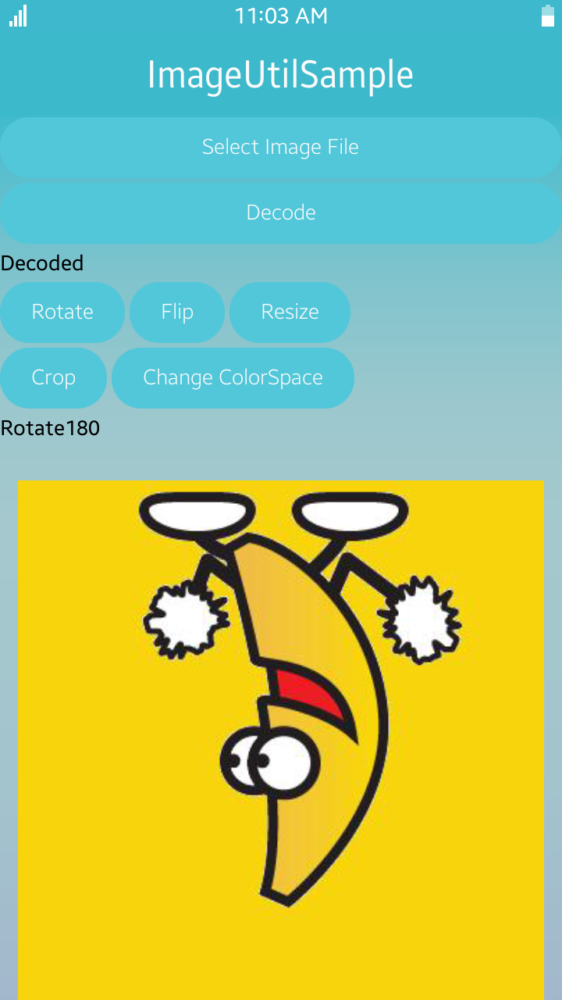</td>
			<td>
			
<strong>ImageUtilSample</strong> [In progress]

			
This sample application demonstrates how to transform an image using <a href="https://developer.tizen.org/dev-guide/csapi/api/Tizen.Multimedia.html"  target="_blank">Tizen.Multimedia C# API</a>.

			</td>
		</tr>
		<tr>
			<td></td>
			<td>
			
<a href="https://github.com/Samsung/Tizen-CSharp-Samples/tree/master/Mobile/FeedbackApp" target="_blank"><strong>FeedbackApp</strong></a>

			
This sample application demonstrates how to play feedback using <a href="https://developer.tizen.org/dev-guide/csapi/api/Tizen.System.Feedback.html"  target="_blank">Tizen.System.Feedback C# API</a>.

			</td>
		</tr>
		<tr>
			<td>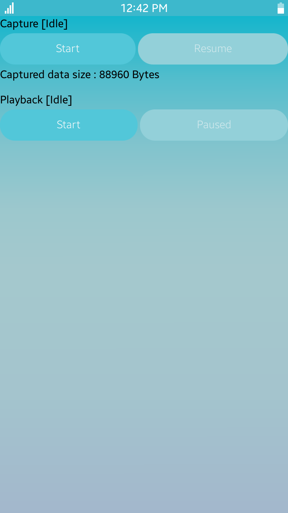</td>
			<td>
			
<strong>AudioIOSample</strong> [In progress]

			
This sample application demonstrates how to capture audio and play using <a href="https://developer.tizen.org/dev-guide/csapi/api/Tizen.Multimedia.html"  target="_blank">Tizen.Multimedia C# API</a>.

			</td>
		</tr>
		<tr>
			<td>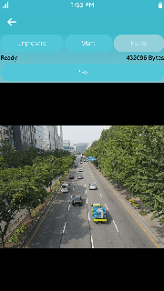</td>
			<td>
			
<strong>RecorderSample</strong> [In progress]

			
This sample application demonstrates how to record audio and video.

			</td>
		</tr>
		<tr>
			<td>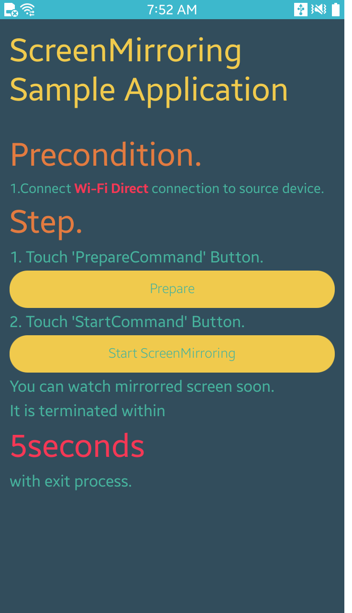</td>
			<td>
			
<strong>ScreenMirroringSample</strong> [In progress]

			
This sample application demonstrates how to use 'SINK' function of Tizen mobile.

			</td>
		</tr>
		<tr>
			<td>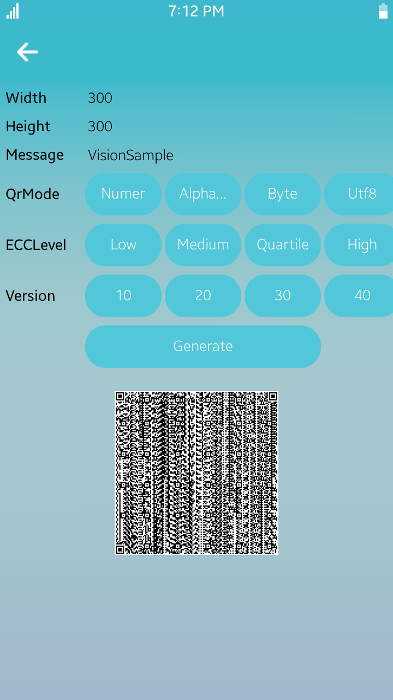</td>
			<td>
			
<strong>VisionApplicationSample</strong> [In progress]

			
This sample application shows how to implement Barcode Generation/Detection, Face Detection, and Image Recognition.

			</td>
		</tr>
	</tbody>
</table>

