# UI

<!--
For MD:
-->

<link href="../css/dotnet-samples.css" ref="stylesheet">

<!--
for TD:

<style type="text/css">
    Please copy dotnet-samples.css and paste it here
</script>
-->

<button class="tablinks" onclick="openProfile(event, 'Mobile')" id="defaultOpen">Mobile</button> <button class="tablinks" onclick="openProfile(event, 'Wearable')">Wearable</button> <button class="tablinks" onclick="openProfile(event, 'TV')">TV</button>

<!-- Tab content -->

<table>
	<tbody>
		<tr>
			<td>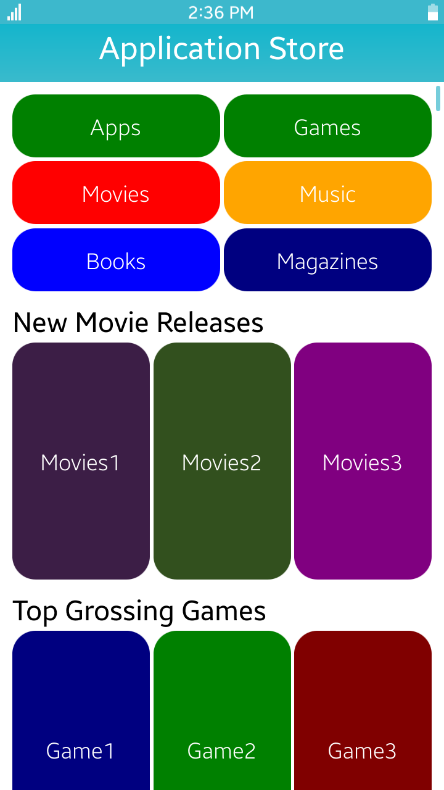</td>
			<td>
			
<a href="https://github.com/Samsung/Tizen-CSharp-Samples/tree/master/Mobile/UI/ApplicationStoreUI" target="_blank"><strong>(M) Application Store UI</strong></a>

			
This sample application demonstrates how to create a complex view.

			</td>
		</tr>
		<tr>
			<td></td>
			<td>
			
<strong>(M) BasicCalculator</strong> [In progress]

			
This sample application demonstrates how to create a calculator with basic mathematical operations using Xamarin.Forms library.

			</td>
		</tr>
		<tr>
			<td></td>
			<td>
			
<a href="https://github.com/Samsung/Tizen-CSharp-Samples/tree/master/Mobile/Calculator" target="_blank"><strong>(M) Calculator</strong></a>

			
This sample application demonstrates the regular calculator and the scientific calculator. 
			This sample follows the Portable Class Libraries (PCL) application model. It uses some of the Xamarin.Forms features such as XAML files for GUI, custom renderers for the image buttons, and subsystem ports using the dependency service.

			
In addition, there is similar web sample application. 
			<ul>
				<li><a href="https://developer.tizen.org/development/sample/web/General/Calculator" target="_blank">Web version</a></li>
			</ul>

			</td>
		</tr>
		<tr>
			<td></td>
			<td>
			
<strong>(M) Clock</strong> [In progress]

			
This sample application demonstrates how to use the clock.

			</td>
		</tr>
		<tr>
			<td></td>
			<td>
			
<a href="https://github.com/Samsung/Tizen-CSharp-Samples/tree/master/Mobile/UI/EmailUI" target="_blank"><strong>(M) Email UI</strong></a>

			
This sample application demonstrates how to configure the screen using a variety of objects. 
			(This sample only demonstrates how to create your UI application only, not the functionality of your application.)

			</td>
		</tr>
		<tr>
			<td></td>
			<td>
			
<a href="https://github.com/Samsung/Tizen-CSharp-Samples/tree/master/Mobile/UI/GalleryUI" target="_blank"><strong>(M) Gallery UI</strong></a>

			
This sample application demonstrates how to configure the screen using a variety of objects. 
			(This sample only demonstrates how to create your UI application only, not the functionality of your application.)

			</td>
		</tr>
		<tr>
			<td>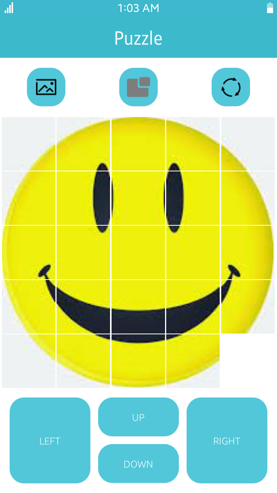</td>
			<td>
			
<a href="https://github.com/Samsung/Tizen-CSharp-Samples/tree/master/Mobile/UI/Puzzle" target="_blank"><strong>(M) Puzzle</strong></a>

			
This sample application demonstrates the basic UI sample application.

			</td>
		</tr>
		<tr>
			<td></td>
			<td>
			
<a href="https://github.com/Samsung/Tizen-CSharp-Samples/tree/master/Mobile/UI/Settings" target="_blank"><strong>(M) Settings UI</strong></a>

			
This sample application demonstrates how to configure the screen using a variety of objects. 
			(This sample only demonstrates how to create your UI application only, not the functionality of your application.)

			</td>
		</tr>
		<tr>
			<td></td>
			<td>
			
<a href="https://github.com/Samsung/Tizen-CSharp-Samples/tree/master/Mobile/UI/SNSUI" target="_blank"><strong>(M) SNS UI</strong></a>

			
This sample application demonstrates how to configure the screen using a variety of objects. 
			It also shows how to compose the view using a scroller, a toolbar, and a drawer. 
			(This sample only demonstrates how to create your UI application only, not the functionality of your application.)

			</td>
		</tr>
	</tbody>
</table>

<!-- Tab content -->

<table>
	<tbody>
		<tr>
			<td>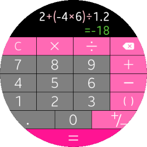</td>
			<td>
                        
<a href="https://github.com/Samsung/Tizen-CSharp-Samples/tree/master/Wearable/Calculator" target="_blank"><strong>(W) Calculator</strong></a>

			
This sample application demonstrates the regular calculator. This is using some Xamarin.Forms features such as XAML files for GUI and Custom Renderers for the image buttons.

			
In addition, there are similar native and web sample applications. 
			<ul>
				<li><a href="https://developer.tizen.org/development/sample/native/UI/%28Circle%29_Calculator" target="_blank">Native version</a></li>
				<li><a href="https://developer.tizen.org/development/sample/web/General/Calculator_1" target="_blank">Web version</a></li>
			</ul>

			</td>
		</tr>
		<tr>
			<td>
			
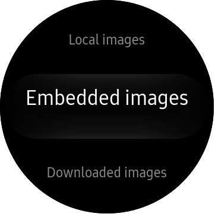

			</td>
			<td>
                        
<a href="https://github.com/Samsung/Tizen-CSharp-Samples/tree/master/Wearable/ImageReader" target="_blank"><strong>(W) ImageReader</strong></a>

			
This sample application demonstrates how to use an image in the Tizen .Net application.
			This application is based on the <a href="https://developer.xamarin.com/samples/xamarin-forms/WorkingWithImages/" target="_blank">Xamarin sample application</a> and is modified according to the Tizen Wearable UI using <a href="https://github.com/Samsung/Tizen.CircularUI/" target="_blank">Tizen.Wearable.CircularUI C# API</a>.

			
For more information, see <a href="https://docs.microsoft.com/en-us/xamarin/xamarin-forms/user-interface/images" target="_blank">Xamarin.Forms.Images</a>.

			
<strong>Prerequisites</strong> 
			Network connection is required for DownloadImage.

			
To use network connection in an application, 
			you must have the following privileges: 
			<ul>
				<li><code>http://tizen.org/privilege/internet</code></li>
				<li><code>http://tizen.org/privilege/network.get</code></li>
			</ul>

			</td>
		</tr>
		<tr>
			<td>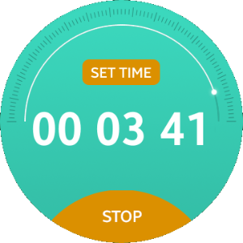</td>
			<td>
                        
<a href="https://github.com/Samsung/Tizen-CSharp-Samples/tree/master/Wearable/RotaryTimer" target="_blank"><strong>(W) Rotary timer</strong></a>

			
This sample application demonstrates how to use Rotary Bezel.

			
In addition, there are similar native and web sample applications. 
			<ul>
				<li><a href="https://developer.tizen.org/development/sample/native/UI/Rotary_Timer" target="_blank">Native version</a></li>
				<li><a href="https://developer.tizen.org/development/sample/web/General/Rotary_Timer" target="_blank">Web version</a></li>
			</ul>

			</td>
		</tr>
		<tr>
			<td>
			

			</td>
			<td>
                        
<a href="https://github.com/Samsung/Tizen-CSharp-Samples/tree/master/Wearable/SkiaSharp2DSample" target="_blank"><strong>(W) SkiaSharp2DSample</strong></a>

			
This sample application demonstrates how to use SkiaSharp API in Tizen Xamarin.Forms applications.
			<ul>
				<li>Drawing Basics (DrawCircle)</li>
				<li>SkiaSharp Path (DrawPath)</li>
				<li>SkiaSharp Transforms (Translate, Scale, RotateDegrees)</li>
			</ul>
			This application uses <a href="https://docs.microsoft.com/en-us/dotnet/api/SkiaSharp" target="_blank">SkiaSharp API</a>.
			<ul>
				<li><a href="https://docs.microsoft.com/en-us/dotnet/api/skiasharp.skcanvas" target="_blank">Class SKCanvas</a></li>
			</ul>

			</td>
		</tr>
		<tr>
			<td>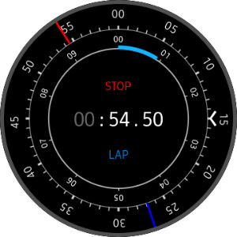</td>
			<td>
			
<strong>(W) XStopWatch</strong> [In progress]

			
This sample application demonstrates how to use a stopwatch and how to create circular UI using <a href="https://github.com/Samsung/Tizen.CircularUI/" target="_blank">Tizen.Wearable.CircularUI C# API</a>.

			
In addition, there is similar native sample application. 
			<ul>
				<li><a href="https://developer.tizen.org/development/sample/native/UI/%28Circle%29_Stopwatch" target="_blank">Native version</a></li>
			</ul>

			</td>
		</tr>
		<tr>
			<td></td>
			<td>
			
<strong>(W) XUIComponents</strong> [In progress]

			
This sample application demonstrates how to use various kinds of Tizen Wearable UI controls using Xamarin.Forms and <a href="https://github.com/Samsung/Tizen.CircularUI/" target="_blank">Tizen.Wearable.CircularUI C# API</a>.

			
In addition, there is similar native sample application. 
			<ul>
				<li><a href="https://developer.tizen.org/development/sample/native/UI/%28Circle%29_UI_Components" target="_blank">Native version</a></li>
			</ul>

			</td>
		</tr>
	</tbody>
</table>

<table>
	<tbody>
		<tr>
			<td>
			
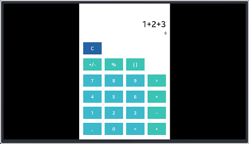

			</td>
			<td>
			
<a href="https://github.com/Samsung/Tizen-CSharp-Samples/tree/master/TV/BasicCalculator" target="_blank"><strong>(T) BasicCalculator</strong></a>

			
This sample application demonstrates how to create a calculator with basic mathematical operations using Xamarin.Forms library.

			</td>
		</tr>
		<tr>
			<td>
			
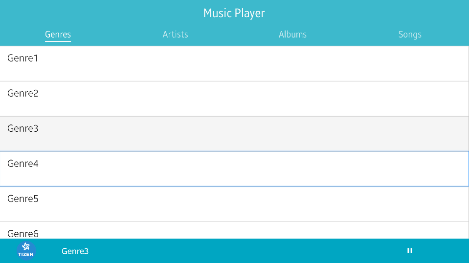

			</td>
			<td>
			
<a href="https://github.com/Samsung/Tizen-CSharp-Samples/tree/master/TV/MusicPlayerUI" target="_blank"><strong>(T) Music Player UI</strong></a>

			
This sample application demonstrates how to use ListViews and a TabbedPage to create intuitive and complex layouts on a TV.

			</td>
		</tr>
		<tr>
			<td>
			

			</td>
			<td>
			
<a href="https://github.com/Samsung/Tizen-CSharp-Samples/tree/master/TV/Stopwatch" target="_blank"><strong>(T) Stopwatch</strong></a>

			
This sample application demonstrates how to create an application that measures the amount of time taken for a task. This application is created using Xamarin.Forms.

			</td>
		</tr>
		<tr>
			<td>
			
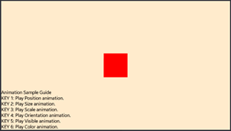

			</td>
			<td>
			
<a href="https://github.com/Samsung/Tizen-CSharp-Samples/tree/master/TV/AnimationSample" target="_blank"><strong>(T) Animation Sample (NUI)</strong></a>

			
This sample application demonstrates how to use the animation class to create and cancel animations.

			</td>
		</tr>
		<tr>
			<td>
			

			</td>
			<td>
            
<a href="https://github.com/Samsung/Tizen-CSharp-Samples/tree/master/TV/ChannelList" target="_blank"><strong>(T) ChannelList (NUI)</strong></a>

			
This sample application demonstrates how to obtain and filter TV channel information.

			</td>
		</tr>
		<tr>
			<td>
			

			</td>
			<td>
			
<a href="https://github.com/Samsung/Tizen-CSharp-Samples/tree/master/TV/FirstScreen" target="_blank"><strong>(T) FirstScreen (NUI)</strong></a>

            
This sample application demonstrates how to launch the apps on the TV.

			</td>
		</tr>
		<tr>
			<td>
			
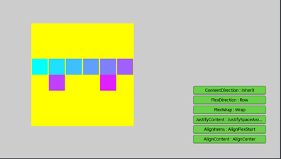

			</td>
			<td>
			
<a href="https://github.com/Samsung/Tizen-CSharp-Samples/tree/master/TV/FlexContainerSample" target="_blank"><strong>(T) FlexContainer Sample (NUI)</strong></a>

			
This sample application demonstrates how to use FlexContainer and shows results of  applied properties.

			</td>
		</tr>
		<tr>
			<td>
			
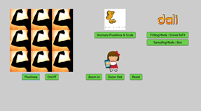

			</td>
			<td>
			
<a href="https://github.com/Samsung/Tizen-CSharp-Samples/tree/master/TV/ImageSample" target="_blank"><strong>(T) Image Sample (NUI)</strong></a>

			
This sample application demonstrates how to use image view and shows some properties of image view.

			</td>
		</tr>
		<tr>
			<td>
			
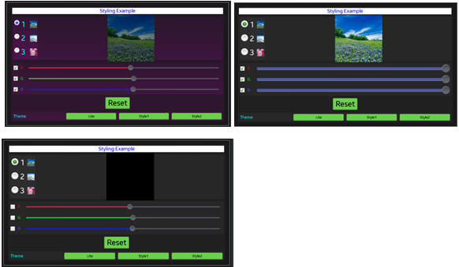

			</td>
			<td>
			
<a href="https://github.com/Samsung/Tizen-CSharp-Samples/tree/master/TV/ScriptLayoutSample" target="_blank"><strong>(T) Script Layout Sample (NUI)</strong></a>

			
This sample application demonstrates how to use JSON files to create styles. 
            Application often contains multiple controls that have an identical appearance. 
			Setting the appearance of each individual control can be repetitive and error prone. 
			Therefore, you can create styles that customizes and controls appearance by grouping and setting properties available on the control type.
			

			</td>
		</tr>
		<tr>
			<td>
			
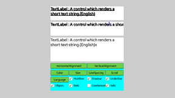

			</td>
			<td>
            
<a href="https://github.com/Samsung/Tizen-CSharp-Samples/tree/master/TV/TextSample" target="_blank"><strong>(T) Text Sample (NUI)</strong></a>

			
This sample application demonstrates how to use the text controls and common text entry scenarios.

			</td>
		</tr>
		<tr>
			<td>
			

			</td>
			<td>
			
<a href="https://github.com/Samsung/Tizen-CSharp-Samples/tree/master/TV/UIControlSample" target="_blank"><strong>(T) UIControl Sample (NUI)</strong></a>

			
This sample application demonstrates how NUI views work on TV. 
			You can navigate and interact NUI views.

			</td>
		</tr>
		<tr>
			<td>
			
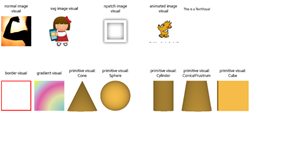

			</td>
			<td>
            
<a href="https://github.com/Samsung/Tizen-CSharp-Samples/tree/master/TV/VisualSample" target="_blank"><strong>(T) Visual Sample (NUI)</strong></a>

			
This sample application demonstrates how to use various kinds of visuals.

			</td>
		</tr>
		<tr>
			<td>
			
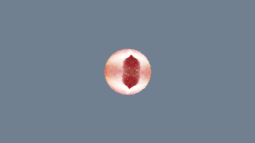

			</td>
			<td>
			
<strong>(T) Ball3D (OpenTK)</strong> [In progress]

			
This sample application demonstrates how to draw a spherical 3D model, add texture to the model, and realize rotation of the model.

			</td>
		</tr>
		<tr>
			<td>
			
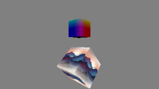

			</td>
			<td>
			
<strong>(T) CubeTexture (OpenTK)</strong> [In progress]

			
This sample application demonstrates how to draw a 3D model (cube), realize rotation of the model, and add texture to the model.

                        
It also demonstrates how the application implements two cubes independently drawn using two programs.

			</td>
		</tr>
		<tr>
			<td>
			

			</td>
			<td>
			
<strong>(T) CubeWithSkiaSharp (OpenTK)</strong> [In progress]

			
This sample application demonstrates how to draw a text with SkiaSharp on the target memory, to generates 2D texture on the target memory block, and to shows 2D texture in the OpenTK app (drawing text on a rotating cube).

			</td>
		</tr>
		<tr>
			<td>
			
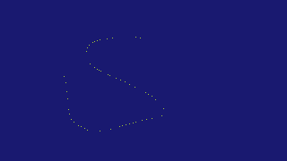

			</td>
			<td>
			
<strong>(T) Graffiti (OpenTK)</strong> [In progress]

			
This sample application demonstrates how to respond to click events or button events and how to draw a dot or line at the corresponding position on the screen.

			</td>
		</tr>
		<tr>
			<td>
			

			</td>
			<td>
			
<strong>(T) Panorama360 (OpenTK)</strong> [In progress]

			
This sample application demonstrates how to achieve 360-degree panorama effect.

			</td>
		</tr>
		<tr>
			<td>
			
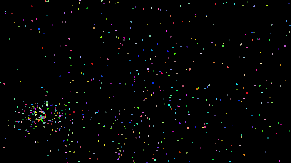

			</td>
			<td>
			
<strong>(T) ParticleDynamic (OpenTK)</strong> [In progress]

			
This sample application demonstrates how to implement a dynamic particle scenario.

			</td>
		</tr>
		<tr>
			<td>
			

			</td>
			<td>
			
<strong>(T) ScratchPaper (OpenTK)</strong> [In progress]

			
This sample application demonstrates how to respond to click events or button events and how to draw corresponding textures at the corresponding position on the screen.

			</td>
		</tr>
		<tr>
			<td>
			

			</td>
			<td>
			
<strong>(T) Star (OpenTK)</strong> [In progress]

			
This sample application demonstrates how to implement shaders loading, program creation, linking, vertex data loading, texture data loading, and other preliminary operations of drawing. It also demonstrates how to draw a multilateral graph (five-pointed star) with the DrawElements API.

			</td>
		</tr>
		<tr>
			<td>
			

			</td>
			<td>
			
<strong>(T) Triangle (OpenTK)</strong> [In progress]

			
This sample application demonstrates how to implement shaders loading, program creation, linking, vertex data loading, texture data loading, and other preliminary operations of drawing. It also demonstrates how to implement a basic graph drawing (drawing triangles) with the DrawArrays API.

			</td>
		</tr>
	</tbody>
</table>

<!--
For MD:
-->

<!--
for TD:

-->
