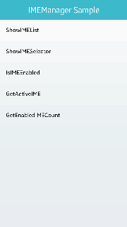
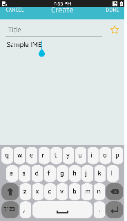
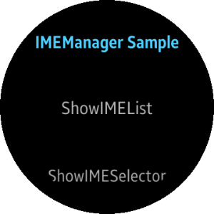
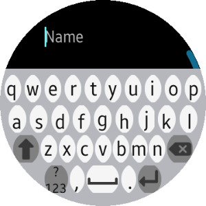
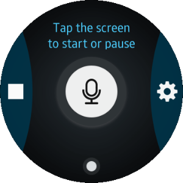

# UIX

<!--
For MD:
-->

<link href="../css/dotnet-samples.css" ref="stylesheet">

<!--
for TD:

<style type="text/css">
    Please copy dotnet-samples.css and paste it here
</script>
-->

<button class="tablinks" onclick="openProfile(event, 'Mobile')" id="defaultOpen">Mobile</button> <button class="tablinks" onclick="openProfile(event, 'Wearable')">Wearable</button> <button class="tablinks" onclick="openProfile(event, 'TV')">TV</button>

<!-- Tab content -->

<table>
	<tbody>
		<tr>
			<td></td>
			<td>
			
<a href="https://github.com/Samsung/Tizen-CSharp-Samples/tree/master/Mobile/Xamarin.Forms/IMEManager" target="_blank"><strong>(M) IMEManager</strong></a>

			
This sample application demonstrates how to manage the installed Input Method Editor (IME) using <a href="/application/dotnet/api/TizenFX/latest/api/Tizen.Uix.InputMethodManager.html" target="_blank">Tizen.Uix.InputMethodManager</a>.

			</td>
		</tr>
		<tr>
			<td></td>
			<td>
			
<a href="https://github.com/Samsung/Tizen-CSharp-Samples/tree/master/Mobile/Xamarin.Forms/IMESample" target="_blank"><strong>(M) IMESample</strong></a>

			
This sample application demonstrates how to create an Input Method Editor (IME) using <a href="/application/dotnet/api/TizenFX/latest/api/Tizen.Uix.InputMethod.html" target="_blank">Tizen.Uix.InputMethod</a>.

			</td>
		</tr>
		<tr>
			<td></td>
			<td>
			
<a href="https://github.com/Samsung/Tizen-CSharp-Samples/tree/master/Mobile/Xamarin.Forms/SpeechToText" target="_blank"><strong>(M) SpeechToText</strong></a>

			
This sample application demonstrates how to record and recognize sound data using <a href="/application/dotnet/api/TizenFX/latest/api/Tizen.Uix.Stt.html" target="_blank">Tizen.Uix.Stt</a>.

			</td>
		</tr>
		<tr>
			<td></td>
			<td>
			
<a href="https://github.com/Samsung/Tizen-CSharp-Samples/tree/master/Mobile/Xamarin.Forms/TextReader" target="_blank"><strong>(M) TextReader</strong></a>

			
This sample application demonstrates how to synthesize voice from text using <a href="/application/dotnet/api/TizenFX/latest/api/Tizen.Uix.Tts.html" target="_blank">Tizen.Uix.Tts</a>.

			</td>
		</tr>
	</tbody>
</table>

<table>
	<tbody>
		<tr>
			<td>
			

			</td>
			<td>
			
<a href="https://github.com/Samsung/Tizen-CSharp-Samples/tree/master/Wearable/Xamarin.Forms/IMEManager" target="_blank"><strong>(W) IMEManager</strong></a>

			
This sample application demonstrates how to manage the installed Input Method Editor (IME) using <a href="/application/dotnet/api/TizenFX/latest/api/Tizen.Uix.InputMethodManager.html" target="_blank">Tizen.Uix.InputMethodManager</a>.

			</td>
		</tr>
		<tr>
			<td>
			

			</td>
			<td>
			
<a href="https://github.com/Samsung/Tizen-CSharp-Samples/tree/master/Wearable/Xamarin.Forms/IMESample" target="_blank"><strong>(W) IMESample</strong></a>

			
This sample application demonstrates how to create an Input Method Editor (IME) using <a href="/application/dotnet/api/TizenFX/latest/api/Tizen.Uix.InputMethod.html" target="_blank">Tizen.Uix.InputMethod</a>.

			</td>
		</tr>
		<tr>
                        <td>
			

			</td>
			<td>
			
<a href="https://github.com/Samsung/Tizen-CSharp-Samples/tree/master/Wearable/Xamarin.Forms/SpeechToText" target="_blank"><strong>(W) SpeechToText</strong></a>

			
This sample application demonstrates how to record and recognize sound data using <a href="/application/dotnet/api/TizenFX/latest/api/Tizen.Uix.Stt.html" target="_blank">Tizen.Uix.Stt</a>.

			</td>
		</tr>
		<tr>
			<td>
			

			</td>
			<td>
                        
<a href="https://github.com/Samsung/Tizen-CSharp-Samples/tree/master/Wearable/Xamarin.Forms/TextReader" target="_blank"><strong>(W) TextReader</strong></a>

			
This sample application demonstrates how to synthesize voice from text using <a href="/application/dotnet/api/TizenFX/latest/api/Tizen.Uix.Tts.html" target="_blank">Tizen.Uix.Tts</a>.

			</td>
		</tr>
	</tbody>
</table>

<table>
	<tbody>
		<tr>
			<td>
			

			</td>
			<td>
			
<a href="https://github.com/Samsung/Tizen-CSharp-Samples/tree/master/TV/Xamarin.Forms/TextReader" target="_blank"><strong>(T) TextReader</strong></a>

			
This sample application demonstrates how to synthesize voice from text using <a href="/application/dotnet/api/TizenFX/latest/api/Tizen.Uix.Tts.html" target="_blank">Tizen.Uix.Tts</a>.

			</td>
		</tr>
	</tbody>
</table>

<!--
For MD:
-->

<!--
for TD:

-->
