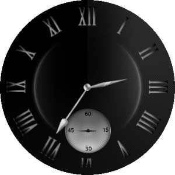
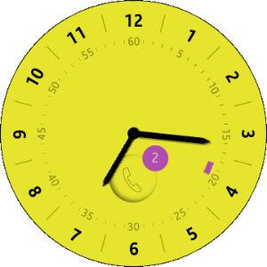
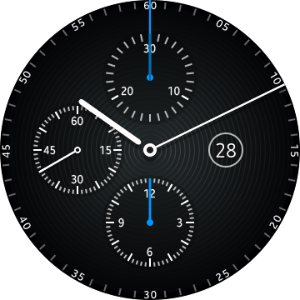
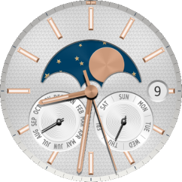
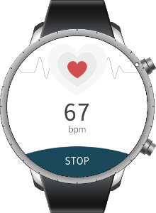
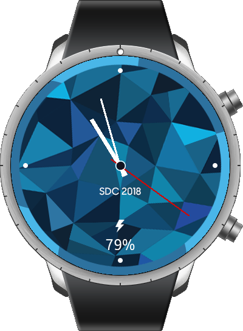

# Watch

<!--
For MD:
-->

<link href="../css/dotnet-samples.css" ref="stylesheet">

<!--
for TD:

<style type="text/css">
    Please copy dotnet-samples.css and paste it here
</script>
-->

<button class="tablinks" onclick="openProfile(event, 'Mobile')">Mobile</button> <button class="tablinks" onclick="openProfile(event, 'Wearable')" id="defaultOpen">Wearable</button> <button class="tablinks" onclick="openProfile(event, 'TV')">TV</button>

<!-- Tab content -->

<table>
	<tbody>
		<tr>
			<td>There is no sample.</td>
		</tr>
	</tbody>
</table>

<table>
	<tbody>
		<tr>
			<td></td>
			<td>
                        
<a href="https://github.com/Samsung/Tizen-CSharp-Samples/tree/master/Wearable/Xamarin.Forms/AmbientWatch" target="_blank"><strong>(W) AmbientWatch</strong></a>

			
This sample application demonstrates how to create a watch application that supports ambient mode in Tizen wearable device. It also demonstrates how to create a circular watch face using <a href="https://samsung.github.io/Tizen.CircularUI/api/index.html" target="_blank">Tizen.Wearable.CircularUI</a>. 
			To extend battery life, a watch application can display a limited UI in the ambient mode by detecting ambient mode changes. 
			

			
In <code>tizen-manifest.xml</code> file, set <code>ambient-support</code> attribute to true: 
			For more information, see <a href="../../../tizen-studio/native-tools/manifest-text-editor.md" target="_blank">ambient-support attribute</a>.
			 
			<code>&lt;watch-application appid&equals;&quot;org.tizen.example.TizenWatchfaceApp1&quot; exec&equals;&quot;TizenWatchfaceApp1.dll&quot; type&equals;&quot;dotnet&quot; ambient-support&equals;&quot;true&quot;&gt;</code>
			

			

			To use the ambient mode, you must enable it in the application settings. Launch <strong>Settings</strong> > <strong>Watch faces and styles</strong> > <strong>Watch always on</strong> > enable it. After screen timeout, the wearable device turns into ambient mode. In addition, the ambient mode activates only if you are wearing the watch on your wrist.

			
In addition, there are similar native and web sample applications. 
			<ul>
				<li><a href="/development/sample/native/Watch/Ambient_Analog_Watch" target="_blank">Native version</a></li>
				<li><a href="/development/sample/web/Watch/Ambient_Watch" target="_blank">Web version</a></li>
			</ul>

			</td>
		</tr>
		<tr>
			<td></td>
			<td>
                        
<a href="https://github.com/Samsung/Tizen-CSharp-Samples/tree/master/Wearable/Xamarin.Forms/AnalogWatch" target="_blank"><strong>(W) AnalogWatch</strong></a>

			
This sample application demonstrates how to create a watchface for the wearable device using ElmSharp and how to use <a href="/application/dotnet/api/TizenFX/latest/api/Tizen.Applications.Badge.html" target="_blank">Tizen.Applications.Badge</a>.

			</td>
		</tr>
		<tr>
			<td></td>
			<td>
                        
<a href="https://github.com/Samsung/Tizen-CSharp-Samples/tree/master/Wearable/Xamarin.Forms/ChronographWatch" target="_blank"><strong>(W) ChronographWatch</strong></a>

			
This sample application demonstrates how to create a circular watch with continuously moving hands. It also demonstrates how to use watch face API using <a href="https://samsung.github.io/Tizen.CircularUI/api/index.html" target="_blank">Tizen.Wearable.CircularUI</a>. 
            This sample application includes the watch and stopwatch functionality.

			
In addition, there are similar native and web sample applications. 
			<ul>
				<li><a href="/development/sample/native/Watch/Chronograph_Watch" target="_blank">Native version</a></li>
				<li><a href="/development/sample/web/Watch/Chronograph_Watch" target="_blank">Web version</a></li>
			</ul>

			</td>
		</tr>
		<tr>
			<td></td>
			<td>
                        
<a href="https://github.com/Samsung/Tizen-CSharp-Samples/tree/master/Wearable/Xamarin.Forms/ClassicWatch" target="_blank"><strong>(W) ClassicWatch</strong></a>

			
This sample application demonstrates how to create a circular watch face, which consists of moving hands. It also demonstrates how to use watch face API using <a href="https://samsung.github.io/Tizen.CircularUI/api/index.html" target="_blank">Tizen.Wearable.CircularUI</a>.

			
In addition, there are similar native and web sample applications. 
			<ul>
				<li><a href="/development/sample/native/Watch/Classic_Watch" target="_blank">Native version</a></li>
				<li><a href="/development/sample/web/Watch/Classic_Watch" target="_blank">Web version</a></li>
			</ul>

			</td>
		</tr>
		<tr>
			<td></td>
			<td>
                        
<strong>(W) PulsometerSDC</strong> [In progress]

			
This sample application demonstrates how to measure the heart rate using <a href="/application/dotnet/api/TizenFX/latest/api/Tizen.Sensor.HeartRateMonitor.html" target="_blank">Tizen.Sensor.HeartRateMonitor</a>.

			</td>
		</tr>
		<tr>
			<td></td>
			<td>
                        
<strong>(W) WatchFaceSDC</strong> [In progress]

			
This sample application demonstrates how to create watch face app using Xamarin Forms.

                        
Additionally, it shows how to extend functionality of the app by displaying battery related properties on the watch face. <a href="/application/dotnet/api/TizenFX/latest/api/Tizen.System.Battery.html" target="_blank">Tizen.System.Battery</a> provides data for extending the functionality.

			</td>
		</tr>
		<tr>
			<td></td>
			<td>
                        
<a href="https://github.com/Samsung/Tizen-CSharp-Samples/tree/master/Wearable/Xamarin.Forms/WeatherWatch" target="_blank"><strong>(W) WeatherWatch</strong></a>

			
This sample application demonstrates how to create a watch face application with weather information for Tizen wearable devices. It also demonstrates how to use watch face API using <a href="https://samsung.github.io/Tizen.CircularUI/api/index.html" target="_blank">Tizen.Wearable.CircularUI</a>. 
			You can get detailed information from <a href="https://github.com/Samsung/Tizen-CSharp-Samples/blob/master/Wearable/WeatherWatch" target="_blank"><strong>readme file</strong> of WeatherWatch</a>.

			
In addition, there are similar native and web sample applications. 
			<ul>
				<li><a href="/development/sample/native/Watch/Weather_Watch" target="_blank">Native version</a></li>
				<li><a href="/development/sample/web/Watch/Weather_Watch" target="_blank">Web version</a></li>
			</ul>

			</td>
		</tr>
	</tbody>
</table>

<table>
	<tbody>
		<tr>
			<td>There is no sample.</td>
		</tr>
	</tbody>
</table>

<!--
For MD:
-->

<!--
for TD:

-->
