# Xamarin Samples

<table class="confluenceTable tablesorter tablesorter-default stickyTableHeaders">
	<thead class="tableFloatingHeaderOriginal">
	</thead>
	<tbody>
		<tr>
			<td></td>
			<td><a href="https://developer.xamarin.com/samples/xamarin-forms/ButtonXaml/" target="_blank"><strong>ButtonXaml</strong></a>
			
This program demonstrates how to create a Button in XAML and process events from it in the code-behind file. By default, the Button occupies the entire page.

			</td>
		</tr>
		<tr>
			<td>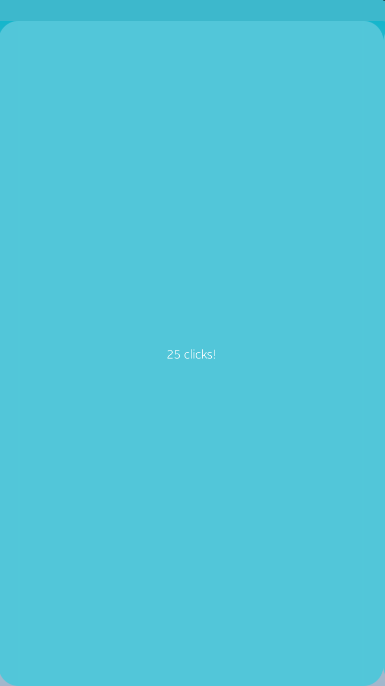</td>
			<td><a href="https://developer.xamarin.com/samples/xamarin-forms/ButtonCode/" target="_blank"><strong>ButtonCode</strong></a>
			
This program demonstrates how to create a Button in code and process events from it. By default, the Button occupies the entire page.

			</td>
		</tr>
		<tr>
			<td></td>
			<td><a href="https://developer.xamarin.com/samples/xamarin-forms/UserInterface/Styles/BasicStyles/" target="_blank"><strong>BasicStyles</strong></a>
			
Xamarin.Forms applications often contain multiple controls that have an identical appearance.

			
Setting the appearance of each individual control can be repetitive and error prone.

			
Instead, styles can be created that customize control appearance by grouping and settings properties available on the control type.

			
This sample demonstrates using the&nbsp;<code>Style</code>&nbsp;class to create styles.

			</td>
		</tr>
		<tr>
			<td class="confluenceTd" colspan="1">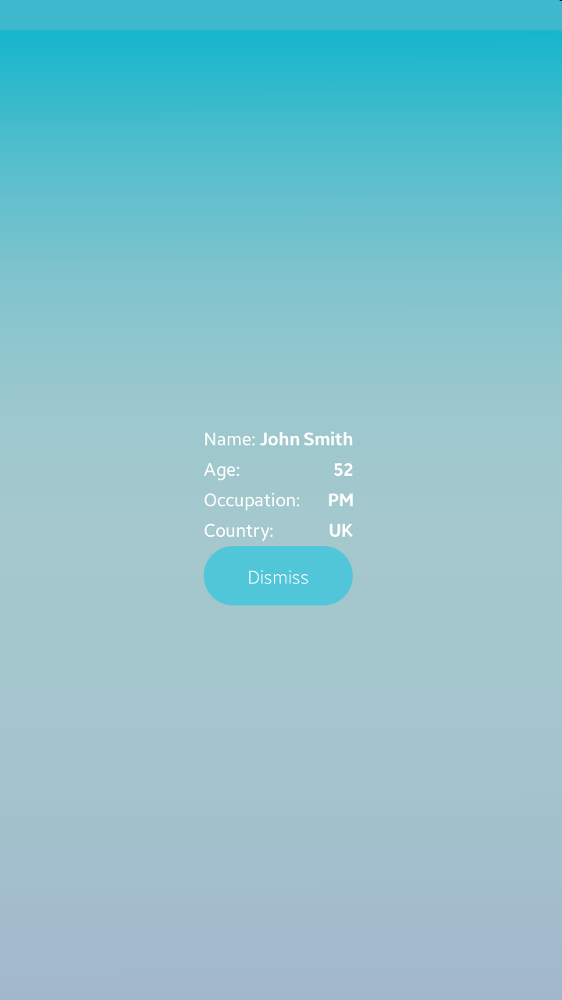</td>
			<td class="confluenceTd" colspan="1">
			
<a href="https://developer.xamarin.com/samples/xamarin-forms/Navigation/Modal/" target="_blank"><strong>Modal</strong></a>

			
This sample demonstrates how to navigate to modal pages.

			</td>
		</tr>
		<tr>
			<td class="confluenceTd" colspan="1">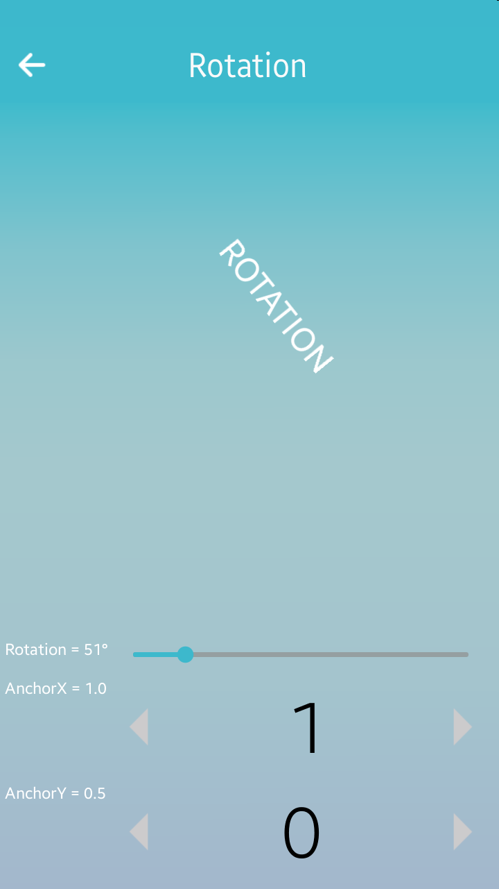</td>
			<td class="confluenceTd" colspan="1">
			
<a href="https://developer.xamarin.com/samples/xamarin-forms/ScaleAndRotate/" target="_blank"><strong>ScaleAndRotate</strong></a>

			
The Xamarin.Forms Scale and Rotation properties allow a program to scale and rotate Xamarin.Forms visual elements.

			</td>
		</tr>
		<tr>
			<td class="confluenceTd" colspan="1">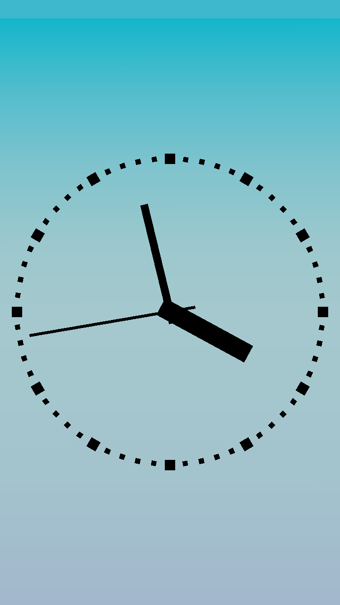</td>
			<td class="confluenceTd" colspan="1">
			
<a href="https://developer.xamarin.com/samples/xamarin-forms/BoxViewClock/" target="_blank"><strong>BoxViewClock</strong></a>

			
A classic analog clock realized entirely with&nbsp;<em>BoxView</em>.

			</td>
		</tr>
		<tr>
			<td class="confluenceTd" colspan="1">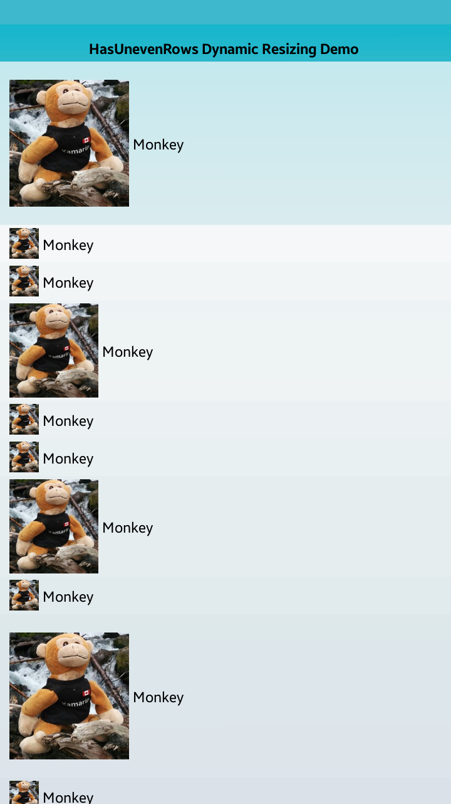</td>
			<td class="confluenceTd" colspan="1">
			
&nbsp;

			
<a href="https://developer.xamarin.com/samples/xamarin-forms/UserInterface/ListView/DynamicUnevenListCells/" target="_blank"><strong>DynamicUnevenListCells</strong></a>

			
This sample demonstrates using the `Cell.ForceUpdateSize` method to programmatically resize a `ListView` row at runtime.

			</td>
		</tr>
		<tr>
			<td class="confluenceTd" colspan="1">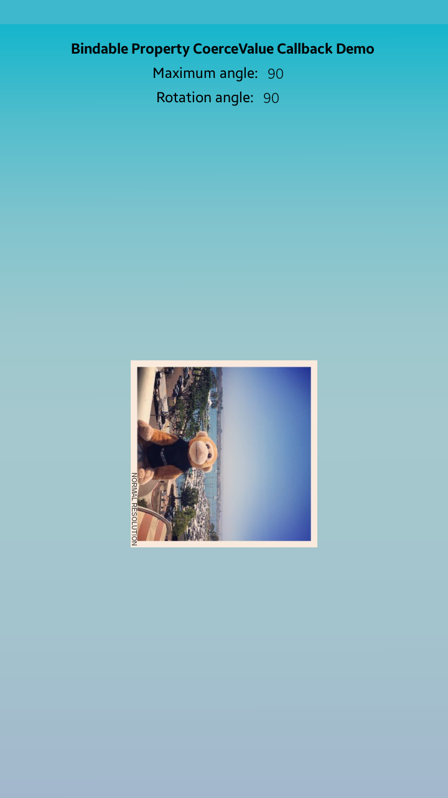</td>
			<td class="confluenceTd" colspan="1">
			
<a href="https://developer.xamarin.com/samples/xamarin-forms/XAML/CoerceValueCallback/" target="_blank"><strong>CoerceValueCallback</strong></a>

			
A bindable property is a special type of property, where the property's value is tracked by the Xamarin.Forms property system. This sample demonstrates using a coerce value callback to force a re-evaluation of a bindable property when the value of the property changes.

			</td>
		</tr>
		<tr>
			<td class="confluenceTd" colspan="1"></td>
			<td class="confluenceTd" colspan="1">
			
<a href="https://developer.xamarin.com/samples/xamarin-forms/Templates/DataTemplateSelector/" target="_blank"><strong>DataTemplateSelector</strong></a>

			
This sample demonstrates using a DataTemplateSelector to select a DataTemplate at runtime per item in a ListView.

			</td>
		</tr>
		<tr>
			<td class="confluenceTd" colspan="1">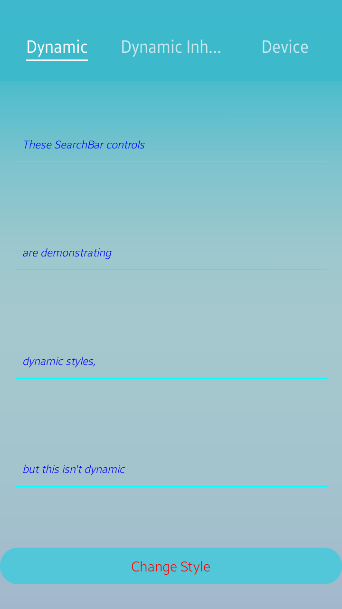</td>
			<td class="confluenceTd" colspan="1">
			
<a href="https://developer.xamarin.com/samples/xamarin-forms/UserInterface/Styles/DynamicStyles/" target="_blank"><strong>DynamicStyles</strong></a>

			
 
			This sample demonstrates how to use dynamic resources to make applications respond to style changes dynamically at runtime.

			</td>
		</tr>
		<tr>
			<td class="confluenceTd" colspan="1">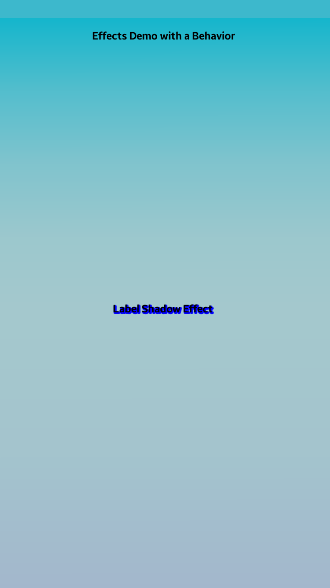</td>
			<td class="confluenceTd" colspan="1">
			
<a href="https://developer.xamarin.com/samples/xamarin-forms/Behaviors/EffectBehavior/" target="_blank"><strong>EffectBehavior</strong></a>

			
 
			Behaviors are a useful approach for adding an effect to a control, removing boiler-plate effect handling code from code-behind files. This sample demonstrates using a behavior to add an effect to a control.

			</td>
		</tr>
		<tr>
			<td class="confluenceTd" colspan="1">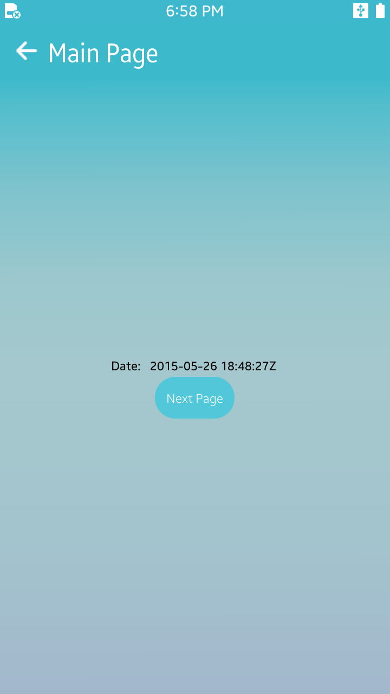&nbsp;&nbsp;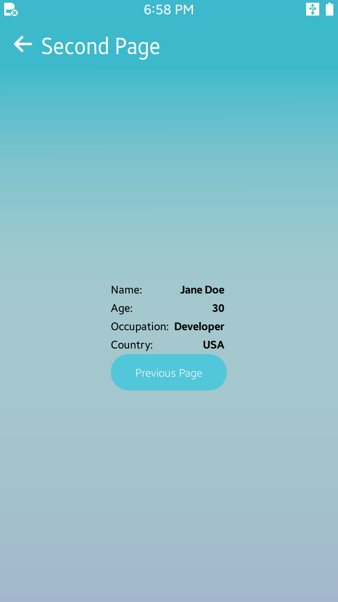</td>
			<td class="confluenceTd" colspan="1">
			
<a href="https://developer.xamarin.com/samples/xamarin-forms/Navigation/PassingData/" target="_blank"><strong>PassingData</strong></a>

			
This sample demonstrates how to pass data between pages when navigating.

			</td>
		</tr>
		<tr>
			<td class="confluenceTd" colspan="1"></td>
			<td class="confluenceTd" colspan="1">
			
<a href="https://developer.xamarin.com/samples/xamarin-forms/WorkingWithGestures/PanGesture/" target="_blank"><strong>PanGesture</strong></a>

			
This sample demonstrates using the `PanGestureRecognizer` class to implement dragging. 
			Presented image (1024x768 px) is smaller than these presented in screenshots from other platforms. This is caused by larger screen resolution in target on which app was tested (1280x720).

			</td>
		</tr>
		<tr>
			<td class="confluenceTd" colspan="1"></td>
			<td class="confluenceTd" colspan="1">
			
<a href="https://developer.xamarin.com/samples/xamarin-forms/WorkingWithGestures/PinchGesture/" target="_blank"><strong>PinchGesture</strong></a>

			
This sample demonstrates using the `PinchGestureRecognizer` class to implement interactive zoom functionality.

			</td>
		</tr>
		<tr>
			<td class="confluenceTd" colspan="1">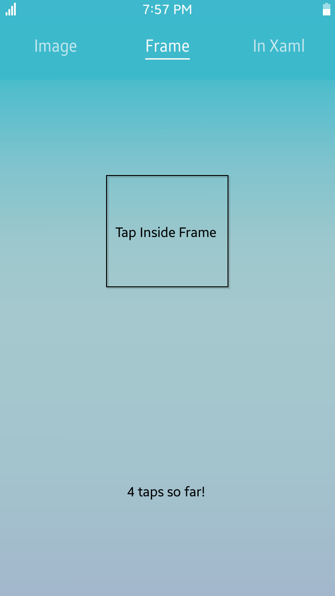&nbsp;&nbsp;&nbsp;&nbsp;</td>
			<td class="confluenceTd" colspan="1">
			
<a href="https://developer.xamarin.com/samples/xamarin-forms/WorkingWithGestures/TapGesture/" target="_blank"><strong>TapGesture</strong></a>

			
This sample demonstrates using the `TapGestureRecognizer` class to implement tap gesture recognition.

			</td>
		</tr>
		<tr>
			<td class="confluenceTd" colspan="1">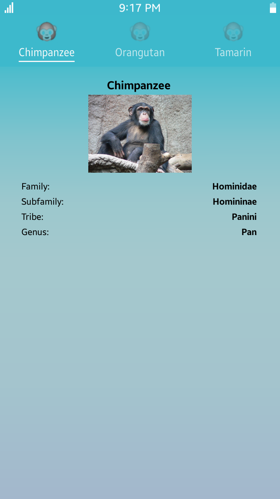</td>
			<td class="confluenceTd" colspan="1">
			
<a href="https://developer.xamarin.com/samples/xamarin-forms/Navigation/TabbedPage/" target="_blank"><strong>TabbedPage</strong></a>

			
This sample demonstrates how to use a `TabbedPage` to navigate through a collection of pages. The `TabbedPage` is constructed by assigning a collection to the `ItemsSource` property and assigning a `DataTemplate` to the `ItemTemplate` property to return pages for objects in the collection.

			</td>
		</tr>
		<tr>
			<td class="confluenceTd" colspan="1">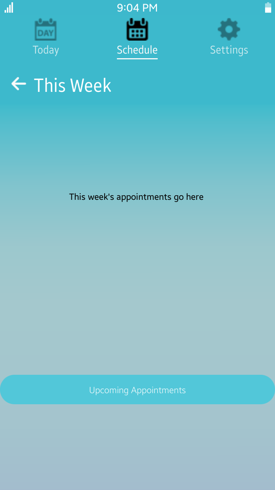</td>
			<td class="confluenceTd" colspan="1">
			
<a href="https://developer.xamarin.com/samples/xamarin-forms/Navigation/TabbedPageWithNavigationPage/" target="_blank"><strong>TabbedPageWithNavigationPage</strong></a>

			
This sample demonstrates how embed a `NavigationPage` in a `TabbedPage`, in order to perform page navigation within a tab. The `TabbedPage` is constructed by populating it with a collection of child `Page` objects.

			</td>
		</tr>
		<tr>
			<td class="confluenceTd" colspan="1">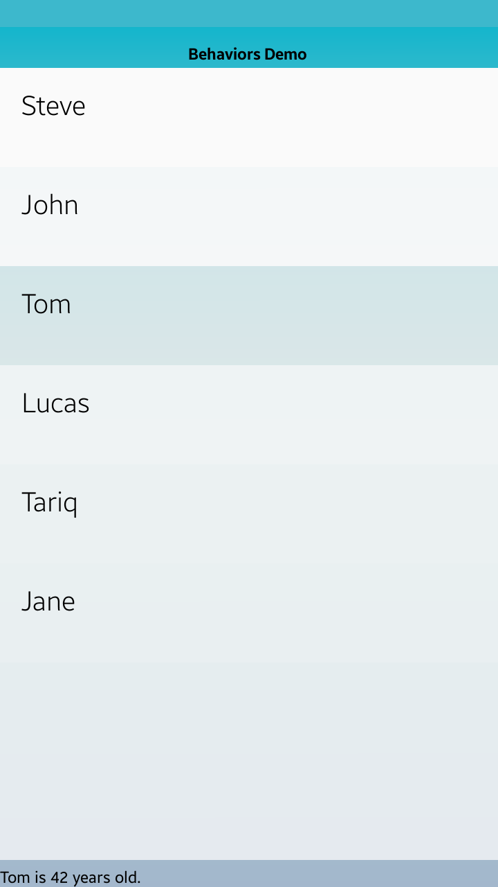</td>
			<td class="confluenceTd" colspan="1">
			
<a href="https://developer.xamarin.com/samples/xamarin-forms/Behaviors/EventToCommandBehavior/" target="_blank"><strong>EventToCommandBehavior</strong></a>

			
This sample demonstrates using a Xamarin.Forms behavior to invoke a command when an event fires.

			</td>
		</tr>
		<tr>
			<td class="confluenceTd" colspan="1">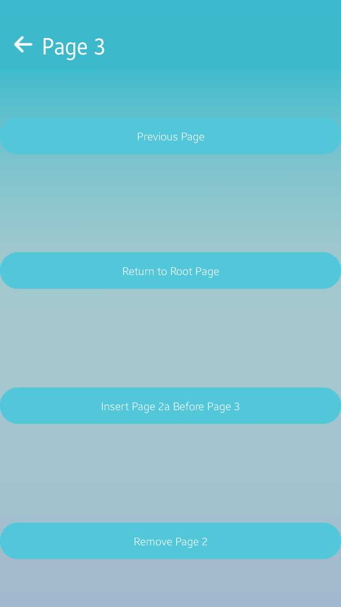</td>
			<td class="confluenceTd" colspan="1">
			
<a href="https://developer.xamarin.com/samples/xamarin-forms/Navigation/Hierarchical/" target="_blank"><strong>Hierarchical</strong></a>

			
This sample demonstrates how to perform hierarchical navigation through a stack of pages in Xamarin.Forms.

			</td>
		</tr>
		<tr>
			<td class="confluenceTd" colspan="1"></td>
			<td class="confluenceTd" colspan="1">
			
<a href="https://developer.xamarin.com/samples/xamarin-forms/Navigation/LoginFlow/" target="_blank"><strong>LoginFlow</strong></a>

			
This sample demonstrates how to manipulate the navigation stack in order to only display the main page of the application once the user has successfully logged in.

			</td>
		</tr>
		<tr>
			<td class="confluenceTd" colspan="1">&nbsp;&nbsp;</td>
			<td class="confluenceTd" colspan="1">
			
<a href="https://developer.xamarin.com/samples/xamarin-forms/Templates/ControlTemplates/SimpleTheme/" target="_blank"><strong>SimpleTheme</strong></a>

			
This sample demonstrates using a ControlTemplate to theme a ContentPage and change the theme at runtime.

			</td>
		</tr>
		<tr>
			<td class="confluenceTd" colspan="1">&nbsp; 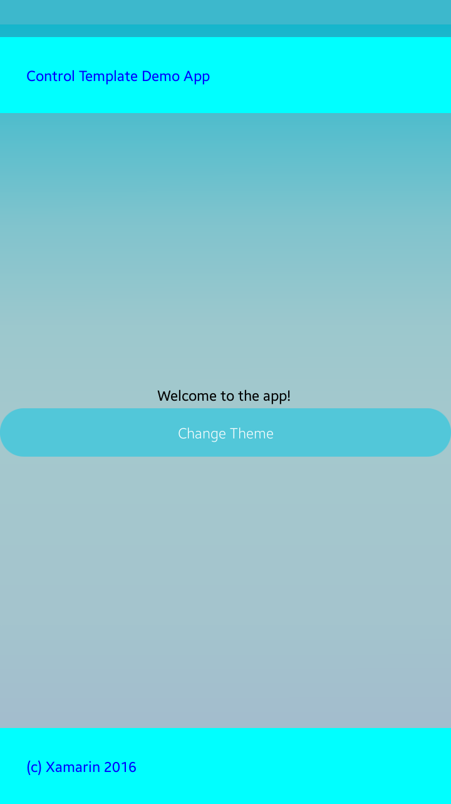</td>
			<td class="confluenceTd" colspan="1">
			
<a href="https://developer.xamarin.com/samples/xamarin-forms/Templates/ControlTemplates/SimpleThemeWithTemplateBinding/" target="_blank"><strong>SimpleThemeWithTemplateBinding</strong></a>

			
This sample demonstrates using a ControlTemplate with a TemplateBinding to theme a ContentPage and change the theme at runtime.

			</td>
		</tr>
		<tr>
			<td class="confluenceTd" colspan="1">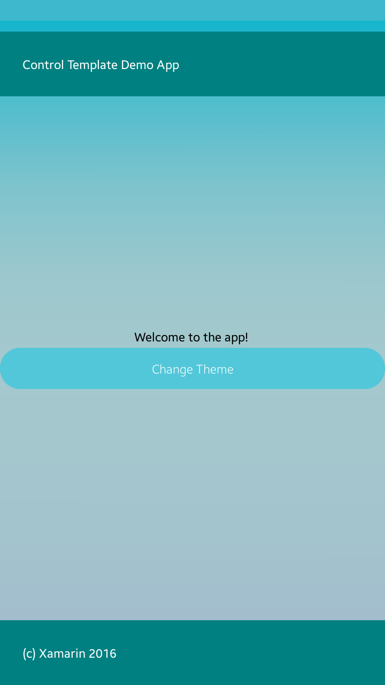&nbsp;&nbsp;</td>
			<td class="confluenceTd" colspan="1">
			
<a href="https://developer.xamarin.com/samples/xamarin-forms/Templates/ControlTemplates/SimpleThemeWithTemplateBindingAndViewModel/" target="_blank"><strong>SimpleThemeWithTemplateBindingAndViewModel</strong></a>

			
This sample demonstrates using a ControlTemplate with a TemplateBinding, that in turn binds to a ViewModel, to theme a ContentPage and change the theme at runtime.

			</td>
		</tr>
		<tr>
			<td class="confluenceTd" colspan="1"></td>
			<td class="confluenceTd" colspan="1">
			
<a href="https://developer.xamarin.com/samples/xamarin-forms/FormsGridLayout/" target="_blank"><strong>FormsGridLayout</strong></a>

			
This sample demonstrates how to display various ui elements in a grid.

			</td>
		</tr>
		<tr>
			<td class="confluenceTd" colspan="1">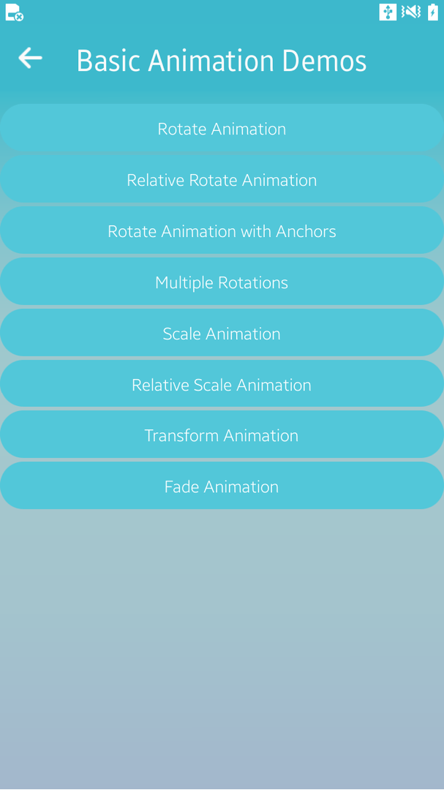</td>
			<td class="confluenceTd" colspan="1">
			
<a href="https://developer.xamarin.com/samples/xamarin-forms/UserInterface/Animation/Basic/" target="_blank"><strong>UserInterface/Animation/Basic</strong></a>

			
The <code>ViewExtensions</code> class provides extension methods that can be used to construct simple animations. This sample demonstrates creating and canceling animations using the <code>ViewExtensions</code> class.

			</td>
		</tr>
		<tr>
			<td class="confluenceTd" colspan="1">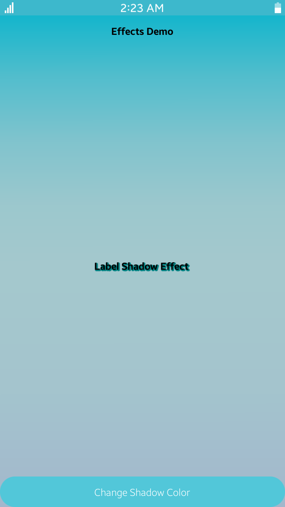</td>
			<td class="confluenceTd" colspan="1">
			
<a href="https://developer.xamarin.com/samples/xamarin-forms/Effects/ShadowEffectRuntimeChange/" target="_blank"><strong>Effects/ShadowEffectRuntimeChange</strong></a>

			
This sample demonstrates using attached properties to pass parameters to an effect, and changing a parameter at runtime.

			</td>
		</tr>
		<tr>
			<td class="confluenceTd" colspan="1"></td>
			<td class="confluenceTd" colspan="1">
			
<a href="https://developer.xamarin.com/samples/xamarin-forms/GettingStarted/" target="_blank"><strong>GettingStarted/XamarinFormsXamlSample</strong></a>

			
This sample demonstrates sharing C# code across platforms using Xamarin.Forms.

			</td>
		</tr>
		<tr>
			<td class="confluenceTd" colspan="1">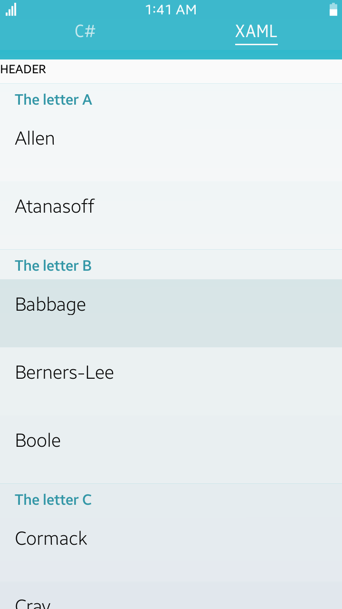</td>
			<td class="confluenceTd" colspan="1">
			
<a href="https://developer.xamarin.com/samples/xamarin-forms/LabelledSectionsList/" target="_blank"><strong>LabelledSectionsList</strong></a>

			
This sample demonstrates how to create an alphabetically ordered list with labelled sections.

			</td>
		</tr>
		<tr>
			<td class="confluenceTd" colspan="1">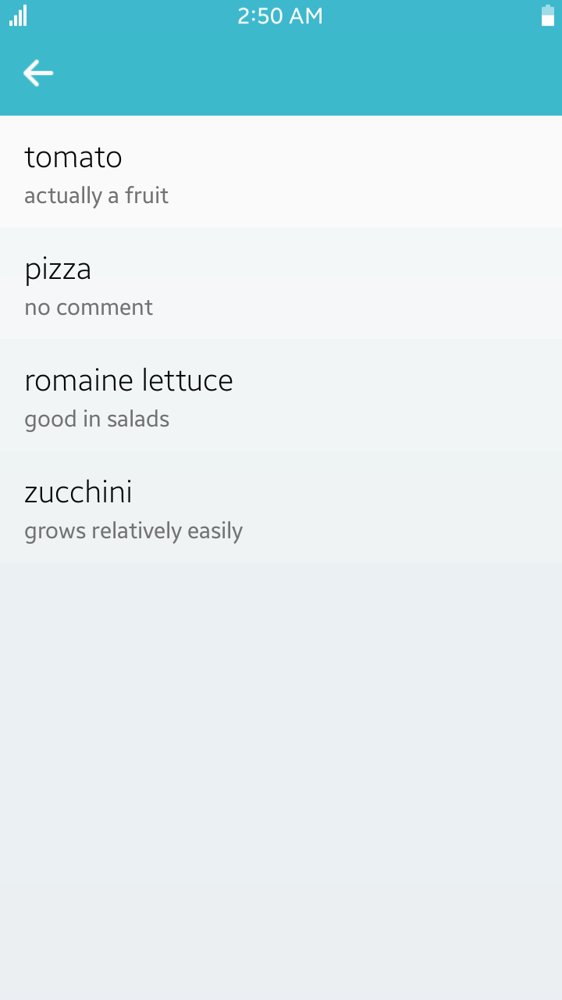&nbsp;&nbsp;&nbsp;&nbsp;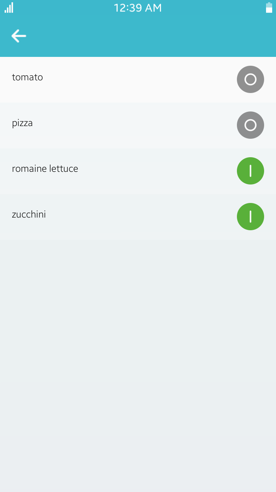&nbsp;&nbsp;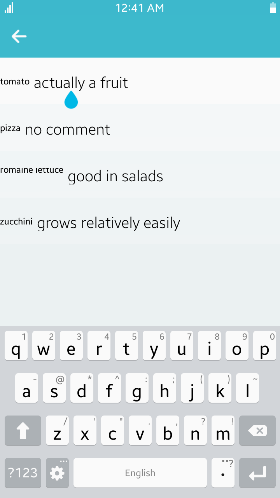</td>
			<td class="confluenceTd" colspan="1">
			
<a href="https://developer.xamarin.com/samples/xamarin-forms/UserInterface/ListView/BuiltInCells/" target="_blank"><strong>UserInterface/ListView/BuiltInCells/builtInCellsListView</strong></a>

			
Built-In Cells:

			<ul>
				<li>TextCell</li>
				<li>ImageCell</li>
				<li>SwitchCell</li>
				<li>EntryCell</li>
			</ul>
			</td>
		</tr>
		<tr>
			<td class="confluenceTd" colspan="1">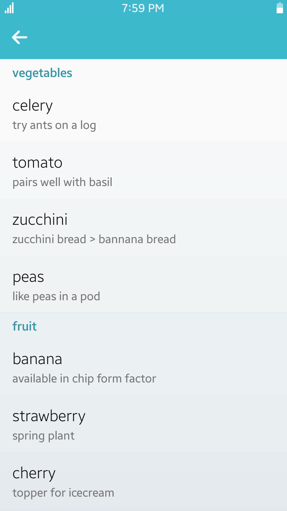</td>
			<td class="confluenceTd" colspan="1">
			
<a href="https://developer.xamarin.com/samples/xamarin-forms/UserInterface/ListView/Grouping/" target="_blank"><strong>UserInterface/ListView/Grouping/groupingSampleListView</strong></a>

			
This sample demonstrates how to implement grouping in a ListView, using both XAML and C#.

			</td>
		</tr>
		<tr>
			<td class="confluenceTd" colspan="1">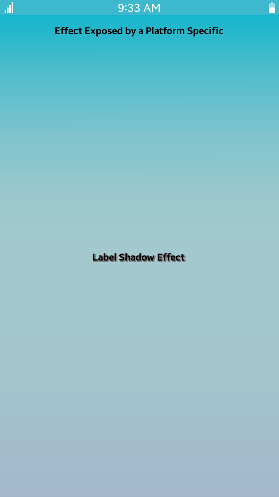</td>
			<td class="confluenceTd" colspan="1">
			
<a href="https://developer.xamarin.com/samples/xamarin-forms/Effects/ShadowEffect/" target="_blank"><strong>UserInterface/ShadowPlatformSpecific</strong></a>

			
This sample demonstrates how to expose an Effect through a platform-specific.

			</td>
		</tr>
		<tr>
			<td class="confluenceTd" colspan="1">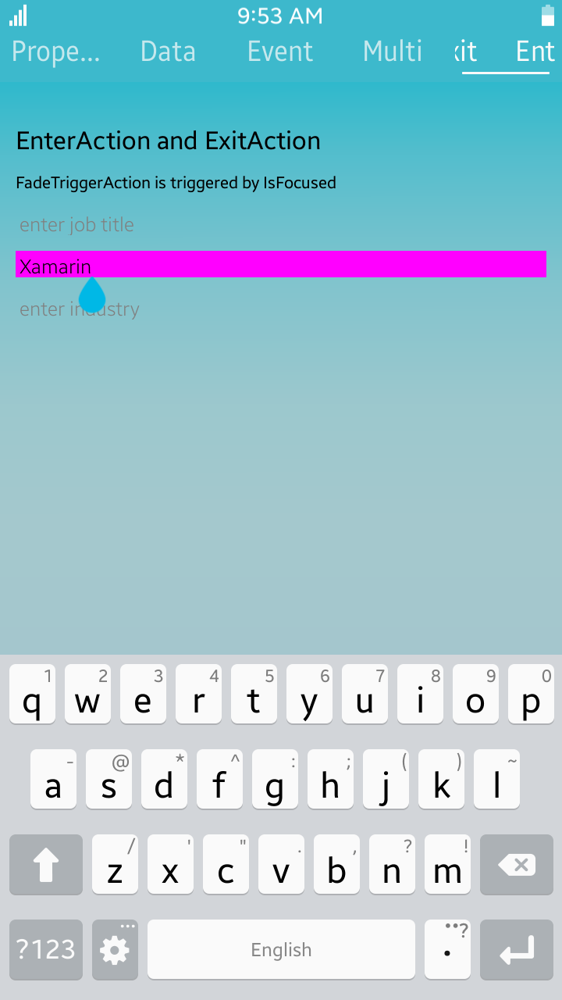</td>
			<td class="confluenceTd" colspan="1">
			
<strong><a href="https://developer.xamarin.com/samples/xamarin-forms/XAML/PassingConstructorArguments/" target="_blank">WorkingWithTriggers</a>&nbsp;</strong>

			
Example of using Xamarin triggers for view customization.

			</td>
		</tr>
		<tr>
			<td class="confluenceTd" colspan="1">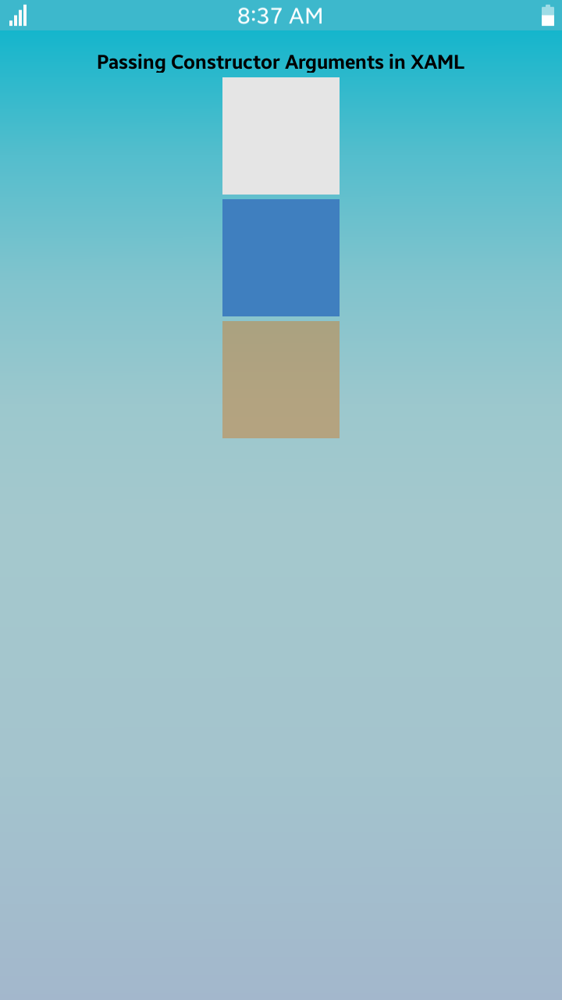</td>
			<td class="confluenceTd" colspan="1">
			
<a href="https://developer.xamarin.com/samples/xamarin-forms/XAML/PassingConstructorArguments/" target="_blank"><strong>XAML/PassingConstructorArguments&nbsp;</strong></a>

			
This sample demonstrates specifying constructor arguments for a non-default constructor in XAML.

			</td>
		</tr>
		<tr>
			<td class="confluenceTd" colspan="1"></td>
			<td class="confluenceTd" colspan="1">
			
<a href="https://developer.xamarin.com/samples/xamarin-forms/XAML/ValidationCallback/" target="_blank"><strong>XAML/ValidationCallback</strong></a>

			
A bindable property is a special type of property, where the property's value is tracked by the Xamarin.Forms property system. This sample demonstrates using a validation callback to validate the value of a bindable property.

			</td>
		</tr>
		<tr>
			<td class="confluenceTd" colspan="1">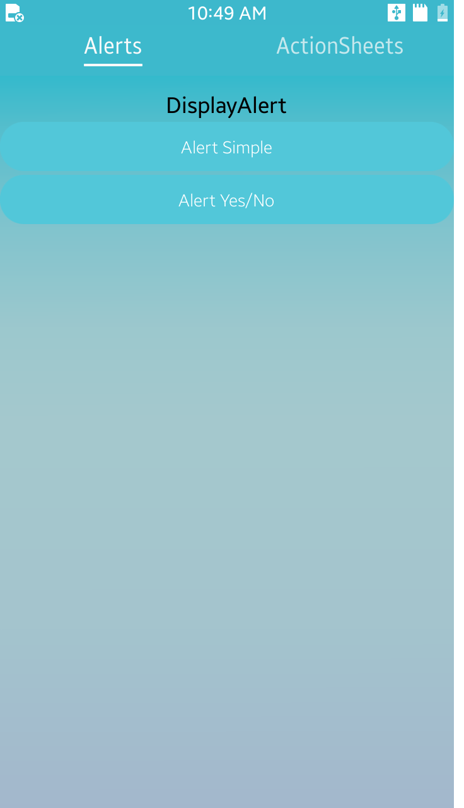</td>
			<td class="confluenceTd" colspan="1">
			
<a href="https://developer.xamarin.com/samples/xamarin-forms/Navigation/Pop-ups/" target="_blank"><strong>Navigation/Pop-ups</strong></a>

			
This sample demonstrates using the alert and action sheet APIs to ask users simple questions and guide users through tasks.

			</td>
		</tr>
		<tr>
			<td class="confluenceTd" colspan="1"></td>
			<td class="confluenceTd" colspan="1">
			
<a href="https://developer.xamarin.com/samples/xamarin-forms/SolitaireEncryption/" target="_blank"><strong>SolitaireEncryption</strong></a>

			
This sample illustrates the inclusion of a Unit Test project in a Xamarin.Forms solution and also a custom Button renderer.

			</td>
		</tr>
		<tr>
			<td class="confluenceTd" colspan="1">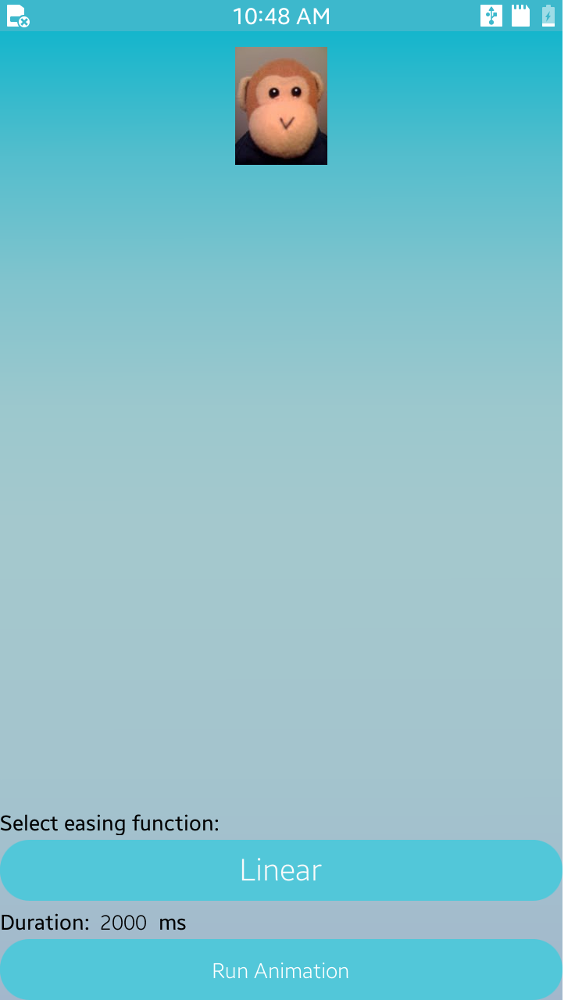</td>
			<td class="confluenceTd" colspan="1">
			
<a href="https://developer.xamarin.com/samples/xamarin-forms/UserInterface/Animation/Easing/" target="_blank"><strong>UserInterface/Animation/Easing</strong></a>

			
This sample demonstrates how to consume the pre-defined easing functions, and how to create custom easing functions.

			</td>
		</tr>
		<tr>
			<td class="confluenceTd" colspan="1">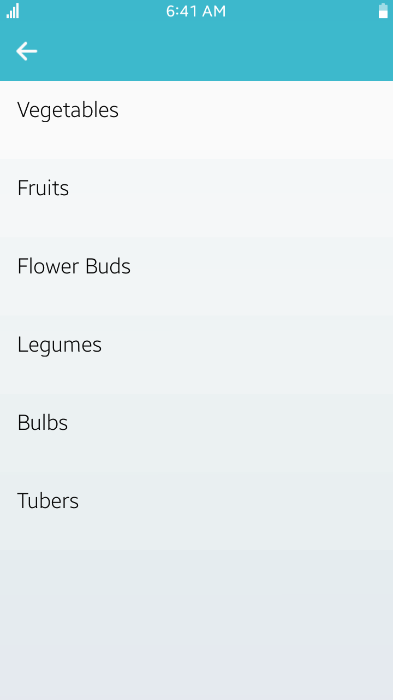</td>
			<td class="confluenceTd" colspan="1">
			
<a href="https://github.com/xamarin/xamarin-forms-samples/tree/master/UserInterface/ListView/Basics/" target="_blank"><strong>BasicFormsListView</strong></a>

			
This sample demonstrates basic use of ListView populated with just an array of strings, using the default view.

			</td>
		</tr>
		<tr>
			<td class="confluenceTd" colspan="1">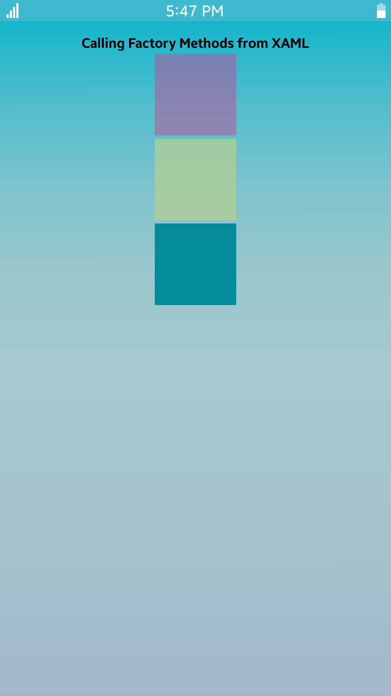</td>
			<td class="confluenceTd" colspan="1">
			
<a href="https://developer.xamarin.com/samples/xamarin-forms/XAML/CallingFactoryMethods/" target="_blank"><strong>CallingFactoryMethods</strong></a>

			
s sample demonstrates using XAML to call a factory method that can be used to initialize an object.

			</td>
		</tr>
		<tr>
			<td class="confluenceTd" colspan="1">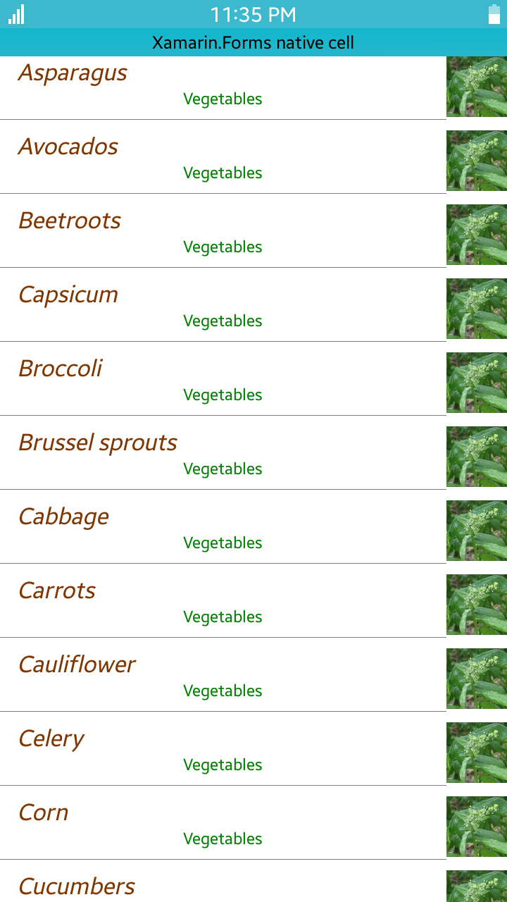</td>
			<td class="confluenceTd" colspan="1">
			
<a href="//developer.xamarin.com/samples/xamarin-forms/CustomRenderers/ListView/" target="_blank"><strong>CustomRenderer.ViewCell</strong></a>

			
This sample demonstrates a custom renderer that encapsulates platform-specific list controls and native cell layouts.

			</td>
		</tr>
		<tr>
			<td class="confluenceTd" colspan="1">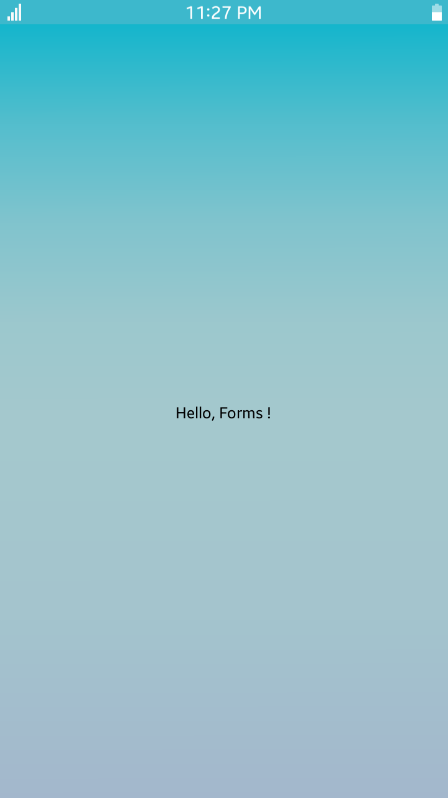</td>
			<td class="confluenceTd" colspan="1">
			
<a href="https://developer.xamarin.com/guides/xamarin-forms/getting-started/introduction-to-xamarin-forms/" target="_blank"><strong>HelloXamarinFormsWorld</strong></a>

			
The application demonstrates Xamarin Forms.

			</td>
		</tr>
		<tr>
			<td class="confluenceTd" colspan="1">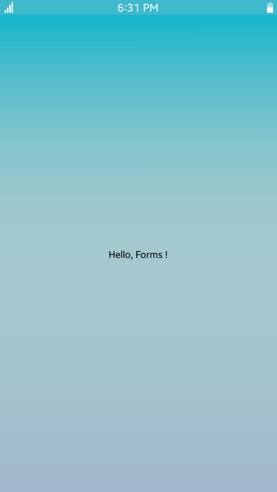</td>
			<td class="confluenceTd" colspan="1">
			
<strong><a href="https://github.com/xamarin/xamarin-forms-samples/tree/master/GettingStarted/HelloXamarinFormsWorldXaml/" target="_blank">HelloXamarinFormsWorldXaml</a></strong>

			
The application demonstrates Xamarin Forms.

			</td>
		</tr>
		<tr>
			<td class="confluenceTd" colspan="1">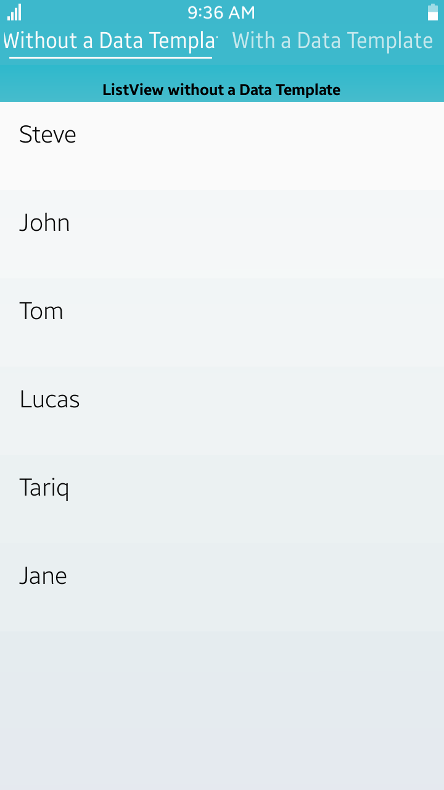</td>
			<td class="confluenceTd" colspan="1">
			
<a href="https://github.com/xamarin/xamarin-forms-samples/tree/master/Templates/DataTemplates" target="_blank"><strong>Template/DataTemplates</strong></a>

			
This sample demonstrates creating a DataTemplate to specify the appearance of data being displayed by a ListView.

			</td>
		</tr>
		<tr>
			<td class="confluenceTd" colspan="1">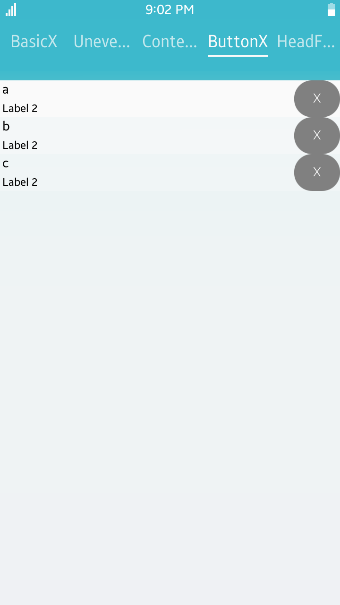</td>
			<td class="confluenceTd" colspan="1">
			
<a href="https://github.com/xamarin/xamarin-forms-samples/tree/master/WorkingWithListview" target="_blank"><strong>WorkingWithListView</strong></a>

			
These samples relate to the <a href="https://developer.xamarin.com/guides/xamarin-forms/user-interface/listview/" target="_blank">Working with ListView in Xamarin.Forms</a> doc.

			</td>
		</tr>
		<tr>
			<td class="confluenceTd" colspan="1">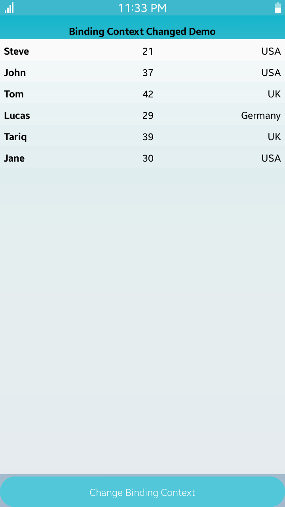</td>
			<td class="confluenceTd" colspan="1">
			
<a href="https://developer.xamarin.com/samples/xamarin-forms/UserInterface/ListView/BindingContextChanged/" target="_blank"><strong>UserInterface/ListView/BindingContextChanged</strong></a>

			
This sample demonstrates binding context changes in a ListView custom cell in Xamarin.Forms.

			</td>
		</tr>
		<tr>
			<td class="confluenceTd" colspan="1">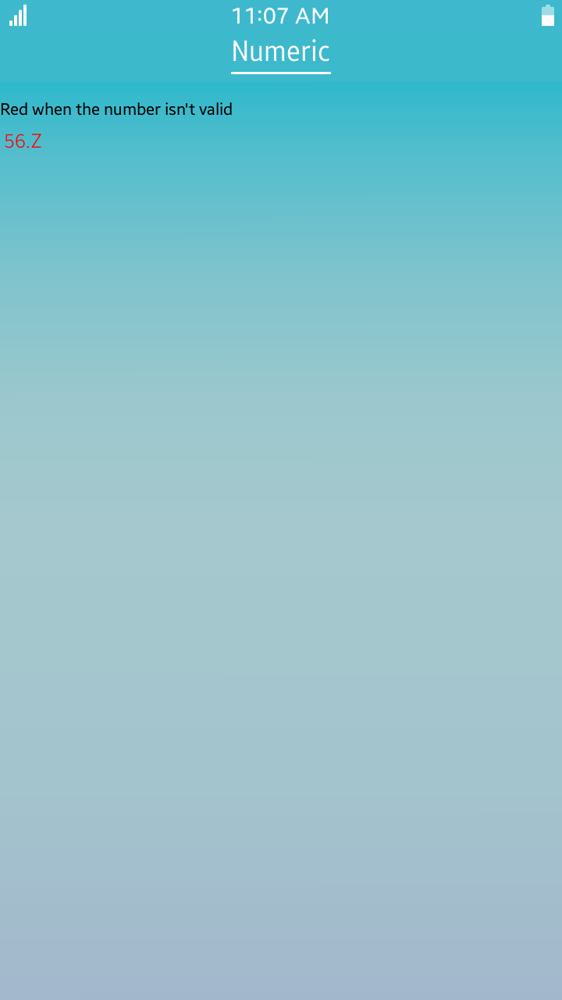</td>
			<td class="confluenceTd" colspan="1">
			
<a href="https://developer.xamarin.com/samples/xamarin-forms/Behaviors/AttachedNumericValidationBehavior/" target="_blank"><strong>Behaviors/Attached</strong></a>NumericValidationBehavior

			
This sample demonstrates creating and consuming an attached behavior. A behavior that's attached to a control through attached properties is known as an attached behavior.

			</td>
		</tr>
		<tr>
			<td class="confluenceTd" colspan="1">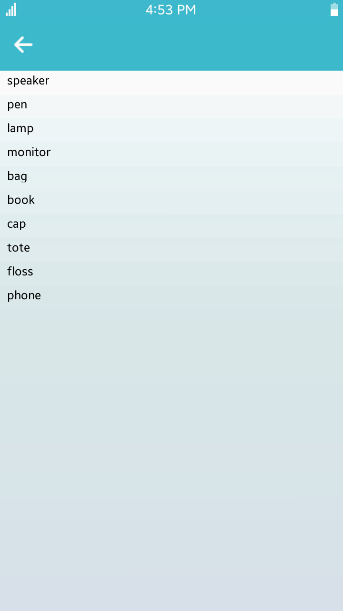</td>
			<td class="confluenceTd" colspan="1">
			
<a href="https://developer.xamarin.com/samples/xamarin-forms/UserInterface/ListView/Interactivity/" target="_blank"><strong>UserInterface/ListView/Interactivity/InteractivityListView</strong></a>

			
This sample demonstrates how to implement interactivity in ListView. Implementations for XAML and C# provided.

			* Context Actions * Pull-to-Refresh * Taps * Selection</td>
		</tr>
		<tr>
			<td class="confluenceTd" colspan="1"></td>
			<td class="confluenceTd" colspan="1">
			
<a href="https://developer.xamarin.com/samples/xamarin-forms/Getting%20Started/" target="_blank"><strong>GettingStarted/XamarinFormsSample</strong></a>

			
This sample demonstrates sharing C# code across platforms using Xamarin.Forms.

			</td>
		</tr>
		<tr>
			<td class="confluenceTd" colspan="1"></td>
			<td class="confluenceTd" colspan="1">
			
<a href="https://developer.xamarin.com/samples/xamarin-forms/PhonewordMultiscreen/" target="_blank"><strong>PhonewordMultiscreen</strong></a>

			
This sample demonstrates adding simple page navigation to the Phoneword app using Xamarin.Forms. The app functionality is to convert telephone number 'words' into digits (eg 1-800-FLOWERS to the actual phone number), and display a second page containing a list of phone numbers that have been called from the app.

			</td>
		</tr>
		<tr>
			<td class="confluenceTd" colspan="1">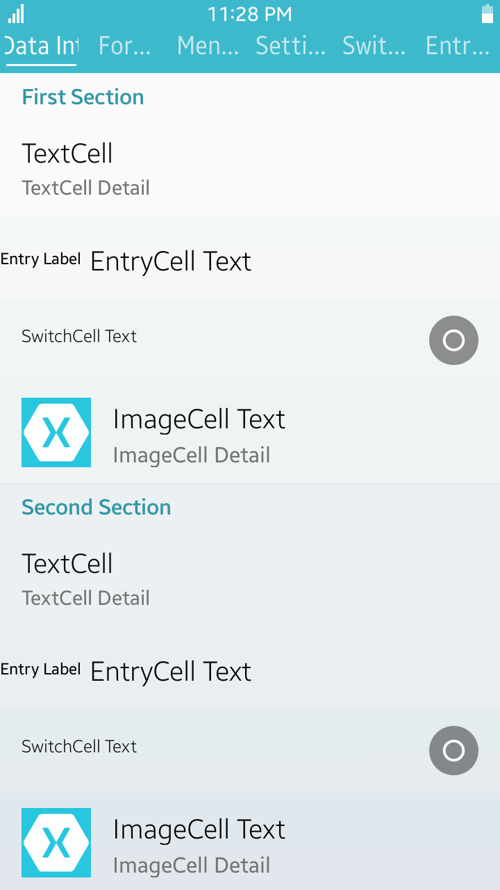&nbsp;&nbsp;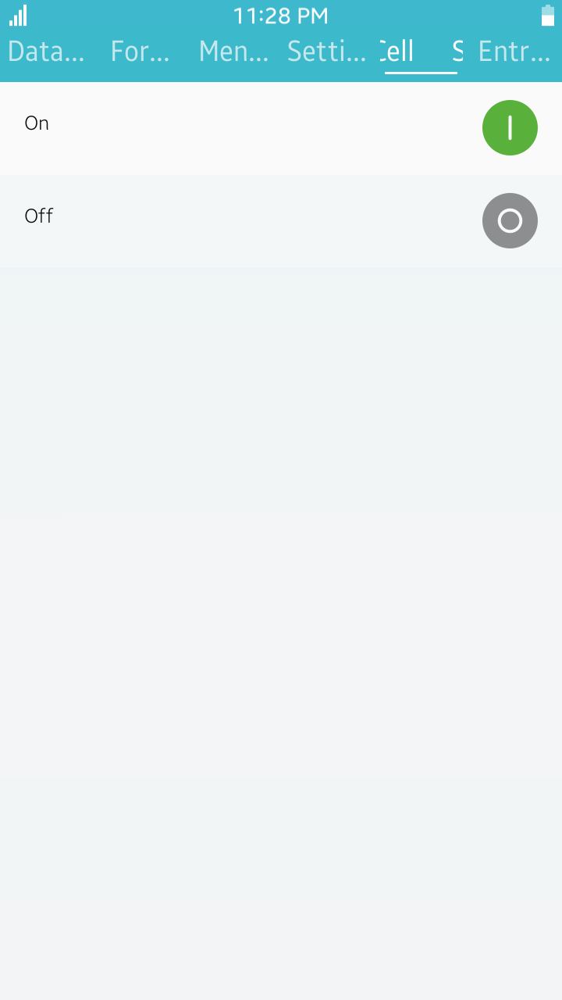&nbsp;&nbsp;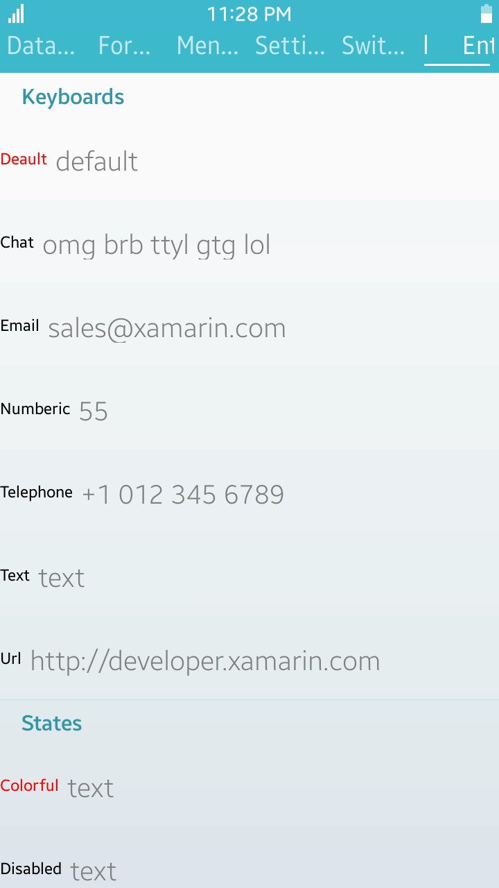</td>
			<td class="confluenceTd" colspan="1">
			
<a href="https://developer.xamarin.com/samples/xamarin-forms/UserInterface/TableView/" target="_blank"><strong>UserInterface/TableView/TableViewSamples</strong></a>

			
The app consists of several tabs. There are four tabs with identical tables, with each demonstrating a different&nbsp;<code>TableIntent</code>. There is one tab demonstrating the customization options of&nbsp;<code>EntryCell</code>. Another tab demonstrates&nbsp;<code>SwitchCell</code>.

			</td>
		</tr>
		<tr>
			<td class="confluenceTd" colspan="1"></td>
			<td class="confluenceTd" colspan="1">
			
<a href="https://developer.xamarin.com/samples/xamarin-forms/WorkingWithFiles/" target="_blank"><strong>WorkingWithFiles/PCL</strong></a>

			
These samples relate to the <a href="https://developer.xamarin.com/guides/xamarin-forms/application-fundamentals/files/" target="_blank">Working with Files in Xamarin.Forms</a> doc.

			</td>
		</tr>
		<tr>
			<td class="confluenceTd" colspan="1"></td>
			<td class="confluenceTd" colspan="1">
			
<a href="https://developer.xamarin.com/samples/xamarin-forms/WorkingWithNavigation/" target="_blank"><strong>WorkingWithNavigation</strong></a>

			
This sample demonstrate navigation using Xamarin.Forms.

			</td>
		</tr>
		<tr>
			<td class="confluenceTd" colspan="1">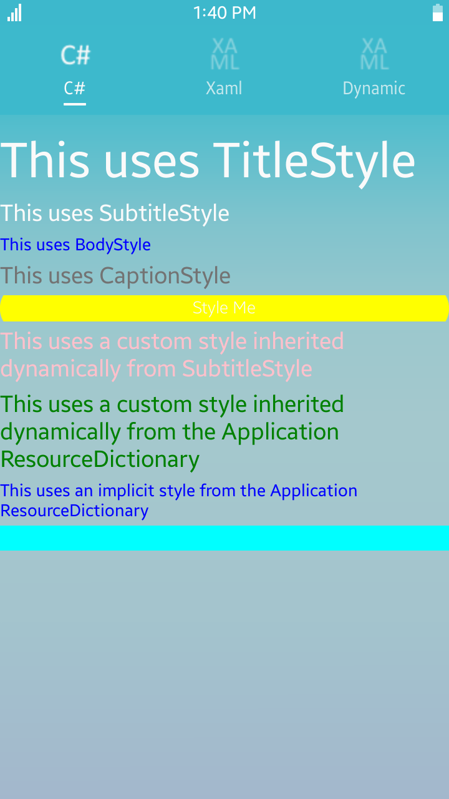</td>
			<td class="confluenceTd" colspan="1">
			
<a href="https://developer.xamarin.com/samples/xamarin-forms/WorkingWithStyles/" target="_blank"><strong>WorkingWithStyles</strong></a>

			
These samples relate to the Working with Files in Xamarin.Forms doc.

			</td>
		</tr>
		<tr>
			<td class="confluenceTd" colspan="1">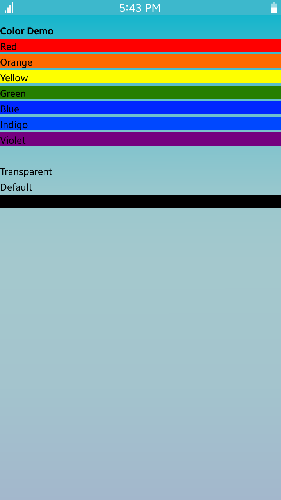</td>
			<td class="confluenceTd" colspan="1">
			
<a href="//developer.xamarin.com/samples/xamarin-forms/WorkingWithColors/" target="_blank"><strong>WorkingWithColors</strong></a>

			
This example presents the Xamarins Color class.

			</td>
		</tr>
		<tr>
			<td class="confluenceTd" colspan="1">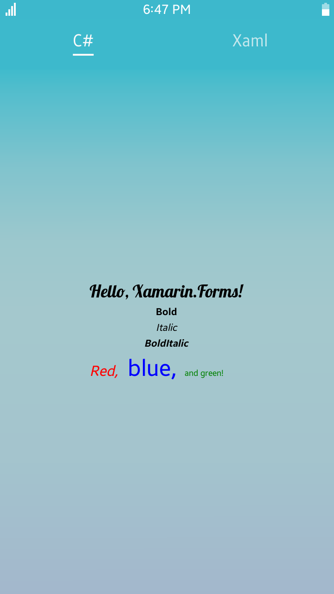</td>
			<td class="confluenceTd" colspan="1">
			
<a href="https://developer.xamarin.com/samples/xamarin-forms/WorkingWithFonts/" target="_blank"><strong>WorkingWithFonts</strong></a>

			
This sample shows how Xamarin.Forms lets you specify font attributes (including weight and size) on controls that display text.

			</td>
		</tr>
		<tr>
			<td class="confluenceTd" colspan="1"></td>
			<td class="confluenceTd" colspan="1">
			
<a href="https://developer.xamarin.com/samples/xamarin-forms/TipCalc/" target="_blank"><strong>TipCalc</strong></a>

			
TipCalc lets you type in a food-and-drink subtotal and a post-tax total from your restaurant bill and then select a tip percentage. It applies the percentage to the food-and-drink subtotal and adds the result to the post-tax total, rounded to the nearest quarter.

			</td>
		</tr>
		<tr>
			<td class="confluenceTd" colspan="1">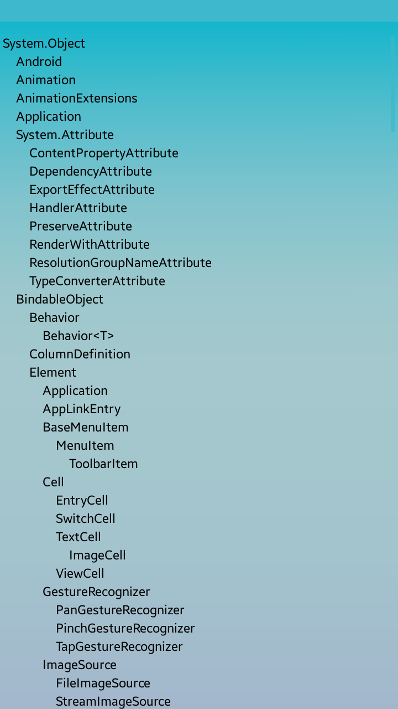</td>
			<td class="confluenceTd" colspan="1">
			
<a href="https://developer.xamarin.com/samples/xamarin-forms/ClassHierarchy/" target="_blank"><strong>ClassHierarchy</strong></a>

			
This program uses .NET reflection to display a scrollable hierarchy of all Xamarin.Forms classes, structures, and enumerations. Non-instantiable classes are displayed in the system accent color.

			</td>
		</tr>
		<tr>
			<td class="confluenceTd" colspan="1">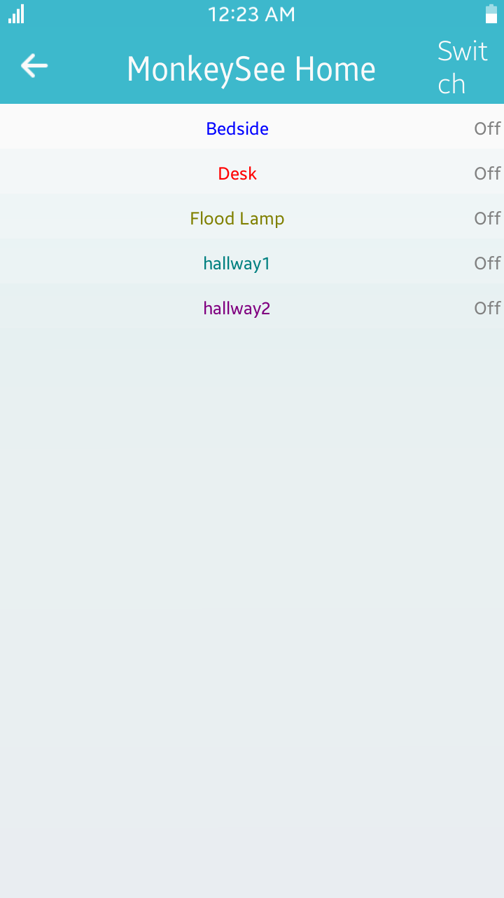</td>
			<td class="confluenceTd" colspan="1">
			
<a href="https://developer.xamarin.com/samples/xamarin-forms/UserInterface/ListView/SwitchEntryTwoBinding/" target="_blank"><strong>ListView TwoWayBinding</strong></a>

			
This sample demonstrates how to implement data collection using EntryCell and ViewCell in Xamarin.Forms. Implementations for XAML and C# provided.

			</td>
		</tr>
	</tbody>
</table>

