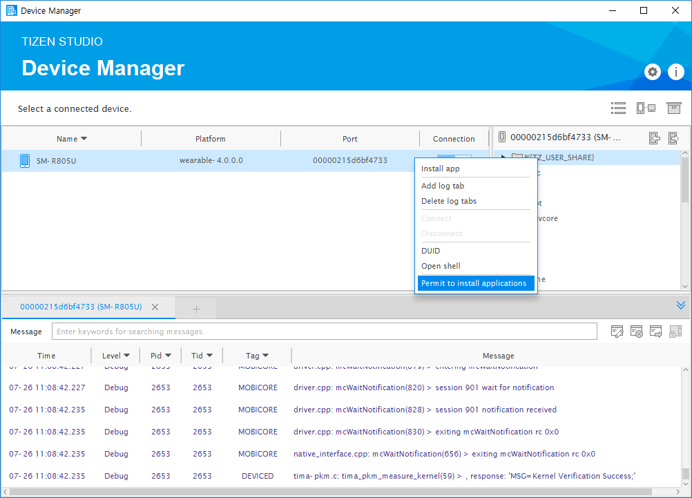

# Permit Device To Install Applications

To permit a device to install applications, follow these steps:

1. In the Visual Studio menu, select **Tools** > **Tizen** > **Tizen Device Manager**.
2. In the **Device Manager** window that appears, select the device and right-click. 
3. Select **Permit to install applications** from the options.

    

## Troubleshooting

If you fail to install an application on a device, follow these instructions:
- Verify the device date and time: If the certificate issued date is before the device date and time, the application cannot be installed as the certificate is considered invalid.
   
- Verify whether the **Permit to install applications** process is performed correctly.
