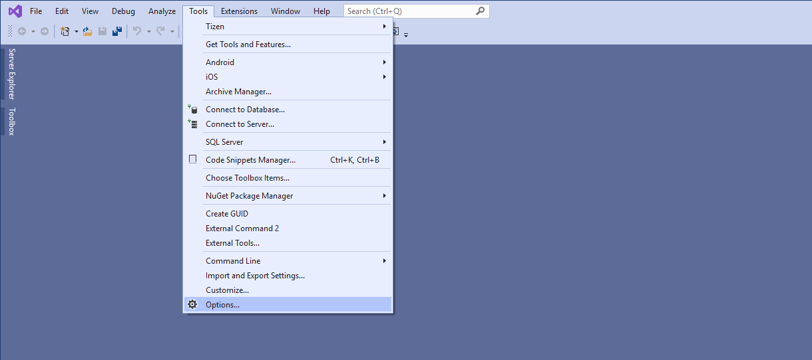
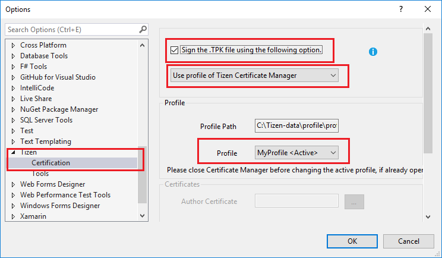

# Signing Application with Certificate

After creating a Samsung certificate for your galaxy watch, ensure that the Visual Studio IDE uses that same certificate to sign your application. 

To use the same certificate in Visual Studio, follow these steps:

1. In the Visual Studio menu, select **Tools > Options**.

    
2. In the **Options** window that appears, select **Tizen > Certification** from the left sidebar.
3. Select the **Sign the .TPK file using the following option.** checkbox.
4. Select **Use profile of Tizen Certificate Manager** from the drop-down list as highlighted in the image.
5. In the **Profile** section, select the certificate profile that you have created, and click **OK**.
	
    
