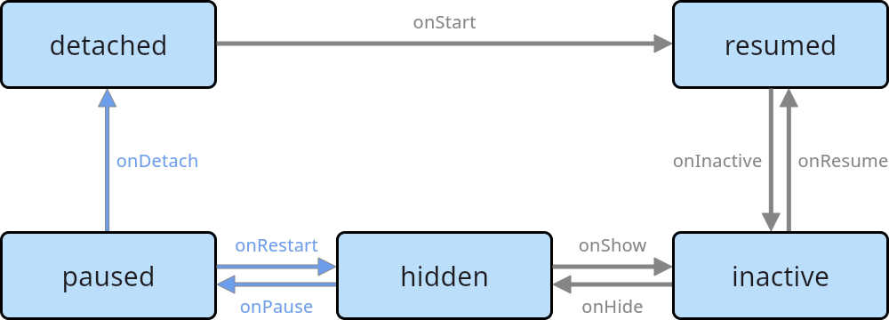

# Flutter Tizen Application

The flutter-tizen project enables you to develop and deploy cross-platform [Flutter](https://flutter.dev) applications on Tizen devices. This guide covers the Flutter Tizen Application model, life-cycle, packaging policy, Flutter Tizen APIs, and provides essential information for building and deploying applications on the Tizen platform.

* * *

## 1. Flutter Tizen Application Model

The Flutter Tizen application model is based on the Flutter framework and allows developers to build beautiful, natively-compiled applications for mobile, web, and desktop from a single codebase. The model integrates seamlessly with Tizen's native features through flutter-tizen plugins, providing a familiar and productive experience for Flutter developers.

The flutter-tizen project consists of:

- **flutter-tizen CLI**: Command-line tool for building and deploying Flutter apps to Tizen devices
- **flutter-tizen plugins**: Platform-specific implementations that expose Tizen native APIs to Flutter apps
- **tizen-interop plugin**: Enables Flutter apps to use Tizen native libraries directly

* * *

## 2. Flutter Tizen Application Life-cycle

The life-cycle of a Flutter Tizen application follows the Flutter application life-cycle pattern, which is slightly different from Tizen native and .NET applications. The life-cycle is managed by the Flutter engine and can be tracked using `AppLifecycleListener` or `WidgetsBindingObserver`.

* * *

### Application States

A Flutter Tizen application can be in one of the following states:

**Table: Application States**

| State | Description |
| --- | --- |
| **resumed** | Application is in the foreground and the user can interact with it. Corresponds to the `onResume()` callback. |
| **inactive** | Application is transitioning to background or another application. Corresponds to `onInactive()` or `onShow()` callbacks. |
| **hidden** | All views of the application are hidden. This state occurs when the app is about to pause or when transitioning from paused to inactive. |
| **paused** | Application is in the background and not responding to user input. Corresponds to `onPause()` callback. |
| **detached** | Flutter engine is completely detached from the view, typically during initialization or termination. Corresponds to `onDetach()` callback. |

**Figure: Flutter application state transitions**



### State Transitions

The following table shows Flutter application states and their corresponding callbacks:

**Table: State Transitions**

| Flutter State | Callback Method |
| --- | --- |
| resumed (onResume() or initState()) | Application initialization |
| inactive (onInactive()) → hidden (onHide()) → paused (onPause()) | Background transition |
| hidden (onRestart()) → inactive (onShow()) → resumed (onResume()) | Foreground transition |
| detached (onDetach() or dispose()) | Application termination |

### Managing Application Life-cycle

Flutter provides two main approaches to manage application life-cycle:

#### Using AppLifecycleListener

`AppLifecycleListener` provides a modern, convenient way to track application state changes:

```dart
import 'package:flutter/material.dart';
import 'package:flutter/scheduler.dart';

class _AppLifecycleDisplayState extends State<AppLifecycleDisplay> {
  late final AppLifecycleListener _listener;

  @override
  void initState() {
    super.initState();
    _listener = AppLifecycleListener(
      onShow: () => _handleTransition('onShow'),
      onResume: () => _handleTransition('onResume'),
      onHide: () => _handleTransition('onHide'),
      onInactive: () => _handleTransition('onInactive'),
      onPause: () => _handleTransition('onPause'),
      onDetach: () => _handleTransition('onDetach'),
      onRestart: () => _handleTransition('onRestart'),
      onStateChange: _handleStateChange,
    );
  }

  @override
  void dispose() {
    _listener.dispose();
    super.dispose();
  }

  void _handleTransition(String name) {
    print('Called Transition() [$name]');
  }

  void _handleStateChange(AppLifecycleState state) {
    print('Called StateChange() [${state.name}]');
  }
}
```

#### Using WidgetsBindingObserver

`WidgetsBindingObserver` provides an alternative approach to track life-cycle changes:

```dart
import 'package:flutter/material.dart';

class _MyHomePageState extends State<MyHomePage> with WidgetsBindingObserver {
  @override
  void initState() {
    super.initState();
    WidgetsBinding.instance.addObserver(this);
  }

  @override
  void dispose() {
    WidgetsBinding.instance.removeObserver(this);
    super.dispose();
  }

  @override
  void didChangeAppLifecycleState(AppLifecycleState state) {
    super.didChangeAppLifecycleState(state);
    print(state);

    switch (state) {
      case AppLifecycleState.resumed:
        print('앱이 다시 활성화되었습니다.[resumed]');
        break;
      case AppLifecycleState.inactive:
        print('앱이 비활성화되었습니다.[inactive]');
        break;
      case AppLifecycleState.paused:
        print('앱이 일시 중지되었습니다.[paused]');
        break;
      case AppLifecycleState.detached:
        print('앱이 종료되었습니다.[detached]');
        break;
      case AppLifecycleState.hidden:
        print('앱이 백그라운드에 완전히 숨겨졌습니다.[hidden]');
        break;
    }
  }
}
```

* * *

## 3. Flutter Tizen Application Packaging

The process of packaging a Flutter Tizen application involves creating a "tpk" file, which is the standard package format for Tizen applications. The packaging process follows similar policies to Tizen native applications, with specific considerations for Flutter applications.

**Package ID & Application ID**

- The Package ID and Application ID are unique identifiers for the application and follow the same naming conventions as Tizen native applications.
- Package ID format: Use a-z, A-Z, 0-9, ".", "-", and "_" characters, with a maximum length of 50 characters.

**Application Directory Policy**

Flutter Tizen applications have the following directory structure:

- **"bin" directory**: Contains the Flutter Tizen application binary and all published output files
- **"lib" directory**: Contains Flutter Tizen libraries and plugins
- **"res" directory**: Contains application resources
- **"data" directory**: Application's own directory for read/write operations
- **"shared/" directory**: For sharing with other applications

The `tizen-manifest.xml` file and signature files are located in the application root directory, similar to other Tizen applications.

**Manifest File**

- A manifest file (tizen-manifest.xml) defines the metadata, permissions, and functionality of the application
- **Platform version and API version**: Ensure that your application targets the correct Tizen platform version and API level
- The manifest file follows the same structure as Tizen native applications

**Signature Policy**

- To install an application on a Tizen device, you must sign it with a valid certificate
- The signing process is the same as for Tizen native applications, using author and distributor signatures
- For more information, please refer to the [Create a certificate profile](../guides/flutter-tizen/doc/install-tizen-sdk.md#create-a-certificate-profile) section.

* * *

## 4. Flutter Tizen API

Flutter Tizen applications leverage the Flutter framework APIs along with platform-specific APIs provided by flutter-tizen plugins.

**Flutter Framework API**

- The Flutter framework provides a rich set of widgets and APIs for building user interfaces
- Includes material design, Cupertino design, and custom widget support
- Provides state management solutions like `setState()`, `Provider`, `Bloc`, and more

**flutter-tizen plugins**

- flutter-tizen plugins expose Tizen native APIs to Flutter applications
- Plugins provide access to Tizen-specific features such as multimedia playback, system information, networking, and device hardware
- For a complete list of available plugins and their documentation, visit the [flutter-tizen plugins repository](https://github.com/flutter-tizen/plugins)

**tizen-interop plugin**

- The [tizen_interop](https://github.com/flutter-tizen/tizen_interop) plugin allows Flutter apps to use Tizen native libraries directly
- Provides a mechanism for interoperability between Flutter and Tizen native code
- Useful for accessing features not yet available as plugins

* * *

## 5. Flutter Tizen Application Development

To start developing a Flutter Tizen application, follow these steps:

1. **Installation**:
   - [Linux (x64)](./guides/flutter-tizen/doc/linux-install.md)
   - [Windows (x64)](./guides/flutter-tizen/doc/windows-install.md)
   - [macOS (x64)](./guides/flutter-tizen/doc/macos-install.md)

2. **Create a new project**:
   ```bash
   flutter-tizen create --platforms tizen my_app
   ```

3. **Code Writing**:
   - Use Dart and Flutter framework to develop application logic
   - Integrate flutter-tizen plugins for Tizen-specific features
   - Implement life-cycle management using `AppLifecycleListener` or `WidgetsBindingObserver`

4. **Build and deploy**:
   ```bash
   # Build a TPK in release mode and sign with an active profile.
   flutter-tizen build tpk
   # Install "build/tizen/tpk/*.tpk" on a Tizen device.
   flutter-tizen install

   or

   # Build and run in debug mode.
   flutter-tizen run
   ```

The entry point for a Flutter Tizen application is defined in the `main()` function of the application, where the Flutter app is initialized using `runApp()`.

**Development Tools**

- **Flutter CLI**: Standard Flutter development tools
- **flutter-tizen CLI**: Tizen-specific build and deployment command line interface
- **VS Code**: With Flutter and Tizen extensions for an enhanced development experience
