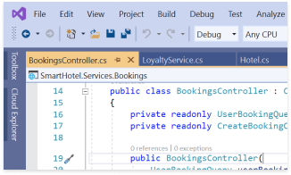
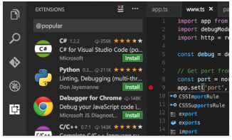
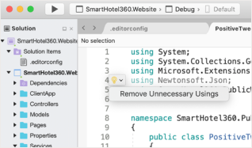
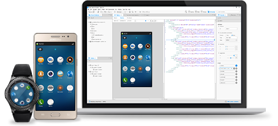

# Get Started

<section id ="main">
Tizen is a user-interactive and service-oriented open source project that allows you to create feature-rich applications for multiple device categories.

To get started with the development of your own Tizen applications:

    

        

            

                

                    

                    

                    <a href="get-started/wearable.md" target="_self">Get Started for Wearable</a>

                

            

        

        

            

                

                    

                    

                    <a href="get-started/tv.md" target="_self">Get Started for TV</a>

                

            

        

        

            

                

                    

                    

                    <a href="get-started/mobile.md" target="_self">Get Started for Mobile</a>

                

            

        

    

## Tizen Extensions for Visual Studio Family

    

        

            

                

                    

                    
<a href="vstools/index.md" target="_self">Visual Studio Tools for Tizen</a>

                

                

                    

                        

                        
Develop Tizen .NET applications with Tizen tools using Visual Studio.

                    

                

            

        

        

            

                

                    

                    
<a href="vstools-mac/overview.md" target="_self">Visual Studio for Mac Extension for Tizen</a>

                

                

                    

                        

                        
Develop Tizen .NET applications using Visual Studio Code on any OS.

                    

                

            

        

        

            

                

                    

                    
<a href="vscode-ext/index.md" target="_self">Visual Studio Code Extension for Tizen</a>

                

                

                    

                        

                        
Develop Tizen .NET applications easily with Visual Studio for Mac.

                    

                

            

        

    

       

        
Image source: <a href="https://visualstudio.microsoft.com/" target="_blank">https://visualstudio.microsoft.com/</a>

    

## Tizen Studio

    

        

            

            

                

                
Tizen Studio is the official IDE for developing web and native applications for Tizen.

                
<a href="tizen-studio/index.md" target="_self">Learn more</a>

            

            

        

    

</section>

