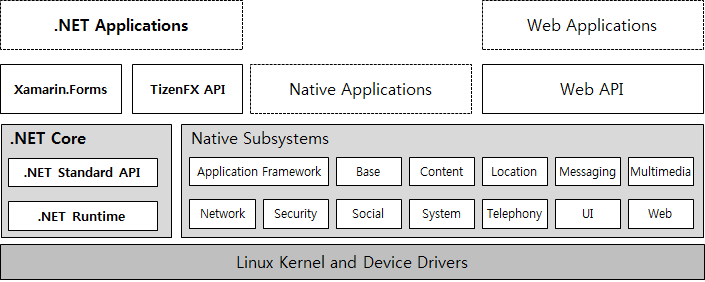

# Tizen Applications

Tizen is a user-interactive and service-oriented open source project that allows you to create feature-rich applications for multiple device categories.

Tizen is designed to be equally friendly to embedded systems developers and Web developers alike, and its flexible nature encourages its use on an array of devices, including TVs, smart phones, watches, tablets, in-vehicle infotainment systems, and smart appliances. Tizen provides a Native API that provides the benefits of building software for embedded systems in C; it also provides a Web API that allows you to create simple programs using only HTML5, CSS, and JavaScript.

To get started with the development of your own Tizen applications:

-   [Create your first Tizen .NET application](dotnet/getting-started/first-app.md), and learn about the main features available for implementing your dream application.

-   [Create your first simple native application](native/getting-started/mobile/first-app.md), and learn about the main features available for implementing your dream application.
-   [Create your first simple Web application](web/getting-started/mobile/first-app.md), and learn about the main features available for implementing your dream application.

The Visual Studio Tools for Tizen is a collection of tools for developing Tizen .NET application.

<a href="https://marketplace.visualstudio.com/items?itemName=tizen.VisualStudioToolsforTizen" target="_blank">
<Strong> Download Visual Studio Tools for Tizen</strong></a>

You can develop, build, debug, profile, and emulate Tizen Native and Web applications.

<a href="https://developer.tizen.org/development/tizen-studio/download" target="_blank">
<strong> Download Tizen Studio</strong></a>

## Tizen Application Types

The Tizen platform supports three primary application types:

-   [Native application](native/index.md) is developed using C and can access more advanced device-specific features, such as camera, GPS, and accelerometer in addition to more advanced system settings and functionality.

    The native applications use the Native API, which provides all of the memory management and performance benefits that come with building applications for Linux in C. The Native API is extremely helpful, as it includes dozens of API modules that cover a large range of capabilities. It provides numerous interfaces to much of the hardware that is found in modern mobile and wearable devices, and does so in an environment that is tailored for limited resources.

-   [Web application](web/index.md) is essentially a Web site stored on your device and built using Web-native languages, such as HTML5, CSS, and JavaScript. The Web application uses the Tizen Web Framework to interact with the native subsystems.

    The Web applications use the Web API, which is a standard Web application project structure with basic elements. The Web API is designed to allow you to easily build applications using Web-native languages.

    A program built using the Web API is laid out much like a standard Web site. It has an `index.html` file that serves as the root, and separate directories for resources, such as JavaScript, CSS, images, and sound resources. This approach makes Web application development in Tizen extremely intuitive for developers with a background in Web development, and makes it easy to quickly write simple applications using high-level languages.

-   [Tizen .NET application](dotnet/index.md) is a new way to develop applications for the Tizen operating system, running on 50 million Samsung devices, including TVs, wearables, mobile devices, and many other IoT devices around the world. The existing Tizen frameworks are either C-based with no advantages of a managed runtime, or HTML5-based with fewer features and lower performance than the C-based solution.

    With Tizen .NET, you can use the C\# programming language and the Common Language Infrastructure standards and benefit from a managed runtime for faster application development, and efficient, secure code execution.

The following figure illustrates the Tizen architecture model supporting the 3 application types.

**Figure: Tizen architecture**

The Tizen platform also allows you to develop a hybrid application package where native and Web applications are packaged together to make more powerful applications. The Tizen platform ensures that all Tizen applications have consistent look and feel, regardless of whether you use the native or Web framework to create them.

## Tizen Profiles

Tizen is built to work on a wide variety of platforms with a focus on embedded devices. In order to accommodate the various types of devices, a set of profiles has been defined to make it easier to develop applications for specific purposes and device types. Since Tizen 3.0, there are 3 profile types you can choose from: mobile, wearable, and TV. The mobile profile is designed for smart phones, the wearable profile is designed for smart watches, and the TV profile is designed for smart TVs.

Both mobile and wearable profiles are supported in native and Web application types. The TV profile is supported in the Web application type only.

**Figure: Applications using the mobile profile**

**Figure: Applications using the wearable profile**

**Figure: Applications using the TV profile**

To become familiar with some terms that you encounter throughout this site, see [Glossary](../glossary.md).  
To see the trademark notice list, see [Trademarks](../trademarks.md).

**See the following links for more information:**
- Source code (GIT/Gerrit): https://review.tizen.org/gerrit
- Tizen Build setup (OBS): https://build.tizen.org/
- Tizen Bug Tracking system (Jira): https://bugs.tizen.org/
- Download URL: http://download.tizen.org/

