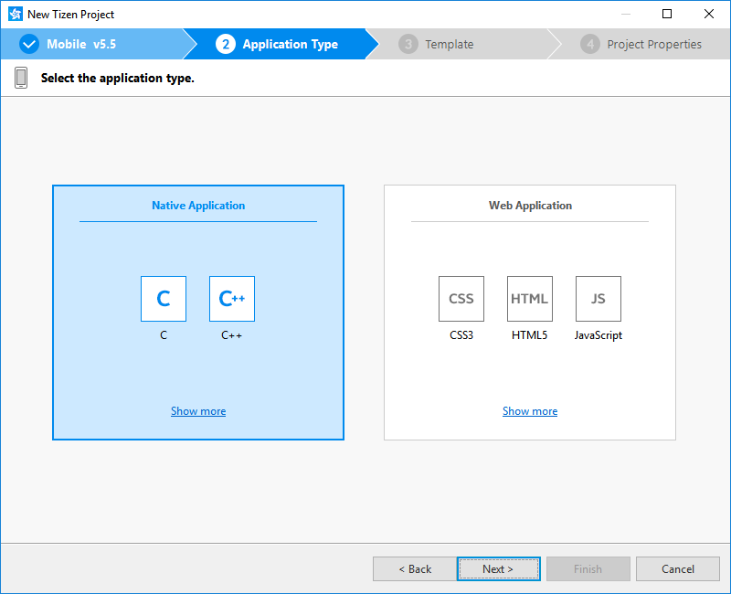
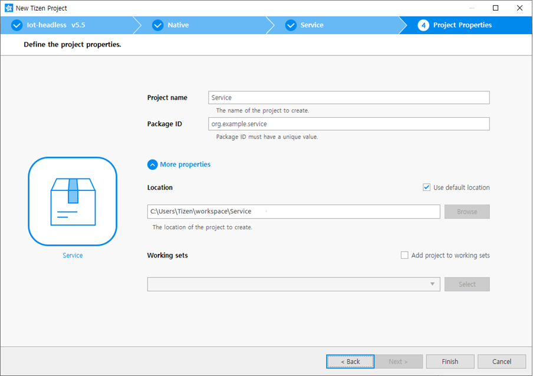
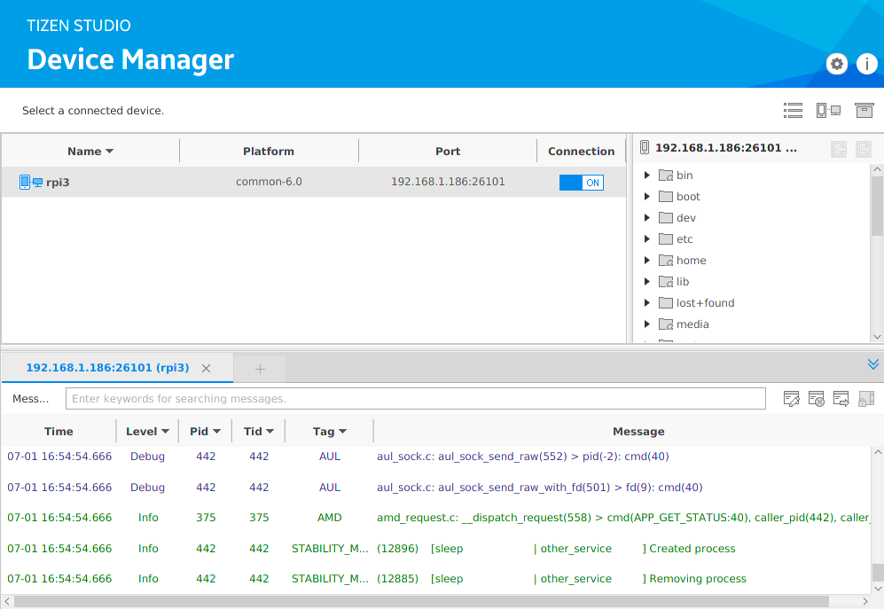

# Create Your First Tizen IoT Native Service Application

**Welcome to Tizen IoT Native Service Application development!**

> [!NOTE]
> Service applications are Tizen native applications, which run in the background with no graphical user interface.
> These applications can be very useful for activities, such as getting sensor data in the background that needs to run periodically or continuously but does not require any user interaction.

An IoT native service application can be created using the C language and run on Raspberry Pi. The application uses the native APIs, which provide various interfaces to the device hardware allowing you to take advantage of numerous capabilities tailored to run with limited device resources.

Study the following instructions to help familiarize yourself with the Tizen [Native application development process](../../tutorials/process/app-dev-process.md) as well as using Tizen Studio and deploying the created application on Raspberry Pi. With the instructions, you can create and run a basic IoT native service application, which displays some text on the log with no user interaction:

1. Before you get started with developing Tizen applications on Raspberry Pi, you must set up your development environment with the board.

    For more information on setting up the development environment with the board, see the following:
    - [Flashing Tizen Image](http://tizenschool.org/tutorial/191/contents/6)
    - [Setting up Raspberry Pi](http://tizenschool.org/tutorial/191/contents/8)

2. Download and install [Tizen Studio](../../../tizen-studio/index.md).

    For more information on the installation process, see the [installation guide](../../../tizen-studio/setup/install-sdk.md).

3. [Create an IoT native service project](#create) using Tizen Studio.

    This step shows how to use a pre-designed template that creates all the basic files and folders required for your project.

4. [Build the application](#build).

    This step shows how to build your own application by validating and compiling your codes.

5. [Run the application](#run).

    This step shows how to run your application on Raspberry Pi.

When you are developing a more complex application, you can take advantage of the [native tools included in Tizen Studio](../../../tizen-studio/native-tools/index.md) to ease the tasks of creating functionality and designing the application UI.

<a name="create"></a>
## Create project

The following example shows you how to create and configure a basic IoT native service application project in Tizen Studio. An application project contains all the files that make up an application.

The following figure illustrates the running result of the example application to be created. You can see the text log of the application (**Hello Tizen**) with no user interaction:

**Figure: Log of the IoT native service application**


To create the application project:

1. Launch Tizen Studio.

2. In the Tizen Studio menu, select **File \> New \> Tizen Project**.

    

    The Project Wizard opens.

3. In the Project Wizard, define the project details.

    The Project Wizard helps you to create a basic application skeleton with the predefined folder structure and mandatory files. You can easily create various applications by selecting an application template or sample to use in the Project Wizard.

    1.  Select the **Template** project type, and click **Next**.

        

    2. Select the profile (**Iot-headed or Iot-headless**) and version from a drop-down list, and click **Next**.

        The version depends on the platform version you have installed and with which you are developing the application.

        

    3. Select the **Native Application** application type, and click **Next**.

        

    4. Select the **Service** template, and click **Next**.

        

    5. Define the project properties, and click **Finish**.

        You can enter a project name (3-50 characters) and a unique package ID. You also can select the location and working sets by clicking **More properties**.

        

        The Project Wizard sets up the project and creates application files using the default content from the template. For more information on the Project Wizard and available templates, see [Creating Tizen Projects with Tizen Project Wizard](../../../tizen-studio/native-tools/project-wizard.md).

You can see the created project in the **Project Explorer** view. The most important files and folders include:

-   `inc`: Folder for included source files

-   `res`: folders for resource file used only within the application

-   `shared`: Folder for resource files to be shared with other applications

-   `src`: Folder for source code files

-   `lib`: Folder for external library files

-   `tizen-manifest.xml`: Manifest file used by the platform to install and launch the application

**Figure: The folder structure of the application in the Project Explorer**


> [!NOTE]
> You can [view and modify the application configuration](#configuration) in the manifest editor. In this example, no change in the configuration is required.

Your application project is now ready for further action.

<a name="configuration"></a>
### Manage application configuration

To view and modify the application configuration:

1. In the **Project Explorer** view, double-click the `tizen-manifest.xml` file of the application to open the manifest editor.

2. In the manifest editor, view and modify the configuration details using various tabs:

    

    - **Overview**: Define general information, such as the package, label, and icon of the application.

    - **Features**: Define required software and hardware features. This information is used for application filtering in Tizen Store.

    - **Privileges**: Define privileges for the security-sensitive APIs or API groups accessed and used by the application.

    - **Localization**: Define localized values for the application label, description, and icon.

    - **Advanced**: Define advanced features, such as application metadata, data control for services, application control functionalities, and account details.

    - **Source**: View and edit the source code of the `tizen-manifest.xml` file. Changes made and saved on the other tabs are reflected in the source code and vice versa.

        > [!NOTE]
        > The `tizen-manifest.xml` file must conform to both the XML file format and the Tizen Native application specification requirements. Editing the file in the **Source** tab is intended for advanced users only.

3. To save any changes, select **File > Save All** in the Tizen Studio menu.

For more information on configuring the application, see [Setting the Application Manifest](../../tutorials/process/setting-properties.md#manifest).

### Understand source code

Pay attention to the life-cycle callbacks in the application source code to understand how the application works.

The `main()` function in the `src/service.c` file is used to register callbacks that manage specific parts of the application life-cycle:

-   `service_app_create`
    -   Called when the application process starts.
-   `service_app_terminate`
    -   Called while the application process is terminating.
    -   Called after the main loop quits.
-   `service_app_control`
    -   Called after the `service_app_create` callback when the process starts.
    -   Called when a launch request is received while the process is running.
    -   Can receive `service_app_control` data (parameters for launching the application).
    -   Used to implement parameter-specific actions of the application.

```
int
main(int argc, char *argv[])
{
    char ad[50] = {0,};
    service_app_lifecycle_callback_s event_callback;
    app_event_handler_h handlers[5] = {NULL, };

    event_callback.create = service_app_create;
    event_callback.terminate = service_app_terminate;
    event_callback.app_control = service_app_control;

    return service_app_main(argc, argv, &event_callback, ad);
}
```

### Add log

You can print logs using the Dlog API in the Tizen native application.
For more information on **Dlog**, see [Dlog](../../../../iot/api/5.5/tizen-iot-headless/group__CAPI__SYSTEM__DLOG.html) API.

In this example, to confirm that the IoT native service application has been launched successfully, add the **Hello Tizen** as a debug log.

You can add the debug log as follows:

1. Confirm that `<dlog.h>` is included, and **LOG_TAG** is defined in `inc/service.h`.
**LOG_TAG** can be changed as you want:

    ```
    #include <dlog.h>

    #ifdef  LOG_TAG
    #undef  LOG_TAG
    #endif
    #define LOG_TAG "service"
    ```

2. To print the sentence you want, use `dlog_print()` in the `service_app_create()`:

    ```
    bool service_app_create(void *data)
    {
	    dlog_print(DLOG_DEBUG, LOG_TAG, "Hello Tizen");
	    return true;
    }
    ```

<a name="build"></a>
## Build your application

When your application code is ready, you may build the application. The building process performs a validation check and compiles your codes.

You can build the application automatically or manually:

-   **Automatically**

    The automatic build means that Tizen Studio automatically rebuilds the application whenever you change a source or resource file and saves the application project.

    To use the automatic build:

    1. Select the project in the **Project Explorer** view.
    2. In the Tizen Studio menu, select **Project \> Build Automatically**.

        

        A check mark appears next to the menu option.

    You can toggle the automatic build on and off by selecting **Project \> Build Automatically**.

- **Manually**

    The manual build means that you determine yourself when the application gets built.

    To manually build the application, right-click the project in the **Project Explorer** view and select **Build Project**.

    **Figure: Manually building the application**

    

    Alternatively, you can also select the project in the **Project Explorer** view and do one of the following:

    -   In the Tizen Studio menu, select **Project \> Build Project**.
    -   Press the **F10** key.

There are more than one build configurations. To see the currently active configuration or change it, right-click the project in the **Project Explorer** view and select **Build Configurations \> Set Active**. The default configuration is `Debug`. For more information, see [Building Applications](../../tutorials/process/building-app.md).

After you have built the application, run it.

<a name="run"></a>
## Run your application

You can run the application on Raspberry Pi.

<a name="target"></a>
### Run on Raspberry Pi

To run the application on a Raspberry Pi:

1. Set the Wi-Fi of Raspberry Pi.

    > [!NOTE]
    > The Wi-Fi of the PC with the Tizen Studio installed and Raspberry Pi must be on the same local network.

1. Generate an author certificate.

    Before you run the application, you must [sign your application package with a certificate profile](../../../tizen-studio/common-tools/certificate-registration.md) in Tizen Studio.

2. Run the application:
    1. In the **Tools \> Device Manager**, select Raspberry Pi and change the connection status to **ON**.

        

    2. In **Project Explorer** view, right-click the project and select **Run As \> Tizen Native Application**.

        

        Alternatively, you can also select the project in the **Project Explorer** view and do one of the following:

        -   Press the **Ctrl + F11** key.
        -   Click the run icon in the toolbar.

        If you have more than one connected device, select the device from the combo box in the toolbar before selecting to run the application.

	3. See logs to confirm if the application launches successfully on Raspberry Pi.

        

	For more information on the Log View, see the [checking Logs with Log View](../../../tizen-studio/common-tools/log-view.md).

    > [!NOTE]
    > The application is launched using the default debug run configuration. To create and use another configuration:
    > 1.  In the `Project Explorer` view, right-click the project and select `Run As > Run Configurations`.
    > 2.  In the `Run Configurations` window, click the `New Launch Configuration` icon (), define the configuration details, and launch the application by clicking `Run`.
    >    

