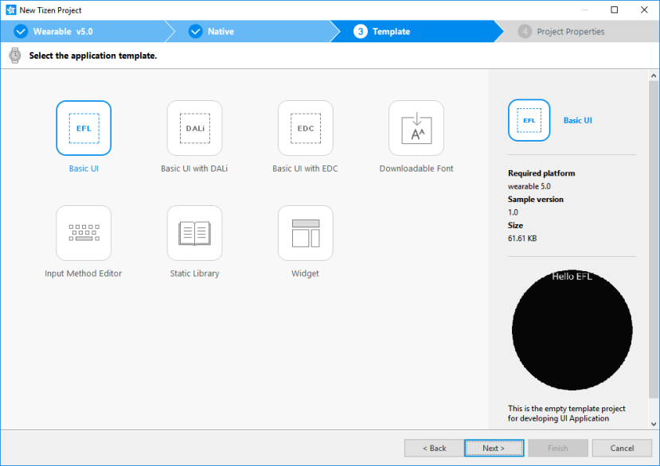
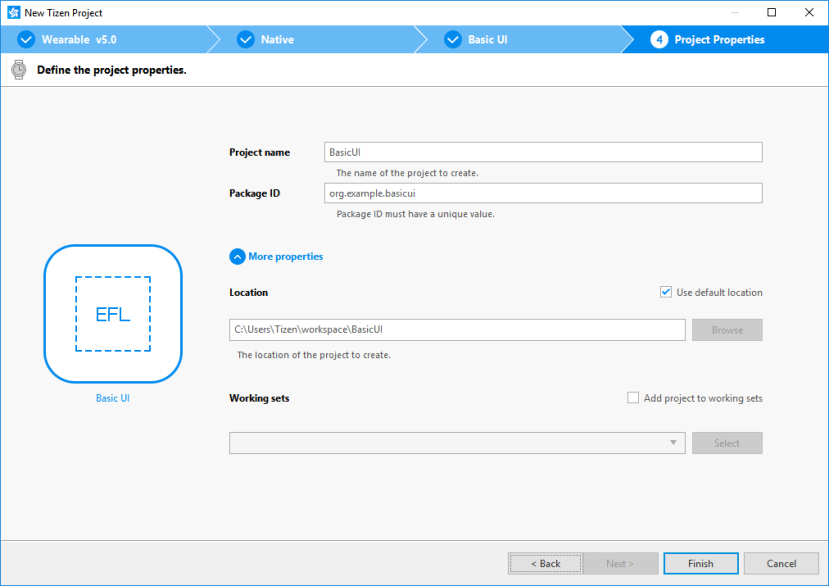
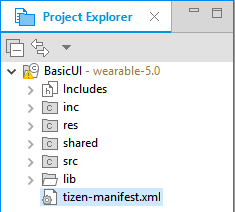
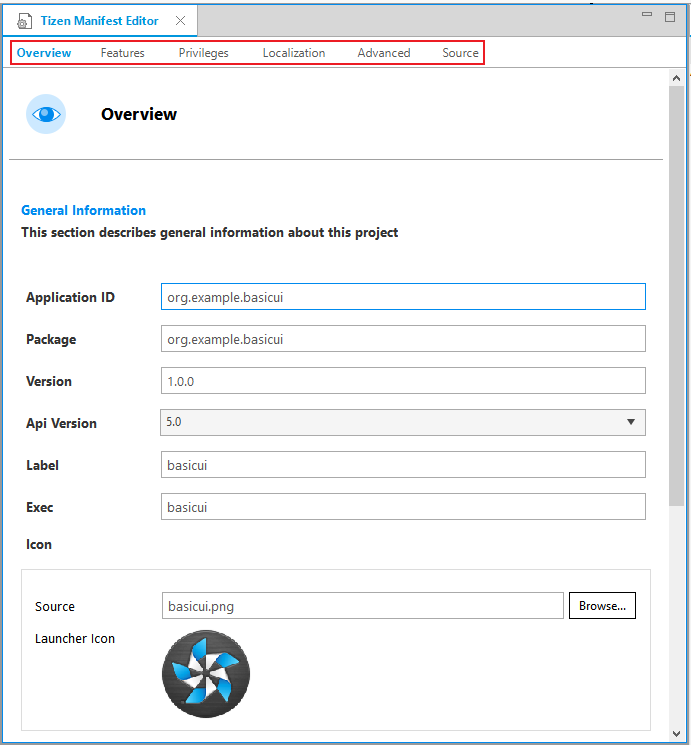
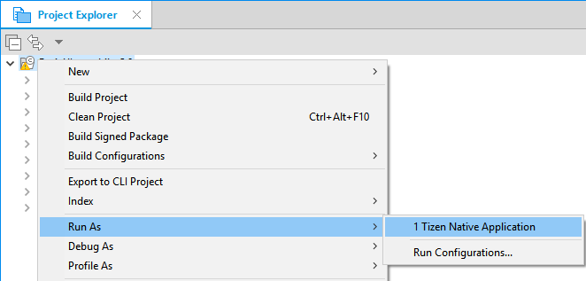
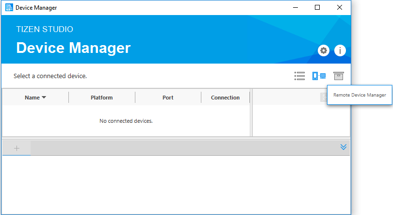

# Creating Your First Tizen Wearable Native Application

**Welcome to Tizen wearable native application development!**

A wearable native application is created using the C language, and can be run on Tizen wearable devices. The application uses the native API, which provides various interfaces to the device hardware allowing you to take advantage of numerous capabilities tailored to run with limited device resources.

Study the following instructions to help familiarize yourself with the Tizen [native application development process](../../tutorials/process/app-dev-process.md) as well as using the Tizen Studio and installing the created application on the emulator or target device. With the instructions, you can create and run a basic wearable native application, which displays some text on the screen with no user interaction:

1.  Before you get started with developing Tizen applications, download and install the [Tizen Studio](../../../tizen-studio/setup/download.md).

    For more information on the installation process, see the [installation guide](../../../tizen-studio/setup/install-sdk.md).

2.  [Create a wearable native project](#create) using the Tizen Studio.

    This step shows how you can use a predesigned project template that creates all the basic files and folders required for your project.

3.  [Build the application](#build).

    After you have implemented code for the features you want, this step shows how you can build the application to validate and compile the code.

4.  [Run the application](#run).

    This step shows how you can run the application on the emulator or a real target device.

5.  [Design a UI](#build_ui).

    This step shows how you can create the application UI and make small alterations to it to improve the usability of your application.

When you are developing a more complex application, you can take advantage of the [native tools included in the Tizen Studio](../../../tizen-studio/native-tools/cover-native.md) to ease the tasks of creating functionality and designing the application UI.

<a name="create"></a>
## Creating a Project

The following example shows you how to create and configure a basic wearable native application project in the Tizen Studio. An application project contains all the files that make up an application.

The following figure illustrates the application to be created. The application screen displays the **Hello Tizen** text and no user interaction is provided. If you click the **Back** key on the device, the application moves to the background.

**Figure: Wearable native Basic UI application**


To create the application project:

1.  Launch the Tizen Studio.

2.  Make sure the **Native** perspective is selected in the upper-right corner of the Tizen Studio window.

    

    If not, select it. If the perspective is not visible, in the Tizen Studio menu, select **Window &gt; Perspective &gt; Open Perspective &gt; Other &gt; Native**, and click **OK**.

3.  In the Tizen Studio menu, select **File &gt; New &gt; Tizen Project**.

    

    The Project Wizard opens.

4.  In the Project Wizard, define the project details.

    The Project Wizard is used to create the basic application skeleton with the required folder structure and mandatory files. You can easily create different applications by selecting an applicable template or sample for the Project Wizard to use.

    1.  Select the **Template** project type and click **Next**.

        

    2.  Select the profile (**Wearable**) and version from a drop-down list and click **Next**.

        The version depends on the platform version you have installed and with which you are developing the application.

        

    3.  Select the **Native Application** application type and click **Next**.

        

    4.  Select the **Basic UI** template and click **Next**.

        

    5.  Define the project properties and click **Finish**.

        You can enter the project name (3-50 characters) and the unique package ID. You can also select the location and working sets by clicking **More properties**.

        

        The Project Wizard sets up the project, creates the application files using the default content from the template, and closes. For more information on the Project Wizard and the available templates, see [Creating Tizen Projects with Tizen Project Wizard](../../../tizen-studio/native-tools/project-wizard.md).

You can see the created project in the **Project Explorer** view. The most important files and folders include:

-   `inc`: Default folder for included source files

-   `res`: Folder for resource files used by the application only

-   `shared`: Folder for resource files to be shared with other applications

-   `src`: Folder for source code files

-   `lib`: Folder for external library files

-   `tizen-manifest.xml`: Manifest file used by the platform to install and launch the application

**Figure: Application in the Project Explorer**



> **Note**
>
> You can [view and modify the application configuration](#configuration) in the manifest editor. In this example, no configuration changes are required.

Your application project is now ready for further actions. Next, build the application.

<a name="configuration"></a>
### Managing the Application Configuration

To view and modify the application configuration:

1.  In the **Project Explorer** view, double-click the `tizen-manifest.xml` file of the application. The Tizen Studio opens the file in the manifest editor.

2.  In the manifest editor, view and modify the configuration details using the various tabs:

    

    -   **Overview**: Define general information, such as the package, label, and icon of the application.

    -   **Features**: Define required software and hardware features. This information is used for application filtering in the Tizen Store.

    -   **Privileges**: Define the security-sensitive APIs or API groups accessed and used by the application.

    -   **Localization**: Define localized values for the application label, description, and icon.

    -   **Advanced**: Define advanced features, such as application metadata, data control for services, application control functionalities, and account details.

    -   **Source**: View and edit the source code of the `tizen-manifest.xml` file. Changes made and saved on the other tabs are reflected in the source code and vice versa.

        > **Note**
        >

		> The `tizen-manifest.xml` file must conform to both the XML file format and the Tizen native application specification requirements. Editing the file in the **Source** tab is intended for advanced users only.

3.  To save any changes, in the Tizen Studio menu, select **File &gt; Save All**.

For more information on configuring the application, see [Setting the Application Manifest](../../tutorials/process/setting-properties.md#manifest).

### Understanding the Source Code

Pay attention to the life-cycle callbacks in the application source code, to understand how the application works. For source code details related to the UI, see [Designing a Simple UI](#build_ui).

The `main()` function in the `src/basicui.c` file is used to register callbacks that manage specific parts of the application life-cycle:

-   `app_create`
    -   Called when the application process starts.
    -   Used to create UI components.
-   `app_terminate`
    -   Called while the application process is terminating.
    -   Called after the main loop quits.
-   `app_resume` (UI applications only)
    -   Called when the application window is shown.
-   `app_pause` (UI applications only)
    -   Called when the application window is totally hidden.
-   `app_control`
    -   Called after the `app_create` callback when the process starts.
    -   Called when a launch request is received while the process is running.
    -   Can receive `app_control` data (parameters for launching the application).
    -   Used to implement parameter-specific actions of the application.

```
int
main(int argc, char *argv[])
{
    appdata_s ad = {0,};
    int ret = 0;

    ui_app_lifecycle_callback_s event_callback = {0,};
    app_event_handler_h handlers[5] = {NULL,};

    event_callback.create = app_create;
    event_callback.terminate = app_terminate;
    event_callback.pause = app_pause;
    event_callback.resume = app_resume;
    event_callback.app_control = app_control;

    ret = ui_app_main(argc, argv, &event_callback, &ad);
    if (ret != APP_ERROR_NONE)
        dlog_print(DLOG_ERROR, LOG_TAG, "app_main() failed. Err = %d", ret);

    return ret;
}
```

<a name="build"></a>
## Building Your Application

After you have created the application project, you can implement the required features. In this example, only the default features from the project template are used, and no code changes are required.

When your application code is ready, you must build the application. The building process performs a validation check and compiles your files.

You can build the application in the following ways:

-   **Automatically**

    The automatic build means that the Tizen Studio automatically rebuilds the application whenever you change a source or resource file and save the application project.

    To use the automatic build:

    1.  Select the project in the **Project Explorer** view.
    2.  In the Tizen Studio menu, select **Project &gt; Build Automatically**.

        

        A check mark appears next to the menu option.

    You can toggle the automatic build on and off by reselecting **Project &gt; Build Automatically**.

-   **Manually**

    The manual build means that you determine yourself when the application is built.

    To manually build the application, right-click the project in the **Project Explorer** view and select **Build Project**.

    **Figure: Manually building the application**

    

    Alternatively, you can also select the project in the **Project Explorer** view and do one of the following:

    -   In the Tizen Studio menu, select **Project &gt; Build Project**.
    -   Press the **F10** key.

You can have more than one build configuration. To see the current active configuration or change it, right-click the project in the **Project Explorer** view and select **Build Configurations &gt; Set Active**. The default configuration is `Debug`. For more information, see [Building Applications](../../tutorials/process/building-app.md).

After you have built the application, run it.

<a name="run"></a>
## Running Your Application

You can run the application on the emulator or a real target device.

<a name="emulator"></a>
### Running on the Emulator

To run the application on the emulator:

1.  Launch an emulator instance in the [Emulator Manager](../../../tizen-studio/common-tools/emulator-manager.md):
    1.  In the Tizen Studio menu, select **Tools &gt; Emulator Manager**.

        

    2.  In the Emulator Manager, select a wearable emulator from the list and click **Launch**.

        If no applicable emulator instance exists, [create a new one](../../../tizen-studio/common-tools/emulator-manager.md#create).

        

        The emulator is launched in its own window. You can also see the new emulator instance and its folder structure in the **Device Manager**.

        

2.  Generate a security profile.

    Before you run the application, you must [sign your application package with a certificate profile](../../../tizen-studio/common-tools/certificate-registration.md) in the Tizen Studio.

3.  Run the application:
    1.  In the **Project Explorer** view, right-click the project and select **Run As &gt; Tizen Native Application**.

        

        Alternatively, you can also select the project in the **Project Explorer** view and do one of the following:

        -   Press the **Ctrl + F11** key.
        -   Click the run icon in the toolbar.

        If you have created multiple emulator instances, select the instance you want from the combo box in the toolbar before selecting to run the application. If you select an offline emulator, it is automatically launched when you select to run the application.

        

    2.  Confirm that the application launches on the emulator.

        

        > **Note**
        >
		> If the emulator display has switched off, you cannot see the application launch. To switch the display on, click the **Power** key (in the lower-right corner of the emulator).

        While the application is running, the **Log** view in the Tizen Studio shows the log, debug, and exception messages from the methods defined in the log macros. To see the view, in the Tizen Studio menu, go to **Window &gt; Show View &gt; Log**.

For more information on using the emulator features, see [Using Emulator Control Keys, Menu, and Panel](../../../tizen-studio/common-tools/emulator-control-panel.md) and [Using Extended Emulator Features](../../../tizen-studio/common-tools/emulator-features.md).

<a name="target"></a>
### Running on a Target Device

To run the application on a target device:

1.  Connect the wearable target device to your computer:
    1.  Define settings on the device:
        -   Go to **Settings &gt; Connections**, and switch on Bluetooth.

            

            

        -   Go to **Settings &gt; Connections**, and switch on Wi-Fi.

            The device and the computer must be connected to the same Wi-Fi network.

            Note the IP address the device is using.

            

        -   Go to **Settings &gt; Gear info**, and switch on the debugging mode.

            

    2.  Use the Remote Device Manager to connect the wearable device:
        1.  In the **Device Manager**, launch the Remote Device Manager by clicking the related icon.

            

        2.  In the **Remote Device Manager** window, click **+**.

            

        3.  In the **Add Device** window, enter the device and network details (use the IP address you noted before), and click **Add**.

            

        4.  In the **Remote Device Manager** window, switch the new device on by clicking the switch under **Connect**.

            

    3.  The device asks for user confirmation. To allow Gear to read log data, copy files to and from your computer, and install the application manually, click the accept mark.

        

    4.  In the **Device Manager**, confirm that the device is connected (shown in the device list).

        

2.  Generate an author certificate.

    Before you run the application, you must [sign your application package with a certificate profile](../../../tizen-studio/common-tools/certificate-registration.md) in the Tizen Studio.

3.  Run the application:
    1.  In the **Device Manager**, select the device.
    2.  In **Project Explorer** view, right-click the project and select **Run As &gt; Tizen Native Application**.

        

        Alternatively, you can also select the project in the **Project Explorer** view and do one of the following:

        -   Press the **Ctrl + F11** key.
        -   Click the run icon in the toolbar.

        If you have both a connected device and existing emulator instances, select the device from the combo box in the toolbar before selecting to run the application.

        

    3.  Confirm that the application launches on the target device.

    > **Note**
    >
	> The application is launched using the default debug run configuration. To create and use another configuration:
    > 1.  In the `Project Explorer` view, right-click the project and select `Run As > Run Configurations`.
    > 2.  In the `Run Configurations` window, click the `New Launch Configuration` icon (), define the configuration details, and launch the application by clicking `Run`.
    > 

<a name="build_ui"></a>
## Designing a Simple UI

The wearable application created with the **Basic UI** template has a simple user interface with a label component showing the **Hello Tizen** text at the top of the screen. The UI is created using [EFL](../../guides/ui/efl/introduction.md).

**Figure: User interface in the Basic UI template**


### Creating the Basic UI

The UI in the **Basic UI** template contains the following components:

-   The EFL UI always contains a window component, which is the root component of the entire UI.
-   Since the application has the indicator bar at the top of the screen, it requires the conformant component.
-   The text label is implemented with a label component.

The UI is created in the `basicui.c` file:

1.  Data structure

    A pointer to the UI components is stored in the `appdata_s` data structure:

    ```
    struct appdata {
        /* Window */
        Evas_Object *win;
        /* Conformant */
        Evas_Object *conform;
        /* Label */
        Evas_Object *label;
    };
    typedef struct appdata appdata_s;
    ```

2.  UI creation

    The `app_create()` life-cycle callback is called when the application main loop starts, and it calls the `create_base_gui()` function to create the UI:

    ```
    static bool
    app_create(void *data)
    {
        /*
           Hook to take necessary actions before the main event loop starts
           Initialize UI resources and application data
           If this function returns true, the application main loop starts
           If this function returns false, the application is terminated
        */
        appdata_s *ad = data;

        create_base_gui(ad);

        return true;
    }
    ```

3.  UI components
    1.  The `create_base_gui()` function creates the UI components: window, conformant, and label.

        The function receives a pointer to fill in the `appdata_s` structure.

        ```
        static void
        create_base_gui(appdata_s *ad)
        {
        ```

    2.  The window component is created with the `elm_win_util_standard_add()` function.

        Callbacks are also added for the window: one of the callbacks handles the `delete,request` event when the window is to be closed, and the other handles the `EEXT_CALLBACK_BACK` event when the hardware **Back** key is pressed.

        ```
            /*
               Window
               Create and initialize elm_win, which is mandatory to manipulate a window
            */
            ad->win = elm_win_util_standard_add(PACKAGE, PACKAGE);
            elm_win_autodel_set(ad->win, EINA_TRUE);

            if (elm_win_wm_rotation_supported_get(ad->win)) {
                int rots[4] = {0, 90, 180, 270};
                elm_win_wm_rotation_available_rotations_set(ad->win, (const int *)(&rots), 4);
            }
            evas_object_smart_callback_add(ad->win, "delete,request", win_delete_request_cb, NULL);
            eext_object_event_callback_add(ad->win, EEXT_CALLBACK_BACK, win_back_cb, ad);
        ```

    3.  The conformant component is needed to show the indicator bar at the top of the screen:

        -   The component is the first object added inside the window with the `elm_conformant_add()` function.
        -   The `elm_win_indicator_mode_set()` function decides whether the indicator is visible, and the `elm_win_indicator_opacity_set()` function sets the indicator opacity mode.
        -   The conformant component is set as a resize object of the window by using the `elm_win_resize_object_add()` function. It means that the conformant size and position are controlled by the window component directly.
        -   The `evas_object_show()` function makes the conformant component visible.

        ```
            /*
               Conformant
               Create and initialize elm_conformant, which is mandatory for the base GUI
               to have a proper size when an indicator or virtual keypad is visible
            */
            ad->conform = elm_conformant_add(ad->win);
            elm_win_indicator_mode_set(ad->win, ELM_WIN_INDICATOR_SHOW);
            elm_win_indicator_opacity_set(ad->win, ELM_WIN_INDICATOR_OPAQUE);
            evas_object_size_hint_weight_set(ad->conform, EVAS_HINT_EXPAND,
                                             EVAS_HINT_EXPAND);
            elm_win_resize_object_add(ad->win, ad->conform);
            evas_object_show(ad->conform);
        ```

    4.  The label component for the text is added with the `elm_label_add()` function. The label is added inside the conformant component, which is the label's parent.

        The label text is set with the `elm_object_text_set()` function.

        ```
            /*
               Label
               Create an actual view of the base GUI
               Modify this part to change the view
            */
            ad->label = elm_label_add(ad->conform);
            elm_object_text_set(ad->label, "<align=center>Hello Tizen</align>");
            evas_object_size_hint_weight_set(ad->label, EVAS_HINT_EXPAND,
                                             EVAS_HINT_EXPAND);
            elm_object_content_set(ad->conform, ad->label);
        ```

    5.  When all the UI components are ready, the `evas_object_show()` function makes the window component visible. This means that the window displays everything on the screen at once.

        ```
            /* Show the window after the base GUI is set up */
            evas_object_show(ad->win);
        }
        ```

### Modifying Existing Components

When the basic UI exists, you can easily modify the components in the UI by using the component-specific functions, or more general Evas object functions.

For example, the following modifications to the label component change the label style to a marker (making the text bold) and increase the font size to 50:

```
/* Label */
ad->label = elm_label_add(ad->conform);
elm_object_text_set(ad->label, "<align=center><font_size=50>Hello Tizen</font/></align>");
elm_object_style_set(ad->label, "marker");
evas_object_size_hint_weight_set(ad->label, EVAS_HINT_EXPAND, EVAS_HINT_EXPAND);
elm_object_content_set(ad->conform, ad->label);
```

**Figure: Modified label component**


### Adding More Components and Functionality

The basic UI only contains one visible label component. You can use it as a basis to design a more elaborate UI with more components, screens, and functionality. The following example shows how to add a list to the existing view (screen), and how to create a second view and move between the 2 views.

All the code changes in this section are made within the `create_base_gui()` function, unless stated otherwise.

To add more content to the UI:

1.  Modify the existing label view to contain a list too.

    To add more components, first create a container that can hold all the various components in one view.

    In this example, the box container is used. It is created and added to the conformant. The new list is created, and then the new list and the existing label component are both added to the box.

    1.  Add the box and list objects to the `appdata_s` data structure:

        ```
        struct appdata {
            Evas_Object *win;
            Evas_Object *conform;
            Evas_Object *label;
            /* Box */
            Evas_Object *box;
            /* List */
            Evas_Object *list;
        };
        typedef struct appdata appdata_s;
        ```

    2.  Create the box component using the conformant as the parent, and set the box as the conformant content:

        ```
        ad->box = elm_box_add(ad->conform);
        evas_object_size_hint_weight_set(ad->box, EVAS_HINT_EXPAND, EVAS_HINT_EXPAND);
        evas_object_show(ad->box);
        elm_object_content_set(ad->conform, ad->box);
        ```

    3.  Modify the existing label component to use box as a parent, and add it to the box:

        ```
        /* Modify the label code */
        ad->label = elm_label_add(ad->box);
        elm_object_text_set(ad->label, "<align=center>Hello Tizen</align>");
        evas_object_size_hint_weight_set(ad->label, 0.0, 0.0);
        /* Comment out the elm_object_content_set() function */
        /* elm_object_content_set(ad->conform, ad->label); */
        evas_object_size_hint_align_set(ad->label, EVAS_HINT_FILL, EVAS_HINT_FILL);
        evas_object_size_hint_min_set(ad->label, 50, 50);
        /* Show and add to box */
        evas_object_show(ad->label);
        elm_box_pack_end(ad->box, ad->label);
        ```

    4.  Create the list and add it to the box:

        -   Create a list component with the `elm_list_add()` function.

            The box component is the parent of the new list component.

        -   Add items to the list with the `elm_list_item_append()` function.

        ```
        int i;
        /* Create the list */
        ad->list = elm_list_add(ad->box);
        /* Set the list size */
        evas_object_size_hint_weight_set(ad->list, EVAS_HINT_EXPAND, EVAS_HINT_EXPAND);
        evas_object_size_hint_align_set(ad->list, EVAS_HINT_FILL, EVAS_HINT_FILL);

        for (i = 0; i < 4; i++) {
            char tmp[8];
            snprintf(tmp, sizeof(tmp), "Item %d", i + 1);
            /* Add an item to the list */
            elm_list_item_append(ad->list, tmp, NULL, NULL, NULL, NULL);
        }
        /* Show and add to box */
        evas_object_show(ad->list);
        elm_box_pack_end(ad->box, ad->list);
        ```

    When you run the application, the screen now shows the label at the top and the list in the middle.

    

2.  Create another view and navigate between the views.

    The previous step created a view that contained a box component with a list component in the box. To create an application with multiple views, you need to add a naviframe component to the application.

    1.  Add the naviframe and naviframe item objects to the `appdata_s` data structure:

        ```
        struct appdata {
            Evas_Object *win;
            Evas_Object *conform;
            Evas_Object *label;
            Evas_Object *box;
            Evas_Object *list;
            /* Naviframe */
            Evas_Object *navi;
            /* Item */
            Elm_Object_Item *navi_item;
        };
        typedef struct appdata appdata_s;
        ```

    2.  Create the naviframe using the conformant as the parent:

        ```
        ad->navi = elm_naviframe_add(ad->conform);
        evas_object_show(ad->navi);
        elm_object_content_set(ad->conform, ad->navi);
        ```

    3.  Modify the box component to have the naviframe as a parent:

        ```
        ad->box = elm_box_add(ad->navi);
        evas_object_size_hint_weight_set(ad->box, EVAS_HINT_EXPAND, EVAS_HINT_EXPAND);
        evas_object_show(ad->box);
        elm_object_content_set(ad->navi, ad->box);
        ```

    4.  Push the box to the naviframe as a top item to create the first view. The second parameter defines a title text for the view.

        Each application view is a separate item in the naviframe, and the top item is always displayed.

        ```
        ad->navi_item = elm_naviframe_item_push(ad->navi, "First view", NULL,
                                                NULL, ad->box, NULL);
        ```

    5.  Create the navigation between the views by adding a `clicked,double` event callback to the list. When the user double-clicks the item, the second view opens.

        For clarity, change the first list item text to **Go to Second**.

        ```
        /* Change the first list item text */
        Elm_Object_Item *it;
        it = elm_list_first_item_get(ad->list);
        elm_object_item_text_set(it, "Go to Second");
        /* Add a callback */
        evas_object_smart_callback_add(ad->list, "clicked,double",
                                       list_item_doubleclicked_cb, ad->navi);
        ```

        

    6.  In the list item double-click event callback, define the content for the second view.

        Create a **Prev** button to return to the first view, and push the button to the naviframe as a new top item. Also create the **Prev** button callback for popping the top item from the naviframe, and consequently displaying the first view.

        Add both the new functions before the `create_base_gui()` function.

        ```
        static void
        prev_btn_clicked_cb(void *data, Evas_Object *obj, void *event_info)
        {
            Evas_Object *nf = data;
            elm_naviframe_item_pop(nf);
        }

        static void
        list_item_doubleclicked_cb(void *data, Evas_Object *obj, void *event_info)
        {
            Evas_Object *navi_button;
            Evas_Object *nf = data;
            Elm_Object_Item *nf_it;

            navi_button = elm_button_add(nf);
            elm_object_text_set(navi_button, "Prev");
            elm_object_style_set(navi_button, "bottom");
            evas_object_smart_callback_add(navi_button, "clicked",
                                           prev_btn_clicked_cb, nf);

            nf_it = elm_naviframe_item_push(nf, "Second view", NULL,
                                            NULL, navi_button, NULL);
        }
        ```

        

