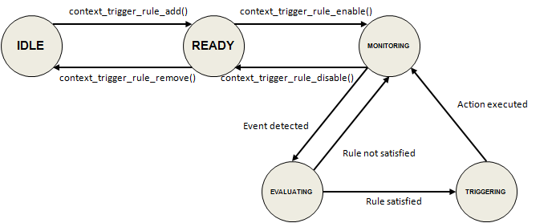

# Contextual System Event Trigger

Tizen enables you to define rules as a combination of a contextual event, conditions, and an action. When the rule is enabled, the system starts to monitor the device status or user activities corresponding to the event defined in the rule. When the event is detected, the conditions are evaluated, and if the conditions are met, the action is triggered.

This feature is supported in mobile applications only.

A rule always consists of 3 main components:

- [Event](#event_and_condition)

  An event literally denotes a contextual event that can be recognized by the device, or a change in a certain contextual state of the device or the user. For example, connections to peripherals, changes in settings, location changes, or specific times can be used as events. Note that only 1 event can be defined in a rule, as it is used as the initiator of the verification of the conditions. If the system detects the occurrence of the designated event, it starts to verify the conditions.

- [Condition](#event_and_condition)

  A condition denotes a contextual state or fact that can be recognized by the device. For example, the current device status or the historical pattern of the device usage can be used as conditions. In a rule, the application can define 1 condition, multiple conditions, or even no condition. If you define multiple conditions in a rule, the application can choose the way of combining the conditions using logical conjunctions or disjunctions. For a logical conjunction, the rule is true only if all the conditions are met. Otherwise, the rule can be true if at least 1 condition is met. If no condition is given, the rule is satisfied instantly when the corresponding event occurs.

- Action

  An action is triggered when the rule is satisfied. You can set an application launch request action using an [application control](../app-management/app-controls.md), or you can set a [notification posting](../notification/notifications.md) action. For example, every day at 10:00 PM, if the battery level is low, the application can post a notification to remind the user to charge the battery.

  Each rule must basically contain 1 action only. However, because the action itself can be defined as an application control, if necessary, you can implement an application that executes a series of tasks to create a complex context-aware service.

The following figure illustrates the rule components and their relations.

**Figure: Rule components**


The main features of the Contextual Trigger API include:

- Rule creation

  - You can [create a new rule and set its description](#create_rule).

  - You can [create an event and add it to the rule](#create_event).

  - You can [create conditions and add them to the rule](#create_condition).

  - You can [set an action](#set_action) (a notification posting or application launch).

- Rule management

  Once a rule is composed and registered successfully into the system, a unique rule ID is assigned to it. You can use the rule ID to [enable, disable, or permanently remove the rule](#manage_rule).

  **Figure: Rule states**

  

  > **Note**
  >
  > A rule can be enabled, disabled, or removed only by the owner application that composed and registered the rule.

- Rule retrieval

  You can [retrieve a list of enabled and disabled rule IDs](#retrieve_rule) owned by your application.

> **Note**
>
> If you only need to monitor a fundamental system event, such as the USB connection status, to launch a service application, and no condition is required, use [event callbacks](../app-management/efl-ui-app.md#callback). In these cases, using the event system instead of the contextual trigger is more efficient, as the contextual trigger runs a rule engine to manage state changes of multiple event and condition items simultaneously.

<a name="event_and_condition"></a>
## Events and Conditions

In a rule, the combination of an event and conditions formulates the logical statement that decides to execute the action of the rule or leave it undone. The event and the conditions are defined in various kinds of contextual information, which can be recognized on the device:

- An event represents a contextual state change or a contextual event literally, such as "headphone is plugged", "the battery level has dropped to low", or "the user enters his home".

- A condition represents a current contextual state or a device or user profile inferred through the usage history, for example, "the current battery level is low", "Wi-Fi connection is active", or "(when receiving an incoming call) the number is the most frequent address in his call logs".

Defining an event or a condition can involve [attribute comparisons](#comparison_attributes) and input option parameter settings. The following example illustrates how to formulate a simple rule of "at 10 PM, if the battery is not charging":

1. Create a rule handle. The first parameter (`CONTEXT_TRIGGER_LOGICAL_CONJUNCTION`) denotes how to combine all condition entries.

   ```
   context_trigger_rule_h rule = NULL;
   context_trigger_rule_create(CONTEXT_TRIGGER_LOGICAL_CONJUNCTION, &rule);
   ```

2. Define the event ("at 10 PM every day").

   A `CONTEXT_TRIGGER_EVENT_TIME` type event entry is created, and a key-value comparison of `CONTEXT_TRIGGER_TIME_OF_DAY == 1320` is set to the event.

   ```
   /* Composing an event */
   context_trigger_rule_entry_h event = NULL;
   context_trigger_rule_event_create(CONTEXT_TRIGGER_EVENT_TIME, CONTEXT_TRIGGER_LOGICAL_CONJUNCTION, &event);
   context_trigger_rule_entry_add_key(event, CONTEXT_TRIGGER_LOGICAL_CONJUNCTION, CONTEXT_TRIGGER_TIME_OF_DAY);
   context_trigger_rule_entry_add_comparison_int(event, CONTEXT_TRIGGER_TIME_OF_DAY, CONTEXT_TRIGGER_EQUAL_TO, 1320);

   /* Adding the event to the rule and releasing the resources */
   context_trigger_rule_add_entry(rule, event);
   context_trigger_rule_entry_destroy(event);
   ```

3. Formulate the condition statement ("battery is not charging") and add it to the rule handle.

   In the condition entry of `CONTEXT_TRIGGER_CONDITION_BATTERY`, the comparison statement is defined as the equality check (`CONTEXT_TRIGGER_EQUAL_TO`) between the left operand (`CONTEXT_TRIGGER_IS_CHARGING`) and the right operand (`CONTEXT_TRIGGER_FALSE`).

   ```
   /* Composing a condition */
   context_trigger_rule_entry_h condition = NULL;
   context_trigger_rule_condition_create(CONTEXT_TRIGGER_CONDITION_BATTERY, CONTEXT_TRIGGER_LOGICAL_CONJUNCTION, &condition);
   context_trigger_rule_entry_add_key(condition, CONTEXT_TRIGGER_LOGICAL_CONJUNCTION, CONTEXT_TRIGGER_IS_CHARGING);
   context_trigger_rule_entry_add_comparison_int(condition, CONTEXT_TRIGGER_IS_CHARGING, CONTEXT_TRIGGER_EQUAL_TO, CONTEXT_TRIGGER_FALSE);

   /* Adding the condition to the rule handle */
   context_trigger_rule_add_entry(rule, condition);
   context_trigger_rule_entry_destroy(condition);
   ```

The above example rule only contains 1 condition, and both the event and the condition contain 1 key-value comparison each. More complex rules, with multiple conditions and multiple comparisons in the event and each condition, can be also formulated. In addition, certain events and conditions require you to set [option parameters](#options).

<a name="options"></a>
### Options

Certain events or conditions require the specification of some option values to clarify their monitoring or computation objective. For example, if an event is defined using `CONTEXT_TRIGGER_EVENT_PLACE`, the target place must be specified by its ID that can be retrieved using the [Geofence Manager](../location-sensors/geofences.md#manager), as in the following example:

```
int place_id;

/* Target place ID must be retrieved through the Geofence Manager API */

/* Composing an event "when the user enters his home" */
context_trigger_rule_entry_h event = NULL;
context_trigger_rule_event_create(CONTEXT_TRIGGER_EVENT_PLACE, CONTEXT_TRIGGER_LOGICAL_CONJUNCTION, &event);
context_trigger_rule_entry_add_option_int(event, CONTEXT_TRIGGER_PLACE_ID, place_id);
```

You can also use an attribute value of the event as an option (or a right operand of a comparison) in a condition. As an example, the logical statement "when receiving a message, if the sender's number is the most frequently communicated number" can be formulated as follows:
```
/* Composing an event "when receiving a message" */
context_trigger_rule_entry_h event = NULL;
context_trigger_rule_event_create(CONTEXT_TRIGGER_EVENT_MESSAGE, CONTEXT_TRIGGER_LOGICAL_CONJUNCTION, &event);
context_trigger_rule_entry_add_key(event, CONTEXT_TRIGGER_LOGICAL_CONJUNCTION, CONTEXT_TRIGGER_EVENT);
context_trigger_rule_entry_add_comparison_string(event, CONTEXT_TRIGGER_EVENT, CONTEXT_TRIGGER_EQUAL_TO, CONTEXT_TRIGGER_RECEIVED);

/* Composing a condition "if the sender number is the most frequently communicated" */
context_trigger_rule_entry_h condition = NULL;
context_trigger_rule_condition_create(CONTEXT_TRIGGER_CONDITION_COMMUNICATION_FREQUENCY, CONTEXT_TRIGGER_LOGICAL_CONJUNCTION, &condition);

/* Message sender's address is used as an option of the condition */
context_trigger_rule_entry_add_option(condition, CONTEXT_TRIGGER_ADDRESS, CONTEXT_TRIGGER_ADDRESS);

/* Checking if the frequency rank of the address is equal to 1 */
context_trigger_rule_entry_add_key(condition, CONTEXT_TRIGGER_LOGICAL_CONJUNCTION, CONTEXT_TRIGGER_RANK);
context_trigger_rule_entry_add_comparison_int(condition, CONTEXT_TRIGGER_RANK, CONTEXT_TRIGGER_EQUAL_TO, 1);
```

The following table lists the available options keys and the corresponding values.

**Table: Options keys and corresponding values**

| Event or  condition                      | Option key                  | Type    | Valid value                              |
|------------------------------------------|-----------------------------|---------|------------------------------------------|
| `CONTEXT_TRIGGER_EVENT_PLACE`              | `CONTEXT_TRIGGER_PLACE_ID`    | Integer | Place ID. For more information, see the [Geofences](../location-sensors/geofences.md) guide. |
| `CONTEXT_TRIGGER_CONDITION_APP_USE_FREQUENCY` | `CONTEXT_TRIGGER_APP_ID`      | String  | Application  ID                          |
| `CONTEXT_TRIGGER_CONDITION_COMMUNICATION_FREQUENCY` | `CONTEXT_TRIGGER_ADDRESS`     | String  | Phone  number                            |
| `CONTEXT_TRIGGER_CONDITION_APP_USE_FREQUENCY`<br>   ` CONTEXT_TRIGGER_CONDITION_COMMUNICATION_FREQUENCY`<br>        `CONTEXT_TRIGGER_CONDITION_MUSIC_PLAYBACK_FREQUENCY`<br>        `CONTEXT_TRIGGER_CONDITION_VIDEO_PLAYBACK_FREQUENCY` | `CONTEXT_TRIGGER_TIME_OF_DAY` | String  | Time  interval of the day. For example, "13-15" denotes "from 1 PM  to 3 PM". |
| `CONTEXT_TRIGGER_CONDITION_APP_USE_FREQUENCY`<br>   ` CONTEXT_TRIGGER_CONDITION_COMMUNICATION_FREQUENCY`<br>       `CONTEXT_TRIGGER_CONDITION_MUSIC_PLAYBACK_FREQUENCY`<br>        `CONTEXT_TRIGGER_CONDITION_VIDEO_PLAYBACK_FREQUENCY` | `CONTEXT_TRIGGER_DAY_OF_WEEK` | String  | `CONTEXT_TRIGGER_MON`,  `CONTEXT_TRIGGER_TUE`, `CONTEXT_TRIGGER_WED`, `CONTEXT_TRIGGER_THU`,  `CONTEXT_TRIGGER_FRI`, `CONTEXT_TRIGGER_SAT`, `CONTEXT_TRIGGER_SUN`,  `CONTEXT_TRIGGER_WEEKDAY`, `CONTEXT_TRIGGER_WEEKEND` |                                    |                                          |

### Logical Conjunctions and Disjunctions

A rule can contain multiple conditions. Some event and condition items provide more than 1 attribute key. For 1 attribute, more than 1 comparison statement can also be defined. For example, the value of an attribute is equal to A, B, or C. To combine multiple comparisons into an attribute, multiple attributes into an event or a condition, and multiple conditions into a rule, the contextual trigger allows you to choose 1 of the following logical operators:

- `CONTEXT_TRIGGER_LOGICAL_CONJUNCTION`It denotes logical "AND". It means "true only if all components are true".

- `CONTEXT_TRIGGER_LOGICAL_DISJUNCTION`It denotes logical "OR". It means "true if at least 1 component is true".

To use the conjunctions and disjunctions:

- Combining conditions into a rule

  With the logical conjunction operator, the rule evaluation becomes true if all the conditions are met. On the other hand, with the logical disjunction operator, the rule evaluation becomes true if at least 1 of the conditions is met. If a rule has 1 condition or no condition, the logical operator has no effect on the evaluation result. The following example shows how to set the proper logical operator between conditions when creating rules:

  ```
  /* Composing an event and conditions */
  context_trigger_rule_entry_h battery_event;
  context_trigger_rule_event_create(CONTEXT_TRIGGER_EVENT_BATTERY, CONTEXT_TRIGGER_LOGICAL_CONJUNCTION, &battery_event);
  context_trigger_rule_entry_add_key(battery_event, CONTEXT_TRIGGER_LOGICAL_CONJUNCTION, CONTEXT_TRIGGER_LEVEL);
  context_trigger_rule_entry_add_comparison_string(battery_event, CONTEXT_TRIGGER_LEVEL, CONTEXT_TRIGGER_EQUAL_TO, CONTEXT_TRIGGER_CRITICAL);

  context_trigger_rule_entry_h gps_condition;
  context_trigger_rule_condition_create(CONTEXT_TRIGGER_CONDITION_GPS, CONTEXT_TRIGGER_LOGICAL_CONJUNCTION, &gps_condition);
  context_trigger_rule_entry_add_key(gps_condition, CONTEXT_TRIGGER_LOGICAL_CONJUNCTION, CONTEXT_TRIGGER_STATE);
  context_trigger_rule_entry_add_comparison_string(gps_condition, CONTEXT_TRIGGER_STATE, CONTEXT_TRIGGER_NOT_EQUAL_TO, CONTEXT_TRIGGER_DISABLED);

  context_trigger_rule_entry_h wifi_condition;
  context_trigger_rule_condition_create(CONTEXT_TRIGGER_CONDITION_WIFI, CONTEXT_TRIGGER_LOGICAL_CONJUNCTION, &wifi_condition);
  context_trigger_rule_entry_add_key(wifi_condition, CONTEXT_TRIGGER_LOGICAL_CONJUNCTION, CONTEXT_TRIGGER_STATE);
  context_trigger_rule_entry_add_comparison_string(wifi_condition, CONTEXT_TRIGGER_STATE, CONTEXT_TRIGGER_NOT_EQUAL_TO, CONTEXT_TRIGGER_DISABLED);

  /*
     Composing a rule "when the battery level becomes critical,
     if GPS AND Wi-Fi are enabled"
  */
  context_trigger_rule_h conjunction_rule;
  context_trigger_rule_create(CONTEXT_TRIGGER_LOGICAL_CONJUNCTION, &conjunction_rule);
  context_trigger_rule_add_entry(conjunction_rule, battery_event);
  context_trigger_rule_add_entry(conjunction_rule, gps_condition);
  context_trigger_rule_add_entry(conjunction_rule, wifi_condition);
  context_trigger_rule_set_action_notification(conjunction_rule, ...);

  /*
     Composing a rule "when the battery level becomes critical,
     if GPS OR Wi-Fi is enabled"
  */

  context_trigger_rule_h disjunction_rule;
  context_trigger_rule_create(CONTEXT_TRIGGER_LOGICAL_DISJUNCTION, &disjunction_rule);
  context_trigger_rule_add_entry(disjunction_rule, battery_event);
  context_trigger_rule_add_entry(disjunction_rule, gps_condition);
  context_trigger_rule_add_entry(disjunction_rule, wifi_condition);
  context_trigger_rule_set_action_notification(disjunction_rule, ...);
  ```

- Combining attributes into an event or condition

  Some event and condition items provide multiple attributes. The logical connection between attributes must be set properly to fulfill the requirement. For example, when you use `CONTEXT_TRIGGER_EVENT_TIME` to define a rule "at 4 PM every Monday", the comparisons regarding the 2 attributes, `CONTEXT_TRIGGER_TIME_OF_DAY` and `CONTEXT_TRIGGER_DAY_OF_WEEK` must be satisfied together.

  On the contrary, using `CONTEXT_TRIGGER_APP_USE_FREQUENCY`, if you want to check whether a specific application belongs to the 5 most frequently used applications, or the application was used at least 10 times, both comparisons against `CONTEXT_TRIGGER_RANK` and `CONTEXT_TRIGGER_TOTAL_COUNT` must be connected by a logical disjunction.

  The following example illustrates the cases described above:

  ```
  /* Composing an event "at 4 PM every Monday" */
  context_trigger_rule_entry_h time_event;
  context_trigger_rule_event_create(CONTEXT_TRIGGER_EVENT_TIME, CONTEXT_TRIGGER_LOGICAL_CONJUNCTION, &time_event);
  context_trigger_rule_entry_add_key(time_event, CONTEXT_TRIGGER_LOGICAL_CONJUNCTION,  CONTEXT_TRIGGER_TIME_OF_DAY);
  context_trigger_rule_entry_add_comparison_int(time_event, CONTEXT_TRIGGER_TIME_OF_DAY, CONTEXT_TRIGGER_EQUAL_TO, 960);
  context_trigger_rule_entry_add_key(time_event, CONTEXT_TRIGGER_LOGICAL_CONJUNCTION,  CONTEXT_TRIGGER_DAY_OF_WEEK);
  context_trigger_rule_entry_add_comparison_string(time_event, CONTEXT_TRIGGER_DAY_OF_WEEK, CONTEXT_TRIGGER_EQUAL_TO, CONTEXT_TRIGGER_MON);

  /*
     Composing a condition "if an application belongs to the 5,
     most frequently used apps or is used at least 10 times per day"
  */
  context_trigger_rule_entry_h app_condition;
  context_trigger_rule_condition_create(CONTEXT_TRIGGER_CONDITION_APP_USE_FREQUENCY, CONTEXT_TRIGGER_LOGICAL_DISJUNCTION, &app_condition);
  context_trigger_rule_entry_add_option_string(app_condition, CONTEXT_TRIGGER_APP_ID, /* Application ID */);
  context_trigger_rule_entry_add_key(app_condition, CONTEXT_TRIGGER_LOGICAL_CONJUNCTION, CONTEXT_TRIGGER_RANK);
  context_trigger_rule_entry_add_comparison_int(app_condition, CONTEXT_TRIGGER_RANK, CONTEXT_TRIGGER_LESS_THAN_OR_EQUAL_TO, 5);
  context_trigger_rule_entry_add_key(app_condition, CONTEXT_TRIGGER_LOGICAL_CONJUNCTION, CONTEXT_TRIGGER_TOTAL_COUNT);
  context_trigger_rule_entry_add_comparison_int(app_condition, CONTEXT_TRIGGER_TOTAL_COUNT, CONTEXT_TRIGGER_GREATER_THAN_OR_EQUAL_TO, 10);
  ```

- Combining comparisons into an attribute

  Similarly as above, regarding an attribute, you can combine multiple comparisons in different ways. For example, if you want to check that the battery level is full or high, use a logical disjunction. If you also want to check whether the current time is between 18:30 and 21:30, use a logical conjunction. The following example illustrates how to compose such conditions:

  ```
  /* Composing a condition "if the battery level is full or high" */
  context_trigger_rule_entry_h battery_condition;
  context_trigger_rule_condition_create(CONTEXT_TRIGGER_CONDITION_BATTERY, CONTEXT_TRIGGER_LOGICAL_CONJUNCTION, &battery_condition);
  context_trigger_rule_entry_add_key(battery_condition, CONTEXT_TRIGGER_LOGICAL_DISJUNCTION, CONTEXT_TRIGGER_LEVEL);
  context_trigger_rule_entry_add_comparison_string(battery_condition, CONTEXT_TRIGGER_LEVEL, CONTEXT_TRIGGER_EQUAL_TO, CONTEXT_TRIGGER_FULL);
  context_trigger_rule_entry_add_comparison_string(battery_condition, CONTEXT_TRIGGER_LEVEL, CONTEXT_TRIGGER_EQUAL_TO, CONTEXT_TRIGGER_HIGH);

  /* Composing a condition "if the current time is between 18:30 and 21:30" */
  context_trigger_rule_entry_h time_condition;
  context_trigger_rule_condition_create(CONTEXT_TRIGGER_CONDITION_TIME, CONTEXT_TRIGGER_LOGICAL_CONJUNCTION, &time_condition);
  context_trigger_rule_entry_add_key(time_condition, CONTEXT_TRIGGER_LOGICAL_CONJUNCTION,  CONTEXT_TRIGGER_TIME_OF_DAY);
  context_trigger_rule_entry_add_comparison_int(time_condition, CONTEXT_TRIGGER_TIME_OF_DAY, CONTEXT_TRIGGER_GREATER_THAN_OR_EQUAL_TO, 1110);
  context_trigger_rule_entry_add_comparison_int(time_condition, CONTEXT_TRIGGER_TIME_OF_DAY, CONTEXT_TRIGGER_LESS_THAN_OR_EQUAL_TO, 1290);
  ```

## Prerequisites

To use the functions and data types of the [Contextual Trigger](../../api/mobile/latest/group__CAPI__CONTEXT__TRIGGER__MODULE.html) API, include the `<context_trigger.h>` header file in your application:

```
#include <context_trigger.h>

```

<a name="create_rule"></a>
## Creating a Rule

To compose a rule:

1. Create a rule for "Notify if the battery is not charging and either Wi-Fi or GPS is enabled when the battery level becomes too low".

   Create a rule handle using the `context_trigger_rule_create()` function. Because both Wi-Fi and GPS conditions need not be met at the same time, the rule must be created with the `CONTEXT_TRIGGER_LOGICAL_DISJUNCTION` operator.

   ```
   context_trigger_rule_h rule = NULL;
   context_trigger_rule_create(CONTEXT_TRIGGER_LOGICAL_DISJUNCTION, &rule);
   ```

2. Set an optional description:

   ```
   context_trigger_rule_set_description(rule, "Notify if the battery is not charging and either Wi-Fi or GPS is enabled when the battery level becomes too low");
   ```

<a name="create_event"></a>
## Creating an Event

To create a `CONTEXT_TRIGGER_EVENT_BATTERY` event to detect battery level changes:

1. Create an event handle using the `context_trigger_rule_event_create()` function:

   ```
   context_trigger_rule_entry_h battery_event = NULL;
   context_trigger_rule_event_create(CONTEXT_TRIGGER_EVENT_BATTERY, CONTEXT_TRIGGER_LOGICAL_CONJUNCTION, &battery_event);
   ```

   While creating an event handle, the application chooses the logical operator (logical conjunction or disjunction), which is applied to combine the attribute keys for the event. For the `CONTEXT_TRIGGER_EVENT_BATTERY` event, 2 types of contextual states are provided: `CONTEXT_TRIGGER_LEVEL` and `CONTEXT_TRIGGER_IS_CHARGING`. Because the application wants to check both if the battery level becomes too low and if the battery is not charging, `CONTEXT_TRIGGER_LOGICAL_CONJUNCTION` must be applied.

2. Add the attribute key with the `context_trigger_rule_entry_add_key()` function.

   The attribute key specifies the detailed comparison terms for the event.

   ```
   /* Add a CONTEXT_TRIGGER_LEVEL key */
   context_trigger_rule_entry_add_key(battery_event, CONTEXT_TRIGGER_LOGICAL_DISJUNCTION, CONTEXT_TRIGGER_LEVEL);

   /* Add a CONTEXT_TRIGGER_IS_CHARGING key */
   context_trigger_rule_entry_add_key(battery_event, CONTEXT_TRIGGER_LOGICAL_CONJUNCTION, CONTEXT_TRIGGER_IS_CHARGING);
   ```

   The application wants to check whether the battery level becomes either low, empty, or critical. For this reason, the `CONTEXT_TRIGGER_LEVEL` key must be added with the `CONTEXT_TRIGGER_LOGICAL_DISJUNCTION` logical operator.

3. Add the comparison operators and values for the attribute key.

   Use the `context_trigger_rule_entry_add_comparison_int()` or `context_trigger_rule_entry_add_comparison_string()` function, depending on the data type.

   ```
   /* Add the comparison values for the CONTEXT_TRIGGER_LEVEL key */
   context_trigger_rule_entry_add_comparison_string(battery_event, CONTEXT_TRIGGER_LEVEL, CONTEXT_TRIGGER_EQUAL_TO, CONTEXT_TRIGGER_LOW);
   context_trigger_rule_entry_add_comparison_string(battery_event, CONTEXT_TRIGGER_LEVEL, CONTEXT_TRIGGER_EQUAL_TO, CONTEXT_TRIGGER_CRITICAL);
   context_trigger_rule_entry_add_comparison_string(battery_event, CONTEXT_TRIGGER_LEVEL, CONTEXT_TRIGGER_EQUAL_TO, CONTEXT_TRIGGER_EMPTY);

   /* Add a comparison value for the CONTEXT_TRIGGER_IS_CHARGING key */
   context_trigger_rule_entry_add_comparison_int(battery_event, CONTEXT_TRIGGER_IS_CHARGING, CONTEXT_TRIGGER_EQUAL_TO, CONTEXT_TRIGGER_FALSE);
   ```

4. Add the event entry to the rule:

   ```
   context_trigger_rule_add_entry(rule, battery_event);
   ```

   Note that a rule must include only 1 event.

5. Free the event:

   ```
   context_trigger_rule_entry_destroy(battery_event);
   ```

<a name="create_condition"></a>
## Creating Conditions

To create conditions to check Wi-Fi and GPS states:

1. Create an event handle using the `context_trigger_rule_condition_create()` function:

   ```
   /* Create a Wi-Fi condition */
   context_trigger_rule_entry_h wifi_condition = NULL;
   context_trigger_rule_condition_create(CONTEXT_TRIGGER_CONDITION_WIFI, CONTEXT_TRIGGER_LOGICAL_CONJUNCTION, &wifi_condition);

   /* Create a GPS condition */
   context_trigger_rule_entry_h gps_condition = NULL;
   context_trigger_rule_condition_create(CONTEXT_TRIGGER_CONDITION_GPS, CONTEXT_TRIGGER_LOGICAL_CONJUNCTION, &gps_condition);
   ```

2. Add the attribute key with the `context_trigger_rule_entry_add_key()` function to specify the comparison terms for each condition:

   ```
   context_trigger_rule_entry_add_key(wifi_condition, CONTEXT_TRIGGER_LOGICAL_CONJUNCTION, CONTEXT_TRIGGER_STATE);
   context_trigger_rule_entry_add_key(gps_condition, CONTEXT_TRIGGER_LOGICAL_CONJUNCTION, CONTEXT_TRIGGER_STATE);
   ```

3. Add a comparison operator and value for the attribute key.

   Use the `context_trigger_rule_entry_add_comparison_int()`, `context_trigger_rule_entry_add_string()`, or `context_trigger_rule_entry_add()` function, depending on the data type.

   In the following example, the conditions for Wi-Fi and GPS are that they are enabled.

   ```
   context_trigger_rule_entry_add_comparison_string(wifi_condition, CONTEXT_TRIGGER_STATE, CONTEXT_TRIGGER_NOT_EQUAL_TO, CONTEXT_TRIGGER_DISABLED);
   context_trigger_rule_entry_add_comparison_string(gps_condition, CONTEXT_TRIGGER_STATE, CONTEXT_TRIGGER_NOT_EQUAL_TO, CONTEXT_TRIGGER_DISABLED);
   ```

4. Add the conditions to the rule handle:

   ```
   context_trigger_rule_add_entry(rule, wifi_condition);
   context_trigger_rule_add_entry(rule, gps_condition);
   ```

   Note that a condition is not mandatory and that a rule can have multiple conditions.

5. Free the conditions:

   ```
   context_trigger_rule_entry_destroy(wifi_condition);
   context_trigger_rule_entry_destroy(gps_condition);
   ```

<a name="set_action"></a>
## Setting an Action

When a rule is satisfied (the event has occurred and the conditions are met), the corresponding action is triggered. Only 1 action can be set for a rule.

To set an action:

- To set an application launch request:

  ```
  app_control_h app;

  /*
     Create an application control handle and set the details,
     such as application ID and operation

  */

  context_trigger_rule_set_action_app_control(rule, app);
  ```

  The application launch request is manipulated with an application control handle. For more information, see the [App Control](../../api/mobile/latest/group__CAPI__APP__CONTROL__MODULE.html) API. You can utilize the application control functionalities by developing an application with the corresponding application controls to execute a series of tasks when a rule is satisfied.

- To register a notification posting request:

  ```
  context_trigger_rule_set_action_notification(rule, "Battery Alert",
                                               "Battery is getting low. To save your battery, turn off Wi-Fi or GPS",
                                               NULL, NULL);
  ```

  The Contextual Trigger API supports the basic notification type only. A notification can contain a title, content body text, an icon, and an application control to be executed.

<a name="manage_rule"></a>
## Managing Rules

To manage the rules:

1. To register a rule:

   1. Register the rule with the `context_trigger_add_rule()` function and acquire the rule ID:

     ```
     int rule_id;

     context_trigger_add_rule(rule, &rule_id);
     ```

     The application can manage the rule with its rule ID. If the application adds the same rule with a previously registered rule ID, the same rule ID is acquired.

   2. Release the rule handle resource:

      ```
      context_trigger_destroy(rule);
      ```

2. To enable and disable a rule:

   - Enable the rule explicitly with its rule ID:

     ```
     context_trigger_enable_rule(rule_id);
     ```

     Note that a rule can be managed only by the application that has registered the rule.

   - Disable the rule with its rule ID:

     ```
     context_trigger_disable_rule(rule_id);
     ```

3. To remove a rule:

   When no longer needed, delete the rule with the `context_trigger_remove_rule()` function. Only disabled rules can be deleted.

   ```
   context_trigger_remove_rule(rule_id);
   ```

<a name="retrieve_rule"></a>
## Retrieving Rules

This use case shows how to query the application's own rule IDs, disable the enabled rules, and remove all the rules. Only the owner application can enable, disable, remove, and retrieve the rules.

To retrieve all rules:

1. Retrieve all the enabled rules registered by the application and disable them:

   ```
   int* enabled_rule_ids;
   int enabled_count;

   context_trigger_get_own_rule_ids(&enabled_rule_ids, &enabled_count, NULL, NULL);

   /* Disable the enabled rules */
   int i = 0;
   for (i = 0; i < enabled_count; i++)
       context_trigger_disable_rule(enabled_rule_ids[i]);
   ```

2. Retrieve all the disabled rules owned by the application and remove them:

   ```
   int* disabled_rule_ids;
   int disabled_count;

   context_trigger_get_own_rule_ids(NULL, NULL, &disabled_rule_ids, &disabled_count);

   /* Remove the disabled rules */
   for (i = 0; i < disabled_count; i++)
       context_trigger_remove_rule(disabled_rule_ids[i]);
   ```

3. Free the memory allocated for the enabled and disabled rules:

   ```
   if (enabled_rule_ids) {
       free(enabled_rule_ids);
       enabled_rule_ids = NULL;
   }

   if (disabled_rule_ids) {
       free(disabled_rule_ids);
       disabled_rule_ids = NULL;
   }
   ```

<a name="comparison_attributes"></a>
## Comparison Attributes for Events and Conditions

The following comparison operators are allowed for specific attribute data types:

- For integer-type attributes:
  - `CONTEXT_TRIGGER_EQUAL_TO`
  - `CONTEXT_TRIGGER_NOT_EQUAL_TO`
  - `CONTEXT_TRIGGER_GREATER_THAN`
  - `CONTEXT_TRIGGER_GREATER_THAN_OR_EQUAL_TO`
  - `CONTEXT_TRIGGER_LESS_THAN`
  - `CONTEXT_TRIGGER_LESS_THAN_OR_EQUAL_TO`

- For string-type attributes:
  - `CONTEXT_TRIGGER_EQUAL_TO`
  - `CONTEXT_TRIGGER_NOT_EQUAL_TO`

The following table summarizes the corresponding comparison attribute keys, with respect to the event and condition items, and the valid right operands for each attribute key. For information on the necessary privileges for each item, see the [Contextual Trigger](../../api/mobile/latest/group__CAPI__CONTEXT__TRIGGER__MODULE.html) API.

**Table: Attribute keys and corresponding operands**

| Event or condition                | Attribute key                  | Type     | Valid operands                                               |
| --------------------------------- | ------------------------------ | -------- | ------------------------------------------------------------ |
| `CONTEXT_TRIGGER_EVENT_TIME`      | `CONTEXT_TRIGGER_TIME_OF_DAY`  | Integer  | From 0 to 1439 (minute)                                      |
| `CONTEXT_TRIGGER_EVENT_TIME`      | `CONTEXT_TRIGGER_DAY_OF_WEEK`  | String   | `CONTEXT_TRIGGER_MON`, `CONTEXT_TRIGGER_TUE`, `CONTEXT_TRIGGER_WED`, `CONTEXT_TRIGGER_THU`, `CONTEXT_TRIGGER_FRI`, `CONTEXT_TRIGGER_SAT`, `CONTEXT_TRIGGER_SUN`, `CONTEXT_TRIGGER_WEEKDAY`, `CONTEXT_TRIGGER_WEEKEND` |
| `CONTEXT_TRIGGER_CONDITION_TIME`  | `CONTEXT_TRIGGER_TIME_OF_DAY`  | Integer  | From 0 to 1439 (minute)                                      |
| `CONTEXT_TRIGGER_CONDITION_TIME`  | `CONTEXT_TRIGGER_DAY_OF_WEEK`  | String   | `CONTEXT_TRIGGER_MON`, `CONTEXT_TRIGGER_TUE`, `CONTEXT_TRIGGER_WED`, `CONTEXT_TRIGGER_THU`, `CONTEXT_TRIGGER_FRI`, `CONTEXT_TRIGGER_SAT`, `CONTEXT_TRIGGER_SUN`, `CONTEXT_TRIGGER_WEEKDAY`, `CONTEXT_TRIGGER_WEEKEND` |
|  `CONTEXT_TRIGGER_CONDITION_TIME` | `CONTEXT_TRIGGER_DAY_OF_MONTH` | Integer  | From 1 to 31                                                 |
| `CONTEXT_TRIGGER_EVENT_CHARGER`<br> `CONTEXT_TRIGGER_EVENT_USB`<br> `CONTEXT_TRIGGER_CONDITION_CHARGER`<br> `CONTEXT_TRIGGER_CONDITION_USB` | `CONTEXT_TRIGGER_IS_CONNECTED` | Integer  | `CONTEXT_TRIGGER_TRUE, CONTEXT_TRIGGER_FALSE`                |
| `CONTEXT_TRIGGER_EVENT_BATTERY`<br> `CONTEXT_TRIGGER_CONDITION_BATTERY` | `CONTEXT_TRIGGER_LEVEL`        | String  | `CONTEXT_TRIGGER_EMPTY`, `CONTEXT_TRIGGER_CRITICAL`, `CONTEXT_TRIGGER_LOW`, `CONTEXT_TRIGGER_NORMAL`, `CONTEXT_TRIGGER_HIGH`, `CONTEXT_TRIGGER_FULL` |
| `CONTEXT_TRIGGER_EVENT_BATTERY`<br> `CONTEXT_TRIGGER_CONDITION_BATTERY` | `CONTEXT_TRIGGER_IS_CHARGING`  | Integer | `CONTEXT_TRIGGER_TRUE`, `CONTEXT_TRIGGER_FALSE`                |
| `CONTEXT_TRIGGER_EVENT_POWER_SAVING_MODE`<br> `CONTEXT_TRIGGER_CONDITION_POWER_SAVING_MODE` | `CONTEXT_TRIGGER_IS_ENABLED`   | Integer  | `CONTEXT_TRIGGER_TRUE`, `CONTEXT_TRIGGER_FALSE`                |
| `CONTEXT_TRIGGER_EVENT_GPS`<br> `CONTEXT_TRIGGER_CONDITION_GPS`  | `CONTEXT_TRIGGER_STATE`        | String   | `CONTEXT_TRIGGER_DISABLED`, `CONTEXT_TRIGGER_SEARCHING`, `CONTEXT_TRIGGER_CONNECTED` |
| `CONTEXT_TRIGGER_EVENT_HEADPHONE`<br> `CONTEXT_TRIGGER_CONDITION_HEADPHONE` | `CONTEXT_TRIGGER_IS_CONNECTED` | Integer                                                      | `CONTEXT_TRIGGER_TRUE`, `CONTEXT_TRIGGER_FALSE`                |
| `CONTEXT_TRIGGER_EVENT_HEADPHONE`<br> `CONTEXT_TRIGGER_CONDITION_HEADPHONE` | `CONTEXT_TRIGGER_TYPE`         | String   | `CONTEXT_TRIGGER_NORMAL`, `CONTEXT_TRIGGER_HEADSET`, `CONTEXT_TRIGGER_BLUETOOTH` |
| `CONTEXT_TRIGGER_EVENT_WIFI`<br> `CONTEXT_TRIGGER_CONDITION_WIFI` | `CONTEXT_TRIGGER_STATE`        | String  | `CONTEXT_TRIGGER_DISABLED`, `CONTEXT_TRIGGER_CONNECTED`, `CONTEXT_TRIGGER_UNCONNECTED` |
| `CONTEXT_TRIGGER_EVENT_WIFI`<br> `CONTEXT_TRIGGER_CONDITION_WIFI` | `CONTEXT_TRIGGER_BSSID`                                      | String  | Wi-Fi BSSID                  |
| `CONTEXT_TRIGGER_EVENT_CALL`<br> `CONTEXT_TRIGGER_CONDITION_CALL` | `CONTEXT_TRIGGER_STATE`        | String  | `CONTEXT_TRIGGER_IDLE`, `CONTEXT_TRIGGER_CONNECTING`, `CONTEXT_TRIGGER_CONNECTED ` |
| `CONTEXT_TRIGGER_EVENT_CALL`<br> `CONTEXT_TRIGGER_CONDITION_CALL` | `CONTEXT_TRIGGER_MEDIUM`                                     | String  | `CONTEXT_TRIGGER_VOICE`, `CONTEXT_TRIGGER_VIDEO`               |
| `CONTEXT_TRIGGER_EVENT_CALL`<br> `CONTEXT_TRIGGER_CONDITION_CALL` | `CONTEXT_TRIGGER_ADDRESS`                                    | String  | Phone number        |
| `CONTEXT_TRIGGER_EVENT_EMAIL`                    | `CONTEXT_TRIGGER_EVENT`        | String  | `CONTEXT_TRIGGER_RECEIVED`, `CONTEXT_TRIGGER_SENT`             |
| `CONTEXT_TRIGGER_EVENT_MESSAGE`                  | `CONTEXT_TRIGGER_EVENT`        | String  | `CONTEXT_TRIGGER_RECEIVED`                                   |
| `CONTEXT_TRIGGER_EVENT_MESSAGE`                  | `CONTEXT_TRIGGER_TYPE`                                      | String     | `CONTEXT_TRIGGER_SMS`, `CONTEXT_TRIGGER_MMS`                   |
| `CONTEXT_TRIGGER_EVENT_CONTACTS`                 | `CONTEXT_TRIGGER_EVENT`      | String  | `CONTEXT_TRIGGER_CHANGED`                                    |
| `CONTEXT_TRIGGER_EVENT_CONTACTS`                 | `CONTEXT_TRIGGER_TYPE`       | String  | `CONTEXT_TRIGGER_MY_PROFILE`, `CONTEXT_TRIGGER_PERSON`         |
| `CONTEXT_TRIGGER_EVENT_ACTIVITY_STATIONARY`<br> `CONTEXT_TRIGGER_EVENT_ACTIVITY_WALKING`<br> `CONTEXT_TRIGGER_EVENT_ACTIVITY_RUNNING`<br> `CONTEXT_TRIGGER_EVENT_ACTIVITY_IN_VEHICLE` | `CONTEXT_TRIGGER_EVENT`        | String                                                       | `CONTEXT_TRIGGER_DETECTED`                                   |
| `CONTEXT_TRIGGER_EVENT_ACTIVITY_STATIONARY`<br> `CONTEXT_TRIGGER_EVENT_ACTIVITY_WALKING`<br> `CONTEXT_TRIGGER_EVENT_ACTIVITY_RUNNING`<br> `CONTEXT_TRIGGER_EVENT_ACTIVITY_IN_VEHICLE` | `CONTEXT_TRIGGER_ACCURACY`                                   | String  | `CONTEXT_TRIGGER_HIGH`, `CONTEXT_TRIGGER_NORMAL`, `CONTEXT_TRIGGER_LOW` |
| `CONTEXT_TRIGGER_EVENT_PLACE`                                | `CONTEXT_TRIGGER_EVENT`        | String   | `CONTEXT_TRIGGER_IN`, `CONTEXT_TRIGGER_OUT`                    |
| `CONTEXT_TRIGGER_CONDITION_APP_USE_FREQUENCY`<br> `CONTEXT_TRIGGER_CONDITION_COMMUNICATION_FREQUENCY` | `CONTEXT_TRIGGER_RANK`         | Integer  | Positive integer |
| `CONTEXT_TRIGGER_CONDITION_APP_USE_FREQUENCY`<br> `CONTEXT_TRIGGER_CONDITION_COMMUNICATION_FREQUENCY` | `CONTEXT_TRIGGER_TOTAL_COUNT`  | Integer  | Non-negative integer   |
| `CONTEXT_TRIGGER_CONDITION_MUSIC_PLAYBACK_FREQUENCY`<br> `CONTEXT_TRIGGER_CONDITION_VIDEO_PLAYBACK_FREQUENCY` | `CONTEXT_TRIGGER_TOTAL_COUNT`  | Integer  | Non-negative integer   |


## Related Information
- Dependencies
  - Tizen 2.4 and Higher for Mobile
