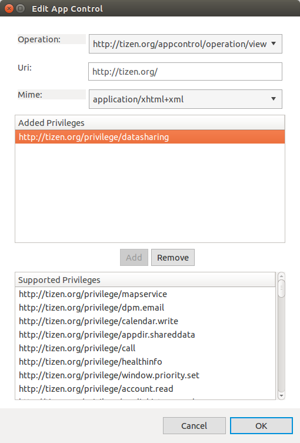
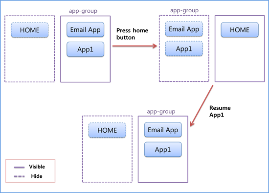

# Application Controls


An application control (app control) is a way of sharing an application's functionality with other applications. Using another application's features through application controls reduces the time and effort needed to develop your own application.

An application can be launched by the user from the launcher or by another application through the application control. The application control launch request describes either an action to be performed by other applications, or the results of that action. The application can also receive results from the launched application through an application control reply.

The main App Control API features are:

- Requesting application launches

  You can [create application control launch requests](#request) to ask the platform to launch an application to perform a specific task for you.

  You can use different [launch types](#launch) (implicit or explicit), depending on whether you know the exact application you want to launch. When you make an implicit launch request, the platform uses the conditions in the launch request to determine which application can be launched to handle the requested task.

- Launching an application due to a launch request

  After the platform has found the correct application to launch, the application is activated through the [launch process](#process), and can perform the task the original application has requested. After the task is completed, the launched application can send the results back to the original application.

- Handling application control launch results

  When the launched application is finished with its task and has sent back the results, you can [receive those results](#results) in your application and handle them accordingly.

- Exporting application controls

  You can [allow other applications to launch your application and use your functionalities](#export_appcontrol) by exporting your application features as application controls.

- Controlling application groups through the launch mode

  You can [set the launch mode](#group) when launching an application through an application control. The launch mode determines whether the application is launched in its own group, or as a sub application within an existing group.

You can take advantage of the Tizen [base application functionalities](#common) through the application control feature.


<a name="launch"></a>
## Launch Types

You can launch an application with an application control using 2 different launch types:

- Explicit launch:

  Explicit launch means that you launch a specific application with the application ID. When you [request an explicit launch](#explicit):

  - If the underlying application launcher framework finds an application matched with the given application ID in the installed application list, it launches the application in a new process. If the matched application is not found, the framework returns the `APP_CONTROL_ERROR_APP_NOT_FOUND` result. Additional information (such as operation, URI, or MIME type) is not used to select an application for an explicit launch.
  - If the operation setting in the `app_control` handle is set to `APP_CONTROL_OPERATION_DEFAULT`, the application ID must be set. Otherwise the `APP_CONTROL_ERROR_INVALID_PARAMETER` result is returned.

  > **Note**
  >
  > Be careful when using the explicit launch, because if the target application does not exist on the device, you need to handle the `APP_CONTROL_ERROR_APP_NOT_FOUND` error. If you want to launch any application that supports a certain operation, use the implicit launch.

- Implicit launch

  Implicit launch means that you launch any application which matches the operation, URI (or scheme), or MIME type you need. When you [request an implicit launch](#implicit):

  1. To determine which application can be launched, the application launcher framework compares the operation, URI, and MIME type conditions.
  2. The application launcher framework iterates the application controls of all applications on the device to [find the applications that match](#resolution) the given conditions.
  3. If only one application is matched for the given conditions, that application is launched. If multiple matching applications are found, the application selector is shown and the user can select the proper application.

	> **Note**
    >
	> Since Tizen 2.4, application controls used to launch service applications outside the current package are not supported. Because of this, the service application is only allowed to be launched explicitly by the application in the same package. All service applications are excluded from matches of implicit launch requests.

<a name="request"></a>
## Launch Requests

To launch an application with the application control, you must create a launch request. You must create an `app_control` handle, and add to the handle the conditions for selecting the application to be launched. You can add the following information:

- Operation: Action to be performed by the launched application.

  > **Note**
  >
  > The operation name format is `http://tizen.org/appcontrol/operation/<verb>`. You can also use the related macro name, `APP_CONTROL_OPERATION_<VERB>`.
  >
  > The macro name can only be used in the `.c` files, not in the [application manifest file for the application control export](#export_appcontrol).

  The operation is mandatory information for sending the launch request.

- URI: Data itself to be performed.

- MIME type: Specific type of the URI.

- Application ID: ID of the application to be launched.

- Extra data: Key-value pairs to [provide additional information for the launch request and launch result](#use).

<a name="explicit"></a>
### Explicit Launch Request

The following example shows how to create an explicit launch request, which launches a calculator application explicitly with the application ID:

```
#include <app.h>
#include <dlog.h>

#define TAG "MY_TAG"

app_control_h app_control;

app_control_create(&app_control);
app_control_set_operation(app_control, APP_CONTROL_OPERATION_DEFAULT);
app_control_set_app_id(app_control, "org.tizen.calculator");

if (app_control_send_launch_request(app_control, NULL, NULL) == APP_CONTROL_ERROR_NONE)
    dlog_print(DLOG_INFO, TAG, "Succeeded to launch a calculator app.");
else
    dlog_print(DLOG_ERROR, TAG, "Failed to launch a calculator app.");

app_control_destroy(app_control);
```

<a name="implicit"></a>
### Implicit Launch Request

The following examples show how to create an implicit launch request:

- To launch a camera application with a specific operation and MIME type:

  ```
  #include <app.h>
  #include <dlog.h>

  #define TAG "MY_TAG"

  app_control_h app_control;

  app_control_create(&app_control);
  app_control_set_operation(app_control, APP_CONTROL_OPERATION_CREATE_CONTENT);
  app_control_set_mime(app_control, "image/jpg");
  if (app_control_send_launch_request(app_control, NULL, NULL) == APP_CONTROL_ERROR_NONE)
      dlog_print(DLOG_INFO, TAG, "Succeeded to launch a camera app.");
  else
      dlog_print(DLOG_ERROR, TAG, "Failed to launch a camera app.");

  app_control_destroy(app_control);
  ```

- To launch a gallery application with a specific operation, URI, and MIME type:

  ```
  #include <app.h>
  #include <dlog.h>

  #define TAG "MY_TAG"

  app_control_h app_control;

  app_control_create(&app_control);
  app_control_set_operation(app_control, APP_CONTROL_OPERATION_VIEW);
  app_control_set_uri(app_control, "file:///home/myhome/Photos/1_photo.jpg");
  app_control_set_mime(app_control, "image/*");

  if (app_control_send_launch_request(app_control, NULL, NULL) == APP_CONTROL_ERROR_NONE)
      dlog_print(DLOG_INFO, TAG, "Succeeded to launch a viewer app.");
  else
      dlog_print(DLOG_ERROR, TAG, "Failed to launch a viewer app.");

  app_control_destroy(app_control);
  ```

<a name="resolution"></a>
### Determining the Application for an Implicit Launch Request

In the case of an implicit launch, the platform determines which application to launch by "resolving the application control". This means that the platform considers the given conditions (operation, URI, and MIME type) in the launch request, searches the filters (installed applications with available application controls) on the device, and attempts to find a match.

The launch request conditions are matched to the available filters using the following logic:

1. The operation value is matched first. An exact match is required for the value in both the launch request and the filters.

   If multiple matching filters with identical operations are available, the URI and MIME types in the matching filters are compared.

2. If the launch request has URI or MIME types as a condition, the comparison is done only among the filters that have URI or MIME types. For example, if the launch request has a URI, but a filter does not, that filter is not added to the result even if the operations are the same. Similarly, if the launch request has MIME types, it is not compared to the filters that have no MIME types.

   An exception is applied to the URIs with a "file" scheme for the value. If the launch request URI contains an existing file path and no MIME types are supplied, the filters that have the MIME type of the given file path are also added to the results.

   > **Note**
   >
   > A filter (application) that expects to match with any form of URI and any type of MIME must use `'*'` and `*/*` in their application control information in the `tizen-manifest.xml` file, instead of leaving the value to `NULL`. Otherwise, the application is discarded by the platform when the application control is resolved.

3. Unlike the operation, the URI and MIME types support wildcards on the filters. Detailed conditions for matches are:

   - The URI match can be an exact, partial (scheme), or pattern match according to the value in the filters. URI filters are matched with the launch request if:
     - Both URIs are exactly the same.
     - Launch request URI passes the test with a `glob()`-like function with the filter URI.
     - Scheme and host part of the URI in the launch request and filters are the same.
     - Scheme part of the URI in the launch request and filters is the same.
   - The MIME type match can be an exact or pattern match according to the value in the filters. MIME type filters are matched with the launch request if:
     - Both MIME types are exactly the same.
     - MIME type in the launch request and filters has the same type and '*' for the subtype.
     - The filters have `*/*` for the MIME type.

The following examples show different scenarios for the results of resolving the application control:

- Operation provided:

  - Request:
    - Operation: `http://tizen.org/appcontrol/operation/view`
    - URI: `NULL`
    - MIME: `NULL`
  - Result (the reason for the failure is marked in **bold**):

  **Table: Scenario when only the operation is provided**

  | Filter ID | Operation                                | URI        | MIME   | Result |
  |-----------|------------------------------------------|------------|--------|--------|
  | 1         | `http://tizen.org/appcontrol/operation/view` | `NULL`     | `NULL` | Pass   |
  | 2         | `http://tizen.org/appcontrol/operation/default` | `NULL`       |   `NULL`     |  Fail      |
  | 3         | `http://tizen.org/appcontrol/operation/view` | `file` |  `NULL`       |   Fail        |

- Operation and URI provided:

  - Request:
    - Operation: `http://tizen.org/appcontrol/operation/view`
    - URI: `file:///usr/share/icons/calendar.png`
    - MIME: `NULL`
  - Result (the reason for the failure is marked in **bold**):

  **Table: Scenario when the operation and URI are provided**

 | Filter ID | Operation                                | URI                                  | MIME      | Result |
|-----------|--------------------------------------------|---------------------------------------|-----------|--------|
| 1         | `http://tizen.org/appcontrol/operation/view` | `NULL`                                 | `NULL`      | Fail   |
| 2         | `http://tizen.org/appcontrol/operation/view` | `file:///usr/share/icons/calendar.png` | `*/*`       | Pass   |
| 3         | `http://tizen.org/appcontrol/operation/view` | `file:///*`                            | `*/*`       | Pass   |
| 4         | `http://tizen.org/appcontrol/operation/view` | `file`                                 | `*/*`       | Pass   |
| 5         | `http://tizen.org/appcontrol/operation/view` | `http`                                 | `*/*`       | Fail   |
| 6         | `http://tizen.org/appcontrol/operation/view` | `NULL`                                 | `image/png` | Pass   |
| 7         | `http://tizen.org/appcontrol/operation/view` | `NULL`                                 | `image/jpg` | Fail   |

- Operation and MIME type provided:

  - Request:
    - Operation: `http://tizen.org/appcontrol/operation/view`
    - URI: `NULL`
    - MIME: `image/png`
  - Result (the reason for the failure is marked in **bold**):

  **Table: Scenario when the operation and MIME type are provided**

| Filter ID | Operation                                | URI                                  | MIME      | Result |
|-----------|------------------------------------------|--------------------------------------|-----------|--------|
| 1         | `http://tizen.org/appcontrol/operation/view` | `NULL`                                 | `image/png` | Pass   |
| 2         | `http://tizen.org/appcontrol/operation/view` | `NULL`                                 | `image/*`   | Pass   |
| 3         | `http://tizen.org/appcontrol/operation/view` | `NULL`                                 | `*/*`       | Pass   |
| 4         | `http://tizen.org/appcontrol/operation/view` | `file:///usr/share/icons/calendar.png` | `NULL`      | Fail   |
| 5         | `http://tizen.org/appcontrol/operation/view` | `NULL`                                 | `image/jpg` | Fail   |
| 6         | `http://tizen.org/appcontrol/operation/view` | `NULL`                                 | `video/*`   | Fail   |
| 7         | `http://tizen.org/appcontrol/operation/view` | `http://tizen.org/favorites.png`       | `image/png` | Fail   |

- Operation, URI, and MIME type provided:

  - Request:
    - Operation: `http://tizen.org/appcontrol/operation/view`
    - URI: `http://www.tizen.org/favorites.png`
    - MIME: `image/png`
  - Result (the reason for the failure is marked in **bold**):

  **Table: Scenario when the operation, URI, and MIME type are provided**

 | Filter ID | Operation                                | URI                                | MIME      | Result |
|-----------|------------------------------------------|------------------------------------|-----------|--------|
| 1         | `http://tizen.org/appcontrol/operation/view` | `http://www.tizen.org/favorites.png` | `image/png` | Pass   |
| 2         | `http://tizen.org/appcontrol/operation/view` | `http://www.tizen.org/favorites.png` | `NULL`      | Fail   |
| 3         | `http://tizen.org/appcontrol/operation/view` | `http://www.tizen.org/*`             | `image/png` | Pass   |
| 4         | `http://tizen.org/appcontrol/operation/view` | `http`                               | `image/png` | Pass   |
| 5         | `http://tizen.org/appcontrol/operation/view` | `NULL`                               | `image/png` | Fail   |
| 6         | `http://tizen.org/appcontrol/operation/view` | `*`                                  | `*/*`       | Pass   |

<a name="process"></a>
## Launch Process

Regardless of the launch request type, when the application launcher framework has received and resolved a launch request, it starts the application by creating a new process and calling the entry point of the application:

1. Like a conventional Linux application, the main function of the application is its entry point. In the Tizen application, the main task is to hand over control to the application framework by calling the `ui_app_main()` function:

	```
    bool
    app_create(void *user_data)
    {
        /*
           Take necessary actions before the main event loop starts
           Initialize UI resources and application data
           If this function returns true, the application main loop starts
           If this function returns false, the application terminates
        */
        return true;
    }

    void
    app_control(app_control_h app_control, void *user_data)
    {
        /* Handle the launch request */
    }

    void
    app_pause(void *user_data)
    {
        /* Take necessary actions when application becomes invisible */
    }

    void
    app_resume(void *user_data)
    {
        /* Take necessary actions when application becomes visible */
    }

    void
    app_terminate(void *user_data)
    {
        /* Release all resources */
    }

    int
    main(int argc, char *argv[])
    {
        struct appdata ad;

        ui_app_lifecycle_callback_s event_callback;

        event_callback.create = app_create;
        event_callback.app_control = app_control;
        event_callback.pause = app_pause;
        event_callback.resume = app_resume;
        event_callback.terminate = app_terminate;

        memset(&ad, 0x0, sizeof(struct appdata));

        return ui_app_main(argc, argv, &event_callback, &ad);
    }
	```

2. The `ui_app_main()` function initializes the application and starts the main loop.

    It takes 4 parameters and uses them to initialize the application. The `argc` and `argv` parameters contain the values from the application framework, and you must never change their values. The third parameter is a state transition handler that is responsible for managing the state transitions the application goes through while it is running. The fourth parameter is application data to be passed to each state handler.

3. When the `ui_app_main()` is first invoked, the application moves from the ready state to the created state, and must initialize itself. During this transition, the application framework calls the application's `app_create_cb()` state transition callback just before the application enters the main loop. Within the registered callback, you must initialize the application resources and create the main window.

    If the `app_create_cb()` callback function returns `false`, the application moves to the terminated state. If it returns `true`, the application enters the main loop.


4. Just after the application enters the main loop, the application framework calls the application's `app_control_cb()` callback.

    The callback is passed to the `app_control` handle containing the reason why the application was launched. For example, the application can be launched to open a file to handle the request that has been sent by other application. The application is always responsible for checking the content of the `app_control` handle and responding appropriately. The content of the `app_control` handle can be empty, if the application is launched by the user from the launcher.

    If the application wants to return the result of the application control operation to the application that originally sent the launch request, the result can be sent with the `app_control_reply_to_launch_request()` function.

	```
	static void
    app_control(app_control_h app_control, void *user_data)
    {
        struct appdata *ad = (struct appdata *)user_data;
        char *operation;
        char *uri;
        char *mime_type;
        app_control_h reply;
        char *app_id;

        app_control_get_operation(app_control, &operation);

        if (!strcmp(operation, APP_CONTROL_OPERATION_VIEW)) {
            app_control_get_uri(app_control, &uri);
            app_control_get_mime(app_control, &mime_type);

            if (uri && !strcmp(mime_type, "image/jpg"))
                display_image_file(ad, uri); /* Display a specific image file */
        }

        if (!strcmp(operation, APP_CONTROL_OPERATION_CREATE_CONTENT)) {
            app_control_get_mime(app_control, &mime_type);

            if (!strcmp(mime_type, "text/plain")) {
                app_control_create(&reply);

                app_get_app_id(&app_id);
                /* Set the value of APP_CONTROL_DATA_SELECTED to give to caller */
                app_control_add_extra_data(reply, APP_CONTROL_DATA_SELECTED, app_id);
                /* Reply to caller */
                app_control_reply_to_launch_request(reply, app_control, APP_CONTROL_RESULT_SUCCEEDED);

                app_control_destroy(reply);
            }
        }
    }
	```

<a name="results"></a>
## Launch Results

After the requested application (callee) has been launched and the launched application has performed the requested operation, the results of the operation are delivered back to the application that sent the original launch request (caller).

The following code example requests the launch of another application by setting the `app_control_result` callback to get the launch result:

```
#include <app.h>
#include <dlog.h>

#define TAG "MY_TAG"

app_control_h app_control;

app_control_create(&app_control);

app_control_set_operation(app_control, APP_CONTROL_OPERATION_CREATE_CONTENT);
app_control_set_mime(app_control, "text/plain");

/* Set callback function, app_control_result, to get the launch result */
if (app_control_send_launch_request(app_control, app_control_result, NULL) == APP_CONTROL_ERROR_NONE)
    dlog_print(DLOG_INFO, TAG, "Succeeded: the application is launched.");
else
    dlog_print(DLOG_ERROR, TAG, "Failed to launch an application.");

app_control_destroy(app_control);
```

The results are delivered in the `app_control` handle with extra data. For some cases, the App Control API provides predefined extra data keys. If the key you need is not predefined, you can create your own key. However, the customized key must be shared between the caller and callee applications.

The following example shows how you can retrieve the results of the launch request and requested operation by implementing the `app_control_result` callback:

```
#include <app.h>
#include <dlog.h>

#define TAG "MY_TAG"

/* Callback function to get result */
static void
app_control_result(app_control_h request, app_control_h reply, app_control_result_e result, void *user_data)
{
    char *value;

    if (result == APP_CONTROL_RESULT_SUCCEEDED) {
        /* Get the value of APP_CONTROL_DATA_SELECTED sent by callee */
        if (app_control_get_extra_data(reply, APP_CONTROL_DATA_SELECTED, &value) == APP_CONTROL_ERROR_NONE)
            dlog_print(DLOG_INFO, TAG, "[app_control_result_cb] Succeeded: value(%s)", value);
        else
            dlog_print(DLOG_ERROR, TAG, "[app_control_result_cb] Failed");
    } else {
        dlog_print(DLOG_ERROR, TAG, "[app_control_result_cb] APP_CONTROL_RESULT_FAILED.");
    }
}
```

<a name="export_appcontrol"></a>
## Application Control Export

You can allow other applications to launch your application and use your application features through application controls by exporting your application control functionalities. To allow other applications to launch your application implicitly without the application ID, specify your application control information in the Tizen Studio.

**Figure: Exporting app control**



> **Note**
>
> In the application manifest file, the valid operation name format is `http://tizen.org/appcontrol/operation/<verb>`. You cannot use the related macro name, `APP_CONTROL_OPERATION_<VERB>`.

The operation, URI, and MIME type information is used when [resolving the application control](#resolution). The operation information is mandatory, while the URI or MIME type information is optional. Any application requesting a launch of your application must either specify your application ID (for an explicit launch) or have the same operation value and applicable URI and MIME type information (for an implicit launch).
You can define privileges to restrict your application from launching. To launch your application, the caller application must request for launch permission by defining privileges in the `tizen-manifest.xml` file.

> **Note**
>
> The URI or MIME type can contain wildcards, such as '\*', to match against given conditions in the app control:
>
> - In the MIME type, you can use two types of wildcards: `image/*` and `*/*`.
> - In the URI, a more complex pattern of wildcards with similar semantics as the standard `glob()` function is available: '\*' matches an arbitrary, possibly empty, string, and '?' matches an arbitrary character. Unlike in the `glob()` function, the '/' character can be matched by the wildcards. There are no [...] character ranges, and the wildcards '\*' and '?' cannot be escaped to include them literally in a pattern.

You can specify the application control information for your application in the [application project settings](../../tutorials/process/setting-properties.md#manifest) in the Tizen Studio.

<a name="group"></a>
## Application Group Management

You can [define the application launch mode](#mode) and group your applications into entities that can be managed together.

The main application group features include:

- Defining the application launch mode

  When an application is launched through an app control, its launch mode defines its behavior:

  - The single launch mode means that the application is launched as a main application (in a new group).
  - The caller launch mode means that the application is launched as a sub application belonging to the same group as the caller application who is causing the application to be launched.

  You can set the application launch mode [in the manifest file](../../../tizen-studio/native_tools/manifest-text-editor.md#launch_mode) using the `launch_mode` attribute of the `<ui-application>` element. If the launch mode is set to `caller`, the application that calls the app control can define the launch mode for the called application using the `app_control_set_launch_mode()` function. However, if the called application has set its launch mode in its manifest file to `single`, that setting overrides the caller application's launch mode request.

- Managing the application group

  Applications in a same group act as if they are in 1 stack. For example, if application A wants to send an email using email application B, the application A can launch the email application B, making the email application B a sub application in the same group as the application A. When both applications are running, and the user presses the home button, both applications are hidden. When the user later resumes the caller application (application A), the email application B is shown on top of the caller application.

  If an application is launched in a group, it can be terminated by the main (first) application in the group. If the main application is terminated or killed, the sub applications in the group are terminated automatically (they can be terminated by the framework even if they are hidden).

  **Figure: Group behavior**

  

## Prerequisites

To enable your application to use the application control functionality:

1. To use the App Control API (in [mobile](../../api/mobile/latest/group__CAPI__APP__CONTROL__MODULE.html) and [wearable](../../api/wearable/latest/group__CAPI__APP__CONTROL__MODULE.html) applications), the application has to request permission by adding the following privilege to the `tizen-manifest.xml` file:

   ```
   <privileges>
      <privilege>http://tizen.org/privilege/appmanager.launch</privilege>
   </privileges>
   ```

2. To use the functions and data types of the App Control API, include the `<app_control.h>` header file in your application:

   ```
   #include <app_control.h>
   ```

<a name="use"></a>
## Launching Applications Using Extra Data

To run a specific application control with some preconfigured parameters:

1. Prepare the application control:

   ```
   ret = app_control_create(&app);
   if (ret != APP_CONTROL_ERROR_NONE)
       dlog_print(DLOG_ERROR, LOG_TAG, "app_control_create() failed. err = %d", ret);
   ```

2. When the `app_control` instance is created, set the operation and MIME type. In this example, the `app_control` launches an application which has the `APP_CONTROL_OPERATION_VIEW` operation and the `image/jpeg` MIME type.

   The operation is mandatory information for the launch request. If the operation is not specified, `APP_CONTROL_OPERATION_DEFAULT` is used for the launch request.

   ```
   ret = app_control_set_operation(app, APP_CONTROL_OPERATION_VIEW);
   if (ret != APP_CONTROL_ERROR_NONE)
       dlog_print(DLOG_ERROR, LOG_TAG, "app_control_set_operation() failed. err = %d", ret);

   ret = app_control_set_mime(app, "image/jpeg");
   if (ret != APP_CONTROL_ERROR_NONE)
       dlog_print(DLOG_ERROR, LOG_TAG, "app_control_set_mime() failed. err = %d", ret);
   ```

   For more information on the common application services and the extra data related to them, see [Common Application Controls](common-appcontrol-n.md).

3. Add extra data to the `app_control` instance using the `app_control_add_extra_data()` or `app_control_add_extra_data_array()` function. In this example, a message is added as extra data:

   ```
   ret = app_control_add_extra_data(app, Your Message Key, message);
   if (ret != APP_CONTROL_ERROR_NONE)
       dlog_print(DLOG_ERROR, LOG_TAG, "app_control_add_extra_data() failed. err = %d", ret);
   ```

4. Launch the `app_control` instance using the `app_control_send_launch_request()` function:

   ```
   ret = app_control_send_launch_request(app, NULL, NULL);
   if (ret != APP_CONTROL_ERROR_NONE)
       dlog_print(DLOG_ERROR, LOG_TAG, "app_control_send_launch_request() failed. err = %d", ret);
   ```

   > **Note**
   >
   > Since Tizen 2.4, service applications are only allowed to be launched explicitly and the caller must be an application in the same package. Otherwise, the `app_control` instance returns an error.

5. In the launched application, read the extra data set to the `app_control` instance using the `app_control_foreach_extra_data()` function. The same function can be used in the original application to read the reply message, when the `app_control_h` instance is returned by the `app_control` reply.

   ```
   bool
   _app_control_extra_data_cb(app_control_h app_control, const char *key, void *user_data)
   {
       int ret;
       char *value;

       ret = app_control_get_extra_data(app, key, &value);
       if (ret != APP_CONTROL_ERROR_NONE)
           dlog_print(DLOG_ERROR, LOG_TAG, "app_control_get_extra_data() failed. err = %d", ret);
       dlog_print(DLOG_DEBUG, LOG_TAG, "[value] %s", value);

       return true;
   }

   ret = app_control_foreach_extra_data(app, _app_control_extra_data_cb, 0);
   if (ret != APP_CONTROL_ERROR_NONE)
       dlog_print(DLOG_ERROR, LOG_TAG, "app_control_foreach_extra_data() failed. err = %d", ret);
   ```

6. When your work with the application control is finished, clean up. To do this, pass the `app_control` handle to the `app_control_destroy()` function.

   ```
   ret = app_control_destroy(app);
   if (ret != APP_CONTROL_ERROR_NONE)
       dlog_print(DLOG_ERROR, LOG_TAG, "app_control_destroy() failed. err = %d", ret);
   ```

<a name="mode"></a>
## Controlling the Launch Mode

In this use case, the caller application has a **Launch** button. When it is clicked, an application control is used to launch a sub application within the same group.

To control the launch mode:

1. Create the UI with the **Launch** button:
```
static void
create_base_gui(appdata_s *ad)
{
    Evas_Object *bigbox;
    Evas_Object *bx;
    Evas_Object *bt;

    ad->win = elm_win_util_standard_add(PACKAGE, PACKAGE);
    elm_win_autodel_set(ad->win, EINA_TRUE);

    evas_object_smart_callback_add(ad->win, "delete,request", win_delete_request_cb, NULL);
    eext_object_event_callback_add(ad->win, EEXT_CALLBACK_BACK, win_back_cb, ad);

    bigbox = elm_box_add(ad->win);
    evas_object_size_hint_weight_set(bigbox, EVAS_HINT_EXPAND, EVAS_HINT_EXPAND);
    elm_win_resize_object_add(ad->win, bigbox);
    evas_object_show(bigbox);

    bx = elm_box_add(ad->win);
    elm_box_pack_end(bigbox, bx);
    evas_object_show(bx);

    bt = elm_label_add(ad->win);
    elm_object_text_set(bt, "AGT3");
    elm_box_pack_end(bx, bt);
    evas_object_show(bt);

    bt = elm_button_add(ad->win);
    elm_object_text_set(bt, "Launch");
    elm_box_pack_end(bx, bt);
    evas_object_show(bt);
    evas_object_smart_callback_add(bt, "clicked", button_click_cb, NULL);

    evas_object_show(ad->win);
}
```

2. When the button is clicked, use an application control to launch the sub application.

   Define the launch mode for the application to be called using the `app_control_set_launch_mode()` function. The second parameter defines the launch mode with the `app_control_launch_mode_e` enumerator (in [mobile](../../api/mobile/latest/group__CAPI__APP__CONTROL__MODULE.html#gadf26b03f2f6b18acba4a946e7eb7b31c) applications).

   ```
   static void
   button_click_cb(void *data, Evas_Object *obj, void *event_info)
   {
       app_control_h h;

       app_control_create(&h);
       app_control_set_operation(h, "http://tizen.org/appcontrol/operation/view");
       app_control_set_mime(h, "application/pdf");
       app_control_set_launch_mode(h, APP_CONTROL_LAUNCH_MODE_GROUP);
       app_control_send_launch_request(h, NULL, NULL);

       app_control_destroy(h);
   }

   static void
   app_control(app_control_h app_control, void *data)
   {
       /* Handle the launch request */
   }
   ```

<a name="common"></a>
## Common Application Controls

The Tizen common application controls specify a standard protocol for sharing application functionalities. You can use the common application controls to perform some basic tasks, such as selecting a file or taking a picture.

The following common application controls are available:

- [Browser](common-appcontrol.md#browser)
- [Calendar](common-appcontrol.md#calendar)
- [Call](common-appcontrol.md#call)
- [Camera](common-appcontrol.md#camera)
- [Contact](common-appcontrol.md#contact)
- [Email](common-appcontrol.md#email)
- [File Storage](common-appcontrol.md#file)
- [Input Delegator](common-appcontrol.md#inputdelegator)
- [Map](common-appcontrol.md#map)
- [Message](common-appcontrol.md#message)
- [Multimedia](common-appcontrol.md#multimedia)
- [System Settings](common-appcontrol.md#settings_main)
	- [Settings for Bluetooth](common-appcontrol.md#settings_bluetooth)
	- [Settings for Location](common-appcontrol.md#settings_location)
	- [Settings for NFC](common-appcontrol.md#settings_nfc)
	- [Settings for Wi-Fi](common-appcontrol.md#settings_wifi)
- [Voice Recorder](common-appcontrol.md#voice)
- [VPN Service](common-appcontrol.md#vpnservice)

## Related Information
- Dependencies
  - Tizen 2.4 and Higher for Mobile
  - Tizen 2.3.1 and Higher for Wearable
