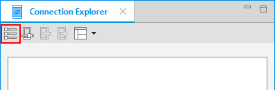
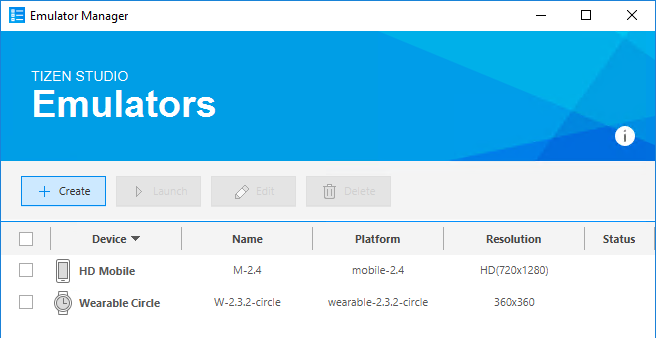
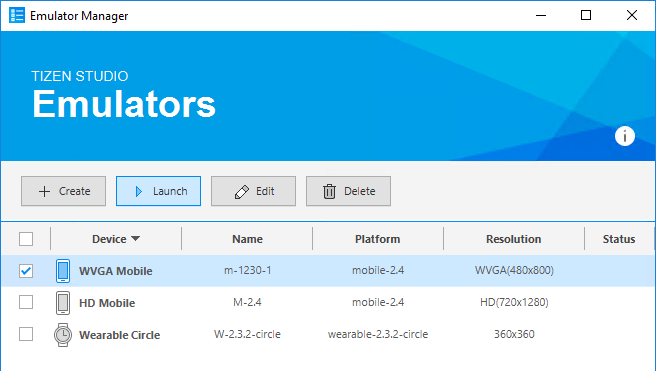
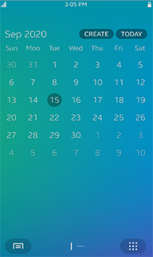
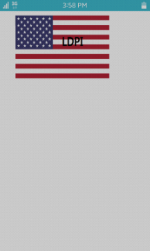
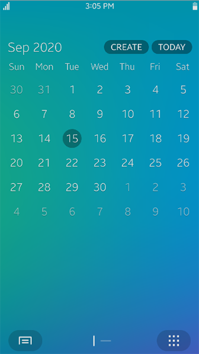
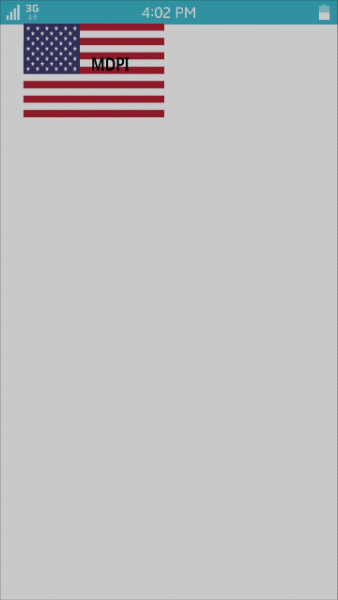

# Application Resources


You can get or set common resources for multiple devices with different specifications.

The main features of the Resource Manager API include:

- Setting resources

  You can [set resources](#set) for your application per language and screen resolution. By setting specific resources for specific languages and screen resolutions, you ensure that the application works flawlessly on multiple devices.

  > **Note**
  >
  > The Resource Manager tool is supported since Tizen 2.4.
  >
  > Check the version and API version attributes in the `<manifest>` element of the application manifest file.

- Using the resources

  You can use different resources (such as images, layouts, and sounds) between devices with different device specifications. For example:

  - To set a different button image for an application depending on the device's current language setting, use the `app_resource_manager_get()` function to [get the appropriate resource file path](#get_path).
  - To use different images depending on the device's screen resolution (DPI), use the same `app_resource_manager_get()` function to get the appropriate image file path.

- Testing the resources

  You can [test the different resources by running them in the emulator](#check_resource).

  > **Note**
  >
  > The resource files must be set to be in different folders and have the same filename.

## Prerequisites

To use the functions and resource types of the [Resource Manager API](../../api/common/latest/group__CAPI__RESOURCE__MANAGER__MODULE.html), include the `<app_resource_manager.h>` header file in your application:

```
#include <app_resource_manager.h>
```

<a name="set"></a>
## Setting Resources

To set the resources:

1. Add resource directories for the required languages and screen resolutions
   under the project `res` directory. Each combination of language and DPI has
   its own directory.

2. Copy the images for each variant into the matching resource directory.

   > **Note**
   >
   > The file names of the resources that you want to use interchangeably
   > depending on the device conditions must be the same.

3. To view the resource directories, use the `res.xml` file.

   The build creates the `res.xml` file automatically when you build the
   application package.

<a name="get_path"></a>
## Getting the Resource File Path

To get the appropriate resource file path in your code:

1. Create the resource manager using the `app_resource_manager_init()` function.
   ```
   app_resource_manager_init();
   ```
   If the function returns `APP_RESOURCE_ERROR_NONE`, the resource manager has been successfully created.

2. Get the resource path using the `app_resource_manager_get()` function. You need 2 parameters:

	- Resource ID

	  The resource ID is an identifier for a specific resource. It consists of subdirectories and filenames including its extension. The same resources are located in different locations with the same filename for supporting multiple devices.

    - Resource type

      The resource type defines whether the resource is an image, layout, sound, or some other file type. There are 4 resource types, which are defined in the `app_resource_e` [enumerator](../../api/common/latest/group__CAPI__RESOURCE__MANAGER__MODULE.html#ga83dadea23a885e1eb257ad1f115513e9).

      Resources with the same resource type are grouped as a folder. The folder name is irrelevant to the actual resource type within it.

    ```
    Evas_Object *img
    char *img_path = NULL;

    app_resource_manager_get(APP_RESOURCE_TYPE_IMAGE, "flag.png", &img_path);

    Evas* canvas = evas_object_evas_get(ad->conform);
    img = evas_object_image_filled_add(canvas);

    if (img_path != NULL) {
        evas_object_image_file_set(img, img_path, NULL);

        evas_object_move(img, 50, 50);
        evas_object_resize(img, 300, 200);
        evas_object_show(img);
        free(img_path);
    }
    ```

    If the function returns `APP_RESOURCE_ERROR_NONE`, the resource path has been successfully retrieved.

3. When you no longer need to get the resource path, call the `app_resource_manager_release()` function to release the resource manager instance.

   The resource manager instance must be released only when the application is closing, so this function must be called in the `app_terminate()` callback function.
   ```
   static void
   app_terminate(void *data)
   {
       app_resource_manager_release();
   }
   ```

<a name="check_resource"></a>
## Checking Resources with the Emulator Manager

To check how the resources are shown on different device configurations, create emulator instances with different resolutions with the [Emulator Manager](../../../../sdk-tools/baseline-sdk/common-tools/emulator-manager.md) and run the application on the instances using different language settings:

1. Open the [Emulator Manager](../../../../sdk-tools/baseline-sdk/common-tools/emulator-manager.md).

   

2. In the **Emulator Manager** window, the HD emulator has already been created.

   Next, create an emulator instance with a WVGA resolution by clicking **Create**.

   

   Select the **WVGA** template. Click **Finish**. If the HD emulator has not been created, create it as well. For more information on creating an emulator instance, see [Creating Emulator Instances](../../../../sdk-tools/baseline-sdk/common-tools/emulator-manager.md#create).

3. Run the application on the WVGA device emulator:

   1. In the **Emulator Manager** window, select the **WVGA** emulator and click **Launch**.

      The WVGA device emulator starts.

      

      

   2. Run the application on the emulator from your IDE.

      The application launches on the emulator.

      

   3. To close the emulator, right-click it and select **Close**.

4. Run the application on the HD device emulator:

   1. In the **Emulator Manager** window, select the **HD** emulator and click **Launch**.

      The HD device emulator starts.

      

      

   2. Run the application on the emulator from your IDE.

      The application launches on the emulator, and you can see that a different image is displayed depending on the device display resolution.

      

5. If you change the emulator language settings and run the application again, you can also see that a different image is displayed depending on the device language (in this case, US English and Korean).

    


## Related Information
- Dependencies
  - Since Tizen 2.4
- API References
  - [Resource Manager](../../api/common/latest/group__CAPI__RESOURCE__MANAGER__MODULE.html)
