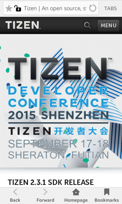
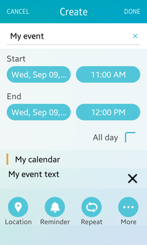
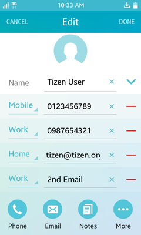
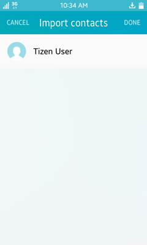
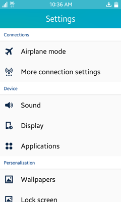
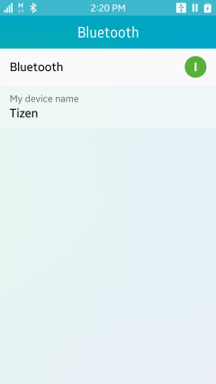
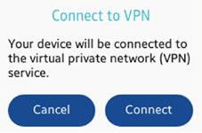

# Common Application Controls

An application control provides functions for launching other applications with a specific operation, URI, MIME type, and extra data. The requesting application can get a result back from the launched application. This topic introduces the common application controls that you can use.

> **Note**
>
> It is possible that no application suitable to receive the application control exists. Verify that a suitable application exists before you send the launch request.

## Browser

The browser application control is supported only in mobile applications.

### Performing a Web Search

To find what you are looking for on the Web, use the `APP_CONTROL_OPERATION_SEARCH` operation.

**Figure: Performing a Web search**


#### Operation

- `http://tizen.org/appcontrol/operation/search` (in `.c` files and manifest file)
- `APP_CONTROL_OPERATION_SEARCH` (in `.c` files only)

#### Extra Input

| Key                     | Description                              | Note                   |
|-------------------------|------------------------------------------|------------------------|
| `APP_CONTROL_DATA_TEXT` | The text to search for. This key must be passed as a string. | This key is mandatory. |

#### Example Code

```
app_control_h app_control;
app_control_create(&app_control);

app_control_set_operation(app_control, APP_CONTROL_OPERATION_SEARCH);
app_control_add_extra_data(app_control, APP_CONTROL_DATA_TEXT, "tizen");

app_control_send_launch_request(app_control, NULL, NULL);
app_control_destroy(app_control);
```

### Loading a Web Page

To open a Web page, use the `APP_CONTROL_OPERATION_VIEW` operation and specify the Web URL in the URI.

**Figure: Loading a Web page**



#### Operation

- `http://tizen.org/appcontrol/operation/view` (in `.c` files and manifest file)
- `APP_CONTROL_OPERATION_VIEW` (in `.c` files only)

#### URI (Mandatory)

- `http:<path>`
- `https:<path>`
- `file:<path>`
- `javascript:<path>`

#### MIME Type (Optional)

- `image/svg+xml`
- `text/html`
- `application/xml`
- `application/xhtml+xml`
- `text/plain`

#### Example Code

```
app_control_h app_control;
app_control_create(&app_control);

app_control_set_operation(app_control, APP_CONTROL_OPERATION_VIEW);
app_control_set_uri(app_control, "https://www.tizen.org");

app_control_send_launch_request(app_control, NULL, NULL);
app_control_destroy(app_control);
```

## Calendar

The calendar application control is supported only in mobile applications.

### Adding a Calendar Event

To add a new event to the user's calendar, use the `APP_CONTROL_OPERATION_ADD` operation with the `application/vnd.tizen.calendar` MIME type. To specify various event details, refer to the extras defined below.

**Figure: Adding a calendar event**



#### Operation

- `http://tizen.org/appcontrol/operation/add` (in `.c` files and manifest file)
- `APP_CONTROL_OPERATION_ADD` (in `.c` files only)

#### MIME Type (Mandatory)

`application/vnd.tizen.calendar`

#### Extra Input

| Key                                    | Description                              | Note                  |
|----------------------------------------|------------------------------------------|-----------------------|
| `APP_CONTROL_DATA_CALENDAR_ALL_DAY`    | The string to indicate if an event applies to all day. The available values are `true` or `false`. This key must be passed as a string. | This key is optional. |
| `APP_CONTROL_DATA_CALENDAR_START_TIME` | The start time of the event (format: YYYY-MM-DD HH:MM:SS). This key must be passed as a string. | This key is optional.                       |
| `APP_CONTROL_DATA_CALENDAR_END_TIME`   | The end time of the event (format: YYYY-MM-DD HH:MM:SS). This key must be passed as a string. | This key is optional.                       |
| `APP_CONTROL_DATA_TITLE`               | The title of the event. This key must be passed as a string. | This key is optional.                       |
| `APP_CONTROL_DATA_TEXT`                | The description of the event. This key must be passed as a string. |This key is optional.                        |

#### Extra Output

| Key                   | Description                              |
|-----------------------|------------------------------------------|
| `APP_CONTROL_DATA_ID` | The database record ID of the event (ID in the `_calendar_event` view). This key must be passed as a string. |

#### Example Code

```
#include <app_control.h>

app_control_h service;
app_control_create(&service);

app_control_set_operation(service, APP_CONTROL_OPERATION_ADD);
app_control_set_mime(service, "application/vnd.tizen.calendar");
app_control_add_extra_data(service, APP_CONTROL_DATA_TITLE, "My event");
app_control_add_extra_data(service, APP_CONTROL_DATA_TEXT, "My event text");
app_control_set_launch_mode(service, APP_CONTROL_LAUNCH_MODE_GROUP);

app_control_send_launch_request(service, NULL, NULL);
```

### Editing a Calendar Event

To edit an existing event in the user's calendar, use the `APP_CONTROL_OPERATION_EDIT` operation with the `application/vnd.tizen.calendar` MIME type. To specify various event details, refer to the extras defined below.

**Figure: Editing a calendar event**


#### Operation

- `http://tizen.org/appcontrol/operation/edit` (in `.c` files and manifest file)
- `APP_CONTROL_OPERATION_EDIT` (in `.c` files only)

#### MIME Type (Mandatory)

`application/vnd.tizen.calendar`

#### Extra Input

| Key                                    | Description                              | Note                   |
|----------------------------------------|------------------------------------------|------------------------|
| `APP_CONTROL_DATA_ID`                  | The database record ID of the event (ID in the `_calendar_event` view). This key must be passed as a string. | This key is mandatory. |
| `APP_CONTROL_DATA_CALENDAR_ALL_DAY`    | The string to indicate if an event applies to all day. The available values are `true` or `false`. This key must be passed as a string. | This key is optional.  |
| `APP_CONTROL_DATA_CALENDAR_START_TIME` | The start time of event (format: YYYY-MM-DD HH:MM:SS). This key must be passed as a string. |  This key is optional.                       |
| `APP_CONTROL_DATA_CALENDAR_END_TIME`   | The end time of event (format: YYYY-MM-DD HH:MM:SS). This key must be passed as a string. |  This key is optional.                       |
| `APP_CONTROL_DATA_TITLE`               | The title of event. This key must be passed as a string. | This key is optional.                       |
| `APP_CONTROL_DATA_TEXT`                | The description of event. This key must be passed as a string. | This key is optional.                        |

#### Extra Output

| Key                   | Description                              |
|-----------------------|------------------------------------------|
| `APP_CONTROL_DATA_ID` | The database record ID of the event (ID in the `_calendar_event` view). This key must be passed as a string. |

#### Example Code

```
#include <app_control.h>

app_control_h service;
app_control_create(&service);

app_control_set_operation(service, APP_CONTROL_OPERATION_EDIT);
app_control_set_mime(service, "application/vnd.tizen.calendar");
app_control_add_extra_data(service, APP_CONTROL_DATA_ID, "42");
app_control_add_extra_data(service, APP_CONTROL_DATA_TITLE, "Edited Title");
app_control_add_extra_data(service, APP_CONTROL_DATA_CALENDAR_ALL_DAY, "true");
app_control_set_launch_mode(service, APP_CONTROL_LAUNCH_MODE_GROUP);

app_control_send_launch_request(service, NULL, NULL);
```

### Viewing a Calendar Event

To display a specified event in the user's calendar, use the `APP_CONTROL_OPERATION_VIEW` operation. To specify various event details, refer to the extras defined below.

To display a specified event from a vcalendar file, use the `file:` URI. To display a specified event using the calendar ID, use the `application/vnd.tizen.calendar` MIME type with `APP_CONTROL_DATA_ID`.

**Figure: Viewing a calendar event**


#### Operation

- `http://tizen.org/appcontrol/operation/view` (in `.c` files and manifest file)
- `APP_CONTROL_OPERATION_VIEW` (in `.c` files only)

#### URI

`file:<path>`

For example: `file://<media storage path>/file.vcs`

#### MIME Type

- `application/vnd.tizen.calendar`

   If viewing an event by event ID, the event ID (ID in the `_calendar_event` view) extra data and `application/vnd.tizen.calendar` MIME type must be specified.

- `text/x-vcalendar` (for vcalendar file)

- `text/vcalendar` (for vcalendar file)

#### Extra Input

| Key                   | Description                              | Note                                     |
|-----------------------|------------------------------------------|------------------------------------------|
| `APP_CONTROL_DATA_ID` | The database record ID of the event (ID in the `_calendar_event` view). This key must be passed as a string. | This key is mandatory when the MIME type is set to `application/vnd.tizen.calendar`. |

#### Example Code

```
/* To view a calendar event from a vcs file */
app_control_h service;
app_control_create(&service);

app_control_set_operation(service, APP_CONTROL_OPERATION_VIEW);
app_control_set_uri(service, "file://<app's shared path>/Calendar3.vcs");
app_control_set_launch_mode(service, APP_CONTROL_LAUNCH_MODE_GROUP);

app_control_send_launch_request(service, NULL, NULL);
app_control_destroy(service);

/* To view a calendar event from a calendar event ID */
app_control_h service;
app_control_create(&service);

app_control_set_operation(service, APP_CONTROL_OPERATION_VIEW);
app_control_set_mime(service, "application/vnd.tizen.calendar");
app_control_add_extra_data(service, APP_CONTROL_DATA_ID, "42");

app_control_send_launch_request(service, NULL, NULL);
app_control_destroy(service);
```

### Selecting a Calendar Event

To select a specified event in the user's calendar, use the `APP_CONTROL_OPERATION_PICK` operation with the `application/vnd.tizen.calendar` MIME type. To specify various event details, refer to the extras defined below.

**Figure: Selecting a calendar event**


#### Operation

- `http://tizen.org/appcontrol/operation/pick` (in `.c` files and manifest file)
- `APP_CONTROL_OPERATION_PICK` (in `.c` files only)

#### MIME Type (Mandatory)

`application/vnd.tizen.calendar`

#### Extra Input

| Key                               | Description                              | Note                  |
|-----------------------------------|------------------------------------------|-----------------------|
| `APP_CONTROL_DATA_TYPE`           | The type of items to be delivered. The available values are `id` (default) and `vcs`. This key must be passed as a string. | This key is optional. |
| `APP_CONTROL_DATA_SELECTION_MODE` | The selection mode of the PICK operation. The available values are `single` (default) and `multiple`. This key must be passed as a string. |This key is optional.                       |
| `APP_CONTROL_DATA_TOTAL_COUNT`    | The total number of events to be returned. This key must be passed as a string. | This key is optional.                      |

#### Extra Output

| Key                         | Description                              |
|-----------------------------|------------------------------------------|
| `APP_CONTROL_DATA_TYPE`     | The type of items to be delivered. The available values are `id` and `vcs`. This key must be passed as a string. |
| `APP_CONTROL_DATA_SELECTED` | The database record ID of the event (ID in the `_calendar_event` view) or the paths of the vcs files. This key must be passed as an array. |

#### Example Code

```
#include <app_control.h>

app_control_h service;
app_control_create(&service);

app_control_set_operation(service, APP_CONTROL_OPERATION_PICK);
app_control_set_mime(service, "application/vnd.tizen.calendar");
app_control_add_extra_data(service, APP_CONTROL_DATA_TYPE, "id");
app_control_add_extra_data(service, APP_CONTROL_DATA_SELECTION_MODE, "single");
app_control_set_launch_mode(service, APP_CONTROL_LAUNCH_MODE_GROUP);

app_control_send_launch_request(service, NULL, NULL);
```

## Call

The call application control is supported in mobile and wearable applications.

### Making a Phone Call

To directly initiate a phone call, use the `APP_CONTROL_OPERATION_CALL` operation with a phone number URI scheme.

**Figure: Making a phone call**


#### Operation

- `http://tizen.org/appcontrol/operation/call` (in `.c` files and manifest file)
- `APP_CONTROL_OPERATION_CALL` (in `.c` files only)

To request this operation, the `http://tizen.org/privilege/call` privilege is needed.

#### URI (Mandatory)

`tel:<number>`

For example: `tel:+821234567890`

#### Example Code

```
void
launchCall()
{
    app_control_h request = NULL;
    app_control_create(&request);

    app_control_set_operation(request, APP_CONTROL_OPERATION_CALL);
    app_control_set_uri(request, "tel:0123456789");

    app_control_send_launch_request(request, NULL, NULL);
    app_control_destroy(request);
}
```

### Launching a Call Application with a Phone Number

To open a call application and display a predefined a phone number, use the `APP_CONTROL_OPERATION_DIAL` action with a phone number URI scheme. When the call application opens, it displays the phone number, but the user must press the **Call** button to initiate the phone call.

**Figure: Launching a Call application**


#### Operation

- `http://tizen.org/appcontrol/operation/dial` (in `.c` files and manifest file)
- `APP_CONTROL_OPERATION_DIAL` (in `.c` files only)

#### URI (Optional)

`tel:<number>`

If empty, a dialer UI without a number is presented.

For example: `tel:+821234567890`

#### Example Code

```
void
launchCall()
{
    app_control_h request = NULL;
    app_control_create(&request);

    app_control_set_operation(request, APP_CONTROL_OPERATION_DIAL);
    app_control_set_uri(request, "tel:0123456789");

    app_control_send_launch_request(request, NULL, NULL);
    app_control_destroy(request);
}
```

## Camera

The camera application control is supported only in mobile applications.

### Capturing a Picture or Video

To take a picture or record video, use the `APP_CONTROL_OPERATION_CREATE_CONTENT` operation with the MIME type. To specify an option, refer to the extras defined below.

**Figure: Taking pictures (left) and recording videos (right)**

 

#### Operation

- `http://tizen.org/appcontrol/operation/create_content` (in `.c` files and manifest file)
- `APP_CONTROL_OPERATION_CREATE_CONTENT` (in `.c` files only)

#### MIME Type (Mandatory)

- `image/*`
- `video/*`

#### Extra Input

| Key                           | Description                              | Note                  |
|-------------------------------|------------------------------------------|-----------------------|
| `APP_CONTROL_DATA_TOTAL_SIZE` | The total size of items to be returned in bytes. This key must be passed as a string. | This key is optional. |

#### Extra Output

| Key                         | Description                              |
|-----------------------------|------------------------------------------|
| `APP_CONTROL_DATA_SELECTED` | The path of the created image or video file. This key must be passed as a string. |

#### Example Code

```
#include <app_control.h>

app_control_h service;
app_control_create(&service);

app_control_set_operation(service, APP_CONTROL_OPERATION_CREATE_CONTENT);
app_control_set_mime(service, "image/*");

app_control_send_launch_request(service, NULL, NULL);
app_control_destroy(service);
```

### Capturing a Picture

To capture a still image, use the `APP_CONTROL_OPERATION_IMAGE_CAPTURE` operation. To specify an option, refer to the extras defined below.

**Figure: Taking a picture**


#### Operation

- `http://tizen.org/appcontrol/operation/image_capture` (in `.c` files and manifest file)
- `APP_CONTROL_OPERATION_IMAGE_CAPTURE` (in `.c` files only)

#### Extra Input

| Key                           | Description                              | Note                  |
|-------------------------------|------------------------------------------|-----------------------|
| `APP_CONTROL_DATA_TOTAL_SIZE` | The total size of items to be returned in bytes. This key must be passed as a string. | This key is optional. |

#### Extra Output

| Key                         | Description                              |
|-----------------------------|------------------------------------------|
| `APP_CONTROL_DATA_SELECTED` | The path of the created file. This key must be passed as a string. |

#### Example Code

```
#include <app_control.h>

app_control_h service;
app_control_create(&service);

app_control_set_operation(service, APP_CONTROL_OPERATION_IMAGE_CAPTURE);

app_control_send_launch_request(service, NULL, NULL);
app_control_destroy(service);
```

### Capturing a Video

To record a video, use the `APP_CONTROL_OPERATION_VIDEO_CAPTURE` operation. To specify an option, refer to the extras defined below.

**Figure: Record a video**


#### Operation

- `http://tizen.org/appcontrol/operation/video_capture` (in `.c` files and manifest file)
- `APP_CONTROL_OPERATION_VIDEO_CAPTURE` (in `.c` files only)

#### Extra Input

| Key                           | Description                              | Note                  |
|-------------------------------|------------------------------------------|-----------------------|
| `APP_CONTROL_DATA_TOTAL_SIZE` | The total size of items to be returned in bytes. This key must be passed as a string. | This key is optional. |

#### Extra Output

| Key                         | Description                              |
|-----------------------------|------------------------------------------|
| `APP_CONTROL_DATA_SELECTED` | The path of the created file. This key must be passed as a string. |

#### Example Code

```
#include <app_control.h>

app_control_h service;
app_control_create(&service);

app_control_set_operation(service, APP_CONTROL_OPERATION_VIDEO_CAPTURE);

app_control_send_launch_request(service, NULL, NULL);
app_control_destroy(service);
```

## Contact

### Adding a Contact

The contact adding operation is supported in mobile and wearable applications. Wearable applications support the `APP_CONTROL_DATA_PHONE` and `APP_CONTROL_DATA_NAME` keys only as extra input.

To add a new contact, use the `APP_CONTROL_OPERATION_ADD` operation with the `application/vnd.tizen.contact` MIME type. To specify various contact details, refer to the extras defined below.

**Figure: Adding a contact**


#### Operation

- `http://tizen.org/appcontrol/operation/add` (in `.c` files and manifest file)
- `APP_CONTROL_OPERATION_ADD` (in `.c` files only)

#### MIME Type (Mandatory)

`application/vnd.tizen.contact`

#### Extra Input

| Key                      | Description                              | Note                  |
|--------------------------|------------------------------------------|-----------------------|
| `APP_CONTROL_DATA_PHONE` | The phone number. This key must be passed as a string. | This key is optional. |
| `APP_CONTROL_DATA_EMAIL` | The email address. This key must be passed as a string. |  This key is optional.   |
| `APP_CONTROL_DATA_URL`   | The homepage URL. This key must be passed as a string. | This key is optional.  |
| `APP_CONTROL_DATA_NAME`  | The contact's name. This key must be passed as a string. | This key is optional.   |

#### Extra Output

| Key                   | Description                              |
|-----------------------|------------------------------------------|
| `APP_CONTROL_DATA_ID` | The database record ID of the added person (ID in the `_contacts_person` view). This key must be passed as a string. |

#### Example Code

```
app_control_h request;
app_control_create(&request);

app_control_set_operation(request, APP_CONTROL_OPERATION_ADD);
app_control_set_mime(request, "application/vnd.tizen.contact");

app_control_add_extra_data(request, APP_CONTROL_DATA_PHONE, "0123456789");
app_control_add_extra_data(request, APP_CONTROL_DATA_EMAIL, "tizen@tizen.org");
app_control_add_extra_data(request, APP_CONTROL_DATA_NAME, "Tizen User");

app_control_set_launch_mode(request, APP_CONTROL_LAUNCH_MODE_GROUP);

int result = app_control_send_launch_request(request, NULL, NULL);
app_control_destroy(request);
```

### Editing a Contact

The contact editing operation is supported only in mobile applications.

To edit a known contact, use the `APP_CONTROL_OPERATION_EDIT` operation with the `application/vnd.tizen.contact` MIME type. To specify various contact details, refer to the extras defined below.

**Figure: Editing a contact**



#### Operation

- `http://tizen.org/appcontrol/operation/edit` (in `.c` files and manifest file)
- `APP_CONTROL_OPERATION_EDIT` (in `.c` files only)

#### MIME Type (Mandatory)

`application/vnd.tizen.contact`

#### Extra Input

| Key                      | Description                              | Note                   |
|--------------------------|------------------------------------------|------------------------|
| `APP_CONTROL_DATA_ID`    | The database record ID of the person to be edited (ID in the `_contacts_person` view). This key must be passed as a string. | This key is mandatory. |
| `APP_CONTROL_DATA_PHONE` | The phone number that is added to the contact. This key must be passed as a string. | This key is optional.  |
| `APP_CONTROL_DATA_EMAIL` | The email address that is added to the contact. This key must be passed as a string. | This key is optional.                      |
| `APP_CONTROL_DATA_URL`   | The homepage URL that is added to the contact. This key must be passed as a string. |  This key is optional.                     |


#### Extra Output

| Key                   | Description                              |
|-----------------------|------------------------------------------|
| `APP_CONTROL_DATA_ID` | The database record ID of the person to be edited (ID in the `_contacts_person` view). This key must be passed as a string. |

#### Example Code

```
app_control_h request;
app_control_create(&request);

app_control_set_operation(request, APP_CONTROL_OPERATION_EDIT);
app_control_set_mime(request, "application/vnd.tizen.contact");

app_control_add_extra_data(request, APP_CONTROL_DATA_ID, personId);

app_control_add_extra_data(request, APP_CONTROL_DATA_PHONE, "0987654321");
app_control_add_extra_data(request, APP_CONTROL_DATA_EMAIL, "2nd Email");

app_control_set_launch_mode(request, APP_CONTROL_LAUNCH_MODE_GROUP);

int result = app_control_send_launch_request(request, NULL, NULL);
app_control_destroy(request);
```

### Viewing a Contact

The contact viewing operation is supported in mobile and wearable applications. Wearable applications support only the `application/vnd.tizen.contact` MIME type.

To display a specified contact in the contact database, use the `APP_CONTROL_OPERATION_VIEW` operation. To specify various contact details, refer to the extras defined below.

To display a specified contact from a vcard file, use the `file:` URI. To display a specified contact with the person ID, use the `application/vnd.tizen.contact` MIME type with `APP_CONTROL_DATA_ID`.

**Figure: Viewing a contact based on ID (left) and from a vcard file (right)**

 

#### Operation

- `http://tizen.org/appcontrol/operation/view` (in `.c` files and manifest file)
- `APP_CONTROL_OPERATION_VIEW` (in `.c` files only)

#### URI

`file:<path>`

#### MIME Type

- `application/vnd.tizen.contact`

  If viewing a contact by person ID, the person ID (ID in the `_contact_person` view) extra data and `application/vnd.tizen.contact` MIME type must be specified.

- `text/vcard`
- `text/x-vcard`

#### Extra Input

| Key                   | Description                              | Note                                     |
|-----------------------|------------------------------------------|------------------------------------------|
| `APP_CONTROL_DATA_ID` | The database record ID of the edited person (ID in the `_contacts_person` view). This key must be passed as a string. | This key is mandatory when the MIME type is set to `application/vnd.tizen.contact`. |

#### Example Code

```
int
launchContactDetails(const char* personId)
{
    app_control_h request;
    app_control_create(&request);

    app_control_set_operation(request, APP_CONTROL_OPERATION_VIEW);
    app_control_set_mime(request, "application/vnd.tizen.contact");
    app_control_add_extra_data(request, APP_CONTROL_DATA_ID, personId);

    app_control_set_launch_mode(request, APP_CONTROL_LAUNCH_MODE_GROUP);

    int result = app_control_send_launch_request(request, NULL, NULL);
    app_control_destroy(request);

    return result;
}

int
launchViewVcard(const char *uri)
{
    app_control_h request;
    app_control_create(&request);

    app_control_set_operation(request, APP_CONTROL_OPERATION_VIEW);
    app_control_set_mime(request, "text/vcard");
    app_control_set_uri(request, uri);

    app_control_set_launch_mode(request, APP_CONTROL_LAUNCH_MODE_GROUP);

    int result = app_control_send_launch_request(request, NULL, NULL);
    app_control_destroy(request);

    return result;
}
```

### Selecting a Contact

The contact selection operation is supported in mobile and wearable applications. Wearable applications support only the `single` value in the `APP_CONTROL_DATA_SELECTION_MODE` key and the `id` and `phone` values in the `APP_CONTROL_DATA_TYPE` key.

To select a specified contact in the user's contacts, use the `APP_CONTROL_OPERATION_PICK` operation with the `application/vnd.tizen.contact` MIME type. To specify various contact details, refer to the extras defined below.

**Figure: Selecting a contact**


#### Operation

- `http://tizen.org/appcontrol/operation/pick` (in `.c` files and manifest file)
- `APP_CONTROL_OPERATION_PICK` (in `.c` files only)

#### MIME Type (Mandatory)

`application/vnd.tizen.contact`

#### Extra Input

| Key                               | Description                              | Note                  |
|-----------------------------------|------------------------------------------|-----------------------|
| `APP_CONTROL_DATA_SELECTION_MODE` | The selection mode of the PICK operation. The available values are `single` (default) and `multiple`. This key must be passed as a string. | This key is optional. |
| `APP_CONTROL_DATA_TYPE`           | The type of items to be delivered. The available values are `id` (default), `phone`, `email`, and `vcf`. This key must be passed as a string. | This key is optional.                      |
| `APP_CONTROL_DATA_TOTAL_COUNT`    | The total number of events to be returned. This key must be passed as a string. | This key is optional.                      |

#### Extra Output

| Key                         | Description                              |
|-----------------------------|------------------------------------------|
| `APP_CONTROL_DATA_TYPE`     | The type of items to be delivered. The available values are `id`, `phone`, `email`, and `vcf`. This key must be passed as a string. |
| `APP_CONTROL_DATA_SELECTED` | The extra field to get the return information. The content of this key depends on its type:<br>- `id`: The database record ID of the selected person (ID in the `_contacts_person` view).<br>- `phone`: The database record ID of the number of the selected person (ID in the `_contacts_number` view).<br>- `email`: The database record ID of the email of the selected person (ID in the `_contacts_email` view).<br>- `vcf`: The path to the vCard file.<br><br>This key must be passed as an array. |

#### Example Code

```
int
launchContactPick(const char *selectionMode, const char *resultType,
                  app_control_reply_cb replyCallback, void *userData)
{
    app_control_h request;
    app_control_create(&request);

    app_control_set_operation(request, APP_CONTROL_OPERATION_PICK);
    app_control_set_mime(request, "application/vnd.tizen.contact");

    app_control_add_extra_data(request, APP_CONTROL_DATA_SELECTION_MODE, selectionMode);
    app_control_add_extra_data(request, APP_CONTROL_DATA_TYPE, resultType);
    app_control_set_launch_mode(request, APP_CONTROL_LAUNCH_MODE_GROUP);

    int result = app_control_send_launch_request(request, replyCallback, userData);
    app_control_destroy(request);

    return result;
}
```

### Sharing a Contact

The contact sharing operation is supported only in mobile applications.

To share a single contact, use the `APP_CONTROL_OPERATION_SHARE` operation with the `application/vnd.tizen.contact` MIME type. To specify various contact details, refer to the extras defined below.

#### Operation

- `http://tizen.org/appcontrol/operation/share` (in `.c` files and manifest file)
- `APP_CONTROL_OPERATION_SHARE` (in `.c` files only)

#### MIME Type (Mandatory)

`application/vnd.tizen.contact`

#### Extra Input

| Key                     | Description                              | Note                   |
|-------------------------|------------------------------------------|------------------------|
| `APP_CONTROL_DATA_ID`   | The database record ID of the person (ID in the `_contacts_person` view) when `APP_CONTROL_DATA_TYPE` is set to `person`.<br>The database record ID of my profile (ID in the `_contacts_my_profile` view) when `APP_CONTROL_DATA_TYPE` is set to `my_profile`. This key must be passed as a string. | This key is mandatory. |
| `APP_CONTROL_DATA_TYPE` | The type of contact. The available values are `my_profile` and `person`. This key must be passed as a string. |      This key is mandatory.               |

#### Example Code

```
#include <app_control.h>

app_control_h service;
app_control_create(&service);

app_control_set_operation(service, APP_CONTROL_OPERATION_SHARE);
app_control_set_mime(service, "application/vnd.tizen.contact");
app_control_add_extra_data(service, APP_CONTROL_DATA_TYPE, "person");
app_control_add_extra_data(service, APP_CONTROL_DATA_ID, person_id);
app_control_set_launch_mode(service, APP_CONTROL_LAUNCH_MODE_GROUP);

app_control_send_launch_request(service, NULL, NULL);
app_control_destroy(service);
```

### Sharing Multiple Contacts

The multiple contact sharing operation is supported only in mobile applications.

To share a set of contacts, use the `APP_CONTROL_OPERATION_MULTI_SHARE` operation with the `application/vnd.tizen.contact` MIME type. To specify various contact details, refer to the extras defined below.

#### Operation

- `http://tizen.org/appcontrol/operation/multi_share` (in `.c` files and manifest file)
- `APP_CONTROL_OPERATION_MULTI_SHARE` (in `.c` files only)

#### MIME Type (Mandatory)

`application/vnd.tizen.contact`

#### Extra Input

| Key                   | Description                              | Note                   |
|-----------------------|------------------------------------------|------------------------|
| `APP_CONTROL_DATA_ID` | The database record IDs of the person (ID in the `_contacts_person` view). This key must be passed as an array. | This key is mandatory. |

#### Example Code

```
#include <app_control.h>
/* contact1, contact2, contact3 are person IDs */
char* contacts[3] = {contact1, contact2, contact3};

app_control_h service;
app_control_create(&service);

app_control_set_operation(service, APP_CONTROL_OPERATION_MULTI_SHARE);
app_control_set_mime(service, "application/vnd.tizen.contact");
app_control_add_extra_data_array(service, APP_CONTROL_DATA_ID, contacts, 3);
app_control_set_launch_mode(service, APP_CONTROL_LAUNCH_MODE_GROUP);

app_control_send_launch_request(service, NULL, NULL);
app_control_destroy(service);
```

## Email

The email application control is supported only in mobile applications.

### Composing an Email

To compose an email with optional recipients, subject, and body text, use the `APP_CONTROL_OPERATION_COMPOSE` operation.

**Figure: Composing an email**


#### Operation

- `http://tizen.org/appcontrol/operation/compose` (in `.c` files and manifest file)
- `APP_CONTROL_OPERATION_COMPOSE` (in `.c` files only)

#### URI (Mandatory)

`mailto:<email address>`

If the `mailto:` field is empty, it filters out all but email applications in the system, and you can use the extra data only to pass optional parameters.

#### Extra Input

| Key                        | Description                              | Note                  |
|----------------------------|------------------------------------------|-----------------------|
| `APP_CONTROL_DATA_TO`      | The email address of the main recipients. This key must be passed as an array. | This key is optional. |
| `APP_CONTROL_DATA_CC`      | The email address of the recipients that must be carbon copied. This key must be passed as an array. |This key is optional.                       |
| `APP_CONTROL_DATA_BCC`     | The email address of the recipients that must be blind carbon copied. This key must be passed as an array. | This key is optional.                      |
| `APP_CONTROL_DATA_SUBJECT` | The subject of an email message. This key must be passed as a string. |This key is optional.                       |
| `APP_CONTROL_DATA_TEXT`    | The body of the email to be sent. This key must be passed as a string. | This key is optional.                      |
| `APP_CONTROL_DATA_PATH`    | The list of multiple file paths to be shared in an email message. This key must be passed as an array. |This key is optional.                       |

#### Example Code

```
app_control_h service;
app_control_create(&service);

char* cc[2] = {"cc@tizen.org", "cc2@tizen.org"};
char* bcc[2] = {"bcc@tizen.org", "bcc2@tizen.org"};
app_control_set_operation(service, APP_CONTROL_OPERATION_COMPOSE);
app_control_set_uri(service, "mailto:to@tizen.org");
app_control_add_extra_data_array(service, APP_CONTROL_DATA_CC, cc, 2);
app_control_add_extra_data_array(service, APP_CONTROL_DATA_BCC, bcc, 2);
app_control_add_extra_data(service, APP_CONTROL_DATA_SUBJECT, "test subject");
app_control_add_extra_data(service, APP_CONTROL_DATA_TEXT, "line1\nline2");

app_control_set_launch_mode(service, APP_CONTROL_LAUNCH_MODE_GROUP);

app_control_send_launch_request(service, NULL, NULL);
app_control_destroy(service);
```

### Sharing a Single File Using an Email Message

To share a single file of any MIME type in an email message, use the `APP_CONTROL_OPERATION_SHARE` operation.

**Figure: Sharing a single file**


#### Operation

- `http://tizen.org/appcontrol/operation/share` (in `.c` files and manifest file)
- `APP_CONTROL_OPERATION_SHARE` (in `.c` files only)

#### URI (Mandatory)

- `file:<path>`
- `mailto:`

  Only an empty `mailto:` field is allowed. This can be used to filter out all but email applications available in the system.

#### MIME Type

Any MIME type that your application needs, such as `image/jpg`, `video/*`, or `*/*`

If sharing a single item through `APP_CONTROL_DATA_PATH` and the URI is specified with `mailto:`, the MIME type must be explicitly set.

#### Extra Input

| Key                     | Description                              | Note                                     |
|-------------------------|------------------------------------------|------------------------------------------|
| `APP_CONTROL_DATA_PATH` | When the URI is set to `mailto`, a path to a single file to be shared must be provided using this key. Otherwise, the key is ignored. This key must be passed as a string. | This key is mandatory when the URI is set to `mailto:`. |

#### Example Code

```
#define PATH_MAX 128

char *shared_res_path = app_get_shared_resource_path();
char img_path[PATH_MAX] = {0,};
snprintf(img_path, PATH_MAX, "%s/image.jpg", shared_res_path);
free(shared_res_path);

app_control_h service;
app_control_create(&service);

app_control_set_launch_mode(service, APP_CONTROL_LAUNCH_MODE_GROUP);
app_control_set_operation(service, APP_CONTROL_OPERATION_SHARE);
app_control_set_uri(service, "mailto:");
app_control_set_mime(service, "image/*");
app_control_add_extra_data(service, APP_CONTROL_DATA_PATH, img_path);

app_control_send_launch_request(service, NULL, NULL);
app_control_destroy(service);
```

### Sharing Multiple Items Using an Email Message

To share multiple files of any MIME type using an email message, use the `APP_CONTROL_OPERATION_MULTI_SHARE` operation.

**Figure: Sharing multiple items**


#### Operation

- `http://tizen.org/appcontrol/operation/multi_share` (in `.c` files and manifest file)
- `APP_CONTROL_OPERATION_MULTI_SHARE` (in `.c` files only)

#### URI (Optional)

`mailto:`

Only an empty `mailto:` field is allowed. This can be used to filter out all but email applications available in the system.

#### MIME Type (Mandatory)

Any MIME type that your application needs, such as `image/jpg`, `video/*`, or `*/*`

If you try to share a set of files with different MIME types, use `<type>/*` or `*/*`. For example, if you send `video/mp4` and `audio/ogg`, the MIME type must be `*/*`.

#### Extra Input

| Key                     | Description                              | Note                   |
|-------------------------|------------------------------------------|------------------------|
| `APP_CONTROL_DATA_PATH` | The list of multiple file paths to be shared in an email message. This key must be passed as an array. | This key is mandatory. |

#### Example Code

```
#define PATH_MAX 128

char *shared_res_path = app_get_shared_resource_path();
char img1_path[PATH_MAX] = {0,};
char img2_path[PATH_MAX] = {0,};
const char *path_array[2] = {img1_path, img2_path};
snprintf(img1_path, PATH_MAX, "%s/image.jpg", shared_res_path);
snprintf(img2_path, PATH_MAX, "%s/image2.jpg", shared_res_path);
free(shared_res_path);

app_control_h service;
app_control_create(&service);

app_control_set_launch_mode(service, APP_CONTROL_LAUNCH_MODE_GROUP);
app_control_set_operation(service, APP_CONTROL_OPERATION_MULTI_SHARE);
app_control_set_uri(service, "mailto:");
app_control_set_mime(service, "image/*");
app_control_add_extra_data_array(service, APP_CONTROL_DATA_PATH, path_array, 2);

app_control_send_launch_request(service, NULL, NULL);
app_control_destroy(service);
```

### Sharing Text in an Email

To share any text with an email message, use the `APP_CONTROL_OPERATION_SHARE_TEXT` operation. You can also define the message subject and a list of file attachments.

**Figure: Sharing text**


#### Operation

- `http://tizen.org/appcontrol/operation/share_text` (in `.c` files and manifest file)
- `APP_CONTROL_OPERATION_SHARE_TEXT` (in `.c` files only)

#### URI (Mandatory)

`mailto:`

Only an empty `mailto:` field is allowed. It filters out all but email applications in the system.

#### Extra Input

| Key                        | Description                              | Note                   |
|----------------------------|------------------------------------------|-----------------------|
| `APP_CONTROL_DATA_TEXT`    | The body of the message to be sent. This key must be passed as a string. | This key is mandatory. |
| `APP_CONTROL_DATA_SUBJECT` | The subject of an email message. This key must be passed as a string. | This key is optional.  |
| `APP_CONTROL_DATA_PATH`    | The list of multiple file paths to be shared using an email message. This key must be passed as an array. |This key is optional.                        |

#### Example Code

```
#define PATH_MAX 128

char *shared_res_path = app_get_shared_resource_path();
char img1_path[PATH_MAX] = {0,};
char img2_path[PATH_MAX] = {0,};
const char *path_array[2] = {img1_path, img2_path};
snprintf(img1_path, PATH_MAX, "%s/image.jpg", shared_res_path);
snprintf(img2_path, PATH_MAX, "%s/image2.jpg", shared_res_path);
free(shared_res_path);

app_control_h service;
app_control_create(&service);

app_control_set_launch_mode(service, APP_CONTROL_LAUNCH_MODE_GROUP);
app_control_set_operation(service, APP_CONTROL_OPERATION_SHARE_TEXT);
app_control_set_uri(service, "mailto:");
app_control_add_extra_data_array(service, APP_CONTROL_DATA_PATH, path_array, 2);
app_control_add_extra_data(service, APP_CONTROL_DATA_SUBJECT, "test subject");
app_control_add_extra_data(service, APP_CONTROL_DATA_TEXT, "line1\nline2");

app_control_send_launch_request(service, NULL, NULL);
app_control_destroy(service);
```

## File Storage

The file storage application control is supported only in mobile applications.

### Retrieving a Specific Type of File

To select any kind of file from the storage, use the `APP_CONTROL_OPERATION_PICK` operation with the corresponding MIME type. To give options for the pick operation, refer to the extras defined below.

#### Operation

- `http://tizen.org/appcontrol/operation/pick` (in `.c` files and manifest file)
- `APP_CONTROL_OPERATION_PICK` (in `.c` files only)

#### MIME Type (Optional)

`*/*`

#### Extra Input

| Key                               | Description                              | Note                  |
|-----------------------------------|------------------------------------------|-----------------------|
| `APP_CONTROL_DATA_SELECTION_MODE` | The selection mode of the pick operation. The available values are `single` (default) and `multiple`. This key must be passed as a string. | This key is optional. |
| `APP_CONTROL_DATA_TOTAL_COUNT`    | The total number of items to be returned. This key must be passed as a string. | This key is optional.                      |
| `APP_CONTROL_DATA_TOTAL_SIZE`     | The total size of items to be returned in bytes. This key must be passed as a string. |This key is optional.                       |

#### Extra Output

| Key                         | Value Description                        |
|-----------------------------|------------------------------------------|
| `APP_CONTROL_DATA_SELECTED` | The list of selected file paths. This key must be passed as an array. |

#### Example Code

```
#include <app_control.h>

app_control_h service;
app_control_create(&service);

app_control_set_operation(service, APP_CONTROL_OPERATION_PICK);
app_control_add_extra_data(service, APP_CONTROL_DATA_SELECTION_MODE, "single");
app_control_set_launch_mode(service, APP_CONTROL_LAUNCH_MODE_GROUP);

app_control_send_launch_request(service, NULL, NULL);
```

### Downloading a File

To download a file, use the `APP_CONTROL_OPERATION_DOWNLOAD` operation and specify the URL in the URI.

#### Operation

- `http://tizen.org/appcontrol/operation/download` (in `.c` files and manifest file)
- `APP_CONTROL_OPERATION_DOWNLOAD` (in `.c` files only)

To request this operation, the `http://tizen.org/privilege/download` privilege is needed since Tizen 2.4.

#### URI

- `http:<path>`
- `https:<path>`

#### Example Code

```
app_control_h app_control;
app_control_create(&app_control);

app_control_set_operation(app_control, APP_CONTROL_OPERATION_DOWNLOAD);
app_control_set_uri(app_control, "http://PATH_TO_FILE");

app_control_send_launch_request(app_control, NULL, NULL);
app_control_destroy(app_control);
```

## Input Delegator

The input delegator application control is supported in wearable applications since Tizen 2.3.2, and in mobile applications since Tizen 4.0. Some of the input types are not supported in mobile applications. And also, some input types may not be supported depending on the device.

### Receiving User Input

To receive a specific type of input from the user, use the `APP_CONTROL_OPERATION_GET_INPUT` operation. This operation will give you various input types. If you want to give an option for the input delegator, refer to the extras defined below. You can execute the desired input type directly using `APP_CONTROL_DATA_INPUT_TYPE` operation. If you do not specify this operation, a default screen is displayed with all possible input types. For example, Figure 1 shows the main screen when the `APP_CONTROL_DATA_INPUT_TYPE` operation is not specified, and Figure 2 shows the screen when the input type of `APP_CONTROL_DATA_INPUT_TYPE` operation is given as `input_voice`.

**Figure 1: Default user input**


**Figure 2: Voice user input**


#### Operation

- `http://tizen.org/appcontrol/operation/get_input` (in `.c` files and manifest file)
- `APP_CONTROL_OPERATION_GET_INPUT` (in `.c` files only)

#### MIME Type (Mandatory)

The input types are grouped into the following MIME types. Therefore, if you specify MIME type through `app_control_set_mime()` function, the input type belonging to the group is displayed on the initial screen.

-   `text/plain` (input\_keyboard, input\_emoticon, input\_voice, input\_reply)
-   `image/*` (input\_drawing)
-   `audio/*` (input\_recording)
-   `*/*` (all input types)

#### Extra Input

| Key                                      | Description                              | Note                  |
|------------------------------------------|------------------------------------------|-----------------------|
| `APP_CONTROL_DATA_INPUT_TYPE`            | The input method type. This key must be passed as a string. The available values are:<br>- `input_voice`: Ask for voice input<br>- `input_emoticon`: Ask for emoticon input<br>- `input_keyboard`: Ask for keyboard input<br>- `input_reply`: Ask for reply input<br>- `input_drawing`: Ask for drawing input<br>- `input_recording`: Ask for recording input | This key is optional.<br>The `input_reply`, `input_drawing` and `input_recording` values are supported only in wearable applications since Tizen 4.0. Also, some input types may not be supported depending on the device.<br><br>The `input_reply` supports the following languages: English, Spanish, French, Italian, Russian, German. |
| `APP_CONTROL_DATA_INPUT_DEFAULT_TEXT`    | The preformatted text to be used as default input, such as "http://" for Web addresses. This key must be passed as a string. |This key is optional.<br>This key is only supported for the `input_keyboard` type.      |
| `APP_CONTROL_DATA_INPUT_GUIDE_TEXT`      | The guide text, such as "Input user name". This key must be passed as a string. |This key is optional.<br>This key is only supported for the `input_keyboard` type.               |
| `APP_CONTROL_DATA_INPUT_PREDICTION_HINT` | The text to receive an answer result from a smart reply. This key must be passed as a string. |This key is optional.<br>This key is only supported for the `input_reply` type.    |
| `APP_CONTROL_DATA_INPUT_RETURNKEY_TYPE` | The return key used in the keyboard input type. This key must be passed as a string. The available values are:<br>- `Done`: Set key label to **Done**<br>- `Send`: Set key label to **Send**<br>- `Join`: Set key label to **Join**<br>- `Login`: Set key label to **Login**<br>- `Next`: Set key label to **Next**<br>- `Sign-in`: Set key label to **Sign-in**<br>- `Search`: Set key label to **Search**<br>- `Go`: Set key label to **Go** | This key is optional and supported since Tizen 4.0.<br>This key is only supported for the `input_keyboard` type. |
| `APP_CONTROL_DATA_INPUT_MAX_TEXT_LENGTH` | The maximum text length allowed in the keyboard input type. This key must be passed as a string. | This key is optional and supported since Tizen 4.0.<br>This key is only supported for the `input_keyboard` type. |
| `APP_CONTROL_DATA_INPUT_CURSOR_POSITION_SET` | The position where the cursor is to be set in the keyboard input type. This key must be passed as a string. | This key is optional and supported since Tizen 4.0.<br>This key is only supported for the `input_keyboard` type. |
| `APP_CONTROL_DATA_INPUT_CURSOR_POSITION_GET` | The current position of the cursor in the keyboard input type. This key must be passed as a string. | This key is optional and supported since Tizen 4.0.<br>This key is only supported for the `input_keyboard` type. |
| `APP_CONTROL_DATA_INPUT_REPLY_TYPE` | The reply type. This key must be passed as a string.<br>This key allows caller application to know the user has entered though which input type of Input Delegator.<br><br> You can decide how to use extra output  according to the result  of this key. If the  result is `input_audio`   or `input_image`, you  must get the path of the result value through     `APP_CONTROL_DATA_PATH`.<br><br>The available values    are:     <br>  -   `input_voice`:     Receive the result     as voice <br>     -   `input_emoticon`:  Receive the result   as an emoticon  <br>-   `input_keyboard`:      Receive the result    as keyboard input  <br> -   `input_reply`:          Receive the result    as reply input     <br> -   `input_image`:     Receive the result    as an image  <br> -   `input_audio`:        Receive the result    as audio  | This key is optional and is supported only in wearable applications since Tizen 4.0. |

#### Extra Output

| Key                     | Value Description                        | Note |
|-------------------------|------------------------------------------|-----|
| `APP_CONTROL_DATA_TEXT` | The result string from the input delegator. This key must be passed as a string. | - |
| `APP_CONTROL_DATA_PATH` | The list of multiple file paths from the input delegator.<br>If user selects `input_recording` type or `input_drawing` type to input in Input Delegator, you must check this key to find the file path of result.<br><br>This key must be passed as an array. | This key is supported only in wearable applications since Tizen 4.0. |

#### Example Code

```
#include <app_control.h>

void
input_selector(void *data, Evas_Object *obj, void *event_info)
{
    app_control_h app_control;
    app_control_create(&app_control);
    app_control_set_operation(app_control, APP_CONTROL_OPERATION_GET_INPUT);
    app_control_set_mime(app_control, "text/plain");
    app_control_set_launch_mode(app_control, APP_CONTROL_LAUNCH_MODE_GROUP);
    /* Extra data for smartreply */
    app_control_add_extra_data(app_control, APP_CONTROL_DATA_INPUT_PREDICTION_HINT, "How are you");
    /* Extra data for return key type */
    app_control_add_extra_data(app_control, APP_CONTROL_DATA_INPUT_RETURNKEY_TYPE, "Done");
    /* Extra data for setting limit of text length */
    app_control_add_extra_data(app_control, APP_CONTROL_DATA_INPUT_MAX_TEXT_LENGTH, "10");
    /* Set cursor position */
    app_control_add_extra_data(app_control, APP_CONTROL_DATA_INPUT_CURSOR_POSITION_SET, "3");
    app_control_send_launch_request(app_control, input_selector_result, NULL);
    app_control_destroy(app_control);
}

static void
input_selector_result(app_control_h request, app_control_h reply, app_control_result_e result, void *user_data)
{
    char *value;
    char *type;
    char *cursor_position;
    if (result == APP_CONTROL_RESULT_SUCCEEDED) {
        int ret = app_control_get_extra_data(reply, APP_CONTROL_DATA_TEXT, &value);
        if (ret == APP_CONTROL_ERROR_NONE) {
            /* Value is the result string */
        }
        /* To get input type of result from input delegator */
        app_control_get_extra_data(reply, APP_CONTROL_DATA_INPUT_REPLY_TYPE, &type);
        ret = app_control_get_extra_data(reply, APP_CONTROL_DATA_INPUT_CURSOR_POSITION_GET, &cursor_position);
        if (ret == APP_CONTROL_ERROR_NONE)
        {
             dlog_print(DLOG_INFO, LOG_TAG, "[cursor_position_get] Succeeded: cursor_position(%s)", cursor_position);
             elm_entry_cursor_pos_set(entry, atoi(cursor_position));
        }
        char **path_array = NULL;
        int path_array_len = -1;
        ret = app_control_get_extra_data_array(reply, APP_CONTROL_DATA_PATH, &path_array, &path_array_len);
        dlog_print(DLOG_DEBUG, LOG_TAG, "len %d", path_array_len);
        if (ret == APP_CONTROL_ERROR_NONE && path_array_len != -1) {
            for (int i = 0; i < path_array_len; ++i) {
                if (path_array[i])
                    dlog_print(DLOG_DEBUG, LOG_TAG, "path %s", path_array[i]);
            }
        }
    }
}
```

## Map

The map application control is supported in mobile and wearable applications. In wearable applications, this application control is available since Tizen 2.3.2.

### Showing a Location on a Map

To open a map to show a location, use the `APP_CONTROL_OPERATION_VIEW` operation with a URI. To specify various map details, refer to the extras defined below.

#### Operation

- `http://tizen.org/appcontrol/operation/view` (in `.c` files and manifest file)
- `APP_CONTROL_OPERATION_VIEW` (in `.c` files only)

#### URI (Mandatory)

-   `geo:latitude,longitude`

    Show the map with 2 values that represent the latitude and longitude. For example: `geo:50.1,-50.1`

-   `geo:0,0?q=keyword`

    Show the map at the location of a given keyword (address or POI). For example: `geo:0,0?q=Eiffel%20Tower`

    All strings passed in the `geo:` URI must be encoded. If only `geo:` is used, it filters out all but map applications in the system, and the location to be shown depends on the application scenario and configuration.


#### Example Code

```
#include <app_control.h>
#include <dlog.h>

int
show_maps_operation(void)
{
    int ret = 0;

    app_control_h service = NULL;
    app_control_create(&service);

    if (service == NULL) {
        dlog_print(DLOG_INFO, LOG_TAG, "Failed to create app control handler");

        return -1;
    }

    app_control_set_operation(service, APP_CONTROL_OPERATION_VIEW);
    app_control_set_uri(service, "geo:50.1,-50.1");

    ret = app_control_send_launch_request(service, NULL, NULL);
    app_control_destroy(service);

    if (ret == APP_CONTROL_ERROR_NONE) {
        dlog_print(DLOG_INFO, LOG_TAG, "Succeeded to request!\n");

        return 0;
    } else {
        dlog_print(DLOG_INFO, LOG_TAG, "Failed to request!\n");

        return -1;
    }

    return 0;
}
```

### Picking a Location from the Map

To pick a location from the map, use the `APP_CONTROL_OPERATION_PICK` operation. To specify various map details, refer to the extras defined below.

#### Operation

- `http://tizen.org/appcontrol/operation/pick` (in `.c` files and manifest file)
- `APP_CONTROL_OPERATION_PICK` (in `.c` files only)

#### URI (Mandatory)

`geo:0,0?q=keyword`

Show the map at the location of a given keyword (address or POI). For example: `geo:0,0?q=Eiffel%20Tower`

All strings passed in the `geo:` URI must be encoded.

If only `geo:` is used, it filters out all but map applications in the system, and the location to be shown depends on the application scenario and configuration.

#### Extra Input

| Key                     | Description                              | Note                                     |
|-------------------------|------------------------------------------|------------------------------------------|
| `APP_CONTROL_DATA_TYPE` | The type of items to be delivered. The available values are `address` (default), `image`, `poi`, `geocode`, `uri`, or `all`. This key must be passed as a string. | This key is optional. The `poi` value is not supported in Tizen 2.4.The `geocode` and `uri` values are supported since Tizen 3.0. |

#### Extra Output

| Key                         | Description                              | Note                                     |
|-----------------------------|------------------------------------------|------------------------------------------|
| `APP_CONTROL_DATA_SELECTED` | The address of the selected location. This key must be passed as a string. | -                                        |
| `APP_CONTROL_DATA_NAME`     | The name of the selected location. This key must be passed as a string. | This key is not supported in Tizen 2.4. |
| `APP_CONTROL_DATA_LOCATION` | The geo-coordinates of the selected location. This key must be passed as a string. | This key is supported since Tizen 3.0. |
| `APP_CONTROL_DATA_URL`      | The URI of a place that shows the selected location. This key must be passed as a string. | This key is supported since Tizen 3.0.                                         |
| `APP_CONTROL_DATA_PATH`     | The file path of the image showing the selected location. This key must be passed as a string. | -                                        |

#### Example Code

```
#include <app_control.h>
#include <dlog.h>

int
pick_location_operation(void)
{
    int ret = 0;

    app_control_h service = NULL;
    app_control_create(&service);

    if (service == NULL) {
        dlog_print(DLOG_INFO, LOG_TAG, "Failed to create app control handler");

        return -1;
    }

    app_control_set_operation(service, APP_CONTROL_OPERATION_PICK);
    app_control_set_uri(service, "geo:0,0?q=Eiffel Tower");
    app_control_add_extra_data(service, APP_CONTROL_DATA_TYPE, "all");
    app_control_set_launch_mode(service, APP_CONTROL_LAUNCH_MODE_GROUP);

    app_control_send_launch_request(service, pick_reply_cb, NULL);
    app_control_destroy(service);

    return 0;
}

void
pick_reply_cb(app_control_h request, app_control_h reply, app_control_result_e result, void *user_data)
{
    char *address = NULL;
    char *name = NULL;
    char *geocode = NULL;
    char *uri = NULL;
    char *path = NULL;

    if (result == APP_CONTROL_RESULT_SUCCEEDED) {
        app_control_get_extra_data(reply, APP_CONTROL_DATA_SELECTED, &address);
        app_control_get_extra_data(reply, APP_CONTROL_DATA_NAME, &name);
        app_control_get_extra_data(reply, APP_CONTROL_DATA_LOCATION, &geocode);
        app_control_get_extra_data(reply, APP_CONTROL_DATA_URL, &uri);
        app_control_get_extra_data(reply, APP_CONTROL_DATA_PATH, &path);

        dlog_print(DLOG_INFO, LOG_TAG, "Selected address: %s", address);
        dlog_print(DLOG_INFO, LOG_TAG, "Selected name: %s", name);
        dlog_print(DLOG_INFO, LOG_TAG, "Selected location: %s", geocode);
        dlog_print(DLOG_INFO, LOG_TAG, "Selected uri: %s", uri);
        dlog_print(DLOG_INFO, LOG_TAG, "Map image path: %s", path);

        free(address);
        free(name);
        free(geocode);
        free(uri);
        free(path);
    }
}
```

## Message

### Composing a Message

The message composition operation is supported only in mobile applications.

To compose a new message, use the `APP_CONTROL_OPERATION_COMPOSE` operation. To specify various message details, refer to the extras defined below.

**Figure: Composing a message**


#### Operation

- `http://tizen.org/appcontrol/operation/compose` (in `.c` files and manifest file)
- `APP_CONTROL_OPERATION_COMPOSE` (in `.c` files only)

#### URI (Mandatory)

-   `sms:<phone-number>`

    For example: `sms:+17913331234`

-   `mmsto:<phone-number>`

    For example: `mmsto:+17913331234`

#### Extra Input

| Key                        | Description                              | Note                  |
|----------------------------|------------------------------------------|-----------------------|
| `APP_CONTROL_DATA_TO`      | The phone numbers of recipients. This key must be passed as an array. | This key is optional. |
| `APP_CONTROL_DATA_TEXT`    | The body of the message to be sent. This key must be passed as a string. | This key is optional.                      |
| `APP_CONTROL_DATA_SUBJECT` | The subject of an MMS message. If this value is set for an SMS message, the message is automatically converted to MMS. This key must be passed as a string. | This key is optional.                      |
| `APP_CONTROL_DATA_PATH`    | The list of multiple file paths to be shared in a multimedia message. This key must be passed as an array. | This key is optional.                      |

#### Example Code

```
#include <app_control.h>

app_control_h service;
app_control_create(&service);

app_control_set_operation(service, APP_CONTROL_OPERATION_COMPOSE);
app_control_set_uri(service, "mmsto:1234567890");
app_control_set_launch_mode(service, APP_CONTROL_LAUNCH_MODE_GROUP);
app_control_add_extra_data(service, APP_CONTROL_DATA_TEXT, "My text");
app_control_add_extra_data(service, APP_CONTROL_DATA_SUBJECT, "My subject");

app_control_send_launch_request(service, NULL, NULL);
```

### Sharing a Single Item Using a Message

The single item sharing operation is supported only in mobile applications.

To share a single item using an MMS message, use the `APP_CONTROL_OPERATION_SHARE` operation.

**Figure: Sharing a single item**


#### Operation

- `http://tizen.org/appcontrol/operation/share` (in `.c` files and manifest file)
- `APP_CONTROL_OPERATION_SHARE` (in `.c` files only)

#### URI (Mandatory)

-   `mmsto:`

    Only an empty `mmsto:` field is allowed. This can be used to filter out all but message applications available in the system.

-   `file:<path>`

    For example: `file://<media storage path>/item.jpg`

#### MIME Type

Any MIME type that your application needs, such as `image/jpg`, `video/*`, or `*/*`

If sharing a single item through `APP_CONTROL_DATA_PATH` and the URI is specified with `mmsto:`, the MIME type must be explicitly set.

#### Extra Input

| Key                     | Description                              | Note                                     |
|-------------------------|------------------------------------------|------------------------------------------|
| `APP_CONTROL_DATA_PATH` | When the URI is set to `mmsto`, a path to a single file to be shared must be provided using this key. Otherwise, the key is ignored. This key must be passed as a string. | This key is mandatory when the URI is set to `mmsto`. |

#### Example Code

```
#include <app_control.h>

app_control_h service;
app_control_create(&service);

app_control_set_operation(service, APP_CONTROL_OPERATION_SHARE);
app_control_add_extra_data(service, APP_CONTROL_DATA_PATH, IMAGE_PATH);
app_control_set_launch_mode(service, APP_CONTROL_LAUNCH_MODE_GROUP);

app_control_send_launch_request(service, NULL, NULL);
```

### Sharing Multiple Items Using a Message

The multiple item sharing operation is supported only in mobile applications.

To share multiple items using an MMS message, use the `APP_CONTROL_OPERATION_MULTI_SHARE` operation.

**Figure: Sharing multiple items**


#### Operation

- `http://tizen.org/appcontrol/operation/multi_share` (in `.c` files and manifest file)
- `APP_CONTROL_OPERATION_MULTI_SHARE` (in `.c` files only)

#### URI (Optional)

`mmsto:`

Only an empty `mmsto:` field is allowed. This can be used to filter out all but message applications available in the system.

#### MIME Type (Mandatory)

Any MIME type that your application needs, such as `image/jpg`, `video/*`, or `*/*`

If you try to share a set of files with different MIME types, use `<type>/*` or `*/*`. For example, if you send `video/mp4` and `audio/ogg`, the MIME type must be `*/*`.

#### Extra Input

| Key                     | Description                              | Note                   |
|-------------------------|------------------------------------------|------------------------|
| `APP_CONTROL_DATA_PATH` | The list of multiple file paths to be shared in a multimedia message. This key must be passed as an array. | This key is mandatory. |

#### Example Code

```
#include <app_control.h>

app_control_h service;
app_control_create(&service);

const char* paths[] = {IMAGE_PATH1, IMAGE_PATH2};

app_control_set_operation(service, APP_CONTROL_OPERATION_MULTI_SHARE);
app_control_set_uri(service, "mmsto:");
app_control_add_extra_data_array(service, APP_CONTROL_DATA_PATH, paths, 2);
app_control_set_launch_mode(service, APP_CONTROL_LAUNCH_MODE_GROUP);

app_control_send_launch_request(service, NULL, NULL);
```

### Sharing Text in a Message

The text sharing operation is supported in mobile and wearable applications.

To share any text with an SMS or MMS message, use the `APP_CONTROL_OPERATION_SHARE_TEXT` operation.

**Figure: Sharing text**


#### Operation

- `http://tizen.org/appcontrol/operation/share_text` (in `.c` files and manifest file)
- `APP_CONTROL_OPERATION_SHARE_TEXT` (in `.c` files only)

#### URI (Mandatory)

- `sms:`
- `mmsto:`

Only an empty `sms:` or `mmsto:` field is allowed. This can be used to filter out all but message applications available in the system.

#### Extra Input

| Key                        | Description                              | Note                   |
|----------------------------|------------------------------------------|------------------------|
| `APP_CONTROL_DATA_TEXT`    | The body of the message to be sent. This key must be passed as a string. | This key is mandatory. |
| `APP_CONTROL_DATA_SUBJECT` | The subject of an MMS message. If it is set for an SMS message, the message is automatically converted to MMS. This key must be passed as a string. | This key is optional.  |
| `APP_CONTROL_DATA_PATH`    | The list of multiple file paths to be shared in a multimedia message. This key must be passed as an array. | This key is optional.                       |

#### Example Code

```
#include <app_control.h>

app_control_h service;
app_control_create(&service);

app_control_set_operation(service, APP_CONTROL_OPERATION_SHARE_TEXT);
app_control_set_uri(service, "mmsto:");
app_control_add_extra_data(service, APP_CONTROL_DATA_TEXT, "Hello, My name is Tizy.");
app_control_add_extra_data(service, APP_CONTROL_DATA_SUBJECT, "My subject");
app_control_set_launch_mode(service, APP_CONTROL_LAUNCH_MODE_GROUP);

app_control_send_launch_request(service, NULL, NULL);
```

## Multimedia

### Playing an Audio or Video File

The audio or video file playback operation is supported in mobile and wearable applications.

To play an audio or video file, use the `APP_CONTROL_OPERATION_VIEW` operation with a URI. To specify various details, refer to the extras defined below.

#### Operation

- `http://tizen.org/appcontrol/operation/view` (in `.c` files and manifest file)
- `APP_CONTROL_OPERATION_VIEW` (in `.c` files only)

#### URI (Mandatory)

- `http:<path>`
- `https:<path>`
- `file:<path>`
- `rtsp:<path>`
- `rtp:<path>`

#### MIME Type (Optional)

- `audio/*`
- `video/*`
- `text/x-iMelody`
- `application/vnd.apple.mpegurl`
- `application/x-mpegurl`
- `application/sdp`
- `application/ogg`
- `application/x-smaf`
- `application/vnd.smaf`

#### Example Code

```
#include <app_control.h>
#include <dlog.h>

int
play_audio_operation(const char* audio_uri)
{
    int ret = 0;

    app_control_h service = NULL;
    app_control_create(&service);

    if (service == NULL) {
        dlog_print(DLOG_INFO, LOG_TAG, "Failed to create app control handler\n");

        return -1;
    }

    app_control_set_operation(service, APP_CONTROL_OPERATION_VIEW);
    app_control_set_uri(service, audio_uri);

    ret = app_control_send_launch_request(service, NULL, NULL);
    app_control_destroy(service);

    if (ret == APP_CONTROL_ERROR_NONE) {
        dlog_print(DLOG_INFO, LOG_TAG, "Succeeded to request!\n");

        return 0;
    } else {
        dlog_print(DLOG_INFO, LOG_TAG, "Failed to request!\n");

        return -1;
    }

    return 0;
}
```

### Viewing an Image File

The image file viewing operation is supported in mobile and wearable applications.

To display an image file, use the `APP_CONTROL_OPERATION_VIEW` operation with a URI. To specify various details, refer to the extras defined below.

#### Operation

- `http://tizen.org/appcontrol/operation/view` (in `.c` files and manifest file)
- `APP_CONTROL_OPERATION_VIEW` (in `.c` files only)

#### URI (Mandatory)

- `http:<path>`
- `https:<path>`
- `file:<path>`

#### MIME Type (Optional)

- `image/*`

#### Example Code

```
#include <app_control.h>>
#include <dlog.h>

int
view_image_operation(const char* image_uri)
{
    int ret = 0;

    app_control_h service = NULL;
    app_control_create(&service);

    if (service == NULL) {
        dlog_print(DLOG_INFO, LOG_TAG, "Failed to create app control handler\n");

        return -1;
    }

    app_control_set_operation(service, APP_CONTROL_OPERATION_VIEW);
    app_control_set_uri(service, image_uri);

    ret = app_control_send_launch_request(service, NULL, NULL);
    app_control_destroy(service);

    if (ret == APP_CONTROL_ERROR_NONE) {
        dlog_print(DLOG_INFO, LOG_TAG, "Succeeded to request!\n");

        return 0;
    } else {
        dlog_print(DLOG_INFO, LOG_TAG, "Failed to request!\n");

        return -1;
    }

    return 0;
}
```

### Retrieving a Media File

The media file retrieval operation is supported in mobile and wearable applications. Wearable applications support only the `image/*` MIME type.

To retrieve a specific type of media file, use the `APP_CONTROL_OPERATION_PICK` operation. To specify various details, refer to the extras defined below.

#### Operation

- `http://tizen.org/appcontrol/operation/pick` (in `.c` files and manifest file)
- `APP_CONTROL_OPERATION_PICK` (in `.c` files only)

#### MIME Type (Optional)

- `audio/*`
- `image/*`
- `video/*`

#### Extra Input

| Key                               | Description                              | Note                  |
|-----------------------------------|------------------------------------------|-----------------------|
| `APP_CONTROL_DATA_SELECTION_MODE` | The selection mode of the pick operation. The available values are `single` (default) and `multiple`. This key must be passed as a string. | This key is optional. |
| `APP_CONTROL_DATA_TOTAL_COUNT`    | The total number of items to be returned. This key must be passed as a string. |This key is optional.                       |
| `APP_CONTROL_DATA_TOTAL_SIZE`     | The total size of items to be returned in bytes. This key must be passed as a string. |    This key is optional.                       |

#### Extra Output

| Key                         | Value Description                        |
|-----------------------------|------------------------------------------|
| `APP_CONTROL_DATA_SELECTED` | The paths of the selected files. This key must be passed as an array. |

#### Example Code

```
#include <app_control.h>
#include <dlog.h>

int
retrieve_media_operation(const char* mime_type)
{
    int ret = 0;

    app_control_h service = NULL;
    app_control_create(&service);

    if (service == NULL) {
        dlog_print(DLOG_INFO, LOG_TAG, "Failed to create app control handler\n");

        return -1;
    }

    app_control_set_operation(service, APP_CONTROL_OPERATION_PICK);
    app_control_set_mime(service, mime_type);
    app_control_set_launch_mode(service, APP_CONTROL_LAUNCH_MODE_GROUP);

    ret = app_control_send_launch_request(service, NULL, NULL);
    app_control_destroy(service);

    if (ret == APP_CONTROL_ERROR_NONE) {
        dlog_print(DLOG_INFO, LOG_TAG, "Succeeded to request!\n");

        return 0;
    } else {
        dlog_print(DLOG_INFO, LOG_TAG, "Failed to request!\n");

        return -1;
    }

    return 0;
}
```

## System Settings

The system settings application control is supported only in mobile applications.

### Showing System Settings

To display various setting menus for, for example, Connections, Devices, and System Information, use the `APP_CONTROL_OPERATION_SETTING` operation.

**Figure: Showing system settings**



#### Operation

- `http://tizen.org/appcontrol/operation/setting` (in `.c` files and manifest file)
- `APP_CONTROL_OPERATION_SETTING` (in `.c` files only)

#### Example Code

```
int
launch_setting(void)
{
    int ret = 0;
    app_control_h service = NULL;
    app_control_create(&service);

    if (service == NULL) {
        dlog_print(DLOG_INFO, LOG_TAG, "Failed to create app control handler");

        return -1;
    }

    app_control_set_operation(service, APP_CONTROL_OPERATION_SETTING);

    ret = app_control_send_launch_request(service, NULL, NULL);
    app_control_destroy(service);

    if (ret == APP_CONTROL_ERROR_NONE) {
        dlog_print(DLOG_INFO, LOG_TAG, "Succeeded to launch settings!\n");

        return 0;
    } else {
        dlog_print(DLOG_INFO, LOG_TAG, "Failed to launch settings!\n");

        return -1;
    }

    return 0;
}
```

## Settings for Bluetooth

The Bluetooth settings application control is supported in mobile and wearable applications.

### Showing Bluetooth Settings to Activate Bluetooth

To launch the Bluetooth setting application to allow the user to activate or deactivate Bluetooth, use the `APP_CONTROL_OPERATION_SETTING_BT_ENABLE` operation.

**Figure: Showing Bluetooth activation settings**

 

#### Operation

- `http://tizen.org/appcontrol/operation/setting/bt_enable` (in `.c` files and manifest file)
- `APP_CONTROL_OPERATION_SETTING_BT_ENABLE` (in `.c` files only)

#### Example Code

```
#include <app_control.h>

int
bt_enable_operation(void)
{
    int ret = 0;
    app_control_h service = NULL;
    app_control_create(&service);

    if (service == NULL) {
        dlog_print(DLOG_INFO, LOG_TAG, "Failed to create app control handler");

        return -1;
    }

    app_control_set_operation(service, APP_CONTROL_OPERATION_SETTING_BT_ENABLE);

    ret = app_control_send_launch_request(service, NULL, NULL);
    app_control_destroy(service);

    if (ret == APP_CONTROL_ERROR_NONE) {
        dlog_print(DLOG_INFO, LOG_TAG, "Succeeded to launch!\n");

        return 0;
    } else {
        dlog_print(DLOG_INFO, LOG_TAG, "Failed to launch!\n");

        return -1;
    }

    return 0;
}
```

### Showing Bluetooth Settings to Configure Visibility

To launch the Bluetooth setting application to allow the user to configure the visibility of the device, use the `APP_CONTROL_OPERATION_SETTING_BT_VISIBILITY` operation.

**Figure: Showing Bluetooth visibility settings**


#### Operation

- `http://tizen.org/appcontrol/operation/setting/bt_visibility` (in `.c` files and manifest file)
- `APP_CONTROL_OPERATION_SETTING_BT_VISIBILITY` (in `.c` files only)

#### Example Code

```
#include <app_control.h>

int
bt_visibility_operation(void)
{
    int ret = 0;
    app_control_h service = NULL;
    app_control_create(&service);

    if (service == NULL) {
        dlog_print(DLOG_INFO, LOG_TAG, "Failed to create app control handler");

        return -1;
    }

    app_control_set_operation(service, APP_CONTROL_OPERATION_SETTING_BT_VISIBILITY);

    ret = app_control_send_launch_request(service, NULL, NULL);
    app_control_destroy(service);

    if (ret == APP_CONTROL_ERROR_NONE) {
        dlog_print(DLOG_INFO, LOG_TAG, "Succeeded to launch!\n");

        return 0;
    } else {
        dlog_print(DLOG_INFO, LOG_TAG, "Failed to launch!\n");

        return -1;
    }

    return 0;
}
```

## Settings for Location

The location settings application control is supported only in mobile applications.

### Showing Location Settings

To launch the location setting application to allow the user to configure the source of the location information, use the `APP_CONTROL_OPERATION_SETTING_LOCATION` operation.

If the location service is not active when an application tries to use the [Location Manager](../../api/mobile/latest/group__CAPI__LOCATION__MANAGER__MODULE.html) or Geolocation APIs, an error occurs. To solve the problem, the application can try to launch the location setting application to let the user enable the location service. The user can activate the GPS, network positioning using the Wi-Fi Positioning System (WPS) and cellular network, or both.

**Figure: Showing location settings**

 

#### Operation

- `http://tizen.org/appcontrol/operation/setting/location` (in `.c` files and manifest file)
- `APP_CONTROL_OPERATION_SETTING_LOCATION` (in `.c` files only)

#### Example Code

```
int
location_setting(void)
{
    int ret = 0;
    app_control_h service = NULL;
    app_control_create(&service);

    if (service == NULL) {
        dlog_print(DLOG_INFO, LOG_TAG, "Failed to create app control handler");

        return -1;
    }

    app_control_set_operation(service, APP_CONTROL_OPERATION_SETTING_LOCATION);

    ret = app_control_send_launch_request(service, NULL, NULL);
    app_control_destroy(service);

    if (ret == APP_CONTROL_ERROR_NONE) {
        dlog_print(DLOG_INFO, LOG_TAG, "Succeeded to launch location settings!\n");

        return 0;
    } else {
        dlog_print(DLOG_INFO, LOG_TAG, "Failed to launch location settings!\n");

        return -1;
    }

    return 0;
}
```

## Settings for NFC

The NFC settings application control is supported only in mobile applications.

### Showing NFC Settings

To launch the NFC setting application to allow the user to activate or deactivate NFC, use the `APP_CONTROL_OPERATION_SETTING_NFC` operation.

**Figure: Showing NFC settings**


#### Operation

- `http://tizen.org/appcontrol/operation/setting/nfc` (in `.c` files and manifest file)
- `APP_CONTROL_OPERATION_SETTING_NFC` (in `.c` files only)

#### Extra Input

| Key                     | Description                              | Note                                     |
|-----------------------|----------------------------------------|----------------------------------------|
| `APP_CONTROL_DATA_TYPE` | The NFC setting menu type to be shown. This key must be passed as a string. The available values are:<br>- `nfc` (default): Default setting menu is launched<br>- `tap_n_pay`: Tap & pay setting menu is launched<br>The support for this value depends on the device NFC settings. | This key is optional and is supported since Tizen 3.0. |

#### Example Code

```
#include <app_control.h>
#include <dlog.h>

int
nfc_setting(void)
{
    int ret = 0;

    app_control_h service = NULL;
    app_control_create(&service);

    if (service == NULL) {
        dlog_print(DLOG_INFO, LOG_TAG, "Failed to create app control handler");

        return -1;
    }

    app_control_set_operation(service, APP_CONTROL_OPERATION_SETTING_NFC);

    ret = app_control_send_launch_request(service, NULL, NULL);
    app_control_destroy(service);

    if (ret == APP_CONTROL_ERROR_NONE) {
        dlog_print(DLOG_INFO, LOG_TAG, "Succeeded to launch NFC settings app!\n");

        return 0;
    } else {
        dlog_print(DLOG_INFO, LOG_TAG, "Failed to launch NFC settings app!\n");

        return -1;
    }

    return 0;
}
```

## Settings for Wi-Fi

The Wi-Fi settings application control is supported only in mobile applications.

### Showing Wi-Fi Settings

To launch the Wi-Fi setting application to allow the user to activate and configure (or deactivate) Wi-Fi connections, use the `APP_CONTROL_OPERATION_SETTING_WIFI` operation.

**Figure: Showing Wi-Fi settings**


#### Operation

- `http://tizen.org/appcontrol/operation/setting/wifi` (in `.c` files and manifest file)
- `APP_CONTROL_OPERATION_SETTING_WIFI` (in `.c` files only)

#### Example Code

```
int
wifi_launch_operation(void)
{
    int ret = 0;
    app_control_h service = NULL;

    ret = app_control_create(&service);

    if (ret != APP_CONTROL_ERROR_NONE || service == NULL) {
        dlog_print(DLOG_INFO, LOG_TAG, "Failed to create app control handler");

        return -1;
    }

    app_control_set_operation(service, APP_CONTROL_OPERATION_SETTING_WIFI);

    ret = app_control_send_launch_request(service, NULL, NULL);
    app_control_destroy(service);

    if (ret != APP_CONTROL_ERROR_NONE) {
        dlog_print(DLOG_INFO, LOG_TAG, "Failed to launch Wi-Fi setting application");

        return -1;
    }

    return 0;
}
```

## Voice Recorder

The voice recorder application control is supported only in mobile applications.

### Recording Audio

To record audio, use the `APP_CONTROL_OPERATION_CREATE_CONTENT` operation with the audio MIME type. To give an option for recording audio, refer to the extras defined below.

#### Operation

- `http://tizen.org/appcontrol/operation/create_content` (in `.c` files and manifest file)
- `APP_CONTROL_OPERATION_CREATE_CONTENT` (in `.c` files only)

#### MIME Type (Mandatory)

Audio MIME type, such as `audio/m4a`, `audio/ogg`, and `audio/*`

#### Extra Input

| Key                           | Description                              | Note                  |
|-----------------------------|----------------------------------------|---------------------|
| `APP_CONTROL_DATA_TOTAL_SIZE` | The total size of items to be returned in bytes. This key must be passed as a string. | This key is optional. |

#### Extra Output

| Key                         | Value Description                        |
|-----------------------------|------------------------------------------|
| `APP_CONTROL_DATA_SELECTED` | The path of the created audio file. This key must be passed as a string. |

#### Example Code

```
#include <app_control.h>

app_control_h service;
app_control_create(&service);

app_control_set_operation(service, APP_CONTROL_OPERATION_CREATE_CONTENT);
app_control_set_mime(service, "audio/m4a");
app_control_set_launch_mode(service, APP_CONTROL_LAUNCH_MODE_GROUP);

app_control_send_launch_request(service, NULL, NULL);
```

## VPN Service

The VPN service application control is supported only in mobile applications since Tizen 3.0.

### Connecting and Disconnecting VPN

To connect VPN, use the `APP_CONTROL_OPERATION_SETTING_VPN` operation. This operation helps you to connect or disconnect the VPN interface you created. You must set up the VPN service before launching this application control.

**Figure: Connecting and disconnecting VPN**



#### Operation

- `http://tizen.org/appcontrol/operation/setting/vpn` (in `.c` files and manifest file)
- `APP_CONTROL_OPERATION_SETTING_VPN` (in `.c` files only)

#### Extra Input

| Key                     | Description                              | Note                   |
|-------------------------|------------------------------------------|------------------------|
| `APP_CONTROL_DATA_TYPE` | The method type. The available values are `up` (VPN interface up) and `down` (VPN interface down). This key must be passed as a string. | This key is mandatory. |
| `APP_CONTROL_DATA_NAME` | The VPN interface name. This key must be passed as a string. | This key is mandatory.                       |

#### Extra Output

| Key                     | Description                              |
|-------------------------|------------------------------------------|
| `APP_CONTROL_DATA_TEXT` | The VPN service result string. This key must be passed as a string. |

#### Example Code

```
#include <app_control.h>

void
launch_vpn_service_appcontrol(void)
{
    app_control_h service;
    app_control_create(&service);

    app_control_set_operation(service, APP_CONTROL_OPERATION_SETTING_VPN);
    app_control_add_extra_data(service, APP_CONTROL_DATA_TYPE, "up");
    app_control_add_extra_data(service, APP_CONTROL_DATA_NAME, "tizen");
    app_control_set_launch_mode(service, APP_CONTROL_LAUNCH_MODE_GROUP);

    app_control_send_launch_request(service, vpn_appcontrol_result_cb, NULL);
    app_control_destroy(service);
}

static void
vpn_appcontrol_result_cb(app_control_h request, app_control_h reply, app_control_result_e result, void *user_data)
{
    char *result_txt;

    switch (result) {
    case APP_CONTROL_RESULT_APP_STARTED:
    case APP_CONTROL_RESULT_SUCCEEDED:
      dlog_print(DLOG_INFO, LOG_TAG, "Success!");
      break;
    case APP_CONTROL_RESULT_FAILED:
      dlog_print(DLOG_INFO, LOG_TAG, "Failed!");
      break;
    case APP_CONTROL_RESULT_CANCELED:
      dlog_print(DLOG_INFO, LOG_TAG, "Canceled!");
      break;
    }

    app_control_get_extra_data(reply, APP_CONTROL_DATA_TEXT, &result_txt);
    dlog_print(DLOG_INFO, LOG_TAG, "Result: %s", result_txt);
}
```

## Related Information
- Dependencies
  - Tizen 2.4 and Higher for Mobile
  - Tizen 2.3.2 and Higher for Wearable
