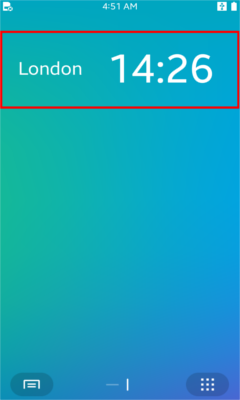

# DALi Widget Application


You can create a widget applications with DALi to display small version of application on the homescreen.

To create a DALi widget application, you must:

- Use the [Dali::WidgetApplication class](#widget-application-api).

	> **Note**
	> A DALi widget application is implemented similarly to a [DALi basic UI application](dali-basic-app.md), since the [Dali::WidgetApplication](../../api/mobile/latest/classDali_1_1WidgetApplication.html) class inherits from the [Dali::Application](../../api/mobile/latest/classDali_1_1Application.html) class. Consequently, make sure you are familiar with the basic UI application details before tackling a widget application.

- Make sure you [start the event loop](#mainloop).

- Implement your own widget class by inheriting the [Dali::Widget class](#widget-api).


**Figure: DALi widget application**



For the steps of creating the basic parts of a simple DALi widget application, see [Basics of Creating a DALi Widget Application](#create).

<a name="widget-application-api"></a>
## Widget application class

If you want to use DALi for your widget application, you must create the application with the `Dali::WidgetApplication` class. This class provides the means for initializing the resources required by DALi.

The following table lists the main function you need in your widget application.

**Table: Main functions**

| Function                             | Description                              |
|--------------------------------------|------------------------------------------|
| `mainloop()`                         |
| `RegisterWidgetCreatingFunction()`   | Register function to create widget instance |

The `mainloop()` function is used to start the event loop. If you do not call the function and start the event loop, DALi cannot call any callback functions for application events.

The `RegisterWidgetCreatingFunction()` function registers creating function to create widget instance. Widget application will create widget instance using this creating function when WidgetViewer application requests.

<a name="widget-api"></a>
## Widget class

`Dali::Widget` class provides interface for creating custom widget.

The following table lists the main function to manage widget instance.

**Table: Main functions**

| Function           | Description                                                                   |
|--------------------|-------------------------------------------------------------------------------|
| `OnCreate()`       | Called after the widget instance is created.                                  |
| `OnTerminate()`    | Called after the widget instance is terminated.                               |
| `OnPause()`        | Called when the widget is invisible.                                          |
| `OnResume()`       | Called when the widget is visible.                                            |
| `OnResize()`       | Called before the widget size is changed.                                     |
| `OnUpdate()`       | Called when an event for updating the widget is received.                     |
| `SetContentInfo()` | Send data about current state of widget instance to WidgetViewer application. |

Most of functions are for managing widget instance lifecycle. You can describe what will do on each lifecycle functions.

Widget instance can send data to WidgetViewer application using `SetContentInfo()` function. If you want to save current state of widget before deleting and show it again, you can use it.

<a name="create"></a>
## Basics of Creating a DALi Widget Application

1. Initialize the widget application:

   Create the `Dali::WidgetApplication` class instance to initialize and set up DALi for a widget application
   ```
   int DALI_EXPORT_API main( int argc, char **argv )
   {
     WidgetApplication application = WidgetApplication::New( &argc, &argv, "" );

     WidgetApplicationExample test( application );

     application.MainLoop();

     return 0;
   }
   ```

2. Connect signals to keep yourself informed when certain system events occur.

   To manage signal connection safely, DALi provides the [Dali::ConnectionTracker](../../api/mobile/latest/classDali_1_1ConnectionTracker.html) class. A typical way to start a DALi application is to create a class derived from the `Dali::ConnectionTracker` class and use its member functions as callback functions for DALi signals.When the application receives the `InitSignal()`, it can create UI components. Connect the `WidgetApplicationExample::Create()` callback to the `Dali::WidgetApplication::InitSignal()` function:
   ```
    class WidgetApplicationExample : public ConnectionTracker
    {
      public:
        WidgetApplicationExample( WidgetApplication& application )
          : mApplication( application )
        {
          mApplication.InitSignal().Connect( this, &WidgetApplicationExample::Create );
        }

        void Create( Application& application )
        {
          // Register widget creating function here.
        }

      private:
        WidgetApplication& mApplication;
    }
   ```

3. Create own widget class

   Before starting, You should know DALi background knowledge [Handle/Body Pattern: Basic Way of Using DALi Objects](handle.md).

   Because of this pattern, you need to make two classes. Handle class of custom widget and Body class of custom widget class.

   1. Make handle class of custom widget(sample-widget.h).

   ```
   #include <dali/public-api/adaptor-framework/widget.h>

   namespace Demo
   {
   namespace Internal
   {
     class SampleWidget;
   }
   class SampleWidget : public Dali::Widget    // Inherit widget class
   {
   public:
     SampleWidget();
     static SampleWidget New();
     ~SampleWidget();
     SampleWidget( const SampleWidget& sampleWidget );
     SampleWidget& operator=( const SampleWidget& sampleWidget );
   public:
     explicit SampleWidget( Internal::SampleWidget* sampleWidget );
   };
   }
   ```

   2. Make body class of custom widget(sample-widget-impl.h).

   ```
   #include <dali/public-api/adaptor-framework/widget-impl.h>

   // HANDLE INCLUDES
   #include "sample-widget.h"

   namespace Demo
   {
   namespace Internal
   {
   class SampleWidget : public Dali::Internal::Adaptor::Widget
   {
   public:
     SampleWidget();
     ~SampleWidget();
     static Demo::SampleWidget New();
     virtual void OnCreate( const std::string& contentInfo, Dali::Window window );
     virtual void OnTerminate( const std::string& contentInfo, Dali::Widget::Termination type );
     virtual void OnPause();
     virtual void OnResume();
     virtual void OnResize( Dali::Window window );
     virtual void OnUpdate( const std::string& contentInfo, int force );

   protected:
     // Undefined
     SampleWidget(const SampleWidget&);
     SampleWidget& operator=(SampleWidget&);
   };
   } // namespace Internal
   } // namespace Dali
   ```

   3. Implement each lifecycle functions.

   ```
   #include "sample-widget-impl.h"
   #include <dali-toolkit/dali-toolkit.h>
   #include <dali/integration-api/debug.h>

   using namespace Dali;
   using namespace Dali::Toolkit;

   namespace Demo
   {
   namespace Internal
   {

   Demo::CustomWidget SampleWidget::New()
   {
     IntrusivePtr<SampleWidget> impl = new SampleWidget();
     Demo::SampleWidget handle = Demo::SampleWidget( impl.Get() );
     return handle;
   }

   SampleWidget::SampleWidget(){}

   SampleWidget::~SampleWidget(){}

   void SampleWidget::OnCreate( const std::string& contentInfo, Dali::Window window )
   {
     TextLabel textLabel = TextLabel::New("Hello world!");
     window.Add(textLabel);
     // This widget will draw "Hello world!" text when WidgetViewer application loads this widget.
   }

   void SampleWidget::OnTerminate( const std::string& contentInfo, Dali::Widget::Termination type )
   {
     DALI_LOG_ERROR("Widget instance terminated\n");
   }

   void SampleWidget::OnPause()
   {
     DALI_LOG_ERROR("Widget instance paused\n");
   }

   void SampleWidget::OnResume()
   {
     DALI_LOG_ERROR("Widget instance resumed\n");
   }

   void SampleWidget::OnResize( Dali::Window window )
   {
     DALI_LOG_ERROR("Widget instance resized\n");
   }

   void SampleWidget::OnUpdate( const std::string& contentInfo, int force )
   {
     DALI_LOG_ERROR("Widget instance updated\n");
   }

   } // Internal
   } // Dali
   ```

4. Add creating function for custom widget.

    Now include custom widget header and add creating function for custom widget.

    ```
    #include "sample-widget.h"

    class WidgetApplicationExample : public ConnectionTracker
    {
      public:
        WidgetApplicationExample( WatchApplication& application )
          : mApplication( application )
        {
          mApplication.InitSignal().Connect( this, &WidgetApplicationExample::Create );
        }

        static Dali::Widget CreatingWidgetFunction(const std::string& widgetName)
        {
          Demo::SampleWidget widget = Demo::SampleWidget::New();
          return widget;
        }

        void Create( Application& application )
        {
          mApplication.RegisterWidgetCreatingFunction( "widget-dali.example", CreatingWidgetFunction );
        }

      private:
        WidgetApplication& mApplication;
    };
    ```

## Related Information
- Dependencies
  - Tizen 4.0 and Higher
