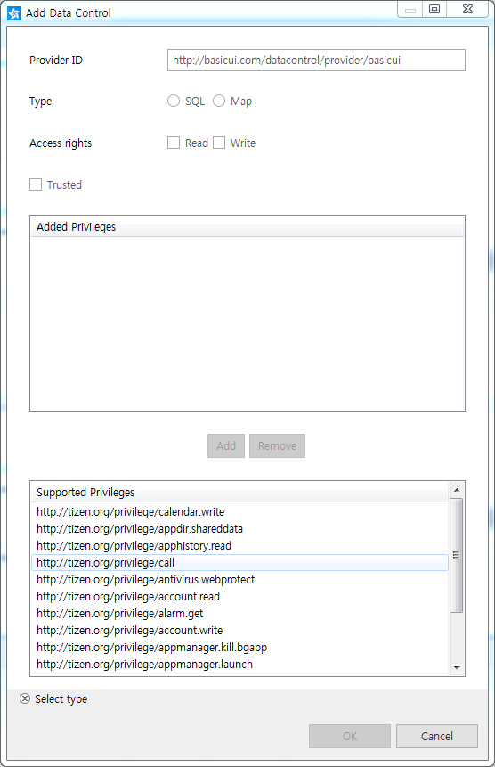

# Data Control


The data control is a standard mechanism for exchanging specific data between applications.

A provider application shares its data, and a consumer application can request the shared data. All applications can function as consumers and request data shared by other applications using a data control. However, only service applications can function as providers and share their own data.

The main features of the Data Control API include:

- Working with map-type data controls

  You can [use a key-value-type data control](#map1) to access data exported by service applications. You can also define a key-value-type data control provider to export specific data from your service application.

  The consumer sends a request to the provider to get, set, add, or remove map-type data. The provider processes the request and sends a response back to the consumer.

- Working with SQL-type data controls

  You can [use a SQL-type data control](#map2) to access specific data exported by service applications. You can also define a SQL-type data control provider to export specific data from your service application.

  The consumer sends a request to the provider to insert, update, select, or delete SQL-type data. The provider processes the request and sends a response back to the consumer.

- Monitoring data changes

  You can [monitor data changes and provide notifications about them](#map3). The available notification types are listed in the `data_control_data_change_type_e` enumerator (in [mobile](../../api/mobile/latest/group__CAPI__DATA__CONTROL__MODULE.html#ga09ee00edc0c08676b2fa241f30fab378) and [wearable](../../api/wearable/latest/group__CAPI__DATA__CONTROL__MODULE.html#ga09ee00edc0c08676b2fa241f30fab378) applications).

To create a provider, you must [export its provider functionalities](#export) in the application project settings in the IDE. For the consumer to access shared data, it must know the provider ID and data ID.

**Figure: Data control mechanism**


## Prerequisites

The data control use cases run two applications. Each application plays a different role: one as the consumer, the other as the provider.

To enable your application to use the data control functionality:

1. To use the Data Control API (in [mobile](../../api/mobile/latest/group__CAPI__DATA__CONTROL__MODULE.html) and [wearable](../../api/wearable/latest/group__CAPI__DATA__CONTROL__MODULE.html) applications), the consumer has to request permission by adding the following privileges to the `tizen-manifest.xml` file:

   ```
   <privileges>
      <privilege>http://tizen.org/privilege/datasharing</privilege>
      <privilege>http://tizen.org/privilege/appmanager.launch</privilege>
   </privileges>
   ```

2. For the provider, in the Tizen Studio, double-click **tizen-manifest.xml**, and in the manifest editor, go to **Advanced > Data Control**, and click **+** to add the provider details. Add the **Read** and **Write** access rights to both **SQL** and **Map** types.

    You can set the data access to trusted, to allow other applications that are signed with the same certificate to access the data. Additionally, you can also define privileges to restrict access for applications having certain defined privileges.

    The following sample code explains, how the `<datacontrol>` elements are consequently added to the `tizen-manifest.xml` file:

   ```
   <?xml version="1.0" encoding="utf-8"?>
    <manifest xmlns="http://tizen.org/ns/packages" api-version="4.0"
             package="@PACKAGE_NAME@" version="@VERSION@" install-location="internal-only">
      <label>datacontrolprovider</label>
      <author email="PUT YOUR EMAIL" href="www.tizen.org">PUT YOUR NAME</author>
      <description>datacontrolprovider</description>
      <service-application appid="org.tizen.datacontrolprovider"
                      exec="datacontrolprovider"
                      nodisplay="true" multiple="false" type="capp" taskmanage="true"
                      auto-restart="false" on-boot="false">
          <datacontrol providerid = "Your Provider ID" access="ReadWrite" type="Sql" trusted="True">
             <privilege>http://tizen.org/privilege/contact.read</privilege>
             <privilege>http://tizen.org/privilege/email</privilege>
          </datacontrol>
          <datacontrol providerid = "Your Provider ID" access="ReadWrite" type="Map" trusted="False"/>
       </service-application>
       <privileges>
          <privilege>http://tizen.org/privilege/datasharing</privilege>
       </privileges>
    </manifest>
    ```

3. To use the functions and data types of the Data Control API, include the `<data_control.h>` header file in your application:

   ```
   #include <data_control.h>

   #include <sqlite3.h>
   #include <stdlib.h>
   #include <glib.h>
   #include <string.h>
   ```

   To execute the applications in the following use cases, the `<sqlite3.h>`, `<stdlib.h>`, `<glib.h>`, and `<string.h>` header files have to be included too.

<a name="map1"></a>
## Working with Map-type Data Controls

In the consumer, you must first get the unique map-type `datacontrol_h` instance using the `data_control_map_create()`, `data_control_map_set_provider_id()`, or `data_control_map_set_data_id()` function. Afterwards, you can send requests to the provider using the `data_control_map_get()`, `data_control_map_set()`, `data_control_map_add()`, and `data_control_map_remove()` functions.

The provider returns a response to the consumer. The consumer can handle the response in a callback of the `data_control_map_response_cb` struct (in [mobile](../../api/mobile/latest/structdata__control__map__response__cb.html) and [wearable](../../api/wearable/latest/structdata__control__map__response__cb.html) applications), which is triggered when the provider finishes the requested operation.

> **Note**  
> Since Tizen 4.0, you can use the `data_control_map_bind_response_cb()` function, which binds a callback to a provider handle. This allows you to register multiple callbacks for a given provider ID.

To get, set, add, and remove map-type data:

1. Implement the provider application:

   1. The provider stores and provides data to the consumer. The provider has 4 operations that the consumer can request: get, set, add, and remove.

      Implement the callbacks to react to the requests from the consumer:

      ```
      struct map_data {
          char **str_arr;
          int arr_size;
      };
      typedef struct map_data map_data_s;

      static GHashTable *map_repository_test;

      /* Callback for handling the get operation request */
      void
      get_value_request_cb(int request_id, data_control_h provider, const char *key,
                           void *user_data)
      {
          map_data_s* map_data = (map_data_s*)g_hash_table_lookup(map_repository_test, key);

          int ret_value_count = 0;
          char **val_arr = NULL;
          if (map_data != NULL) {
              val_arr = map_data->str_arr;
              ret_value_count = map_data->arr_size;
          }

          int ret = data_control_provider_send_map_get_value_result(request_id, val_arr,
                                                                    ret_value_count);
          if (ret != DATA_CONTROL_ERROR_NONE)
              dlog_print(DLOG_ERROR, LOG_TAG,
                         "send_map_get_result failed with error: %d", ret);
          else
              dlog_print(DLOG_INFO, LOG_TAG, "Get value success request_id: %d", request_id);
      }

      /* Callback for handling the set operation request */
      void
      set_value_request_cb(int request_id, data_control_h provider, const char *key,
                           const char *old_value, const char *new_value, void *user_data)
      {
          map_data_s* map_data = (map_data_s*)g_hash_table_lookup(map_repository_test, key);
          if (map_data != NULL) {
              for (int i = 0; i < map_data->arr_size; i++) {
                  if (strcmp(map_data->str_arr[i], old_value) == 0)
                      map_data->str_arr[i] = g_strdup(new_value);
              }
          }

          int ret = data_control_provider_send_map_result(request_id);
          if (ret != DATA_CONTROL_ERROR_NONE)
              dlog_print(DLOG_ERROR, LOG_TAG, "send_map_result failed with error: %d", ret);
          else
              dlog_print(DLOG_INFO, LOG_TAG, "Set value success request_id: %d", request_id);
      }

      /* Callback for handling the add operation request */
      void
      add_value_request_cb(int request_id, data_control_h provider, const char *key,
                           const char *value, void *user_data)
      {
          map_data_s* map_data = (map_data_s*)g_hash_table_lookup(map_repository_test, key);

          if (map_data == NULL) {
              map_data = (map_data_s*)(g_malloc(sizeof(*map_data)));
              map_data->arr_size = 0;
              map_data->str_arr = (char**)calloc(1, sizeof(char*));
              map_data->str_arr[0] = g_strdup(value);
              g_hash_table_insert(map_repository_test, g_strdup(key), map_data);
          } else {
              char **new_arr = (char**)calloc(map_data->arr_size + 2, sizeof(char*));
              for (int i = 0; i < map_data->arr_size; i++)
                  new_arr[i] = g_strdup(map_data->str_arr[i]);
              free(map_data->str_arr);
              new_arr[map_data->arr_size] = g_strdup(value);
              map_data->str_arr = g_strdupv(new_arr);
              free(new_arr);
          }
          map_data->arr_size += 1;

          int ret = data_control_provider_send_map_result(request_id);
          if (ret != DATA_CONTROL_ERROR_NONE) {
              dlog_print(DLOG_ERROR, LOG_TAG, "send_map_result failed with error: %d", ret);
          } else {
              dlog_print(DLOG_INFO, LOG_TAG, "Add value success request_id: %d %d %s",
                         request_id, map_data->arr_size, map_data->str_arr[0]);
          }
      }

      /* Callback for handling the remove operation request */
      void
      remove_value_request_cb(int request_id, data_control_h provider, const char *key,
                              const char *value, void *user_data)
      {
          map_data_s* map_data = (map_data_s*)g_hash_table_lookup(map_repository_test, key);

          if (map_data != NULL) {
              int size = map_data->arr_size;
              for (int i = 0; i < size; i++) {
                  if (strcmp(map_data->str_arr[i], value) == 0) {
                      free(map_data->str_arr[i]);
                      map_data->arr_size--;
                  }
              }
              if (map_data->arr_size == 0) {
                  if (!g_hash_table_remove(map_repository_test, key)) {
                      dlog_print(DLOG_ERROR, LOG_TAG, "remove value failed -%s", key);

                      return;
                  }
              }
          }

          int ret = data_control_provider_send_map_result(request_id);
          if (ret != DATA_CONTROL_ERROR_NONE)
              dlog_print(DLOG_ERROR, LOG_TAG, "send_map_result failed with error: %d", ret);
          else
              dlog_print(DLOG_INFO, LOG_TAG, "Remove value Success");
      }
      ```

   2. Register the operation callbacks within the `app_create()` function (generated by the Tizen Studio) using the `data_control_provider_map_register_cb()` function:

      ```
      void
      __free_key(gpointer data)
      {
          if (data) {
              g_free(data);
              data = NULL;
              dlog_print(DLOG_INFO, LOG_TAG, "Remove key");
          }
      }

      void
      __free_data(gpointer data)
      {
          if (data) {
              g_free(data);
              data = NULL;
              dlog_print(DLOG_INFO, LOG_TAG, "Remove value");
          }
      }

      data_control_provider_map_cb map_callback;
      void
      initialize_datacontrol_provider()
      {
          map_repository_test = g_hash_table_new_full(g_str_hash, g_str_equal,
                                                      __free_key, __free_data);

          map_callback.get_cb = get_value_request_cb;
          map_callback.add_cb = add_value_request_cb;
          map_callback.remove_cb = remove_value_request_cb;
          map_callback.set_cb = set_value_request_cb;

          int result = data_control_provider_map_register_cb(&map_callback);
          if (result != DATA_CONTROL_ERROR_NONE)
              dlog_print(DLOG_ERROR, LOG_TAG,
                         "data_control_provider_map_register_cb failed with error: %d",
                         result);
          else
              dlog_print(DLOG_INFO, LOG_TAG, "Provider map register success");
      }

      static bool
      app_create(void *data)
      {
          initialize_datacontrol_provider()

          return true;
      }
      ```

2. Implement the consumer application:

   1. The consumer sends requests for the get, set, add, and remove operations to the provider, and receives the results as a response from the provider.

      Implement the response callbacks, which receive the request result and data from the provider:

      ```
      /* Callback for the get operation response */
      void
      map_get_response_cb(int request_id, data_control_h provider,
                          char **ret_value_list, int ret_value_count, bool provider_ret,
                          const char *error, void *user_data)
      {
          if (provider_ret) {
              dlog_print(DLOG_INFO, LOG_TAG,
                         "The get operation is successful. Value count: %d ", ret_value_count);
              for (int i = 0; i < ret_value_count; i++)
                  dlog_print(DLOG_INFO, LOG_TAG, "(%d) Return value: %s ",
                             i, ret_value_list[i]);
          } else {
              dlog_print(DLOG_ERROR, LOG_TAG,
                         "The get operation for the request %d failed. error message: %s",
                         request_id, error);
          }
      }

      /* Callback for the set operation response */
      void
      map_set_response_cb(int request_id, data_control_h provider, bool provider_ret,
                          const char *error, void *user_data)
      {
          if (provider_ret) {
              dlog_print(DLOG_INFO, LOG_TAG, "The set operation is successful");
          } else {
              dlog_print(DLOG_ERROR, LOG_TAG,
                         "The set operation for the request %d failed. error message: %s",
                         request_id, error);
          }
      }

      /* Callback for the add operation response */
      void
      map_add_response_cb(int request_id, data_control_h provider, bool provider_ret,
                          const char *error, void *user_data)
      {
          if (provider_ret) {
              dlog_print(DLOG_INFO, LOG_TAG, "The add operation is successful");
          } else {
              dlog_print(DLOG_ERROR, LOG_TAG,
                         "The add operation for the request %d failed. error message: %s",
                         request_id, error);
          }
      }

      /* Callback for the remove operation response */
      void
      map_remove_response_cb(int request_id, data_control_h provider, bool provider_ret,
                             const char *error, void *user_data)
      {
          if (provider_ret) {
              dlog_print(DLOG_INFO, LOG_TAG, "The remove operation is successful");
          } else {
              dlog_print(DLOG_ERROR, LOG_TAG,
                         "The remove operation for the request %d failed. error message: %s",
                         request_id, error);
          }
      }
      ```

   2. To identify the provider and data, initialize a data control handler within the `app_create()` function generated by the Tizen Studio:

      ```
      data_control_map_response_cb map_callback;
      void
      initialize_datacontrol_consumer(appdata_s *ad)
      {
          const char *provider_id = Your Provider ID;
          const char *data_id = "table";
          int ret;

          /* Create data control handler */
          ret = data_control_map_create(&(ad->provider_h));
          if (ret != DATA_CONTROL_ERROR_NONE)
              dlog_print(DLOG_ERROR, LOG_TAG,
                         "creating data control provider failed with error: %d", ret);
          ret = data_control_map_set_provider_id(ad->provider_h, provider_id);
          if (ret != DATA_CONTROL_ERROR_NONE)
              dlog_print(DLOG_ERROR, LOG_TAG,
                         "setting provider id failed with error: %d", ret);
          ret = data_control_map_set_data_id(ad->provider_h, data_id);
          if (ret != DATA_CONTROL_ERROR_NONE)
              dlog_print(DLOG_ERROR, LOG_TAG, "setting data id failed with error: %d", ret);

          /* Set response callbacks */
          map_callback.get_cb = map_get_response_cb;
          map_callback.set_cb = map_set_response_cb;
          map_callback.add_cb = map_add_response_cb;
          map_callback.remove_cb = map_remove_response_cb;

          /* Register response callbacks */
          ret = data_control_map_register_response_cb(ad->provider_h, &map_callback, NULL);
          if (ret != DATA_CONTROL_ERROR_NONE) {
              dlog_print(DLOG_ERROR, LOG_TAG,
                         "Registering the callback function failed with error: %d", ret);

              if (ret == DATA_CONTROL_ERROR_IO_ERROR)
                  dlog_print(DLOG_ERROR, LOG_TAG, "I/O error");
              else
                  dlog_print(DLOG_ERROR, LOG_TAG, "Out of memory");
          }

          int req_id = 0;

          /* Send a request to add a value */
          const char *key = "key";
          const char *value = "value";
          data_control_map_add(ad->provider_h, key, value, &req_id);

          /* Send a request to get a value */
          data_control_map_get(ad->provider_h, key, &req_id);

          /* Send a request to set a value */
          const char *old_value = "old value";
          const char *new_value = "new value";
          data_control_map_set(ad->provider_h, key, old_value, new_value, &req_id);

          /* Send a request to remove a value */
          data_control_map_remove(ad->provider_h, key, value, &req_id);
      }

      static bool
      app_create(void *data)
      {
          initialize_datacontrol_consumer(ad);

          return true;
      }
      ```

<a name="map2"></a>
## Working with SQL-type Data Controls

In the consumer, you must first get the unique SQL-type `datacontrol_h` instance using the `data_control_sql_create()`, `data_control_sql_set_provider_id()`, or `data_control_sql_set_data_id()` function. Afterwards, you can send requests to the provider using the `datacontrol_sql_select()`, `data_control_sql_insert()`, `data_control_sql_update()`, and `data_control_sql_delete()` functions.

The provider returns a response to the consumer. The consumer can handle the response in a callback of the `data_control_sql_response_cb` struct (in [mobile](../../api/mobile/latest/structdata__control__sql__response__cb.html) and [wearable](../../api/wearable/latest/structdata__control__sql__response__cb.html) applications), which is triggered when the provider finishes the requested operation.

> **Note**  
> Since Tizen 4.0, you can use the `data_control_sql_bind_response_cb()` function, which binds a callback to a provider handle. This allows you to register multiple callbacks for a given provider ID.

To insert, select, update, and delete SQL-type data:

1. Implement the provider application:

   1. The provider stores and provides data to the consumer. The provider has 4 operations that the consumer can request: insert, select, update, and delete.

      Implement the callbacks to react to the requests from the consumer:

      ```
      data_control_provider_sql_cb *sql_callback;
      static sqlite3* db;

      /* Callback for handling the insert operation request */
      void
      insert_request_cb(int request_id, data_control_h provider, bundle *insert_data,
                        void *user_data)
      {
          char* command = data_control_provider_create_insert_statement(provider,
                                                                        insert_data);
          int ret = sqlite3_exec(db, command, NULL, NULL, NULL);

          if (ret != SQLITE_OK) {
              data_control_provider_send_error(request_id, sqlite3_errmsg(db));
              free(command);

              return;
          }
          dlog_print(DLOG_INFO, LOG_TAG, "[insert_request_cb] insert success");

          long long inserted_row_id = sqlite3_last_insert_rowid(db);
          ret = data_control_provider_send_insert_result(request_id, inserted_row_id);
          if (ret != DATA_CONTROL_ERROR_NONE)
              dlog_print(DLOG_ERROR, LOG_TAG,
                         "insert_send_result failed with error: %d", ret);
          dlog_print(DLOG_INFO, LOG_TAG, "[insert_request_cb] send result success");

          free(command);
      }

      /* Callback for handling the select operation request */
      void
      select_request_cb(int request_id, data_control_h provider, const char **column_list,
                        int column_count, const char *where, const char *order,
                        void *user_data)
      {
          sqlite3_stmt* sql_stmt = NULL;

          char* command = data_control_provider_create_select_statement(provider,
                                                                        column_list,
                                                                        column_count, where,
                                                                        order);
          int ret = sqlite3_prepare_v2(db, command, strlen(command), &sql_stmt, NULL);
          if (ret != SQLITE_OK) {
              data_control_provider_send_error(request_id, sqlite3_errmsg(db));
              free(command);

              return;
          }

          ret = data_control_provider_send_select_result(request_id, (void *)sql_stmt);
          if (ret != DATA_CONTROL_ERROR_NONE)
              dlog_print(DLOG_ERROR, LOG_TAG,
                         "select_send_result failed with error: %d", ret);
          dlog_print(DLOG_INFO, LOG_TAG, "[select_request_cb] send result success");

          sqlite3_finalize(sql_stmt);
          free(command);
      }

      /* Callback for handling the update operation request */
      void
      update_request_cb(int request_id, data_control_h provider, bundle *update_data,
                        const char *where, void *user_data)
      {
          char* command = data_control_provider_create_update_statement(provider,
                                                                        update_data, where);
          int ret = sqlite3_exec(db, command, NULL, NULL, NULL);
          if (ret != SQLITE_OK) {
              data_control_provider_send_error(request_id, sqlite3_errmsg(db));
              free(command);

              return;
          }

          ret = data_control_provider_send_update_result(request_id);
          if (ret != DATA_CONTROL_ERROR_NONE)
              dlog_print(DLOG_ERROR, LOG_TAG,
                         "update_send_result failed with error: %d", ret);
          dlog_print(DLOG_INFO, LOG_TAG, "[update_request_cb] send result success");

          free(command);
      }

      /* Callback for handling the delete operation request */
      void
      delete_request_cb(int request_id, data_control_h provider, const char *where,
                        void *user_data)
      {
          dlog_print(DLOG_INFO, LOG_TAG, "[delete_request_cb] request_id(%d)", request_id);
          char* command = data_control_provider_create_delete_statement(provider, where);
          int ret = sqlite3_exec(db, command, NULL, NULL, NULL);
          if (ret != SQLITE_OK) {
              data_control_provider_send_error(request_id, sqlite3_errmsg(db));
              free(command);

              return;
          }

          ret = data_control_provider_send_delete_result(request_id);
          if (ret != DATA_CONTROL_ERROR_NONE)
              dlog_print(DLOG_ERROR, LOG_TAG,
                         "delete_send_result failed with error: %d", ret);
          dlog_print(DLOG_INFO, LOG_TAG, "[delete_request_cb] delete success");

          free(command);
      }
      ```

   2. Register the operation callbacks using the `data_control_provider_sql_register_cb()` function and create the database:

      ```
      int
      create_database()
      {
          dlog_print(DLOG_INFO, LOG_TAG, "%s%s", app_get_data_path(), "test.db");

          int open_flags = (SQLITE_OPEN_READWRITE | SQLITE_OPEN_CREATE);

          int ret = sqlite3_open_v2(Your DB Path, &db, open_flags, NULL);
          if (ret != SQLITE_OK) {
              dlog_print(DLOG_ERROR, LOG_TAG,
                         "database creation failed with error: %d", ret);

              return ret;
          }

          char* sql_command = "CREATE TABLE IF NOT EXISTS Dictionary (WORD VARCHAR(30),
                               WORD_DESC TEXT, WORD_NUM INT, Point INT)";
          ret = sqlite3_exec(db, sql_command, NULL, NULL, NULL);
          if (ret != SQLITE_OK)
              dlog_print(DLOG_ERROR, LOG_TAG,
                         "database table creation failed with error: %d", ret);

          sql_command = "CREATE TABLE IF NOT EXISTS Note (TITLE VARCHAR(30), CONTENTS TEXT)";
          ret = sqlite3_exec(db, sql_command, NULL, NULL, NULL);
          if (ret != SQLITE_OK)
              dlog_print(DLOG_ERROR, LOG_TAG,
                         "database table creation failed with error: %d", ret);

          dlog_print(DLOG_INFO, LOG_TAG, "DB init Success.");

          return ret;
      }

      void
      initialize_datacontrol_provider()
      {
          dlog_print(DLOG_INFO, LOG_TAG, "initialize_datacontrol_provider");

          int result = create_database();
          if (result != SQLITE_OK)
              return;

          sql_callback = (data_control_provider_sql_cb *)malloc(sizeof(data_control_provider_sql_cb));
          sql_callback->select_cb = select_request_cb;
          sql_callback->insert_cb = insert_request_cb;
          sql_callback->delete_cb = delete_request_cb;
          sql_callback->update_cb = update_request_cb;
          result = data_control_provider_sql_register_cb(sql_callback, NULL);
          if (result != DATA_CONTROL_ERROR_NONE)
              dlog_print(DLOG_ERROR,
                         "data_control_sql_response_c failed with error: %d", result);
          else
              dlog_print(DLOG_INFO, LOG_TAG, "Provider SQL register success");
      }
      ```

2. Implement the consumer application:

   1. The consumer sends requests for the insert, select, update, and delete operations to the provider, and receives the results as a response from the provider.

      Implement the response callbacks, which receive the request result and data from the provider:

      ```
      /* Callback for the insert operation response */
      void
      sql_insert_response_cb(int request_id, data_control_h provider,
                             long long inserted_row_id, bool provider_result,
                             const char *error, void *user_data)
      {
          if (provider_result) {
              dlog_print(DLOG_INFO, LOG_TAG, "The insert operation is successful");
          } else {
              dlog_print(DLOG_ERROR, LOG_TAG,
                         "The insert operation for the request %d failed. error message: %s",
                         request_id, error);
          }
      }

      /* Callback for the select operation response */
      void
      sql_select_response_cb(int request_id, data_control_h provider,
                             result_set_cursor cursor, bool provider_result,
                             const char *error, void *user_data)
      {
          if (provider_result) {
              dlog_print(DLOG_INFO, LOG_TAG, "The select operation is successful");
          } else {
              dlog_print(DLOG_ERROR, LOG_TAG,
                         "The select operation for the request %d failed. error message: %s",
                         request_id, error);
          }

          while (data_control_sql_step_next(cursor) == DATA_CONTROL_ERROR_NONE) {
              char word[32] = {0,};
              char word_desc[32] = {0,};
              long long word_number = -1;

              data_control_sql_get_text_data(cursor, 0, word);
              data_control_sql_get_text_data(cursor, 1, word_desc);
              data_control_sql_get_int64_data(cursor, 2, &word_number);

              dlog_print(DLOG_INFO, LOG_TAG, "Word: %s, Word DESC: %s, Word NUM: %ld ",
                         word, word_desc, word_number);
          }
      }

      /* Callback for the update operation response */
      void
      sql_update_response_cb(int request_id, data_control_h provider, bool provider_result,
                             const char *error, void *user_data)
      {
          if (provider_result) {
              dlog_print(DLOG_INFO, LOG_TAG, "The update operation is successful");
          } else {
              dlog_print(DLOG_ERROR, LOG_TAG,
                         "The update operation for the request %d failed. error message: %s",
                         request_id, error);
          }
      }

      /* Callback for the delete operation response */
      void
      sql_delete_response_cb(int request_id, data_control_h provider, bool provider_result,
                             const char *error, void *user_data)
      {
          if (provider_result) {
              dlog_print(DLOG_INFO, LOG_TAG, "The delete operation is successful");
          } else {
              dlog_print(DLOG_ERROR, LOG_TAG,
                         "The delete operation for the request %d failed. error message: %s",
                         request_id, error);
          }
      }
      ```

      Once you get the `result_set_cursor` object in the select operation response callback, you can use the following functions to get information:

      - `data_control_sql_step_first()`
      - `data_control_sql_step_last()`
      - `data_control_sql_step_next()`
      - `data_control_sql_set_previous()`
      - `data_control_sql_get_column_count()`
      - `data_control_sql_get_column_name()`
      - `data_control_sql_get_column_item_size()`
      - `data_control_sql_get_column_item_type()`
      - `data_control_sql_get_blob_data()`
      - `data_control_sql_get_int_data()`
      - `data_control_sql_get_int64_data()`
      - `data_control_sql_get_double_data()`
      - `data_control_sql_get_text_data()`

   2. To identify the provider and data, initialize a data control handler within the `app_create()` function generated by the Tizen Studio:
      ```
      data_control_sql_response_cb sql_callback;
      void
      initialize_datacontrol_consumer(appdata_s *ad)
      {
          int ret;
  
          const char *provider_id = Your Provider ID;
          const char *data_id = "Dictionary";
  
          /* Create data control handler */
          ret = data_control_sql_create(&(ad->provider_h));
          if (ret != DATA_CONTROL_ERROR_NONE)
              dlog_print(DLOG_ERROR, LOG_TAG,
                         "creating data control provider failed with error: %d", ret);
  
          ret = data_control_sql_set_provider_id(ad->provider_h, provider_id);
          if (ret != DATA_CONTROL_ERROR_NONE)
              dlog_print(DLOG_ERROR, LOG_TAG,
                         "setting provider id failed with error: %d", ret);
  
          ret = data_control_sql_set_data_id(ad->provider_h, data_id);
          if (ret != DATA_CONTROL_ERROR_NONE)
              dlog_print(DLOG_ERROR, LOG_TAG, "setting data id failed with error: %d", ret);
  
          /* Set response callbacks */
          sql_callback.delete_cb = sql_delete_response_cb;
          sql_callback.insert_cb = sql_insert_response_cb;
          sql_callback.select_cb = sql_select_response_cb;
          sql_callback.update_cb = sql_update_response_cb;
  
          /* Register response callbacks */
          ret = data_control_sql_register_response_cb(ad->provider_h, &sql_callback, NULL);
          if (ret != DATA_CONTROL_ERROR_NONE)
              dlog_print(DLOG_ERROR, LOG_TAG,
                         "Registering the callback function failed with error: %d", ret);
  
          dlog_print(DLOG_INFO, LOG_TAG, "Init data control success");
  
          int req_id = 0;
  
          /* Send a request to insert a row */
          bundle *b = bundle_create();
          bundle_add_str(b, "WORD", "'test'");
          bundle_add_str(b, "WORD_DESC", "'test desc'");
  
          data_control_sql_insert(ad->provider_h, b, &req_id);
  
          /* Send a request to select a row */
          char *column_list[2];
          column_list[0] = "WORD";
          column_list[1] = "WORD_DESC";
  
          const char *where = "WORD = 'test'";
          const char *order = "WORD ASC";
  
          data_control_sql_select(ad->provider_h, column_list, 2, where, order, &req_id);
  
          /* Send a request to add a row */
          bundle_add_str(b, "WORD", "'test_new'");
          data_control_sql_update(ad->provider_h, b, where, &req_id);
  
          /* Send a request to delete a row */
          const char *where_delete = "WORD = 'test'";
          result = data_control_sql_delete(ad->provider_h, where_delete, &req_id);
  
          /* Free memory */
          bundle_free(b);
      }
  
      static bool
      app_create(void *data)
      {
          /*
             Take necessary actions before main event loop starts
             Initialize UI resources and application data
             If this function returns true, the main loop of application starts
             If this function returns false, the application is terminated
          */
          appdata_s *ad = data;
  
          create_base_gui(ad);
          initialize_datacontrol_consumer(ad);
  
          return true;
      }
  	  ```

   3. To send requests to a specific table, use the `data_control_sql_set_data_id()` function:

      ```
      {
          bundle *b;
          int ret;

          /* Insert data to the Note table */
          ret = data_control_sql_set_data_id(ad->provider_h, "Note");
          if (ret != DATA_CONTROL_ERROR_NONE)
              dlog_print(DLOG_ERROR, LOG_TAG, "setting data id failed with error: %d", ret);

          b = bundle_create();
          bundle_add_str(b, "TITLE", "'test'");
          bundle_add_str(b, "CONTENTS", "'test contents'");
          data_control_sql_insert(ad->provider_h, b, &req_id);
          bundle_free(b);

          /* Insert data to the Dictionary table */
          ret = data_control_sql_set_data_id(ad->provider_h, "Dictionary");
          if (ret != DATA_CONTROL_ERROR_NONE)
              dlog_print(DLOG_ERROR, LOG_TAG, "setting data id failed with error: %d", ret);

          b = bundle_create();
          bundle_add_str(b, "WORD", "'test'");
          bundle_add_str(b, "WORD_DESC", "'test desc'");
          data_control_sql_insert(ad->provider_h, b, &req_id);
          bundle_free(b);
      }
      ```

<a name="map3"></a>
## Monitoring Data Changes

If the consumer wants to receive data change notifications from the provider, it can request notifications with a data change callback:

- The consumer can add a data change callback using the `data_control_add_data_change_cb()` function. When no longer needed, the callback can be removed using the `data_control_remove_data_change_cb()` function.
- To accept the callback addition and notification request from the consumer, the provider uses the `data_control_provider_add_data_change_consumer_filter_cb()` function to add a notification filter. When no longer needed, the filter can be removed using the `data_control_provider_remove_data_change_consumer_filter_cb()` function.
- In the provider, you can use the `data_control_provider_foreach_data_change_consumer()` function to list all the consumers whose request for the data change notifications has been successful, and who can receive data change notifications from the provider.

To monitor data changes, and send and receive notifications:

1. Implement monitoring in the provider application.

   When the provider's data changes, the provider can send information about the changed data to the consumers who have registered a data change notification callback.

   When a consumer attempts to register a data change notification callback, the provider can decide whether to allow it.

   ```
   bool
   change_noti_consumer_list_cb(data_control_h provider, char *consumer_appid,
                                void *user_data)
   {
       dlog_print(DLOG_INFO, LOG_TAG,
                  "Added change noti consumer appid: %s", consumer_appid);

       return true;
   }

   bool
   consumer_filter_cb_1(data_control_h provider, char *consumer_appid, void *user_data)
   {
       dlog_print(DLOG_INFO, LOG_TAG,
                  "consumer appid %s try to add data change callback", consumer_appid);
       if (strcmp(consumer_appid, "org.tizen.helloworld_consumer2") == 0) {
           dlog_print(DLOG_INFO, LOG_TAG, "Invalid appid: %s", consumer_appid);

           return false;
       }
       data_control_provider_foreach_data_change_consumer(provider,
                                                          &change_noti_consumer_list_cb,
                                                          NULL);

       return true;
   }

   bool
   consumer_filter_cb_2(data_control_h provider, char *consumer_appid, void *user_data)
   {
       dlog_print(DLOG_INFO, LOG_TAG,
                  "consumer appid %s try to add data change callback", consumer_appid);
       if (strcmp(consumer_appid, "org.tizen.helloworld_consumer3") == 0) {
           dlog_print(DLOG_INFO, LOG_TAG, "Invalid appid: %s", consumer_appid);

           return false;
       }

       return true;
   }

   /* Add the filter for the accepted callback registration */
   int filter_callback_id_1;
   int filter_callback_id_2;
   void
   add_consumer_filter_cb_func(void *data, Evas_Object *obj EINA_UNUSED,
                               void *event_info EINA_UNUSED)
   {
       data_control_provider_add_data_change_consumer_filter_cb(consumer_filter_cb_1,
                                                                NULL,
                                                                &filter_callback_id_1);
       dlog_print(DLOG_INFO, LOG_TAG,
                  "filter_callback_id_1 id: %d", filter_callback_id_1);

       data_control_provider_add_data_change_consumer_filter_cb(consumer_filter_cb_2,
                                                                NULL,
                                                                &filter_callback_id_2);
       dlog_print(DLOG_INFO, LOG_TAG,
                  "filter_callback_id_2 id: %d", filter_callback_id_2);
   }

   /* Remove the filter */
   void
   remove_consumer_filter_cb_func(void *data, Evas_Object *obj EINA_UNUSED,
                                  void *event_info EINA_UNUSED)
   {
       data_control_provider_remove_data_change_consumer_filter_cb(filter_callback_id_1);
       dlog_print(DLOG_INFO, LOG_TAG, "remove callback %d", filter_callback_id_1);

       data_control_provider_remove_data_change_consumer_filter_cb(filter_callback_id_2);
       dlog_print(DLOG_INFO, LOG_TAG, "remove callback %d", filter_callback_id_2);
   }

   /* Send a data change notification */
   void
   update_request_cb(int request_id, data_control_h provider, bundle *update_data,
                     const char *where, void *user_data)
   {
       char* command = data_control_provider_create_update_statement(provider,
                                                                     update_data, where);
       int ret = sqlite3_exec(db, command, NULL, NULL, NULL);
       if (ret != SQLITE_OK) {
           data_control_provider_send_error(request_id, sqlite3_errmsg(db));
           free(command);

           return;
       }

       ret = data_control_provider_send_update_result(request_id);
       if (ret != DATA_CONTROL_ERROR_NONE)
           dlog_print(DLOG_ERROR, LOG_TAG,
                      "update_send_result failed with error: %d", ret);
       dlog_print(DLOG_INFO, LOG_TAG, "[update_request_cb] send result success");

       data_control_provider_send_data_change_noti(provider,
                                                   DATA_CONTROL_DATA_CHANGE_SQL_UPDATE,
                                                   update_data);
       dlog_print(DLOG_INFO, LOG_TAG,
                  "[send data change notification] Notify data change");

       free(command);
   }
   ```

2. Implement the consumer application.

   The consumer requests the provider to add or remove the data change callback, and receives the request result from the provider. If the provider allows the data change notifications, the consumer receives them when the data changes.

   ```
   /* Triggered when the data change notification arrives */
   void
   data_change_cb(data_control_h provider, data_control_data_change_type_e type,
                  bundle *data, void *user_data)
   {
       char *word;
       char *word_desc;
       char *word_num;

       bundle_get_str(data, "WORD", &word);
       bundle_get_str(data, "WORD_DESC", &word_desc);
       bundle_get_str(data, "WORD_NUM", &word_num);
       dlog_print(DLOG_INFO, LOG_TAG, "%d type noti, changed data: %s, %s, %s",
                  type, word, word_desc, word_num);
   }

   /* Triggered when the provider has accepted the callback registration */
   void
   result_cb(data_control_h provider, data_control_error_e result, int callback_id,
             void *user_data)
   {
       dlog_print(DLOG_INFO, LOG_TAG, "Add data change callback RESULT: %d", result);
   }

   /* Register the callback */
   int cb_id;
   void
   add_data_change_cb_func(void *data, Evas_Object *obj, void *event_info)
   {
       appdata_s *ad = (appdata_s *)data;
       int ret = data_control_add_data_change_cb(ad->provider_h, data_change_cb, NULL,
                                                 result_cb, NULL, &cb_id);
       if (ret != DATA_CONTROL_ERROR_NONE)
           dlog_print(DLOG_ERROR, LOG_TAG,
                      "add data change callback failed with error: %d", ret);
       dlog_print(DLOG_INFO, LOG_TAG, "add data change callback done: %d", cb_id);
   }

   /* Remove the callback */
   void
   remove_data_change_cb_func(void *data, Evas_Object *obj, void *event_info)
   {
       appdata_s *ad = (appdata_s *)data;
       data_control_remove_data_change_cb(ad->provider_h, cb_id);
       dlog_print(DLOG_INFO, LOG_TAG, "remove data change callback done: %d", cb_id);
   }
   ```

<a name="export"></a>
## Data Control Export

You can export the provider functionalities of your Tizen native service application in the [application project settings](../../tutorials/process/setting-properties.md#manifest) in the Tizen Studio. The provider ID, type, and accessibility must be specified for the available data control.

**Figure: Exporting data control**



The data model must be opened to the public to help other applications to use the exported data controls. The data model consists of the following data:

- Provider ID

  - It is used for identifying the data control provider.
  - It must be unique and use a fully-qualified domain name.
  - It must consist of alpha-numeric letters separated with the period (".") character, and it must start with a letter.
  - Platform-defined data control provider is defined in the `http://tizen.org/datacontrol/provider/<application name>` format.
  - User-defined data control provider is defined in the `http://<vendor.com>/datacontrol/provider/<application name>` format.

- Data ID

  - It is used for identifying data (usually a database table name or a registry section name) exported by the data control provider.
  - It must be unique in the data control provider and it is given as a string of 1 or more components, separated by a slash ("/") character.

- Type

  - You can use Tizen native applications that provide their own data structure table and implement the SQL-type data control provider using the database file.
  - You can use Tizen native applications that provide their own key-value pairs data structure map and implement the map-type data control provider using registry file or collection map classes.

- Data schema

  - SQL-type data control exports column names and types of the data structure table.
  - Map-type data control exports key names and types of the data structure map.

- Data accessibility

  - Tizen native applications can control read and write access from other applications by defining data control accessibility.
- Trusted
  - You can allow access from other applications signed with the same certificate by setting the trusted status for the data control.
- Privileges
  - Your provider application can restrict access to applications having certain defined privileges.


**Table: Data model example of a data control provider**

| Data control type | Data control provider ID                 | Data control data ID | Data schema              | Data accessibility      | Trusted    | Privileges |                                          |
|-----------------|----------------------------------------|--------------------|------------------------|-----------------------|----------|----------|----------------------------------------|
| SQL               | `http://<vendor.com>/datacontrol/provider/sample` | `data1`              | `column1`(Type: Integer) | `column2`(Type: String) | Read-Only  | True       | `http://tizen.org/privilege/application.admin` |
| Map               | `http://<vendor.com>/datacontrol/provider/sample2` | `data2`              | `key1`(Type: String)     | `key2`(Type: String)    | Read-Write | False      | `http://tizen.org/privilege/appmanager.launch` |


## Related Information
- Dependencies
  - Tizen 2.4 and Higher for Mobile
  - Tizen 2.3.1 and Higher for Wearable
