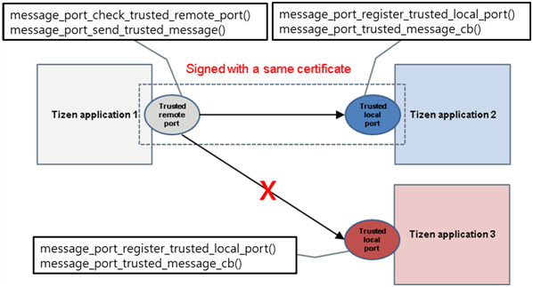

# Message Port


Tizen applications can communicate with each other using message ports. Applications can send and receive messages through message port communication. The message data type for communication is a map data which consists of a bundle (key and value pair).

The main features of the Message Port API include:

- Using uni-directional communication

  You can send and receive messages using [uni-directional message port communication](#uni) between Tizen native applications.

- Using bi-directional communication

  You can send and receive messages using [bi-directional message port communication](#bi) between Tizen native applications.

- Using trusted communication

  You can [send and receive trusted messages](#trusted_use) between specific applications.

You can communicate using 2 types of message ports:

- **Local port** is used to register your message port and prepare to receive messages from another application.

  To receive messages from the another application, set the callback from the local message port.

- **Remote port** is used to send messages to other applications. The local message port information can be sent to the other application for bi-directional communication.

## Prerequisites

To enable your application to use the message port functionality:

1. You need 2 applications to communicate with each other through the message port.

2. To use trusted message port communication, both applications must have the same certificate. To create and register an author certificate, go to the Tizen Studio menu and select **Tools > Certificate Manager**. For more information, see [Working with the Certificate Profile](../../tizen-studio/common_tools/certificate-registration.md).

3. To use the functions and data types of the Message Port API (in [mobile](../../api/mobile/latest/group__CAPI__MESSAGE__PORT__MODULE.html) and [wearable](../../api/wearable/latest/group__CAPI__MESSAGE__PORT__MODULE.html) applications), include the `<message_port.h>` header file in your application:

   ```
   #include <message_port.h>
   ```

<a name="uni"></a>
## Using Uni-directional Communication

To use uni-directional communication, you must check whether the message port of a remote application is registered with the `message_port_check_remote_port()` function. You can then send messages to the remote application using the `message_port_send_message()` function. The remote application can receive the messages using the `message_port_register_local_port()` function.

**Figure: Uni-directional message port communication**


To send a message from Application 1 to Application 2 using the Message Port API:

1. Register a local port in Application 2.

   To register the local port, call the `message_port_register_local_port()` function and implement a callback for it in Application 2:

   ```
   void
   message_port_cb(int local_port_id, const char *remote_app_id, const char *remote_port,
                   bool trusted_remote_port, bundle *message, void *user_data)
   {
       char *command = NULL;
       char *data = NULL;
       bundle_get_str(message, "command", &command);
       bundle_get_str(message, "data", &data);

       dlog_print(DLOG_INFO, TAG, "Message from %s, command: %s data: %s",
                  remote_app_id, command, data);
   }

   int port_id = message_port_register_local_port(local_port, message_port_cb, NULL);
   if (port_id < 0)
       dlog_print(DLOG_ERROR, LOG_TAG, "Port register error: %d", port_id);
   else
       dlog_print(DLOG_INFO, LOG_TAG, "port_id: %d", port_id);
   ```

2. Check the remote port in Application 1.

   To check the remote port, call the `message_port_check_remote_port()` function in Application 1:

   ```
   bool
   test_check_remote_port()
   {
       int ret;
       bool found;

       ret = message_port_check_remote_port(remote_app_id, remote_port, &found);
       if (ret != MESSAGE_PORT_ERROR_NONE)
           dlog_print(DLOG_ERROR, TAG, "message_port_check_remote_port error: %d", ret);

       return found;
   }
   ```

3. Send a message in Application 1.

   To send a message, call the `message_port_send_message()` function in Application 1:

   ```
   void
   send_message(void)
   {
       int ret;
       bundle *b = bundle_create();
       bundle_add_str(b, "command", "begin");
       bundle_add_str(b, "data", "dummy");
       ret = message_port_send_message(remote_app_id, remote_port, b);
       if (ret != MESSAGE_PORT_ERROR_NONE)
           dlog_print(DLOG_ERROR, TAG, "message_port_check_remote_port error: %d", ret);
       else
           dlog_print(DLOG_INFO, TAG, "Send message done");
       bundle_free(b);
   }
   ```

<a name="bi"></a>
## Using Bi-directional Communication

To use bi-directional communication, you must check whether the message port of a remote application is registered with the `message_port_check_remote_port()` function. You can then send messages and local message port information to the remote application using the `message_port_send_message_with_local_port()` function. The remote application can use the local message port information to send response messages after it receives your messages using the `message_port_register_local_port()` function.

**Figure: Bi-directional message port communication**


To send a message from Application 1 to Application 2, and from Application 2 to Application 1:

1. Implement the response logic in both applications:

   ```
   void
   message_port_cb(int local_port_id, const char *remote_app_id, const char *remote_port,
                   bool trusted_remote_port, bundle *message, void *user_data)
   {
       int ret;
       char *command = NULL;
       char *data = NULL;
       bundle_get_str(message, "command", &command);
       bundle_get_str(message, "data", &data);

       dlog_print(DLOG_INFO, TAG, "Message from %s, command: %s data: %s",
                  remote_app_id, command, data);

       bundle *reply = bundle_create();
       bundle_add_str(reply, "result", "GOT_IT");
       ret = message_port_send_message(remote_app_id, remote_port, reply);
       bundle_free(reply);
       if (ret != MESSAGE_PORT_ERROR_NONE)
           dlog_print(DLOG_ERROR, TAG, "Port send message error: %d", ret);
   }
   ```

2. Register the local port in Application 1.

   Call the `message_port_register_local_port()` function in Application 1:

   ```
   void
   message_port_cb(int local_port_id, const char *remote_app_id, const char *remote_port,
                   bool trusted_remote_port, bundle *message, void *user_data)
   {
       char *result = NULL;
       bundle_get_str(message, "result", &result);
       dlog_print(DLOG_INFO, TAG, "Message from %s, result: %s ", remote_app_id, result);
   }

   int local_port_id = message_port_register_local_port(local_port, message_port_cb);
   if (local_port_id < 0)
       dlog_print(DLOG_ERROR, TAG, "Port register error: %d", local_port_id);
   else
       dlog_print(DLOG_INFO, TAG, "port_id: %d", port_id);
   ```

3. Send a message with local port information.

   To get a response from the receiver, local port information must be sent to the receiver when the message is delivered. To do this, call the `message_port_send_message_with_local_port()` function in Application 1.

   ```
   void
   send_message_with_local_port(int local_port_id)
   {
       int ret;
       bundle *b = bundle_create();
       bundle_add_str(b, "command", "begin");
       bundle_add_str(b, "data", "dummy");

       ret = message_port_send_message_with_local_port(remote_app_id, remote_port, b, local_port_id);
       if (ret != MESSAGE_PORT_ERROR_NONE)
           dlog_print(DLOG_ERROR, TAG, "message_port_send_message_with_local_port error: %d", ret);
       else
           dlog_print(DLOG_INFO, TAG, "Send message done");
       bundle_free(b);
   }

   if (test_check_remote_port()) {
       dlog_print(DLOG_INFO, TAG, "Remote port check success.");
       send_message_with_local_port(local_port_id);
   }
   ```

<a name="trusted_use"></a>
## Using Trusted Communication

The trusted message port instance can be retrieved using the `message_port_register_trusted_local_port()` function. Communication over the trusted message port is allowed only if both applications are signed with a certificate that is uniquely assigned to its developer.

**Figure: Trusted uni-directional message port communication**



Trusted communication works similarly as normal message port communication. The only difference is that you must use trusted functions instead of normal functions, as defined in the following table.

**Table: Corresponding normal and trusted communication functions**

| Normal communication                 | Trusted communication                    |
|--------------------------------------|------------------------------------------|
| `message_port_check_remote_port()`   | `message_port_check_trusted_remote_port()` |
| `message_port_send_message()`        | `message_port_send_trusted_message()`    |
| `message_port_register_local_port()` | `message_port_register_trusted_local_port()` |

## Related Information
- Dependencies
  - Tizen 2.4 and Higher for Mobile
  - Tizen 2.3.1 and Higher for Wearable
