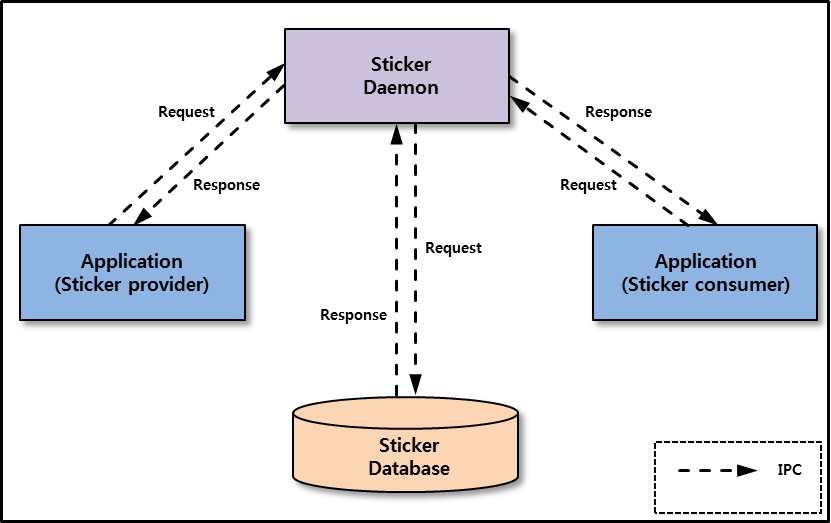

# Sticker


The Sticker feature provides users with fun experiences to share sticker information. The Sticker applications are composed of a [Sticker provider application](#provider_application) and [Sticker consumer applications](#consumer_application). The Sticker provider creates stickers and you can create your own Sticker consumer applications that use the stickers created by the Sticker provider. The Sticker provider application can store sticker details such as URI, keyword, and group name to the Sticker database. The Sticker consumer applications can retrieve sticker information using the Sticker API.

The main features of the Sticker API include:

- Preparing the Sticker service for use

  You can connect the Sticker daemon to operate the Sticker service.

- Sticker data handle

  You can use the Sticker data handle to [store the sticker information](#set_data_handle) and to [get the sticker information](#get_data_handle) stored in it.

- [Inserting the sticker information](#insert_sticker)

  - You can store the sticker information using the Sticker API at application runtime, and [use the JSON file](#set_json) to store the sticker information at a time.
  - You can store sticker information automatically when the Sticker provider application is installed without using the Sticker API.

- Retrieving the sticker information

  You can [retrieve the sticker information](#retrieve_sticker), which includes URI, keyword, group name, and so on.

**Figure: Sticker Mechanism**



## Prerequisites

To enable your Sticker provider application to use the Sticker functionality:

1. To use the Sticker provider API, the following category must be added to the `tizen-manifest.xml` file:

    ```
    <category name="http://tizen.org/category/sticker"/>
    ```

2. To use the functions and data types of the Sticker API, include the `<sticker_provider.h>` header file in your application:

    ```
    #include <sticker_provider.h>
    ```

To enable your Sticker consumer application to use the Sticker functionality:

1. To use the Sticker consumer API, the application has to request permission by adding the following privilege to the `tizen-manifest.xml` file:

    ```
    <privileges>
       <privilege>http://tizen.org/privilege/mediastorage</privilege>
    </privileges>
    ```

2. To use the functions and data types of the Sticker API, include the `<sticker_consumer.h>` header file in your application:

    ```
    #include <sticker_consumer.h>
    ```

 To ensure that a Sticker function has been executed properly, make sure that the return is equal to `STICKER_ERROR_NONE`.

<a name="provider_application"></a>
## Create Sticker Provider Application

You can provide the sticker information to applications that use stickers. If you store the stickers into the Sticker database, the Sticker consumer applications can search for them.

### Create Sticker Provider Handle

Create the Sticker provider handle using `sticker_provider_create()` that allows you to store the sticker information:

```
void
create_sticker_provider_handle()
{
    sticker_provider_h sticker_provider;
    int ret;
    ret = sticker_provider_create(&sticker_provider);
    if (ret != STICKER_ERROR_NONE)
        /* Error handling */
}
```

<a name="set_data_handle"></a>
### Set Sticker Information to Sticker Data Handle

To store the sticker information to the Sticker database without using the JSON file, the sticker information must be set into the Sticker data handle:

```
sticker_data_h
set_sticker_data(sticker_data_uri_type_e type, const char* uri, const char* keyword[],
int len, const char* group, const char* thumbnail, const char* description)
{
    sticker_data_h sticker_data;
    int ret;

    /* Creates a Sticker data handle */
    ret = sticker_data_create(&sticker_data);
    if (ret != STICKER_ERROR_NONE)
        /* Error handling */

    /* Sets the URI and URI type of the sticker */
    ret = sticker_data_set_uri(sticker_data, type, uri);
    if (ret != STICKER_ERROR_NONE)
        /* Error handling */

    for (int i = 0; i < len; i++)
    {
        /* Adds a keyword of the sticker to the list */
        ret = sticker_data_add_keyword(sticker_data, keyword[i]);
        if (ret != STICKER_ERROR_NONE)
            /* Error handling */
    }

    /* Sets the group name of the sticker */
    ret = sticker_data_set_group_name(sticker_data, group);
    if (ret != STICKER_ERROR_NONE)
        /* Error handling */

    /* Sets the thumbnail local path of the sticker */
    ret = sticker_data_set_thumbnail(sticker_data, thumbnail);
    if (ret != STICKER_ERROR_NONE)
        /* Error handling */

    /* Sets the description of the sticker */
    ret = sticker_data_set_description(sticker_data, description);
    if (ret != STICKER_ERROR_NONE)
        /* Error handling */

    return sticker_data;
}

void
insert_sticker_data()
{
    sticker_data_h data_handle;
    int ret;

    /* Your code */

    data_handle = set_sticker_data(type, uri, keyword, len, group, thumbnail, description);

    /* Your code */

    /* Destroys a sticker data handle */
    ret = sticker_data_destroy(data_handle);
    if (ret != STICKER_ERROR_NONE)
        /* Error handling */
}
```

> **Note**
>
> When the Sticker data handle is no longer needed, destroy it.

<a name="set_json"></a>
### Set Sticker Information in JSON File

The following JSON file shows how to set the sticker information to be stored into the Sticker database:

```
{
    "sticker":
    [
        {
            "type" : 1,  /* Sets the URI type of the sticker */
            "uri" : "/res/face/slightly_smiling_face.png",  /* Sets the URI of the sticker */
            "keyword" : ["face", "smile"],  /* Adds a keyword of the sticker to the list */
            "group" : "face",  /* Sets the group name of the sticker */
            "thumbnail" : "/res/thumbnail/face/slightly_smiling_face.png",  /* Sets the thumbnail local path of the sticker */
            "description" : "A yellow face with simple, open eyes and a thin, closed smile."  /* Sets the description of the sticker */
        },
        {
            "type" : 1,
            "uri" : "/res/face/heart_eyes.png",
            "keyword" : ["face", "love", "adoration"],
            "group" : "face",
            "thumbnail" : "/res/thumbnail/face/heart_eyes.png",
            "description" : "A yellow face with an open smile, sometimes showing teeth, and red, cartoon-styled hearts for eyes."
        },
        ...
        {
            ...
        }
    ]
}
```

<a name="insert_sticker"></a>
### Insert Sticker Information

You can use the following methods to store sticker information into the Sticker database:

- To store one sticker information, use `sticker_provider_insert_data()`:

  ```
  void
  insert_sticker_data(sticker_provider_h sticker_provider, sticker_data_h sticker_data)
  {
      int ret;
      ret = sticker_provider_insert_data(sticker_provider, sticker_data);
      if (ret != STICKER_ERROR_NONE)
          /* Error handling */
  }
  ```

- To store multiple sticker information, use `sticker_provider_insert_data_by_json_file()`:

  ```
  void
  insert_finished_cb(sticker_error_e error, void *user_data)
  {
      /* Your code */
  }

  void
  insert_sticker_data(sticker_provider_h sticker_provider, const char* json_path)
  {
      int ret;
      ret = sticker_provider_insert_data_by_json_file(sticker_provider, json_path, insert_finished_cb, NULL);
      if (ret != STICKER_ERROR_NONE)
          /* Error handling */
  }
  ```

- To store sticker information without using `sticker_provider_insert_data()` and `sticker_provider_insert_data_by_json_file()`, add the following metadata to the `tizen-manifest.xml` file:

  ```
  <category name="http://tizen.org/category/sticker"/>
  <!-- Sets the JSON local path -->
  <metadata key="http://tizen.org/metadata/sticker" value="/res/json/sticker.json"/>
  ```

  If you set the path of the JSON file to the value in metadata, sticker information of the JSON file is automatically stored when the Sticker provider application is installed.

  > **Note**
  >
  > The metadata must be added after category.

### Update Sticker Information

You can update the sticker information stored in the Sticker database using the following functions:

```
void
update_sticker_data(sticker_provider_h sticker_provider, sticker_data_h sticker_data)
{
    int ret;
    ret = sticker_provider_update_data(sticker_provider, sticker_data);
    if (ret != STICKER_ERROR_NONE)
        /* Error handling */
}
```

### Destroy Sticker Provider Handle

Destroy the Sticker provider handle using `sticker_provider_destroy()`:

```
void
destroy_sticker_provider_handle(sticker_provider_h sticker_provider)
{
    int ret;
    ret = sticker_provider_destroy(sticker_provider);
    if (ret != STICKER_ERROR_NONE)
        /* Error handling */
}
```

<a name="consumer_application"></a>
## Create Sticker Consumer Application

You can create the Sticker consumer application using Sticker API to use sticker information. You can search for stickers and get details of stickers.

### Create Sticker Consumer Handle

Create the Sticker consumer handle using `sticker_consumer_create()` that allows you to retrieve the sticker information:

```
void
create_sticker_consumer_handle()
{
    sticker_consumer_h sticker_consumer;
    int ret;
    ret = sticker_consumer_create(&sticker_consumer);
    if (ret != STICKER_ERROR_NONE)
        /* Error handling */
}
```

<a name="retrieve_sticker"></a>
### Retrieve Sticker Information

You can retrieve all the stickers stored in the Sticker database and use keyword, group name, and type of URI to retrieve stickers.

The following example shows how to retrieve stickers using the group name:

```
void
sticker_info_cb(sticker_data_h sticker_data, void *user_data)
{
    /* Your code */
}

void
retrieve_stickers(sticker_consumer_h sticker_consumer)
{
    int ret;
    int offset;
    int count;
    int result;
    char *group_name;

    /* Your code */

    /* Retrieve all sticker data by group name */
    ret = sticker_consumer_data_foreach_by_group(sticker_consumer, offset, count, &result, group_name, sticker_info_cb, NULL);
    if (ret != STICKER_ERROR_NONE)
        /* Error handling */
}
```

You can retrieve the keywords and the group name of the stickers.

The following example shows how to retrieve the keyword list:

```
void
keyword_foreach_cb(const char *keyword, void *user_data)
{
    /* Your code */
}

void
retrieve_keyword_list(sticker_consumer_h sticker_consumer)
{
    int ret;

    /* Retrieve all keywords */
    ret = sticker_consumer_keyword_list_foreach_all(sticker_consumer, keyword_foreach_cb, NULL);
    if (ret != STICKER_ERROR_NONE)
        /* Error handling */
}
```

<a name="get_data_handle"></a>
### Get Sticker Information

To obtain sticker information, use `sticker_data_get__XXX()`. To avoid memory leaks, free the character array variable with `free()` when no longer needed.

The following example shows how to get the sticker information from the Sticker data handle:

```
void
keyword_foreach_cb(const char *keyword, void *user_data)
{
    /* Your code */
}

void
get_sticker_data(sticker_data_h sticker_data)
{
    int ret;
    char *app_id;
    sticker_data_uri_type_e type;
    char *uri;
    char *group;
    char *thumbnail;
    char *description;
    char *last_updated;

    /* Gets the name of the sticker provider application */
    ret = sticker_data_get_app_id(sticker_data, &app_id);
    if (ret != STICKER_ERROR_NONE)
        /* Error handling */

    /* Gets the URI and URI type of the sticker */
    ret = sticker_data_get_uri(sticker_data, &type, &uri);
    if (ret != STICKER_ERROR_NONE)
        /* Error handling */

    /* Retrieves all keywords of the Sticker data handle */
    ret = sticker_data_foreach_keyword(sticker_data, keyword_foreach_cb, NULL);
    if (ret != STICKER_ERROR_NONE)
        /* Error handling */

    /* Gets the group name of the sticker */
    ret = sticker_data_get_group_name(sticker_data, &group);
    if (ret != STICKER_ERROR_NONE)
        /* Error handling */

    /* Gets the thumbnail local path of the sticker */
    ret = sticker_data_get_thumbnail(sticker_data, &thumbnail);
    if (ret != STICKER_ERROR_NONE)
        /* Error handling */

    /* Gets the description of the sticker */
    ret = sticker_data_get_description(sticker_data, &description);
    if (ret != STICKER_ERROR_NONE)
        /* Error handling */

    /* Gets the last updated date of the sticker */
    ret = sticker_data_get_date(sticker_data, &last_updated);
    if (ret != STICKER_ERROR_NONE)
        /* Error handling */
}
```

### Destroy Sticker Consumer Handle

Destroy the Sticker consumer handle using `sticker_consumer_destroy()`:

```
void
destroy_sticker_consumer_handle(sticker_consumer_h sticker_consumer)
{
    int ret;
    ret = sticker_consumer_destroy(sticker_consumer);
    if (ret != STICKER_ERROR_NONE)
        /* Error handling */
}
```

## Related Information
* Dependencies
  - Tizen 5.5 and Higher for Mobile
  - Tizen 5.5 and Higher for Wearable
